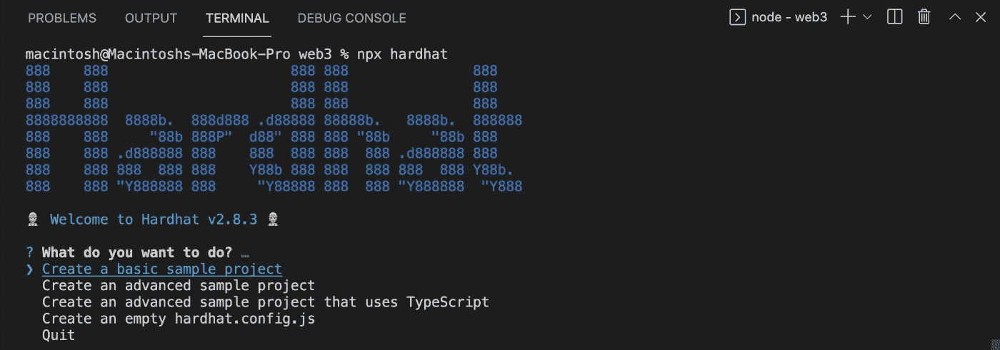
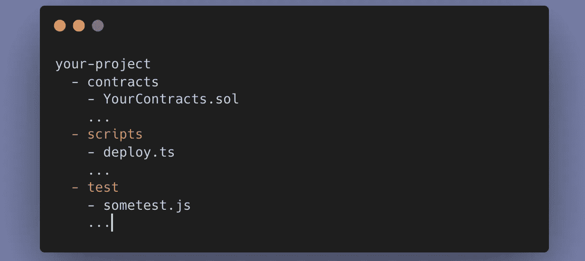
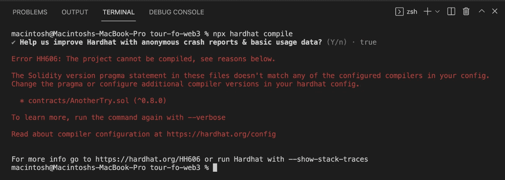
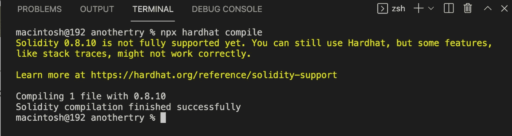

# 掌握区块链开发:实现以太坊安全帽的第一步

> 原文：<https://betterprogramming.pub/mastering-blockchain-development-first-step-to-implement-ethereum-hardhat-and-typescript-74807c691129>

## 掌握 web 3 第 1 部分—你好 dApp 合同


Freepik 图片来自@ [natanaelginting](https://www.freepik.com/natanaelginting)

本系列文章旨在展示 web 2.0 和 web 3.0 之间的区别。

我将通过一步一步地构建一个名为 Hello App 和 Hello DApp 的应用程序来解释它们之间的区别。这是一个非常基础的教程第 1 部分，将使用 Hello World 用例作为示例，但我还添加了另一部分来测试合同([第 2 部分](https://aindrajaya.medium.com/mastering-blockchain-development-hardhat-implementation-on-testing-smart-contract-with-typescript-3048b4a36052))和在本地网络上部署([第 3 部分](https://aindrajaya.medium.com/mastering-blockchain-development-deploying-smart-contract-using-hardhat-node-and-typescript-9383bcdad6ee))。

或者如果你想直接展示代码，你可以看看我的这个项目的 GitHub repo。

# 先决条件

如果你遵循本教程，我假设你至少有编程经验，如果你有使用 Typescript 的经验就更好了。我还假设您对智能合约开发一无所知，但是我将尝试解释构建 Hello dApp 智能合约的每个步骤。

# 入门指南

1 .设置您的本地环境

```
$ mkdir your-project
$ cd your-project
$ git init
$ yarn init -y
$ yarn add -D hardhat
$ npx hardhat
```

它将显示此控制台:



2 .基本结构文件夹



# 创建合同

创建第一个合同，在 contracts 文件夹中创建一个名为`HelloContract.sol`的文件。`.sol`是指 solidity，这是一种编程语言，用于在以太坊中开发智能合约。

因为文件契约是由你决定的，你可以随意命名，因为你的契约的文件名只要以`.sol`结尾就没有编译的意义。

当你写一个 solidity 文件时，你需要做的第一件事是你需要告诉用来编译你的合同的编译器，因为你需要告诉 solidity 你需要什么编译器来运行或编译你的合同。然后你写`pragma`，它只是一种预编译命令。

你可以写这个:

> ***Code 1****:*这意味着你期望至少这个版本的编译器会运行/编译你的契约，就像你在`package.json`上写这个版本的库一样。

然后下一个你也定义了名字 contract，当我们用 javascript 写一个类时，它只是相同的结构代码。代码将是这样的:

**下一段代码中，您可以添加以下内容:**

**似乎对这些代码很熟悉？当然，这是我们在学习一门新的编程语言时通常会编写的第一段代码，这也是声明`Hello, World from Web 3`时应该编写的 Solidity，因为 Solidity 有它的风格。**

**但是如果你对另一个命令感到困惑，没关系，也许你对命令`pure`和`memory`不熟悉，这就是区别(我们稍后讨论)。**

> *****代码 3*** *:* 行代码表示，一个`hello()`函数挂出`HelloContract`契约，`public`表示任何人都可以调用它，`returns`到`string`，`Hello, World`是我们期望返回的字符串。**

**不对，我想我们忘了在合同中加入许可版本。您可以在代码顶部添加:**

> *****代码 4*** *:* 什么原因？它只是让我们，因为开发人员可以识别在我们的 solidity 文件中使用的特定许可证。完整的解释你可以在这里看到**

**好的，下一个我们应该编辑我们的合同，这样我们可以知道发生了什么。将以下命令写入您的命令行界面:**

```
$ npx hardhat compile
```

**你遇到过这个错误吗:**

****

**因此，错误代码是关于不符合任何已配置编译器的 Solidity version pragma 语句。**

**您用来编译智能合约的编译器可能不同于 hardhat 使用的默认编译器。**

**打开`hardhat.config.js`然后你可以通过这个解决方案来解决:**

**但是如果你仍然看到另一个警告，那也没关系。然后，恭喜你，你完成了你的第一份合同。喔喔喔！！**

****

## **但是…接下来呢？**

**测试？哦对了，就是这样。您应该在运行它或将其部署到网络(测试或主网络)之前进行测试。你可以浏览本教程系列的第二部分。**

# **结论**

**对于本文，我们已经知道如何使用 Solidity 创建一个简单的契约，然后确保我们使用的编译器与我们的 Hardhat 编译器相同，我还解释了 Solidity 用来创建 Hello World 分散式应用程序的每一行代码。**

**它仍然有很大的探索空间，也许在本系列教程结束时，我们可以知道 web 2.0 开发和 web 3.0 开发之间的真正区别。谢谢大家！！**