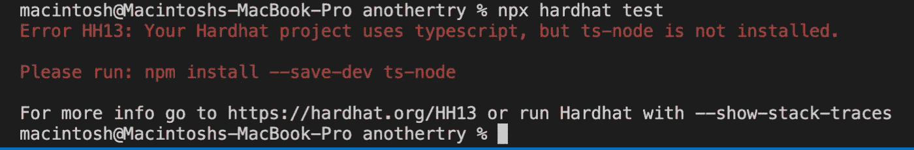

# 掌握区块链开发:使用 TypeScript 测试智能合约的 Hardhat 实现

> 原文：<https://betterprogramming.pub/mastering-blockchain-development-hardhat-implementation-on-testing-smart-contract-with-typescript-3048b4a36052>

## 掌握 web 3 第 2 部分—智能合约测试


来自@pch.vector 的 Freepik 图片

让我们从这[第 1 部分](https://aindrajaya.medium.com/mastering-blockchain-development-first-step-to-implement-ethereum-hardhat-and-typescript-74807c691129)继续我们的教程系列，我们已经完成了我们的第一个智能 hello 契约，并且已经成功编译。下一步，我们应该测试我们的代码，以确保我们在 Solidity 文件上写的东西是我们所期望的。

在 Hardhat 中，我们需要再次添加一些库，并且不要忘记让它留在我们的开发环境中。

```
$ yarn add -D [@nomiclabs/hardhat-ethers](http://twitter.com/nomiclabs/hardhat-ethers) ethers [@nomiclabs/hardhat-waffle](http://twitter.com/nomiclabs/hardhat-waffle) ethereum-waffle chai
```

然后，您还可以添加 typescript 配置，如下所示:

```
$ yarn add --save-dev ts-node typescript
```

在最后一种情况下，您应该添加测试类型，大多数智能合约开发人员将使用`chai`作为主要测试库(在这种情况下，我们还需要为 chai 配置 typescript)。

```
$ yarn add --save-dev chai [@types/node](http://twitter.com/types/node) [@types/mocha](http://twitter.com/types/mocha) [@types/chai](http://twitter.com/types/chai)
```

因为我们已经安装并将实现一些 typescript，所以不要忘记将`hardhat.config.js`文件改为`hardhat.config.ts`。它会自动将我们的文件转换成基于 typescript 的文件。之后，在文件`hardhat.config.ts`的第一行添加以下代码:

# 测试合同

现在，让我们写一些测试。记住，根据我们之前关于项目结构的解释，我们应该在创建测试文件之前创建一个`test`文件夹。然后您可以随意命名测试文件(别忘了我们使用的是基于类型脚本的文件)。

导入 Nomiclabs hardhat(你可以看到它[这里](https://www.npmjs.com/package/@nomiclabs/hardhat-ethers)获得更多解释)，但它的简化，它是一个插件，允许我们以一种简单的方式与以太坊区块链互动(如果你有使用松露的经验，它将需要在运行所有松露服务之前运行本地区块链)，所以这就是为什么 hardhat 对我个人来说有一点容易，并且当我在我们的本地计算机上开发区块链时安全我的内存使用，更多关于 Hardhat 你可以看到([这里](https://hardhat.org/getting-started/))，怎么样

在我们的测试文件中运行的流，将与保存在`artifacts/contracts`文件夹中的我们编译的契约(ABI)进行通信。

然后二进制代码将与以太坊节点进行交互。
所以，这里是我们将用来测试我们的智能合约的代码测试，然后调用我们的`hello()`函数。代码如下:

然后运行:

```
$ npx hardhat test
```

首先，您会看到一个错误，就像这样(我希望它会得到解决)，然后您只需针对该错误再次运行建议命令，或者您可以按照下面的步骤，了解应该在我们的命令行中写些什么。



要解决此错误，您可以添加以下命令:

```
$ yarn add -D ts-node...
//After done, run test again$ npx hardhat test
```

结果应该是这样的:


# 结论

那么，刚刚发生了什么？首先，简单的解释是，我们之前在我们的智能合约中测试了我们的函数，那个函数叫做`hello()`，所以函数`hello()`将被运行并提供字符串`Hello, World from Web3`，如果我们用另一个字符串改变我们的测试，它将导致错误并且测试失败。

对于更多的解释，我们可以在哪里与我们的智能合同进行交互？我没有看到我们项目之外有任何东西在运行。是的，确实如此。安全帽有能力根据我们的目的立即运行以太坊区块链。

因此，如果你在我们调用`hello()`函数的最后一行代码中看到，这是 hardhat 的力量，它可以使以太坊网络在我们的项目中虚拟运行，调用`hello()`函数来显示要测试的“`Hello, World from Web3`”字符串。