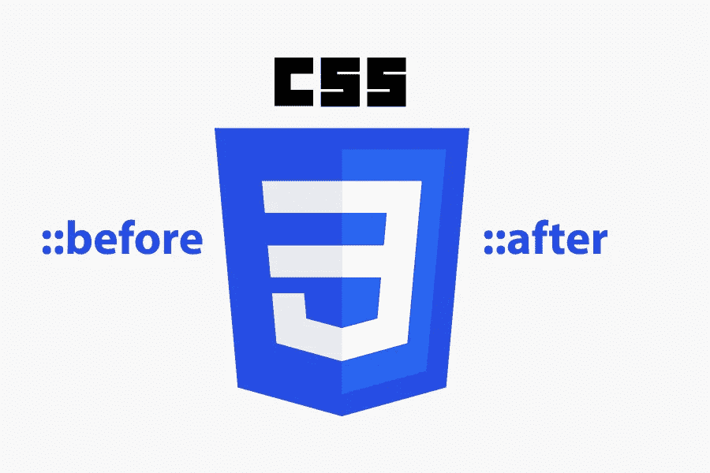
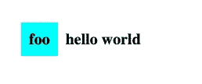
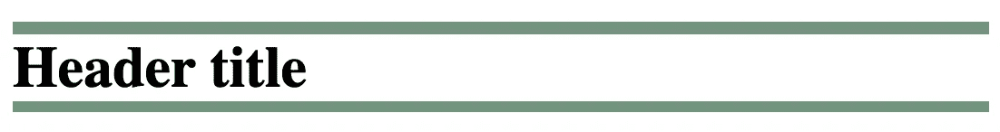
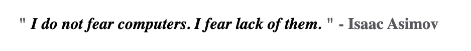
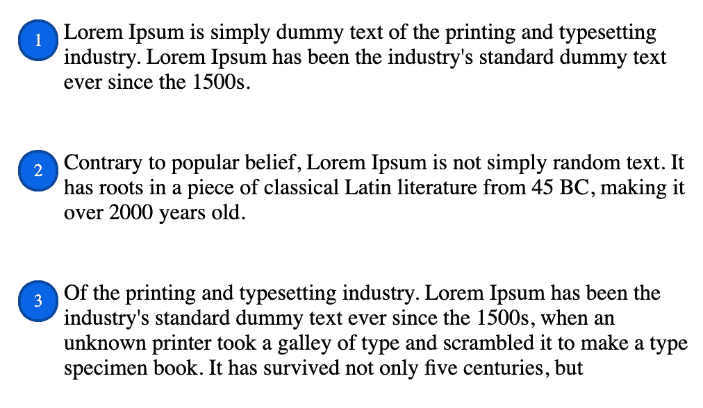

# 掌握 CSS ::before 和::after

> 原文：<https://betterprogramming.pub/mastering-css-before-and-after-ecf1d59d9a3d>

## 深入研究 CSS 中的::before 和::after 伪元素



图片由作者提供。

CSS 伪元素用于样式化元素的指定部分。简单回顾一下，让我们看看 Mozilla 开发者网络上的参考资料:

> CSS **伪元素**是添加到选择器中的关键字，它允许您对所选元素的特定部分进行样式化。例如，`[*::first-line*](https://developer.mozilla.org/en-US/docs/Web/CSS/::first-line)`可以用来改变段落首行的字体。”— [MDN 网络文档](https://developer.mozilla.org/en-US/docs/Web/CSS/Pseudo-elements)

可用 CSS 伪元素的列表不是很长。然而，熟悉它们是很重要的。每一个都有特定的用途。它们可以极大地改善您的 web 代码库。

以下是所有 CSS 伪元素:

*   `::after`
*   `::before`
*   `::first-letter`
*   `::first-line`
*   `::marker`
*   `::selection`

它们看起来都相当简单，不言自明。然而，它们会帮助你构建一些简洁而强大的布局。你觉得哪个最酷？

`::before`和`::after`是目前为止我最喜欢的。它们让你能够做非常酷的事情，同时保持你的 HTML 和 CSS 最小化。

在这篇文章中，我们将检查所有的酷的东西，我们将能够用它们来建立。我们还将了解它们的常见用例。

# 句法

在深入研究之前，我们先来看看`pseudo-element`的一般语法:

```
selector**::pseudo-element** {
  property: value;
}
```

注意我们是如何使用双冒号(`::`)而不是单冒号(`:`)。这是 CSS3 的语法。最初，它们的语法规范只有一个冒号(CSS2，CSS1)。

这一变化是由 W3C 推动的。他们的目的是明确区分那些使用单个冒号的伪类。

两者有什么区别？简而言之，伪类是针对非表示性特征的选择。另一方面，伪元素使我们能够创建新的虚拟元素。

*注意，为了向后兼容，大多数浏览器仍然接受 CSS2 和 CSS1 中的单冒号语法。*

# 工作前和工作后怎么做？

这些伪元素用于在目标元素之前或之后添加内容。

对于内容的放置位置有一个常见的误解。许多人认为内容会放在选中的 HTML 标签之前或之后。相反，它将被放在元素内容的前面或后面。

让我们来看看这个例子:

```
p::before {
  content: "foo - ";
}<p>text</p>
```

在原始 HTML 中,“输出”相当于:

```
✅ <p>foo - text</p>
```

而不是这个:

```
❌ foo - <p> text</p>
```

当`::before`和`::after`在元素内容之前添加内容时，有一个标签不起作用:``。这个标签不在里面添加内容。它只是媒体内容的替代品。这意味着它不能与任何伪元素一起工作。

# 内容属性

对于伪元素来说，`content`属性至关重要。默认情况下，`content`设置为`none`。这意味着，如果您尝试在不添加该属性的情况下设计元素的样式，实际上什么也不会发生。

让我们通过添加一些内容来修正上面的示例:

即使我们不想添加任何文本，我们仍然需要用`''`填充该属性。这是使用伪元素时最常见的错误之一。

现在我们已经看到了`content`的重要性，让我们通过查看 MDN 来定义它到底是什么:

> “`**content**` CSS 属性用生成的值替换元素。使用`content`属性插入的对象是**匿名替换元素** *。"—* [MDN 网络文档](https://developer.mozilla.org/en-US/docs/Web/CSS/content)

属性非常强大，让我们可以从许多不同的来源添加内容。当使用该属性显示伪元素上的任何内容时，我们需要注意几个问题:

1.  默认情况下，内容将显示为`display-inline`，而不是`display:block`。
2.  如果内容是字符串，用户将无法选择它。这意味着用户不能用鼠标复制它。它应该是 *atrezzo* 而不是主要内容。

## 内容值

我们可以使用`content: 'foo'`直接添加字符串内容。如果我们希望文本是可翻译的呢？如果我们直接将文本添加到`CSS`样式表中，将很难用适当的翻译来替换它。

对于这个用例，我们可以将翻译存储在带有属性的元素中。然后，我们可以通过引用该属性将它与内容一起拉出来。这将使我们的 CSS 保持动态，而不是静态绑定到一个字符串。

让我们看一个例子:

让我们来看看结果的截图:



从前面的 HTML 代码中捕获

注意我们是如何使用属性`before-text`来提取文本的:

`content`属性可以包含 URL。让我们看一个使用案例的例子:

```
p::before {
  **content: url(https://unsplash.it/15/15);**
  margin-right: 0.625rem;
}
```

让我们来看看结果的截图:


从前面的 HTML 代码中捕获

除了 URL、属性和字符串之外，`content`属性可以包含各种属性:`counters`、`quotes`、`linear-gradient`等。您可以在 MDN 网络文档上查看完整列表[。](https://developer.mozilla.org/en-US/docs/Web/CSS/content)

我们不局限于使用一个属性。我们可以将多个`content`属性合并为一个。

```
p::before {
  **content: attr(data-details) "- more details -";**
  margin-right: 0.625rem;
}
```

# 用例示例

既然我们已经看到了`::before`和`::after`与`content`的结合有多么强大，那么让我们来看一些实际的例子。

## 1.化妆品

一个主要的使用案例主要是化妆品。你可以用它们给你的元素增加一些视觉美感。

让我们用一个例子来更好地理解它:

让我们来看看结果的截图:



从前面的 HTML 代码中捕获

用很少的代码和没有额外的标记，我们可以实现一个布局，否则将需要大量的工作。

## 2.自定义批量报价

另一个伟大的用途是创建您的自定义块报价。让我们使用 CSS 和自定义属性自定义 HTML5 标签来创建一个可重用组件。

让我们看看它的代码:

让我们来看看结果的截图:



从前面的 HTML 代码中捕获

## 3.定制有序列表

另一个用例是创建定制的 HTML 有序列表。这可以通过使用`counter-reset`、`counter-increment`和`counter(counter-name)`来实现。

让我们看看它的代码:

让我们来看看结果的截图:



从前面的 HTML 代码中捕获

# 最后的想法

我们已经看到这两个伪元素是多么有趣。可能性是无限的。它们有助于减少不必要的标记，并通过丰富元素来增加价值。

它们不应该被过度使用。正如我们所看到的，在一些特殊的用例中，它们确实大放异彩。在其他情况下，如果使用不当，它们可能会成为一种负担。

我希望这篇文章能帮助你理解我为什么如此喜欢它们。

# 相关文章

[](/stop-using-the-pixel-unit-in-css-8b8788a1301f) [## 停止使用 CSS 中的像素单位

### 避免使用 px 装置的 3 个原因

better 编程. pub](/stop-using-the-pixel-unit-in-css-8b8788a1301f) [](/5-different-ways-to-vertically-align-your-css-content-6ac864af7f2c) [## 垂直对齐 CSS 内容的 5 种不同方法

### 研究设计网页的各种 CSS 方法

better 编程. pub](/5-different-ways-to-vertically-align-your-css-content-6ac864af7f2c)