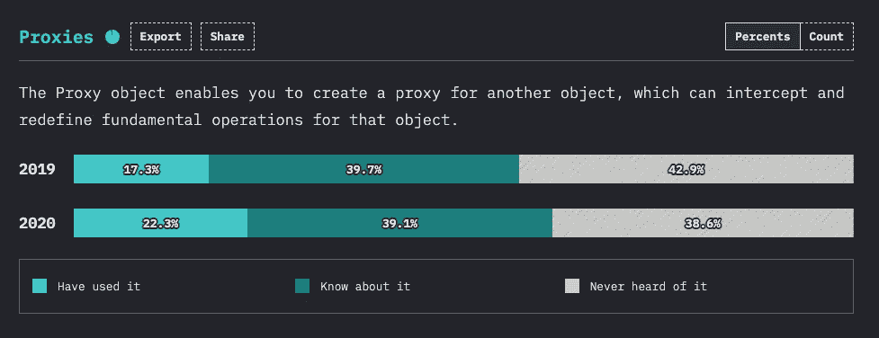
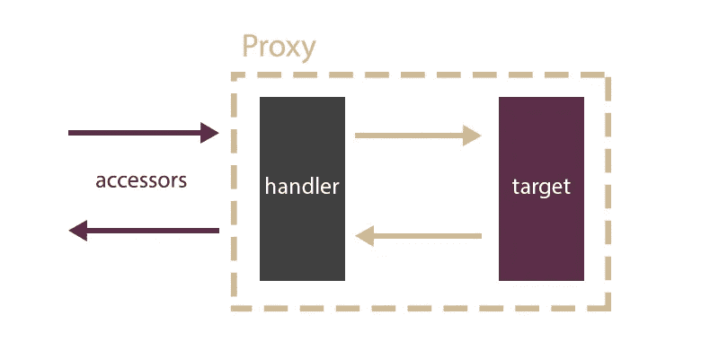

# 掌握 ES6 代理

> 原文：<https://betterprogramming.pub/mastering-es6-proxies-ced4253bc661>

## 如何在现实世界中使用代理


[DISRUPTIVO](https://unsplash.com/@sejadisruptivo?utm_source=medium&utm_medium=referral) 在 [Unsplash](https://unsplash.com?utm_source=medium&utm_medium=referral) 上拍照

ECMAScript 6 版本过了很久才发布。它直到 2015 年才发布，而 ECMAScript 5 是在 1997 年发布的。网络泡沫、EMACScript 4 失败的尝试以及其他因素是这一最新版本背后的原因。

因此，ES6 功能丰富。功能如此丰富，以至于许多功能都被忽略了。ES6 类的 sugar 语法特性让一切黯然失色。这使得令人敬畏的代理功能有点被忽视。

最近 js 的[状态发布了。据它说，代理人仍然是广泛未知的。今年对它的认识只增加了 4%:](https://stateofjs.com)



来自 js 状态的统计数据，在此处找到

这促使我写这篇文章，试图提高对这一特性的认识。让我们看看明年我们能否一起提高这个百分比！

# 什么是代理？

> *`*Proxy*`*对象使您能够为另一个对象创建一个代理，它可以截取并重新定义该对象的基本操作。**
> 
> *— MDN 网络文档*

*听起来是不是很酷？代理是可以放在其他对象前面并重新定义其基础的对象。您可以记录对对象的访问、创建缓存、控制对方法的访问、为变量提供方法访问器——这种可能性是无穷无尽的。*

# *代理诉讼*

*让我们看看代理是如何创建的:*

> **用两个参数创建一个*`*Proxy*`*:**
> 
> **—* `*target*` *:您要代理的原始对象**
> 
> **—* `*handler*` *:定义哪些操作会被拦截，以及如何重新定义被拦截的操作的对象。**
> 
> *— MDN 网络文档*

**

*作者代理模式*

*让我们创建第一个代理:*

```
*const book = {};const bookHandler = {};const bookProxy = new Proxy(book, bookHandler);*
```

*当我们的`handler`为空时，就好像我们直接调用了对象:*

```
*bookProxy.name; // undefined*
```

*处理程序可以定义一组陷阱。这些陷阱是我们放置代码来重新定义对象基础的地方。以下是完整列表:*

*   *`[handler.apply()](https://developer.mozilla.org/en-US/docs/Web/JavaScript/Reference/Global_Objects/Proxy/Proxy/apply)`*
*   *`[handler.construct()](https://developer.mozilla.org/en-US/docs/Web/JavaScript/Reference/Global_Objects/Proxy/Proxy/construct)`*
*   *`[handler.defineProperty()](https://developer.mozilla.org/en-US/docs/Web/JavaScript/Reference/Global_Objects/Proxy/Proxy/defineProperty)`*
*   *`[handler.deleteProperty()](https://developer.mozilla.org/en-US/docs/Web/JavaScript/Reference/Global_Objects/Proxy/Proxy/deleteProperty)`*
*   *`[handler.get()](https://developer.mozilla.org/en-US/docs/Web/JavaScript/Reference/Global_Objects/Proxy/Proxy/get)`*
*   *`[handler.getOwnPropertyDescriptor()](https://developer.mozilla.org/en-US/docs/Web/JavaScript/Reference/Global_Objects/Proxy/Proxy/getOwnPropertyDescriptor)`*
*   *`[handler.getPrototypeOf()](https://developer.mozilla.org/en-US/docs/Web/JavaScript/Reference/Global_Objects/Proxy/Proxy/getPrototypeOf)`*
*   *`[handler.has()](https://developer.mozilla.org/en-US/docs/Web/JavaScript/Reference/Global_Objects/Proxy/Proxy/has)`*
*   *`[handler.isExtensible()](https://developer.mozilla.org/en-US/docs/Web/JavaScript/Reference/Global_Objects/Proxy/Proxy/isExtensible)`*
*   *`[handler.ownKeys()](https://developer.mozilla.org/en-US/docs/Web/JavaScript/Reference/Global_Objects/Proxy/Proxy/ownKeys)`*
*   *`[handler.preventExtensions()](https://developer.mozilla.org/en-US/docs/Web/JavaScript/Reference/Global_Objects/Proxy/Proxy/preventExtensions)`*
*   *`[handler.set()](https://developer.mozilla.org/en-US/docs/Web/JavaScript/Reference/Global_Objects/Proxy/Proxy/set)`*
*   *`[handler.setPrototypeOf()](https://developer.mozilla.org/en-US/docs/Web/JavaScript/Reference/Global_Objects/Proxy/Proxy/setPrototypeOf)`*

*为了时间和简单起见，本文中我们将只关注`get`和`set`陷阱。*

# *代理获取陷阱*

*我们先来看看`get`陷阱界面:*

```
*get: function(target, prop, receiver)*
```

*让我们拦截任何对象访问器并总是返回默认字符串`'unknown'`:*

*简单不是吗？使用`get`处理程序，我们可以劫持对象的任何访问器。但是我们要小心——我们当前对象的访问器将总是解析为`'unknown'`:*

```
*bookProxy.title // unknown
bookProxy.pages // unknownbookProxy.read() // return unknown and then error is book.read is not a function*
```

*让我们仔细看看`get`处理程序的参数:*

```
*const handler = {
  get: function(target, property, receiver) {}
};*
```

*   *`target`:要代理的原始对象。*
*   *`property`:被访问属性的名称或符号。*
*   *`receiver` : proxy 或继承 de proxy 的对象。*

*对`target`或`receiver`的任何修改将在代理对象中可见。*

*让我们实现一个基本的属性记录器。每当访问一个属性时，我们将打印一条消息`"you have access the ${prop} property"`。*

*让我们重构上面的代码来使用`Reflect`而不是手动访问属性。*

*现在让我们做一些更复杂的事情。让我们计算一个属性被调用的次数。*

*起初，这样做是很直观的:*

**注意:* `*counter*` *需要在* `*target*` *对象中。试图从* `*get*` *陷阱中的* `*receiver*` *访问任何属性都会导致无限循环。我们可以绕过这个无限循环，但是对于我们的例子来说不值得。**

*有一个问题:使用这种方法，`count`将成为对象的一部分。如果要解耦，最好用闭包。让我们看看使用闭包后我们的代码会是什么样子。但是首先，让我们回顾一下 JavaScript 中的闭包概念是什么。*

> *闭包是捆绑在一起(封闭)的函数与对其周围状态(词法环境)的引用的组合。…在 JavaScript 中，闭包是在每次创建函数时创建的。*
> 
> *— MDN*

*现在让我们看看代码:*

*现在`counter`不再可以从我们的处理程序外部访问，它被解耦了。*

# *代理设置陷阱*

*我们已经看到了`get`陷阱。同样，逻辑也适用于`set`号。我们先来看看`set`陷阱界面。*

```
*set: function(target, property, value)*
```

*让我们创建一个代理，它只接受`string`类型的变量作为输入。*

**注意:这是一个简单的例子。要在生产中使用，你应该注意像* `*defineProperty*` *这样的东西。它应该结合在一起，因为这是一种创造新道具的方式。**

*这在我们之前的代理中是有效的:*

```
*Object.defineProperty(dictionaryProxy, "strawberry", {
  get: function () {
    return 10;
  }
});dictionaryProxy.strawberry // result will be 10*
```

*这样做很容易解决这个问题:*

*或者，也可以在`defineProperty`陷阱中做一些新奇的事情:*

# *代理组成*

*一旦你开始创建你的代理对象，你就可以尽情地玩，并把它们组合起来:*

*你可以做的是创建你的最佳实践代理，然后在你需要的时候组合它们。*

# *真实世界的例子*

*代理被用在许多场景中。代理最常见的用途是用于单元测试。它们被用来在嘲弄的对象周围表演所有的魔术。*

*现在让我们创建一个非常简单的模仿函数实用程序。我们将模仿 jest [API](https://jestjs.io/docs/en/mock-functions) 。*

*我们将实现三种方法:*

*   *`mockReset`:将模拟设置重置为初始设置。*
*   *`hasBeenCalled`:如果函数被调用，返回 true，否则返回 false。*
*   *`mockReturnValue`:设置函数的返回值。*

*那里发生了什么事？*

*核心概念是我们在对一个函数做`Proxy`。但这怎么可能呢？*

> **中的****JavaScript****，* ***函数*** *是一级* ***对象*** *，因为它们可以像任何其他* ***对象*** *一样拥有属性和方法。与其他* ***对象*** *区别在于* ***函数*** *可以被调用。简而言之，它们就是* ***功能对象。****
> 
> ***— MDN***

*由于函数本质上是对象，我们可以自由地将它们放在代理后面。剩下要做的就是定义一个 API 和一个作用域函数状态:`currentState`。对于这组特定的 API 指令，我们只需要`get`陷阱。陷阱将运行定义在`methods`对象上的 API 指令。*

# ***收尾***

*我们一起深入研究了代理功能。ES6 的这个功能乍一看很吓人。一旦你掌握了窍门，使用起来就很有趣。我们已经掌握了核心概念。然而，我们只是触及了表面。有很有意思的陷阱，像`apply`，好玩又厉害。*

*代理人不仅仅是嘲笑！它们是实现 [*写时复制*](https://en.wikipedia.org/wiki/Copy-on-write) 机制的完美工具。*

*更多的 ES6 代理将很快出现在你面前！*

*还想吃吗？查看我关于 Typescript 映射类型的文章*

*[](https://medium.com/better-programming/mastering-typescripts-mapped-types-5fa5700385eb) [## 掌握 TypeScript 的映射类型

### 了解如何像专家一样处理 Typescript 映射类型

medium.com](https://medium.com/better-programming/mastering-typescripts-mapped-types-5fa5700385eb)*