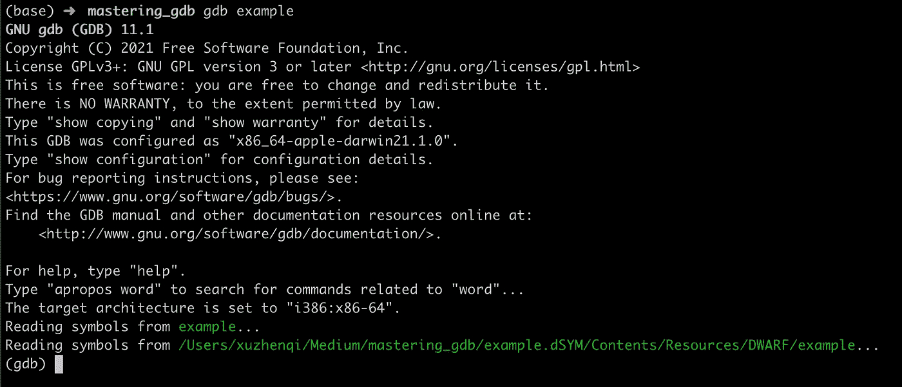
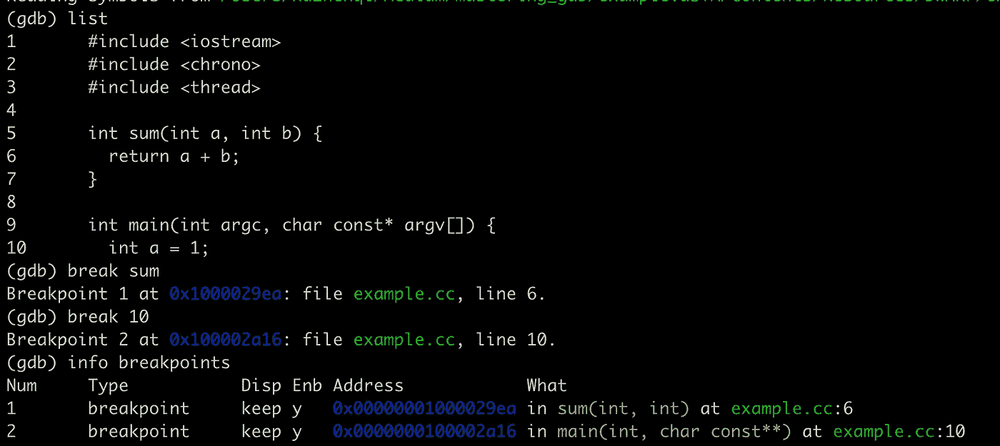
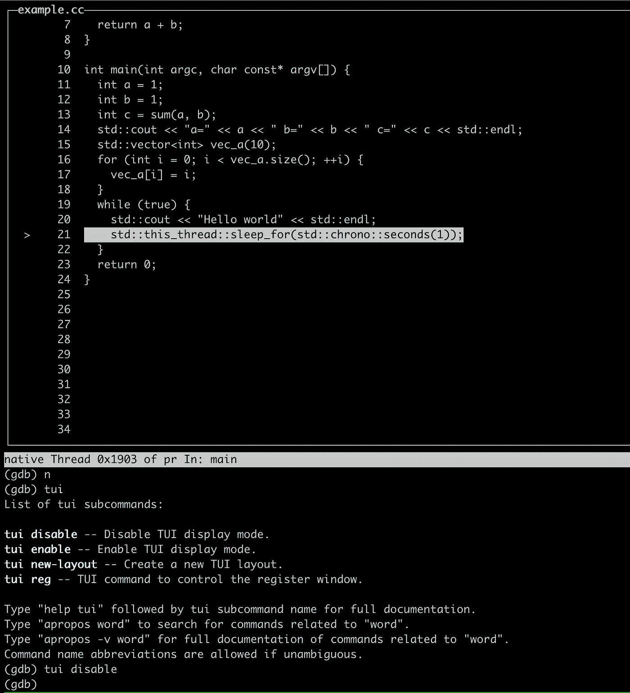

# 掌握 GDB

> 原文：<https://betterprogramming.pub/mastering-gdb-be5e589af90b>

## 提高你的调试技能

[西格蒙德](https://unsplash.com/@sigmund?utm_source=medium&utm_medium=referral)在 [Unsplash](https://unsplash.com?utm_source=medium&utm_medium=referral) 上拍照

GNU 项目调试器(GDB)是 Linux 下非常有用的调试器。
聪明的程序员通常使用 gdb 来调试 bug，当一个程序核心转储，或者一个程序发生意外行为时。在本文中，我将向您展示如何高效地使用 gdb。

# 选择合适的编译标志

编译器通常会进行许多优化，以生成最佳代码，这给调试带来了困难。如果遇到类似找不到符号这样的错误，需要打开适当的编译标志进行调试，以便调试器可以获得足够的信息。

*   使用`-g`让编译器将调试信息构建到可执行文件中。
*   使用`-ggdb3`可以让 gdb 调试宏。
*   使用`-fno-omit-frame-pointer`来避免编译器优化掉小函数，这样你就可以看到完整的调用栈。
*   使用`-0g`让编译器打开不影响调试的优化。

# 启动 gdb

用适当的标志编译程序后，我们可以使用 GDB 来调试生成的可执行文件。有很多不同的场景，每个场景的启动方式都略有不同。

*   在第一个场景中，我们有一个接受一些参数的可执行文件。我们可以用`gdb executable`启动 gdb，然后用`run arg1 arg2`运行程序。
*   在第二种情况下，当可执行文件正在运行时，会生成一个核心转储文件，这可能是一个段故障。我们可以用`gdb executable coredump_file`启动 gdb，gdb 会在错误发生的地方停止。
*   在第三个场景中，我们有一个正在运行的可执行文件。我们可以使用`gdb attach pid`来附加到进程。

启动广发的截图

# 断点和监视

启动 gdb 后，我们一般会设置一个断点。程序在遇到检查点时会暂停。我们可以观察程序的状态。

*   `break func`会在某个函数处中断。
*   `break example.cc:10`会在 example.cc 的第 10 行中断，如果只有一个文件，我们可以省略文件名，直接用`break 10`。我们可以键入`list`来显示当前行周围的代码。
*   `info breaks`可以显示你设置的所有断点。
*   `delete 2`将删除第二个断点。
*   你也可以设置条件断点，只需将`if [condition]`追加到 break 命令。
*   可以在一个变量上设置一个观察点，观察点是另一种断点，如果被观察的变量改变了，它将暂停程序。

设置断点的图示

# 变量和表达式

当暂停在一个断点上时，我们可以通过打印变量和表达式来观察程序的状态。

*   `info args`可以向我们展示一个函数的自变量。
*   `info locals`可以显示当前函数的局部变量。
*   `print`可以用来显示一个变量或一个表达式的结果。参见下图。`print a`打印变量。`print a=2`将首先评估`a=2`然后打印结果。注意，如果直接输入`a=2`，会得到一个错误。`print sum(1, a)`调用函数`sum`。

> (gdb)print a
> $ 1 = 1
> (gdb)print a = 2
> $ 2 = 2
> (gdb)print sum(1，a)

您也可以格式化`print`的结果，

*   `print /x <exp>`将以十六进制显示结果。
*   `print /t <exp>`将以二进制显示结果。
*   `print /d <exp>`将以无符号整数格式显示结果。
*   `print /c <exp>`将以有符号整数格式显示结果。
*   注意`print`的结果，如`$1`、`$2`也是可以进一步使用的变量。
*   `dprintf locaion, format-string, expr1, expr2`。`drpintf`是一个方便的命令，可以在该位置动态打印，就像你在该位置插入了一个`printf`表达式一样。
*   `set $foo = 4`可以设置变量。如果你想保存一些中间结果，这是很方便的。
*   `command 2`是另一个 gdb 命令，你可以设置命中特定断点时要执行的命令。当点击第一个断点时，下图将自动执行`info locals`。你也可以用这种方法达到`dprintf`同样的效果。

> (gdb)命令 1
> 为断点 1 键入命令，每行一个。
> 以一句“结束”结束。
> info locals
> end

*   `print *&arr[96]@5`可以打印一个数组的 96–100 个元素。

注意目前我们不能轻易打印 std::vector 或其他 c++ stdlib 容器。这个话题我们以后再讨论。

# 施工管理

有几个命令允许我们在 gdb 会话中控制程序的执行。

*   `run`将开始运行程序并在第一个断点处停止，如果没有断点，程序将在退出时停止。
*   `start`将启动程序并停止`main`功能。
*   `continue`将继续程序，并在下一个断点处停止或退出。
*   `finish`将在当前功能完成时停止。
*   `next`会停在下一行。
*   `step`将进入一个功能并停在那里。

# 文本用户界面

Gdb 包含一个文本用户界面(TUI)，就像大多数 ide 一样，它可以在调试时显示代码行。`tui enable`进入 tui 模式，按`tui disable`退出。

TUI 插图

# 回溯和线程

回溯对于调试非常有用，尤其是在我们调试核心转储时。

*   `bt`将显示当前回溯。
*   `up`会将您移动到上层框架。
*   `down`会将您移动到下部框架。
*   `frame 2`会直接带你到第二帧。

当调试多线程程序时，

*   `info threads`显示所有线程。
*   `thread 5`将转到第五个线程。
*   `thread apply all [command]`将在所有线程上执行一个命令。使用`thread apply all bt full`打印所有线程的所有回溯非常方便。

# 用`.gdbinit`配置 gdb

Gdb 有一个配置文件，位于`~/.gitinit`或者当前文件夹，就像`.vimrc`对于`vim`一样。当前路径中的配置文件比`~/.gitinit`具有更高的加载优先级。我们来讨论一些配置。

*   `set logging on`将所有输出输出到`gdb.txt`。当命令输出如此多的信息时，这很有用，就像上面的`thread apply all bt full`。
*   `set history save on`保存命令历史。
*   `set pagination off`禁用长屏幕输出的交互显示。
*   `set print pretty on`可以用更漂亮的格式显示 c++类。
*   `set confirm off`禁用确认。

既然 gdb 不能方便的打印出`std::vector`之类的 c++容器，我们可以写一些脚本让它变得简单。跟随[https://gist.github.com/skyscribe/3978082](https://gist.github.com/skyscribe/3978082)。

# 源文件路径

有时我们会遇到像`xxx.c: No such file or directory`这样的错误。这意味着 gdb 找不到源文件。解决方案是:

*   使用`directory [folder]`将特定目录添加到 gdb 的搜索路径中。
*   使用`set substitute-path [src] [dst]`替换路径。

# 宏观扩张

还可以展开宏来查看预处理后的细节。

*   使用`macro expand some_macro(macro_arg)`展开宏。
*   使用`info macro some_macro`查看其定义。

注意 gdb 将分析当前函数的上下文，只有在当前上下文中可见的宏才可以展开。

# 记录程序的状态

gdb 的一个强大的命令是`record`，它记录正在运行的程序的状态，并允许您回退程序。Gdb 还提供了一组以`reverse`前缀开头的命令，如`reverse-continue`、`reverse-finish`、`reverse-next`、`reverse-nexti`、`reverse-step`、`reverse-stepi`。

`record`的一个用途是发现内存损坏。可以在 gdb 中运行程序，记录程序的执行情况，停在发生内存崩溃的位置。然后，您可以查看损坏的内存地址。然后反向运行程序，看看地址的内容在哪里发生了变化。

`record`的缺点是会让你的程序变慢。用好还是要下一番功夫的。

# 保存并加载调试会话

有时候需要反复调整代码，多次运行程序，才能逐渐了解 bug 的细节。但如果每次都重启 gdb，那么反复设置检查点就不方便了。我们可以保存调试会话并在以后重新加载它。

如果你使用 makefile 来构建你的程序，你可以简单地在 gdb 会话中输入`make`，它将重建你的程序并重置检查点。

你也可以使用`save breakpoints bp.txt`将断点保存到 bp.txt，稍后使用`source bp.txt`重新加载这些断点，或者使用`gdb -x bp.txt --args [exe]`在 gdb 启动时加载。

# 关于调试的更多信息

除了 gdb，还有很多其他的调试方法:比如分析日志。二分搜索法 git 提交。它们各有利弊。在调试程序时，您可以结合使用这些方法来有效地解决问题。这样做的好处是你可以完全访问正在运行的程序，这在一个 bug 很难重现的时候非常有用。