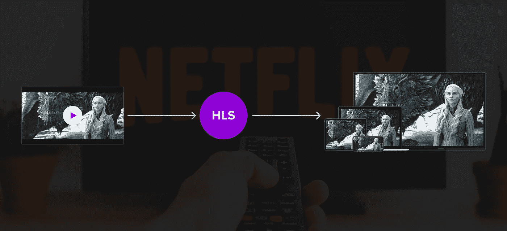
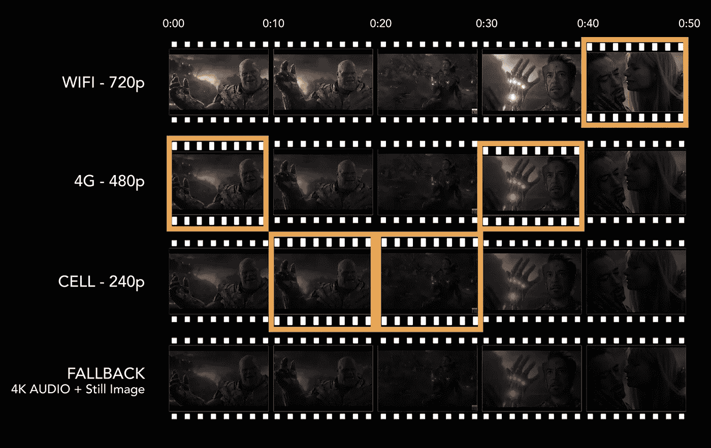

# 掌握 HTTP 直播

> 原文：<https://betterprogramming.pub/mastering-http-live-streaming-d540caa4a9f4>

## 第 1 部分:HLS 简介

HTTP Live Streaming (HLS)通过 HTTP 从普通 web 服务器发送音频和视频，以便在基于 iOS 的设备上播放。HLS 旨在提高可靠性，并通过优化有线和无线连接的可用速度来动态适应网络条件。

**注意:**如果您的应用交付的视频内容超过 10 分钟或数据超过 5MB，App Store 会要求您使用 HLS。

如果您的应用程序通过蜂窝网络使用 HLS，您必须提供至少一个 192Kbps 或更低带宽的流。低带宽流可以是纯音频或带有静止图像的音频。

# 为什么要 HTTP 直播？

在早期，通过网络传输视频不是一件容易的事情。如果您的服务器上只有一个高清文件，并且您必须在只有 2G 网络带宽的手机上播放该视频，想想看，您需要等待多长时间才能观看完整的视频。此外，我们需要一个流媒体服务器为用户提供视频。

HLS 帮助我们使用公共场所网络服务器而不是专门的流服务器轻松地部署流中的媒体内容。让我们讨论一下 HLS 的主要特性

*   自适应流
*   内容保护
*   隐藏字幕和字幕
*   广告插入
*   快进和倒放
*   替代音频
*   使用流替代的回退

## 自适应流

自适应流式传输背后的基本思想是以不同的分辨率和比特率(视频/音频中的 bps)生成各种版本的媒体文件。然后根据用户的带宽、屏幕大小和其他因素选择其中一个。

这些不同版本的视频文件被分成多个块，然后根据用户的带宽进行播放。从图像中可以清楚地看到 HLS 中的自适应流是如何工作的。

HLS 中的自适应流

基于广泛的用户带宽环境(2G、3G、4G、LTE、WIFI 低、WIFI 高)，视频可以使用相应的 HLS 比特率版本 240p、360p、480p、720p 和 1080p 播放。这也允许用户从一个比特率版本切换到另一个比特率版本，这将为用户提供无缝的流体验。

## 内容保护

可以使用样本级加密对媒体片段进行单独加密。对相应密钥文件的引用出现在播放列表文件中，因此播放器可以检索密钥进行解密。

HLS 支持您选择的密钥交换方法。静态密钥、编码器生成的密钥和频繁更新的密钥只是几种可能性。

# HLS 支持什么？

HLS 支持以下内容:

*   现场直播
*   预先录制的内容:视频点播(VOD)
*   交替流:不同比特率的多个交替流
*   智能交换:响应网络带宽变化的流的智能交换
*   媒体加密:加密视频内容
*   用户认证:通过用户认证传送视频/音频内容

下一步将是深入了解 HLS 是如何工作的。为此，我们需要了解 HLS 的架构。我认为这值得一个单独的职位。[第二部分:HTTP 直播的组件](https://medium.com/swift-india/mastering-http-live-streaming-ac982408c16f)