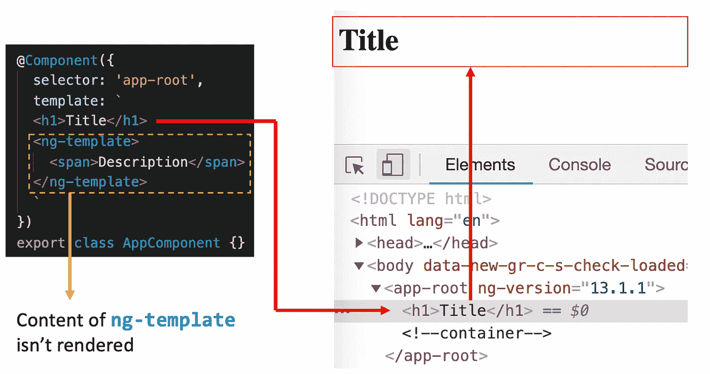
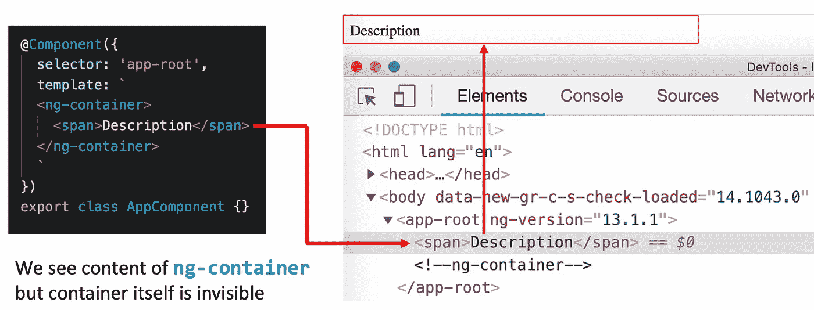
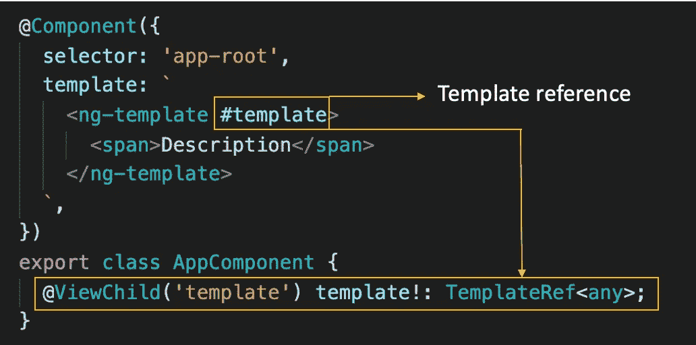
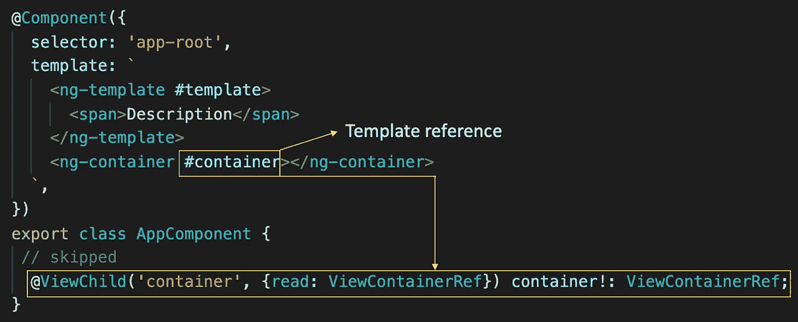
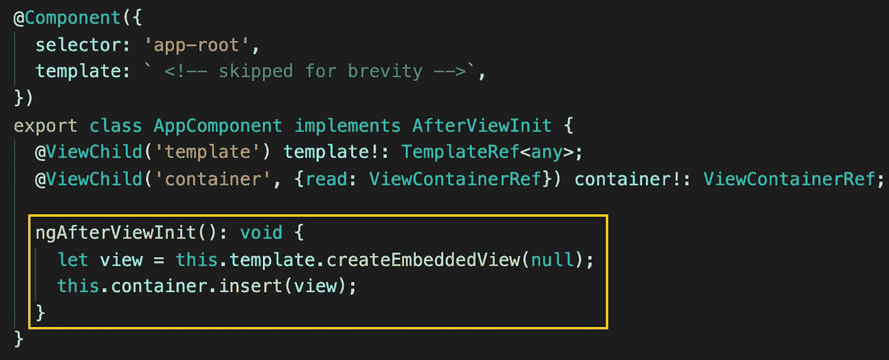
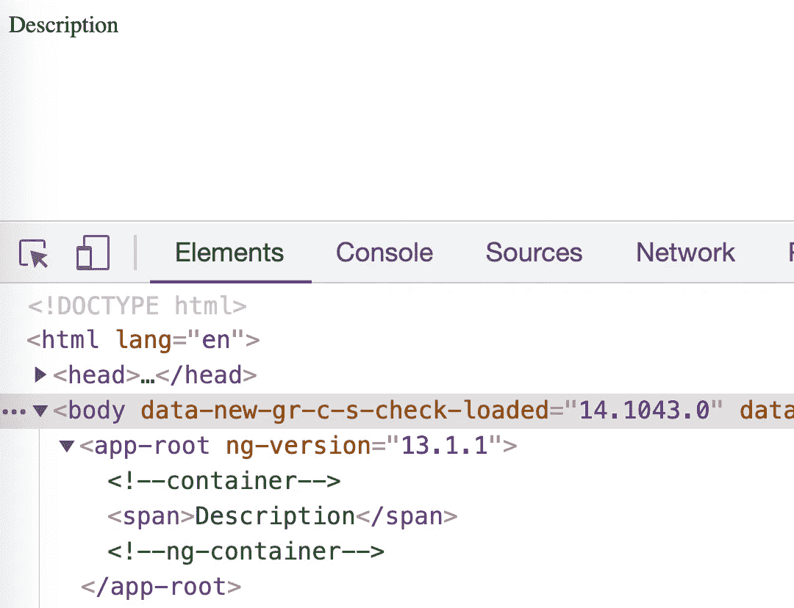
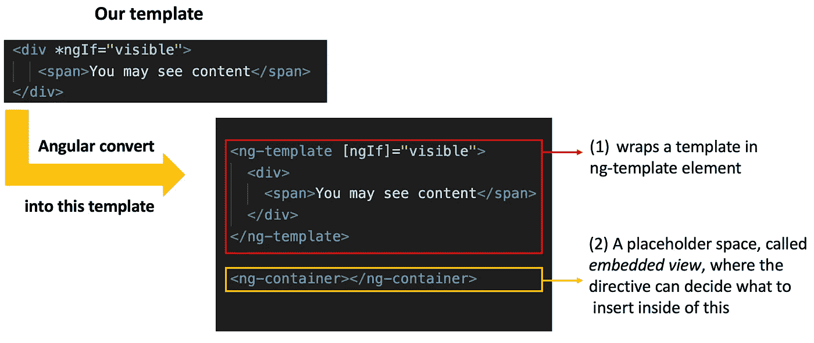
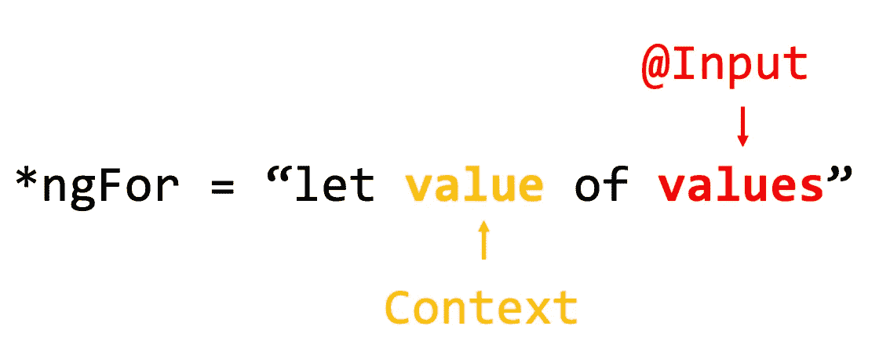
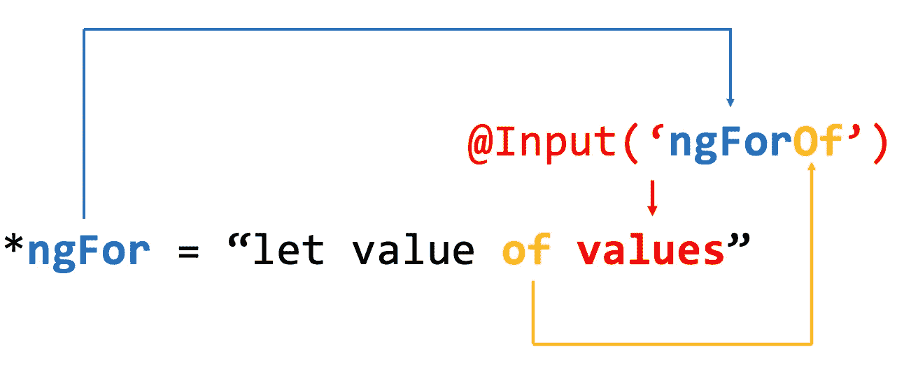

# 掌握角度结构指令

> 原文：<https://betterprogramming.pub/mastering-in-angular-structural-directives-b089186136ef>

## 创建 3 个不同的结构指令来掌握这个想法


当我们开始学习 Angular 时，我们知道有两种类型的指令:属性指令和结构指令。这里我们将只关注*结构指令*。嗯，结构指令允许我们修改元素的 DOM 树，而不仅仅是元素本身(就像属性指令一样)。这包括能够删除一个元素并用其他元素替换它，创建其他元素，等等。

正如你已经知道的，我们需要在代码中区分*结构*指令和*属性*指令:当我们应用*结构*指令时，它应该以`*` : `*ngFor`，`*ngIf`开始。实际上，当我第一次读到这个的时候，这种区分似乎有点奇怪，甚至有点麻烦。让我们试着找出，为什么我们需要把这个`*`放在结构指令中，它是有意义的。

通过这篇文章，我们将实现三个不同的结构指令，帮助你掌握它的主要思想。

# **什么是 ng-template？**

在我们进一步讨论之前，我们需要达成共识，理解什么是`ng-template`。让我们用这个元素开发一个简单的组件，看看 Angular 实际呈现的是什么:



正如你可以在组件模板中看到的，我们在`ng-template`中定义了`span`元素。但是我们在浏览器中看不到这个`span`。看起来很没用，不是吗？稍微等等，当然有用，有目的的退出。

# **什么是 ng-container？**

同样，让我们通过一个组件创建来发现它:



这里我们看到了放入`ng-container`的内容，但是容器本身是不可见的。如果您熟悉 React，您可能会认出与`React.Fragment`或其简写方式`<></>`类似的行为

# 将 ng 容器和 ng 模板绑定在一起

实际上，我们可以要求 Angular 显式地呈现我们放在`ng-template` **中的内容**。为此，我们需要完成以下步骤:

*   **第一步**:获取组件中`ng-template`的引用；
*   **步骤 2** :获取一个容器(任何 DOM 元素)的引用，我们希望在这个容器中呈现`ng-template`的内容
*   **步骤 3** :以编程方式呈现容器中的内容。

## 第一步:

让我们首先定义一个对`ng-template`元素的模板引用，并在组件中访问它:



这里我们为`ng-template`元素定义了一个模板引用`#template`，并使用`ViewChild`装饰器来访问它。请注意，我们在这里要求得到`TemplateRef`(你也可以用这个来要求:`@Input('template', { read: TemplateRef }) template: TemplateRef<any>`)。

## 第二步:

让我们在模板中定义一个容器，我们希望在其中呈现预定义的模板，并在组件中访问它:



几乎与我们在上一步中所做的一样:定义了一个对`ng-container`元素的模板引用`#container`，并使用`ViewChild` decorator 访问它，但是在这种情况下，我们希望将它读为`ViewContainerRef`。请注意，对于容器，我们可以使用任何 DOM 元素，不仅仅是`ng-container`，但是它保持了我们布局的整洁，因为 Angular 没有在布局中留下任何来自`ng-container`的脚。

## 第三步:

`container`和`template`将只在`ngAfterViewInit`生命周期中可用，我们需要在容器中呈现一个模板:



我们刚刚从给定的模板创建了一个视图，并将其插入到容器中。这种情况下的最终结果:



# **结构指令**

你可能会问，为什么我不先解释结构指令，而是从`ng-template`和`ng-container`开始。但是需要解释为什么我们把`*`放在这些指令之前。答案是 Angular 一看到`*`它就以不同的方式对待我们的模板，并创建一些额外的元素:



Angular 将我们的模板包装在`ng-template`元素(1)中。这意味着如果没有对`ngFor`指令的任何实现，我们将什么也看不到。此外，Angular 还创建了一个占位符空间，称为*嵌入式视图*，其中的指令可以决定在这个空视图容器(2)中插入什么，例如，像我们上面所做的那样，在特定的时间插入`ng-template`的内容。

# 示例 1:自定义 ngIf 指令。

让我们想象 Angular 没有像`ngIf`那样的内置指令，我们需要开发自己的名称为`customIf`的指令。

让我们使用 Angular CLI 创建它:

```
ng g d directives/custom-if
```

在`directives`文件夹下创建`custom-if.directive.ts`文件，并自动在`AppModule`中声明；

```
@Directive({
   selector: '[appCustomIf]'
})
export class CustomIfDirective {
   constructor() { }
}
```

由于 Angular 在幕后做了一些工作——用`ng-template`包装我们的模板并创建一个占位符，我们可以在那里放置任何内容，我们可以要求 Angular 在构造函数中提供对这些元素的访问:

```
@Directive({
   selector: '[appCustomIf]'
})
export class CustomIfDirective {
   constructor(
      private template: TemplateRef<any>,    
      private container: ViewContainerRef) { }
}
```

*   `TemplateRef` —引用包含在`ng-template`中的内容
*   `ViewContainerRef` **—** 对占位符的引用，我们可以在其中放置任何内容

在我们的指令中，我们还需要获取@Input，并基于它来确定我们是否需要在指令容器中呈现模板:

```
@Directive({
   selector: '[appCustomIf]'
})
export class CustomIfDirective {
   @Input() appCustomIf!: boolean; constructor(
      private template: TemplateRef<any>,    
      private container: ViewContainerRef) { }
}
```

如果`@Input`为真，最后一步是在`ngOnInit`方法的容器中呈现模板:

```
@Directive({
   selector: '[appCustomIf]'
})
export class CustomIfDirective implements OnInit {
   @Input() appCustomIf!: boolean; constructor(
      private template: TemplateRef<any>,    
      private container: ViewContainerRef) { } ngOnInit() {
      if (this.appCustomIf) {    
           this.container.createEmbeddedView(this.templateRef);
       }
    }
}
```

恭喜你！你已经实现了第一个结构指令。但是我相信更有趣的事情是实现自定义的`ngFor`指令。让我们试着去做。

# **示例 2:自定义 ngFor 指令。**

让我们记住`ngFor`是如何使用的:

```
<ul>
   <li *ngFor="let value of values; let index">
     {{index}} {{value}}
   </li>
</ul> 
```

这看起来有点奇怪，因为我们知道我们可能绑定到只产生一个值的 JS 表达式。但是使用的这个会产生多个值`let value of values`。第一个混淆可能来自于我们试图将关键字`of`与我们与`for...of`一起使用的 JS 关键字`of`进行映射，但是它与这个关键字没有任何共同之处。Angular 使用它自己的 DSL 语言，我们可以使用任何我们想要的单词来代替`of`。我们按顺序走吧。

首先，你在指令`ngFor`右边看到的表达式叫做 *microsyntax* 。让我们试着解释一下它的结构:



在这里，context 可以被设置为任何我们想要用来在目标容器中呈现模板的东西，但是当然，在这种情况下，它应该在沿着`values`的迭代期间被设置为一个元素。记住，我们通常将模板的类型定义为`TemplateRef<any>`，这个`any`是我们模板的上下文类型。

这里更有趣的部分是，我们应该使用哪个名称来访问`values`中的值？这张图表应该有助于您:



该名称由两部分组成:

*   第一部分是指令的名称(在我们的例子中是`ngFor`)；
*   第二部分是在`value`之前的单词的名字(在我们的例子中是`of`

正如我之前说过的，你可以使用任何单词代替`of`，例如`iterate`，并且通过`@Input('ngForIterate')`访问值，它也被称为*绑定键*。

我希望到目前为止一切顺利。让我们开始执行我们的`customFor`指令。像往常一样，让我们使用 Angular CLI 为指令创建脚手架:

```
ng g d directives/customFor
```

它在`directives`文件夹中创建文件`customFor.directive.ts`文件，内容如下:

```
@Directive({
   selector: '[appCustomFor]'
})
export class CustomForDirective {
   constructor() { }
}
```

好吧，为了让事情变得更有趣，让我们为 developing 指令定义我们的 microsyntax:

```
<ul *appCustomFor="let value iterate values; let index">
   <li>{{index}} {{value}}</li>
<ul>
```

我们可以用下面的装饰器访问`values`:

```
@Input('appCustomForIterate') items: any[]
```

当我们在容器中呈现模板时，我们使用了以下 API:

```
this.containerRef.createEmbeddedView(this.templateRef)
```

方法`createEmbeddedView`接受第二个参数，它是模板的上下文:

```
this.containerRef.createEmbeddedView(this.templateRef, {
   '$implicit': '' // any value which we want
   index: 0 // any value which we want
})
```

注意`$implicit`键——在我们的例子中，它在表达式中操纵`value`的值。让我们来看看如何实施该指令:

注意，我故意把内置指令`ngFor`中使用的`of`键改成了`iterate`，所以我们可以这样使用这个指令:

# 示例 3:带有结构指令的自定义轮播

让我们为生产实现一个更实际的例子。让我们假设我们需要实现 Carousel。我们需要向指令传递一个转盘的图像列表，自定义指令需要显示一个当前图像，可以前进/后退。它的用法看起来是这样的:

让我们像往常一样从使用 Angular CLI 创建指令开始，并在构造函数中注入`TemplateRef`和`ViewContainerRef`。此外，我们需要访问`images`变量中的值，这可以通过键绑定`@Input('appCarouselOf')`来实现:

到目前为止，一切都应该是熟悉的。好吧，让我们实现一个负责在容器中呈现模板的方法。在实现之前，注意根据这个指令`let image of images; let ctr = ctr`的用法，我们需要在模板上下文中传递 2 个变量:

*   `$implicit`保持当前轮播图像；
*   `ctr` —负责图像旋转的控制器

让我们实现两个方法，这两个方法在 vis 控制器中可用:`next`和`prev`:

就是这样。下面是完整的实现:

希望你喜欢这篇文章。