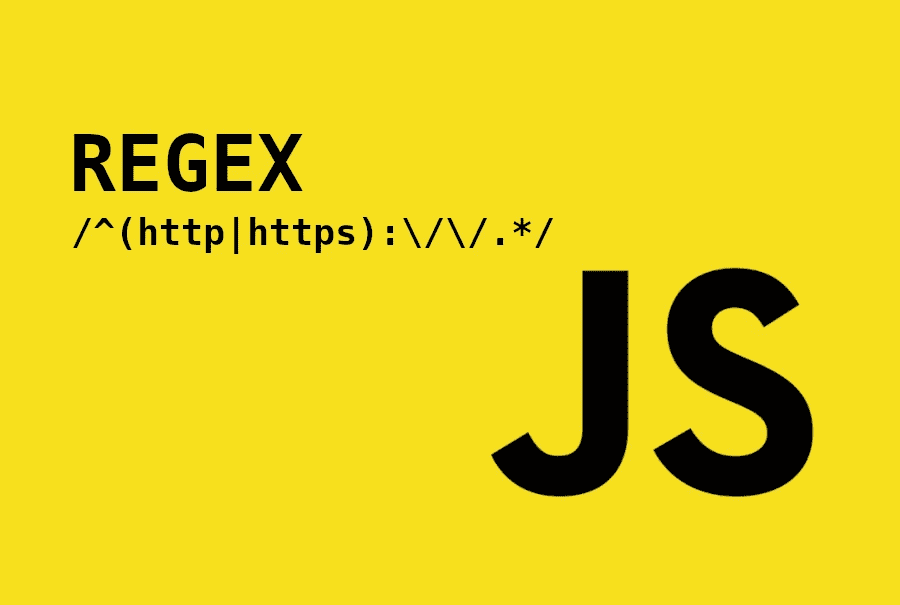

# JavaScript 中的 Regex API 实用指南

> 原文：<https://betterprogramming.pub/mastering-regex-tooling-in-javascript-c3fbbb19fd32>

## RegExp、replaceAll、replace、exec、search、test 等等



正则表达式是包含帮助您匹配、定位和管理文本的模式的文本字符串。非常有用，几乎每种语言都有某种正则表达式支持。

虽然 Perl 和 Python 是 regex 的全功能语言，但是 JavaScript 有很多工具。

您了解 JavaScript 的全部功能吗？您想知道每种工具之间的区别吗？

在本文中，我们不会深入探讨正则表达式的语法，而是探讨可以在 JavaScript 中使用哪些工具来充分利用它们。正则表达式一开始可能有点让人不知所措。我们将看到如何有效地创建和使用它们。

# 创建正则表达式

掌握正则表达式的第一步是能够创建这些正则表达式。在创建 regex express 时，您有两种选择:

## 1.使用正则表达式文字

当我们知道我们的表达式不会在运行时运行时，我们可以使用`regular expression literals`来创建它们。语法很简单；正则表达式用斜线括起来。标志(如果有)被附加在末尾。

```
**/*pattern*/*flags***
```

让我们看一个例子:

这就是所谓的文字符号。正则表达式将在编译时进行解析和计算。这意味着这将是一个非常高效的解决方案。

## 2.使用常规构造函数

当你的正则表达式被设置为在运行时改变或者依赖于一个运行时变量时，我们可以使用`RegExp` API。第一个参数是表达式。有一个可选的第二个参数来设置标志。

```
**new RegExp(*pattern* [, flags]*)***// factory notation without the new keywod is possible
**RegExp(*pattern* [, flags]*)***
```

让我们看一个例子:

表达式的编译将在运行时进行；执行时会比较慢。

使用`RegExp`构造函数的另一个缺点是需要对特殊字符进行转义。例如，我们将需要`\\s`而不是`\s`。请检查[这里](https://riptutorial.com/regex/example/15848/what-characters-need-to-be-escaped-)参考需要转义的内容。

使用两种风格声明相同正则表达式的示例:

创建正则表达式的方法对其功能或用法没有任何影响。任何正则表达式最终都会有相同的原型:`RegExp.prototype`。

## **JavaScript 中支持的标志**

我们之前讨论过正则表达式和标志。标志是可选的，必须用小写字母书写；否则，它们将无效。

让我们检查 JavaScript 引擎接受的不同标志:

*   `i`:使搜索不区分大小写
*   `g`:查找所有匹配，而不是返回第一个。
*   `m`:多线模式。
*   `s`:启用“dotall”模式。它允许`.`匹配换行符`\n`
*   `u`:启用完全 Unicode 支持。
*   `y`:启用粘滞模式:表达式将从其指示的`lastIndex`属性开始搜索。

# JavaScript 方法

现在我们知道了如何创建正则表达式，让我们看看可以用它们做些什么。有八种方法接受正则表达式:

*   两个来自`RegexExp.prototype`。
*   六个来自`String.prototype`。

让我们来详细看看它们:

## 1.测试()

*   仅与正则表达式一起使用

这个方法很有用，因为我们只关心一个给定的目标是否符合我们的标准。它将返回真或假。

如前所述，上述代码与执行以下操作相同:

## 2.执行()

*   仅与正则表达式一起使用

`exec()`方法用于通过多次调用来迭代搜索结果。如果返回是`null`则意味着你到达了终点。如果不是`null`，您将获得`latIndex`位置和匹配的结果。它支持分组。

## 3.匹配()

*   仅与正则表达式一起使用

`match()`方法返回一个包含所有匹配事件的数组，而不是像`exec`那样一次一个。将不会返回关于该匹配的任何附加信息。如果不与`g`标志一起使用，它会返回捕获组。

## 4.matchAll()

*   仅与正则表达式一起使用

`matchAll()`方法类似于`exec`，尽管它会给我们一个迭代器作为结果。然后我们可以使用`for`循环遍历所有结果。它确实返回捕获组。

## 5.搜索()

*   仅与正则表达式一起使用

当你想在一个字符串中定位一个匹配的位置时,`search()`方法很有用。它类似于`indexOf`方法，但是使用正则表达式而不是普通字符串。如果找不到索引或匹配起始位置，将返回`-1`。

## 6.替换()

*   与正则表达式或字符串一起使用

`replace()`方法返回一个新的字符串，其中一些或所有匹配被定义的替换所替换。它适用于字符串或正则表达式文字。与前者一起使用时，只会替换第一个出现的内容。

## 7.replaceAll()

*   与正则表达式或字符串一起使用

`replaceAll()`方法类似于`replace()`。有两个主要区别:

*   当使用字符串时，它将替换所有出现的内容。
*   它将要求正则表达式具有`g`参数，否则将失败。

请注意，`replaceAll`方法刚刚被添加到最新的 ES2021 规格中。

## 8.拆分()

*   与正则表达式或字符串一起使用

`split()`方法使用搜索模式分割字符串。它将返回子字符串的有序数组。可以使用字符串或正则表达式来完成除法。

方法`match()`、`matchAll()`和`search()`接受正则表达式和字符串作为参数。然而，如果没有给定正则表达式，字符串将使用`new RegExp(argument)`转换为`RegExp`。

为了防止这种情况，如果可行的话，像`search()`一样，最好在使用字符串时将它们的字符串对应物实现。

# ECMAScript 功能

## 命名捕获组

捕获组是一个有用的正则表达式特性。在`ES2018`规范中，引入了捕获命名组特性。它允许组名有更一致的访问。

## **正则表达式后视断言**

所有主流浏览器都已经提供了前瞻功能。look back 是作为`ES2018`规格的一部分发布的。它允许我们将正则表达式建立在匹配背后。它的工作方向与前瞻相反。它可以接受积极和消极的条件。

## RegExp unicode 属性转义

在此之前，目前无法使用本地 JavaScript 引擎访问 regex 的 Unicode 字符。它作为`ES2018`规范的一部分发布。

## 正则表达式匹配索引

这尚未发布，将与`ES2022`规格一起发货。通过使用新添加的标志`d`，我们可以访问比赛的`start`和`end`索引位置。

它甚至适用于捕获组和命名组。

# 最后的想法

正则表达式是我们编程生活中不可或缺的工具。在这里，我们已经看到了 JavaScript 引擎中所有不同的选择。有了对其内部的清晰理解，我们现在能够为正确的工作选择正确的工具。

JavaScript 中仍然有一些缺失的特性。然而，它很快覆盖地面。像`Match Indices`这样令人兴奋的事情即将发生。

一些新功能的唯一警告是，它们对 polyfill 来说并不总是微不足道的。这就是一个人背后的样子。

希望这篇文章能帮助你理解和阐明如何更好地使用正则表达式。

感谢阅读。