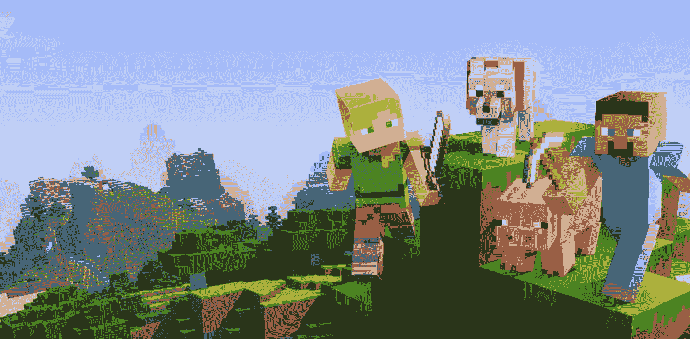
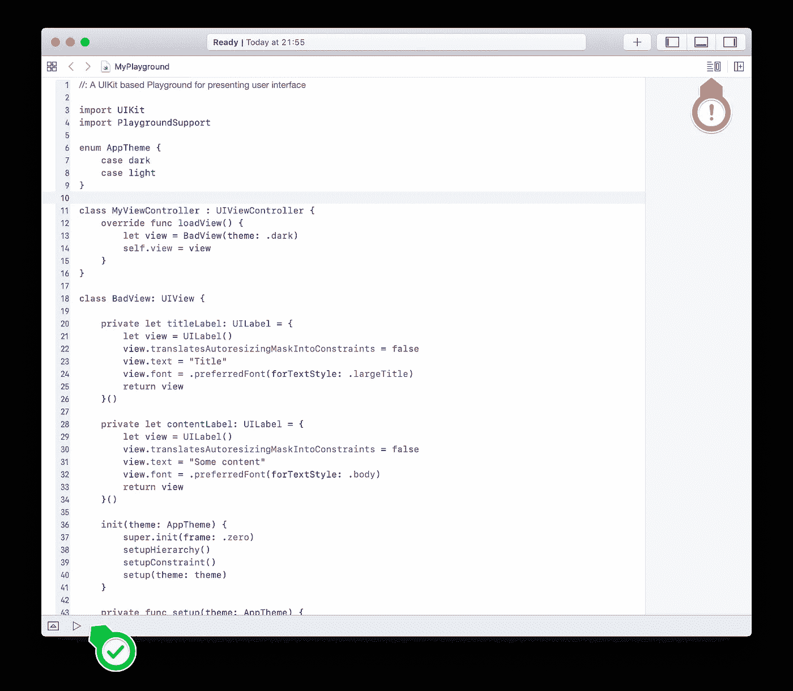

# 掌握 iOS 中的软件工程:开闭原则

> 原文：<https://betterprogramming.pub/mastering-software-engineering-in-ios-open-close-principle-5f28d2f09f8c>

## OCP:软件开发基础简单易懂

Dmitry Chernyshov 在 [Unsplash](https://unsplash.com?utm_source=medium&utm_medium=referral) 上拍摄的照片

# 固体

[在上一篇文章](https://medium.com/@adrianzyga/from-hobbyist-to-professional-ios-developer-solid-part-1-5a256e1d3b43)中，我已经讲述了什么是坚实的原则，并解释了第一条。所以现在我们要继续第二个固体原理，叫做开/闭原理。但在此之前，让我提醒您我将如何在整个系列中展示这些示例，以使一切变得清晰明了:

*   我给个简单的定义
*   我将给出一个糟糕代码的例子，它在某种程度上违背了我们讨论的原则
*   我将解释为什么这个原则在给定的例子中被打破了
*   我将重构代码，因此该示例符合所讨论的原则
*   我将解释为什么现在它符合它

我将向你们展示的每个例子都将在 Swift Playground 中发挥作用。

# 开闭原理

> “软件实体(类、模块、函数等)。)应该对扩展开放，但对修改关闭”
> ——伯特兰·迈耶

这到底是什么意思？

简而言之:一旦我们编写了一段提供功能的代码，我们就不应该去修改它，即使需要修改功能。我们应该能够编写一个新的代码来替代旧的功能。

你要记住，你的最终作品要符合这个原则！这条规则并不阻止重构糟糕的代码或者在需要的时候进行修改！

许多初级开发人员曲解了它，并避免重构(经常进行不必要的继承和重写方法，这样他们就可以添加新的代码，而不是替换坏的代码)。

当你在应用上工作时，尤其是当你在开发过程中，大多数时候你需要修改已经写好的东西来完成工作。在你实现了所有你想要的功能后，你的代码应该遵循开闭原则。

这里有一个例子:

图片来自:[https://www.minecraft.net/](https://www.minecraft.net/)

你可以为*《我的世界》*安装改变其功能的插件(mod ),而无需改变*《我的世界》*客户端本身的代码。这是一个模块级的 OCP 的美丽例子。

游戏本身对扩展(插件)是开放的，对修改是封闭的(你不需要重新编译整个客户端，改变游戏本身的代码来做这些改变)。

但这并不意味着曾经在《我的世界》代码库中的东西将永远留在那里。《我的世界》的开发者仍然在改变客户端本身，发布新版本，改变旧代码(进行修改)。一旦他们做了所有的修改，他们发布了一个新版本的游戏，仍然符合 OCP T21。你仍然可以使用和创建插件。

这一原则可以应用于 3 个最常见的级别:`func`、`class`和模块。《我的世界》的例子展示了模块层次(整个游戏本身是一个模块，模块是其他与之交互的模块)。我将用代码展示`func`和`class`的例子。

# 开始之前

Swift Playground 可以让你看到单个`UIView`和`UIViewController`，而不用创建整个 iOS 应用。

我们将在我们的例子中使用它。创建一个“空白”或单一视图的游乐场，复制代码，确保您已经启用了“实时视图”(橙色箭头)，并按下播放按钮(绿色箭头)。

当您复制第一个示例时，应该会看到类似这样的内容:

## 示例:`UIView`的样式

所以我们最后来看看这个`UIViewController`和关联的`UIView`。如你所见，它可以配置两个主题:

现在尝试添加另一个主题…

类`BadView`打破了*打开/关闭原则*，因为不修改`setup(theme:)`方法就不能添加另一个颜色主题。您还需要通过添加另一个案例来修改`AppTheme`枚举。

您可以通过编写适用于无限多主题的代码来轻松避免这个问题:

正如你所看到的，你仍然可以很容易地选择`.dark`或`.light`主题，但是你也可以提供无限数量的自定义样式，只需将它们作为参数传递给`GoodView`构造函数:

`GoodView`为修改而关闭(无需修改)，为扩展而打开(无限数量的`Style`结构可以扩展其功能)。

如果您愿意，您也可以通过添加静态常量向`Style`结构添加新的样式:

如果您将在许多地方使用新的“joker”样式，那么添加这个静态常量是有意义的，即使这意味着您正在修改`Style`结构。这样做是可以的，因为整体解决方案符合*OCP*——你可以在不改变代码的情况下改变功能。这并不意味着你总是要这样做。这一原则的全部思想就是拥有选择权。如果重构是一条路要走，不要害怕去做。

我可以保证，在 *iOS* 开发中，你每天都会被这个糟糕的设计绊倒。甚至苹果公司也在很多地方犯了这个错误，它提供了一个带有可能样式的枚举，而不是让我们有可能将它们创建为某种样式结构/对象。就看[这里](https://developer.apple.com/documentation/uikit/uibutton/buttontype)或者[这里](https://developer.apple.com/documentation/uikit/uitableview/style)！

# 好了🎉

所以现在你知道了*扎实*的前两条原则。还剩 3 个！

顺便说一下，本文中的例子展示了一种很好的结构化方法，可以通过编程来制作视图和视图控制器，避免使用 xib 文件和故事板！

查看下一部分: [*利斯科夫代入原理*](https://medium.com/@adrianzyga/from-hobbyist-to-professional-ios-developer-liskov-substitution-principle-f98d6e1e6b19) *。*