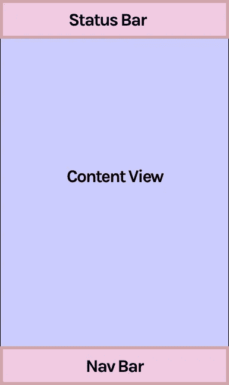
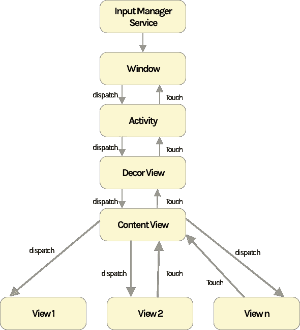
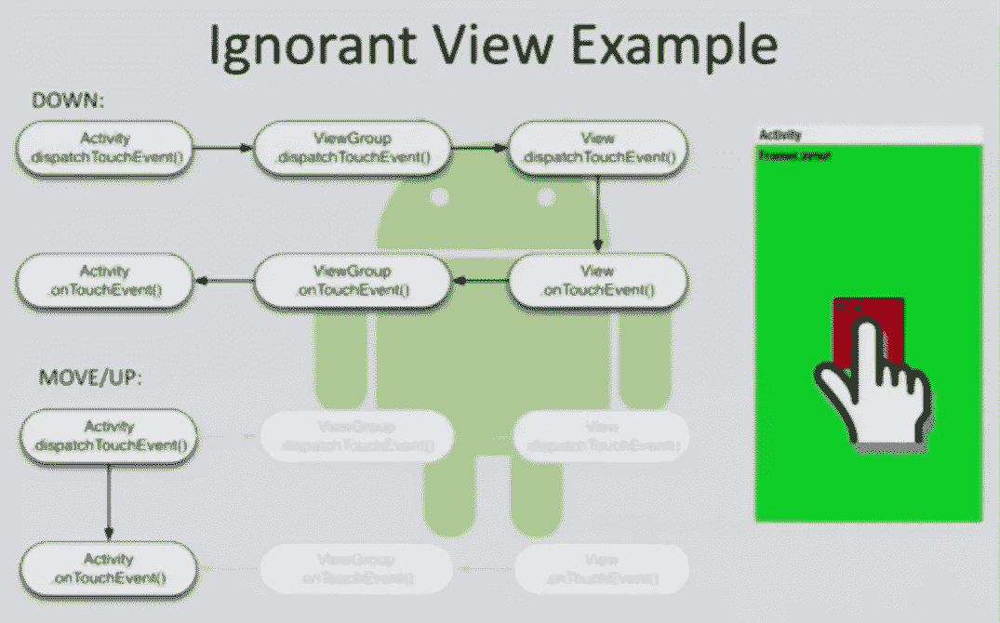
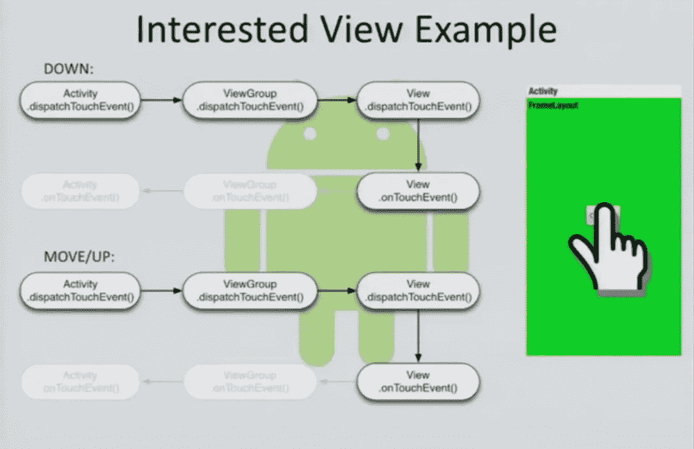
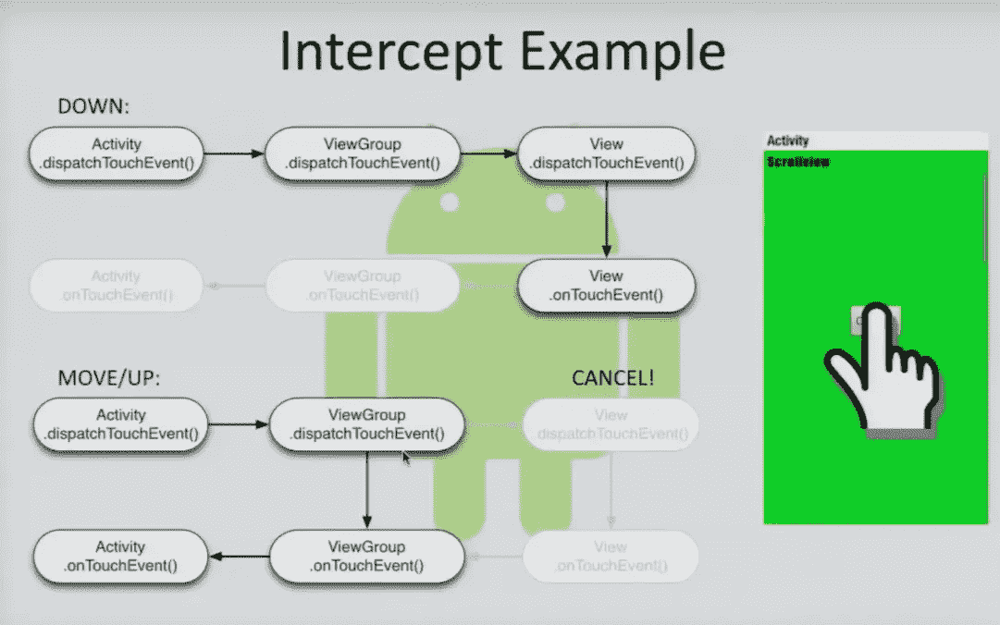
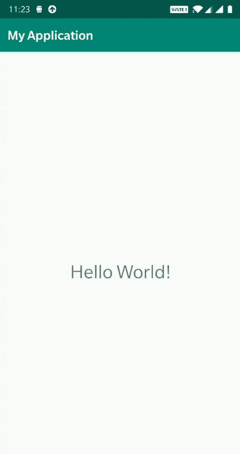

# 掌握 Android 触摸系统

> 原文：<https://betterprogramming.pub/mastering-the-android-touch-system-41234cf3c3b3>

## 让我们探索一下触摸框架


处理触摸事件是开发用户交互的重要部分。我们已经知道了标准事件的基本处理:点击、长时间点击、按键等等。

在这篇文章中，我们将看到 Android 如何将触摸事件从父母发送到孩子。我们开始吧

# 运动事件

从触摸屏到我们的应用程序的每个事件都被包装成一个运动事件。运动事件是用于报告运动事件的对象。它们为我们提供了与每个事件相关的所有信息:动作是什么以及与事件相关的元数据，如触摸位置、该点在屏幕上的手指数量以及事件时间。

运动事件根据动作代码和一组轴值来描述运动。动作代码指定发生的状态变化，例如指针向下或向上。轴值描述了位置和其他运动属性。

# 两颗北极指极星

多点触摸屏为每个手指发出一个移动轨迹。产生移动轨迹的单个手指或其他物体(鼠标、笔、轨迹球)被称为指针。运动事件包含关于当前活动的所有指针的信息，即使它们中的一些自从上次事件被传送以来没有移动过。

当我们用手指触摸屏幕上的特定点时，产生的信息包括 X、Y 坐标，以及其他信息，如索引、id 等。由于 Android 支持多点触摸，指针用于识别在同一时间点引起移动轨迹的所有对象。

# 行动

动作类型和它们的名字暗示了它们做什么。可用的操作有

**ACTION_DOWN:** 这是物体或手指进入**接触**屏幕的第一个点。当你把手指放在屏幕上 **ACTION_DOWN** ，被触发。

**ACTION_UP:** 这是物体或手指释放与屏幕接触的点。当您在屏幕上取下手指 **ACTION_UP** 时，被触发。

**ACTION_MOVE:** 这是指针在屏幕上被**拖动**时调用的事件。这可以定义为循环**动作 _ 下降**和**动作 _ 上升之间发生的变化。**

**ACTION_POINTER_DOWN:** 这与 **ACTION_DOWN** 类似，但在支持多点触摸的情况下，当辅助或附加对象接触屏幕时调用。

**ACTION_POINTER_UP:** 这与 **ACTION_UP** 类似，但在支持多点触摸的情况下，当辅助或附加对象释放与屏幕的接触时，会调用。

**ACTION_CANCEL:** 当最初一个视图正在处理被转移到另一个视图的触摸时，该事件被触发。当前手势已被中止。你不会再得到任何分数了。

手势被定义为以 **ACTION_DOWN** 开始，以 **ACTION_UP 结束。**这个循环在交互过程中重复几次。每个指针都有一个唯一的 id，该 id 在指针第一次下降时被分配(由 **ACTION_DOWN** 或 **ACTION_UP** 指示)。指针 id 保持有效，直到指针最终上升(由 **ACTION_UP** 或 **ACTION_POINTER_UP** 指示)或手势被取消(由 **ACTION_CANCEL** 指示)。

# 了解系统

这是我们完整的窗口，包含三个部分:状态栏、导航栏和内容视图。内容视图是一个`FrameLayout`，它包含你正在展开的其他布局。`setContentView`是告诉内容视图容器上应该填充什么的方法。里面的布局包含了我们添加的所有视图。



# Android 如何处理触摸

输入事件首先传递给窗口，然后传递给前台活动。在我们的应用程序中，最上面的前台活动在任何其他组件之前接收触摸事件。如果我们想要消费这个事件，并且不允许在视图层次结构中有任何进一步的活动，我们覆盖活动中的`dipatchTouchEvent()`并返回 true。活动的`dispatchTouchEvent()`是接收触摸事件的第一个方法。

如果活动对处理触摸事件不感兴趣，那么它就会向下流动，从活动的根布局或`ViewGroup`到底部视图。该循环继续流动，直到它找到某个对处理触摸事件感兴趣的组件。如果任何视图或视图组消耗了触摸事件，则循环停止。如果事件没有找到任何要使用的视图，并且如果循环到达了底部视图，则循环开始往回走，从层次结构底部的视图开始到顶部的活动。



# onInterceptTouchEvent()

`ViewGroup` 有一个额外的方法`onInterceptTouchEvent()`，它持续监控所有通过`ViewGroup`流向其子视图的触摸事件。这是因为在任何给定的时间点，如果 ViewGroup 想要通过停止事件流来获得当前手势的所有权，子视图正在消耗的内容将开始自己消耗。换句话说，一个包含布局可以选择在视图接收到事件之前从一个被接触的视图中窃取事件。

这里最好的例子是一个包含要交互的孩子的`ScrollView`。在这种情况下，父`ViewGroup`不断地监控触摸事件流。如果有一个孩子正在处理的触摸事件，并且手势已经改变为拖动，那么使用`onInterceptTouchEvent()`方法的父节点将停止孩子上的触摸事件并自行消耗。子视图可以调用父视图上的`requestDisallowIntercept()`来在当前手势的持续时间内阻止`onInterceptTouchEvent()`。一旦手势结束或者如果新的手势开始，这些标志被框架重置，因为框架给予父母优先权来控制孩子之上的触摸事件。

# 触摸调度

**步骤 1:** 包含内容视图的当前活动被调用`Activity.dispatchTouchEvent()`。

**步骤 2:** 如果活动选择不“消费”事件(并开始传播)，则事件被传递到`ViewGroup` `dispatchTouchEvent`。

**步骤 3:** `ViewGroup` `dispatchTouchEvent`将首先触发`ViewGroup` `onInterceptTouchEvent`，如果该方法选择不拦截触摸事件，则通过触发`dispatchTouchEvent`将其发送给孩子。

总而言之，从活动开始，`dispatchTouchEvent`在过程中的每个级别都被调用。调度程序负责确定接下来要调用哪些方法。在触发视图层次结构中下一个子节点上的`dispatchTouchEvent`之前，调度程序触发`ViewGroup`。

# 例子

让我们详细看看如果层次结构中没有视图使用触摸事件会发生什么。`dispatchTouchEvent()` 从活动开始，一直到视图，如下图所示，没有任何东西消耗触摸事件，反向链从视图开始，调用视图的`**onTouchEvent()**`及其父视图，然后调用活动。



`dispatchTouchEvent()` *是活动中的第一个方法，* `onTouchEvent()` *是活动中最后一个接收触摸事件的方法。*

这个链条就像`dispatchTouchEvent()`向下流动和`onTouchEvent()`事件流回一样。因此，如果您想在活动中使用触摸事件，请使用`dispatchTouchEvent()` 而不是`onTouchEvent()`，因为在层次结构中，任何子视图都有可能使用它。如果任何视图被消耗，将无法返回。

在任何时候，如果任何组件对使用事件感兴趣，传播就在那里停止。它不会进一步传播，如下所示。



在按钮在`ScrollView`内的情况下，按钮在被点击时接收触摸事件，但是如果手势变为拖动，则`onInterceptTouchEvent`被调用并且`ScrollView`开始处理触摸，并且按钮接收`ACTION_CANCEL`事件。



# 自定义触摸处理

作为开发人员，在某些时候，我们可能需要在布局中移动视图。让我们看看如何做到这一点。

首先，创建一个带有视图的 XML，然后在活动中展开它。这是基本的设置，现在让我们开始运动部分。

```
<?xml version="1.0" encoding="utf-8"?>
<androidx.constraintlayout.widget.ConstraintLayout xmlns:android="http://schemas.android.com/apk/res/android"
    xmlns:app="http://schemas.android.com/apk/res-auto"
    xmlns:tools="http://schemas.android.com/tools"
    android:id="@+id/_root"
    android:layout_width="match_parent"
    android:layout_height="match_parent"
    tools:context=".MainActivity">

    <TextView
        android:id="@+id/_textView"
        android:layout_width="wrap_content"
        android:layout_height="wrap_content"
        android:text="Hello World!"
        android:textSize="30sp"
        app:layout_constraintBottom_toBottomOf="parent"
        app:layout_constraintLeft_toLeftOf="parent"
        app:layout_constraintRight_toRightOf="parent"
        app:layout_constraintTop_toTopOf="parent" />

</androidx.constraintlayout.widget.ConstraintLayout>
```

首先，我们需要为我们打算在屏幕上移动的视图注册一个触摸监听器。接下来，我们覆盖`onTouch()`方法，它有两个属性:视图和`MotionEvent`。然后逻辑开始，因为我们必须移动文本视图:我们需要获得触摸事件的 X 和 Y 坐标，然后将它们设置到视图中。通过这样做，视图在屏幕上移动，但不是像我们预期的那样——在 ACTION_DOWN 中需要计算 delta 部分。可以通过从视图 X 坐标中减去运动事件 X 坐标来获得δX 坐标。下面是一个简单的等式:

```
var _xDelta = _textView.x — event.rawXpackage com.example.myapplication

import androidx.appcompat.app.AppCompatActivity
import android.os.Bundle
import android.view.MotionEvent
import android.view.View
import kotlinx.android.synthetic.main.activity_main.*

class MainActivity : AppCompatActivity(),View.OnTouchListener {

    private var _xDelta: Float = 0.0f
    private var _yDelta: Float = 0.0f

    override fun onCreate(savedInstanceState: Bundle?) {
        super.onCreate(savedInstanceState)
        setContentView(R.layout.activity_main)
        _textView.setOnTouchListener(this)

    }

    override fun onTouch(p0: View?, event: MotionEvent): Boolean {

        when (event.action) {

            MotionEvent.ACTION_DOWN -> {

                _xDelta = _textView.x - event.rawX
                _yDelta = _textView.y - event.rawY
            }
            MotionEvent.ACTION_MOVE ->

                _textView.animate()
                    .x(event.rawX + _xDelta)
                    .y(event.rawY + _yDelta)
                    .setDuration(0)
                    .start()
            else -> return false
        }
        return true
    }

}
```

增量 X 分量应在 ACTION_DOWN 上计算，并应从 ACTION_MOVE 中的事件 X 坐标中扣除。输出将如下所示:



输出

目前就这些。我们对 Android 触摸系统如何工作，如何拦截子触摸事件，如何阻止父触摸事件，以及如何移动屏幕上的视图有了一个概念。有关多点触摸事件和其他触摸相关内容链接的更多信息，请点击以下链接。

## 参考

[戴夫·史密斯掌握安卓触摸系统](https://www.youtube.com/watch?v=EZAoJU-nUyI)

[管理视图组中的触摸事件](https://developer.android.com/training/gestures/viewgroup)

感谢您的阅读。