# 掌握 JavaScript 控制台日志记录的艺术

> 原文：<https://betterprogramming.pub/mastering-the-art-of-console-logging-7518fead4e1a>

## 成为专业控制台用户的 10 种控制台方法

照片由[Joel&Jasmin fr estbird](https://unsplash.com/@theforestbirds?utm_source=medium&utm_medium=referral)在 [Unsplash](https://unsplash.com?utm_source=medium&utm_medium=referral) 上拍摄。

在漫长的调试过程中，我们都使用控制台对象进行虚拟打印。调试是前端开发人员必须面对的日常任务之一。为此，您可以使用调试器或控制台对象。

当使用后者时，大多数开发人员坚持使用最基本的`console.log()`版本。然而，控制台对象有一个为不同场景定制的很棒的 API。为什么只坚持一种方法？你充分利用它了吗？你想简化你的调试体验吗？

通过了解最相关的控制台方法的来龙去脉，您将能够为工作选择正确的工具。在调试/记录代码时，您还将能够提取最相关的信息。最后，通过变得更有效率，你将会节省时间并让自己少一些麻烦。

让我们来看看 10 种最相关的控制台方法:

# 1.console.log/.错误/。警告

`console.log()`并不是写入控制台的唯一方式。控制台对象可以打印不同级别的文本:`warn`、`error`、`log`。

使用合适的品牌:

*   代码不言自明。
*   日志更容易区分。在打印一些调试日志时特别有用。
*   很容易通过相应的级别过滤相关的消息。

让我们来看看不同级别的活动:

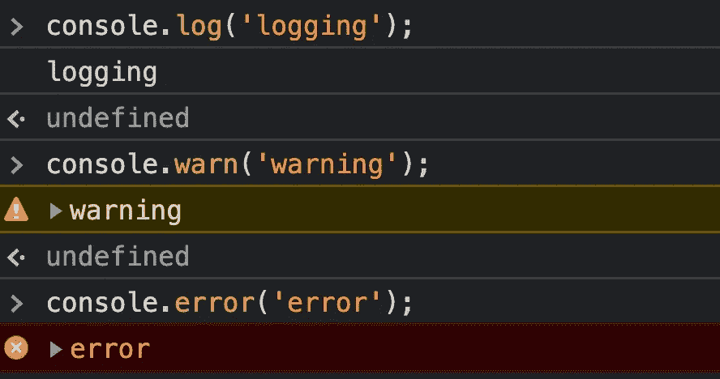

日志工具和浏览器允许您按严重性过滤日志消息。

只需做一些简单的事情，如使用正确的日志级别，就可以看到许多好处。

# 2.console.count/。countReset

这项功能是我衡量绩效时的常用工具之一。当您调试组件的性能时，这很有用。

> "`**console.count()**`方法记录了这个对`count()`的特定调用被调用的次数。"— [MDN 网络文档](https://developer.mozilla.org/en-US/docs/Web/API/Console/count)

当调用`console.count('xxx')`时，它将打印出现的次数以及参数字符串。

让我们来看一个处决:

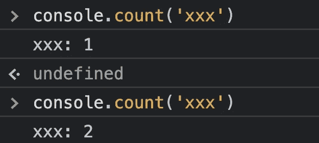

那有用在哪里？假设您有一个计算或渲染成本很高的组件。添加一个计数器来查看它被调用的次数是很有用的。它会让你知道有多少次昂贵的渲染/计算正在发生。

像 React 这样的框架有自己的开发工具来绘制组件渲染，但不幸的是，在应该使用它们的关键场景中，它们并不可靠。

请注意，您可以随时使用`console.countReset()`方法重置计数器。

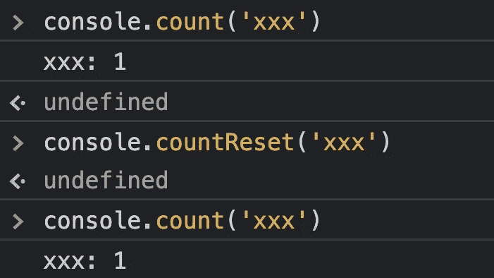

这是一个完美的调试伴侣。您可以深入 JavaScript 代码，了解一段代码执行了多少次。

# 3.console.time/.时间日志/。时间结束

性能调试的另一个有用工具。`console.time`方法将帮助您更好地理解应用程序各部分之间耗费了多少时间。

> "启动一个计时器，您可以用它来跟踪一个操作需要多长时间。您给每个计时器一个唯一的名称，并且在一个给定的页面上可以运行多达 10，000 个计时器。当你用同样的名字调用`[console.timeEnd()](https://developer.mozilla.org/en-US/docs/Web/API/Console/timeEnd)`时，浏览器会输出计时器启动后经过的时间，以毫秒为单位。”— [MDN 网络文档](https://developer.mozilla.org/en-US/docs/Web/API/Console/time)

首先，使用`console.time()`启动定时器。然后，您可以使用`console.timeLog()`来打印您可能感兴趣的任何中间时间结果。这种粒度方法将帮助您更好地理解代码的性能。

*注意:一些浏览器可能会在该函数中接受第二个参数，您可以在其中记录额外的数据。*

下面是调用的结果:

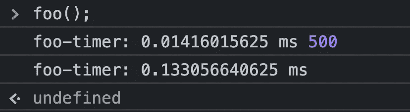

需要注意的是，这些值会根据运行代码的机器而有所不同。根据同一台计算机上的许多因素，执行时间也会有所不同。在根据性能时间观察做出决策时，请记住这两点。

# 4.控制台.时间戳

此功能是非标准的，可能会因浏览器而异。

> 向浏览器的[性能](https://developers.google.com/web/tools/chrome-devtools/evaluate-performance/reference)或[瀑布](https://developer.mozilla.org/en-US/docs/Tools/Performance/Waterfall)工具添加单个标记。这使您可以将代码中的某个点与时间轴中记录的其他事件相关联，如布局和绘画事件。— [MDN 网络文档](https://developer.mozilla.org/en-US/docs/Web/API/Console/timeStamp)

在调试一些性能问题时，这是另一个巨大的帮助。它允许您向性能监视器 UI 添加一些输入，以便您可以将其用作参考。

让我们看下面的例子:我们有一段处理一些项目的代码。我们想对执行过程有更多的了解。为此，我们可以使用性能监视器。

当我们的数组中处理了 100 个项目时，我们将使用`console.timeStamp()`来打印一条消息。这些参考点可能会派上用场，帮助我们进一步了解正在发生的事情。在这个特定的例子中，由于我们要处理 1000 个项目，我们应该会看到十个`timeStamps`出现在性能监视器中。

现在，让我们转到 Chrome 开发者工具，记录该按钮点击的性能:

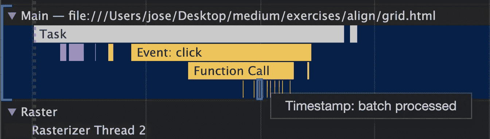

不出所料，我们观察了十个`timeStamp`习俗的实例。在这个小而简单的例子中，我们可以看到 100 个项目之间的时间是如何变化的，即使我们只是执行加法。这符合我们的预期，因为这是 JavaScript 执行的本质。

# 5.console.profile/.profileEnd

让我们看看最后的控制台方法，重点是内存/性能调试。`console.profile()`允许您以编程方式启动 JavaScript 分析器。这使得 profiler 非常细粒度，只针对代码的特定区域。当你完成后，就打电话给`console.profileEnd()`来结束分析。

请注意，这是非标准特性。行为可能因供应商而异。

让我们看一个使用示例:

执行后，您可以通过单击“...”来检查结果在 Chrome 开发者工具上，然后在“更多工具”和“JavaScript 分析器”上

让我们看看我们的例子的结果:

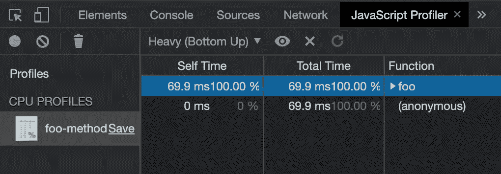

能够以编程方式分析我们的代码，让我们能够精确定位我们可能怀疑有内存问题的任何区域。

# 6.控制台.表格

这个特性让你以一种更友好的方式来表示对象。函数的参数可以是对象或数组:

*   如果它是一个对象，它将显示它的可枚举属性。
*   如果是数组，将显示每一项。

假设您想在调试时比较两个对象。不使用调试器，您可以使用`console.table()`方法来查看用户友好的比较。

让我们看看结果:

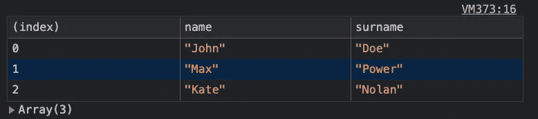

有时您不需要启动调试器，只需要一个友好的对象可视化就可以了。

# 7.控制台.目录

这个函数与前一个函数有着相同的目标:帮助在控制台中可视化表示一个对象。

> `Console`方法`**dir()**`显示指定 JavaScript 对象属性的交互式列表。输出显示为带有显示三角形的分层列表，可让您查看子对象的内容。— [MDN 网络文档](https://developer.mozilla.org/en-US/docs/Web/API/Console/dir)

和`console.log()`有什么区别？`console.log()`方法使用`toString`方法表示对象，而`console.dir()`显示交互对象。

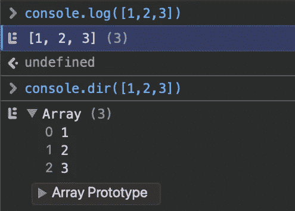

注意在`console.log()`执行中，我们没有得到对象类型，而在`console.dir()`中我们得到了它。

# 8.控制台.组

帮助您更好地可视化日志的另一种方法。这将增加你的日志层次。您将能够按层对它们进行分组。在调用`console.groupEnd()`之前，每个`console.group()`会将后续控制台消息缩进一个额外的级别。

我们来看一个例子:

让我们来看看它的控制台结果:

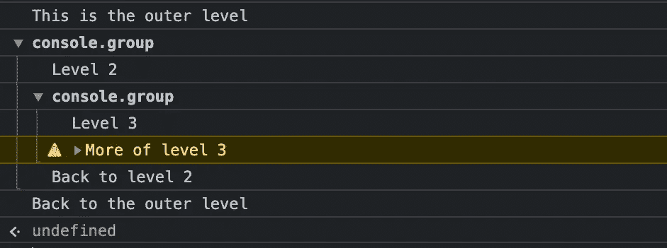

当你有很多日志并且你需要一点清晰的时候，这是非常有用的。

# 9.控制台. trace

这是一个简单而强大的特性。控制台接口的`trace`方法将当前方法堆栈跟踪输出到浏览器控制台。

让我们通过一个实践示例来更好地理解这一点:

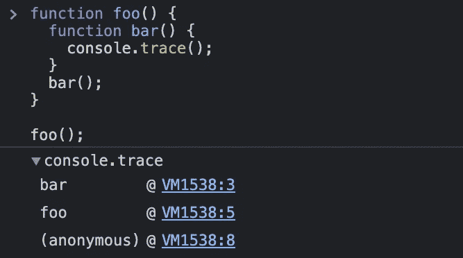

我们可以观察到`foo()`调用的堆栈跟踪。这有助于详细调试错误和异常，而无需使用调试工具。

# 10.控制台.断言

我把一个最有用的方法留到了最后。`console.assert()`可以通过使用类似测试的语法来帮助识别代码库中的 bug。

> 如果断言为假，`**console.assert()**`方法将向控制台写入一条错误消息。如果断言为真，则什么都不会发生。”— [MDN 网络文档](https://developer.mozilla.org/en-US/docs/Web/API/console/assert)

让我们做一个虚拟的例子，我们将检查对象参数是否为 falsy。当然，像 TypeScript 这样的工具将帮助您主动发现这些不一致之处。

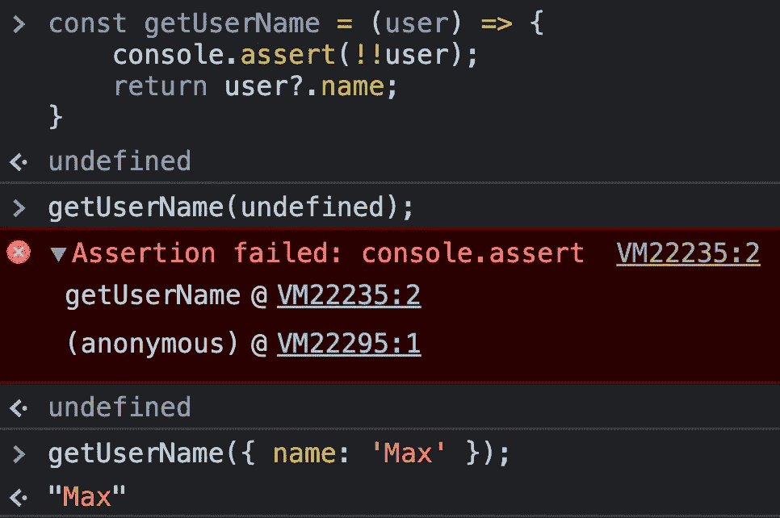

这段代码不应该意外地被发布到产品中。这只是为了帮助你调试会话。通过放置断言，您可以在不同的方法上验证您的假设，而不必自己添加断点来进行检查。

# 最后的想法

我们已经看到当正确使用时，控制台方法在我们的日常开发生活中有多大的帮助。它涵盖了广泛的领域:

*   对象可视化
*   误差增大
*   数据比较
*   性能监控器
*   内存分析
*   输出的粒度级别

当然，您并不总是需要控制台界面来进行调试。你可以使用调试器。根据不同的场景，您可能会使用其中一种工具。然而，通过了解你所掌握的所有工具，你可以做出更好的决定。

我希望这篇文章能让你开始使用控制台方法，并打破默认使用`console.log()`的习惯。

干杯！

# 有关系的

 [## 5 个常见的 JavaScript 内存错误

### 避免应用程序内存泄漏的技巧

better 编程. pub](/5-common-javascript-memory-mistakes-c8553972e4c2)  [## 提高代码性能的 10 种 JavaScript 数组方法

### Every、some、includes 和其他数组方法

better 编程. pub](/10-javascript-array-methods-to-boost-your-code-performance-acb57b455189)