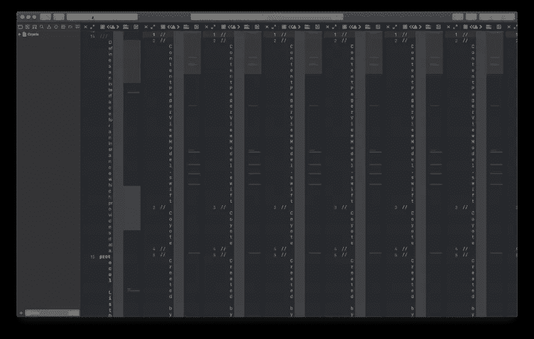
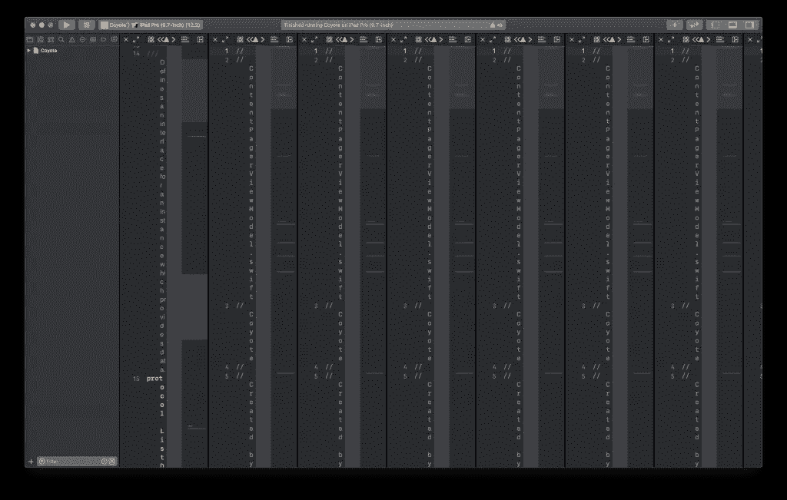
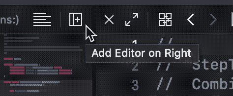
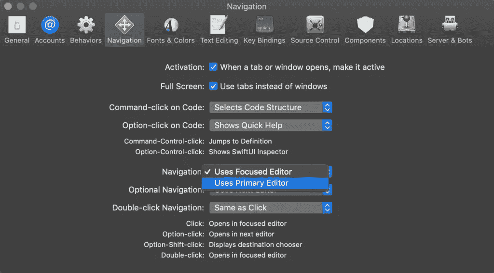
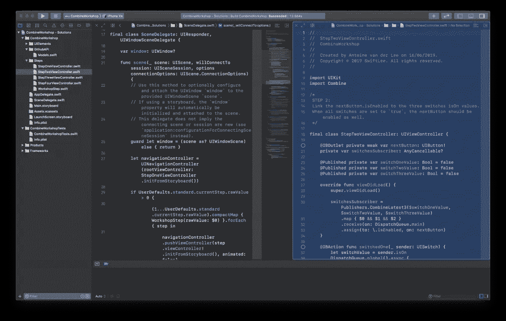
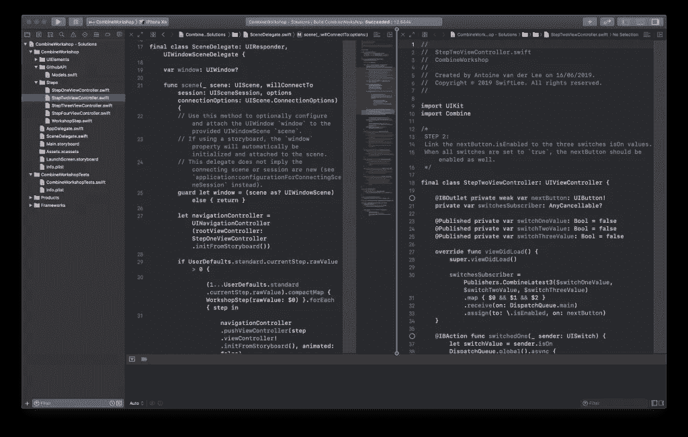
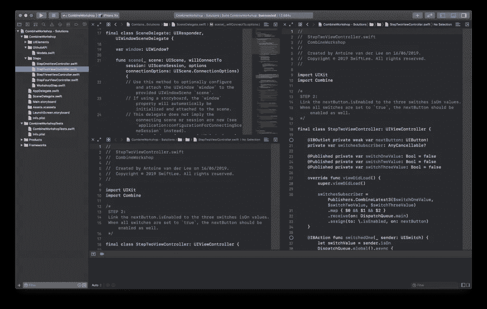
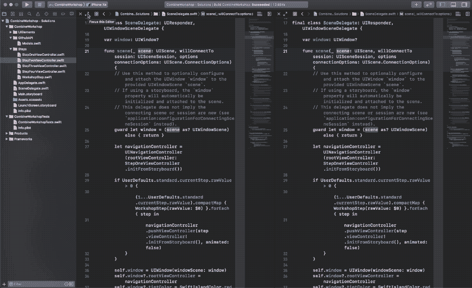

# 掌握 Xcode 11 中的助理编辑器

> 原文：<https://betterprogramming.pub/mastering-the-assistant-editor-in-xcode-11-4c26bdcd673>

## 让我们深入了解 Xcode 11 的新特性

Xcode 11 是在 2019 年 WWDC 期间推出的，它改进了助理编辑的工作方式。

如果您经常使用第二个编辑器，当您试图在 Xcode 11 中使用相同的工作流程时，当文件在左边的编辑器中打开时，最初可能会非常沮丧，而您原本希望它们在右边的编辑器中打开。

就像学习[如何在没有 SwiftUI](https://www.avanderlee.com/xcode/xcode-previews/) 的情况下使用新的 Xcode 预览面板一样，你只需要学习新的编辑器如何在 Xcode 11 中工作。一旦你明白了，你会发现你实际上改善并加快了你的工作流程。

## Xcode 里的助理编辑是什么？

Xcode 中的助理编辑器是第二个编辑器，它会根据您在主编辑器中执行的工作，自动显示 Xcode 确定对您最有帮助的文件。在 Objective-C 时代用的很多，在编辑`MyClass.m`的时候会打开`MyClass.h`。

您可以从 Xcode 菜单中选择“编辑器”>“助理”来打开编辑器。

如今，助理编辑更多地被视为仅次于主编的二级编辑。

## Xcode 11 中引入的编辑器更改

在 Xcode 11 中，您可以打开的编辑器数量似乎不再有限制:

打开 Xcode 11 编辑器的数量没有限制

新的编辑器是 Xcode 11 引入的最大变化之一。它是在 2019 年 WWDC 期间的[Xcode 11 新功能](https://developer.apple.com/videos/play/wwdc2019/401/)会议上推出的。

*   同时打开多个编辑器
*   通过进入全屏编辑模式聚焦于单个编辑器
*   单独配置每个编辑器，因为它们都有自己的小地图、预览、助手和其他补充视图

## 添加额外的编辑器

可以使用“文件”>“新建”>“编辑器”或使用键盘快捷键 Control+Command+T 来添加新的编辑器。

添加新编辑器的另一个简单方法是编辑器标题中的 new 按钮:

“添加新编辑器”按钮

当鼠标悬停在按钮上时点击选项允许你在当前编辑器下添加一个新的编辑器。

## 在助理编辑器中打开文件

如前所述，您不能在助理编辑器中打开文件，但是您可以在辅助编辑器中打开文件。

在 Xcode 11 之前，您会使用 Option+Open file 在二级编辑器中打开文件。现在执行同样的操作将在下一个编辑器中打开该文件。这意味着当右编辑器被聚焦时是左编辑器，反之亦然。

## 恢复旧的行为

首先，试一试。不要直接切换回旧的行为，因为一旦你习惯了，新的方式会很有用。

如果您仍然不能适应新的流程，您可以像以前一样更改设置来打开文件。

更改 Xcode 11 导航行为

转至“设置”>“导航”，然后:

*   将导航设置为“使用主编辑器”
*   将可选导航设置为“使用第二个编辑器”

## 使用目标选择器打开文件

使用选项+Shift+打开文件允许您选择目标编辑器。

使用 Xcode 11 目标选择器打开文件

如果您使用多个编辑器，这将非常方便。您也可以使用“目标选择器”在新编辑器中打开文件。

这可以通过将蓝色区域移动到现有编辑器旁边的一行来完成。

使用“目标选择器”打开新的编辑器

这可以通过水平和垂直两种方式完成，这样您就可以在彼此之上打开编辑器:

两个编辑在一起

## 使用焦点模式处理多个编辑器

首先，您可能会关闭任何辅助编辑器，直到您的编辑器再次全屏显示。有了 Xcode 11，这就不再需要了，因为您现在可以在全屏模式下关注单个编辑器了。

您可以从“视图”>“编辑器”>“焦点”中的菜单或使用快捷键“控制”+Shift+Command+Enter 来聚焦活动编辑器。最简单的方法可能是使用新的焦点按钮:

聚焦 Xcode 中的编辑器

## 结论

虽然您可能需要时间来适应 Xcode 11 中的新编辑器，但它们是改进开发工作流的一个很好的新方法。确保您充分利用新功能。

[重构选项](https://www.avanderlee.com/swift/xcode-refactoring/)也非常强大，而[这些技巧将进一步优化](https://www.avanderlee.com/optimization/speeding-up-development-a-collection-of-tips/)您的工作流程。