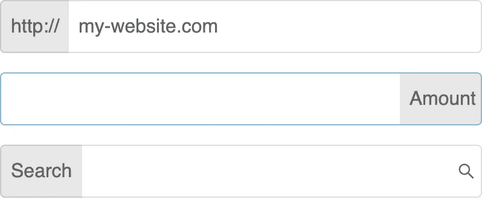
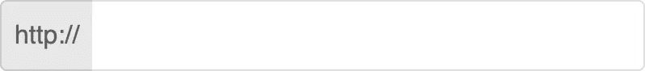
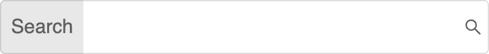

# 掌握复合组件模式

> 原文：<https://betterprogramming.pub/mastering-the-compound-component-pattern-cd0e56937fc3>

## 使用高级模式编写声明性 React 组件


[Joshua Sortino](https://unsplash.com/@sortino?utm_source=medium&utm_medium=referral) 在 [Unsplash](https://unsplash.com?utm_source=medium&utm_medium=referral) 上拍摄的照片

今天，我想介绍一种简单而强大的方法来用 ReactJS 创建组件:复合组件模式。

## 什么是复合成分？

复合组件模式允许组件共享一个*隐式*状态。这允许我们创建表达性和声明性的组件，而不需要不必要的训练。这些组件一起工作来完成一个共享的任务。

一个很好的例子是 HTML `select`和`option`。

```
<select>
 <option value="apple">Apple</option>
 <option value="pear">Pear</option>
</select>
```

`Option`和`select`合作完成他们的目标，让用户选择他们最喜欢的水果。

前面的例子是原生 HTML。反应当量会是什么样的？

下面是没有复合组件模式时的样子:

```
<Select
  value={value}
  onChange={handleChange}
  options={[
    { value: "apple", label: "Apple" },
    { value: "pear", label: "Pear" }
  ]}
/>;
```

下面是复合组件模式的外观:

```
<Select value={value} onChange={handleChange}>
  <Select.Option value="apple">Apple</Select.Option>
  <Select.Option value="pear">Pear</Select.Option>
</Select>;
```

如您所见，我们的组件现在以更具声明性的方式表达。

让我们将复合组件模式付诸实践，创建我们自己的`Input`组件。

# 将模式付诸行动

我们想创建一个足够灵活的`Input`组件来满足我们所有的需求。

## 验收准则

*   标签可以放在输入之前或之后。
*   像图标或按钮这样的自定义元素可以放在输入之前或之后。
*   它还应该允许传入自定义元素，如图标或按钮。
*   当输入获得焦点时，整个区域都应该获得焦点。
*   组件应该将`htmlFor`添加到标签中。

## 设计



## 我们组件的 API

```
<InputGroup id="search-input" value={searchTerm} onChange={handleSearchTermChange}>
  <InputGroup.Label>Search</InputGroup.Label>
  <InputGroup.Input />
  <InputGroup.Item>
    <SearchIcon />
  </InputGroup.Item>
</InputGroup>
```

# 代码

我们开始吧！我们创建一个名为`InputGroup.js`的文件。

然后我们为我们的`InputGroup`创建一个定制的上下文:

```
const InputGroupContext = React.createContext();
```

然后，我们定义一个自定义挂钩，以便我们的组件可以使用该上下文:

现在我们有了上下文，我们可以创建我们的`InputGroup`组件:

这个组件做两件事。

*   它呈现传递给它的`children`。
*   它用我们的`InputGroupContext.Provider`包装`children`。这使得我们的组件不必显式地传递 props 就可以进行通信。

现在，让我们定义我们的`Input`组件:

如您所见，我们的`Input`组件从上下文中接收它需要的道具。这意味着我们不需要显式地将`id`、`value`和`onChange`传递给它。

我们的`Label`组件以类似的方式工作。

我们还可以定义一个`Item`组件，以便更容易地传递像图标这样的定制元素:

最后，我们导出`InputGroup`及其所有组件:

```
InputGroup.Label = Label;
InputGroup.Item = Item;
InputGroup.Input = Input;export default InputGroup;
```

现在我们可以使用`InputGroup`、`InputGroup.Input`、`InputGroup.Label`和`InputGroup.Item`来重新创建我们的设计。

首先，让我们为网站做一个输入，左边是`https://`。



网站输入

为此，我们使用`InputGroup`和`InputGroup.Item`:

```
<InputGroup
  id="input-1"
  value={value}
  onChange={event => setValue(event.target.value)}
>
  <InputGroup.Item className="bg-dark">http://</InputGroup.Item>
  <InputGroup.Input />
</InputGroup>;
```

简单！

接下来，我们进行搜索输入:



搜索输入

```
<InputGroup
  id="input-1"
  value={value}
  onChange={event => setValue(event.target.value)}
>
  <InputGroup.Label className="bg-dark">Search</InputGroup.Label>
  <InputGroup.Input />
  <InputGroup.Item>
    <AiOutlineSearch />
  </InputGroup.Item>
</InputGroup>;
```

就是这样！想想复合组件的所有用例——它们在下拉、选择、标签等方面表现出色。

## 要查看代码和 CSS，请在 [codesandbox](https://codesandbox.io/s/fieldinput-compound-components-dysdj) 上查看。