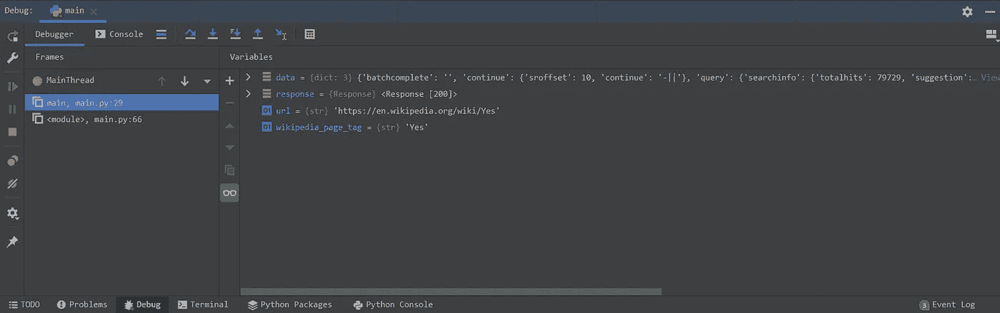
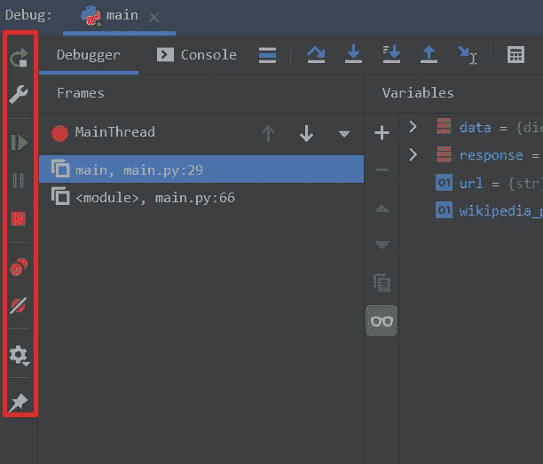
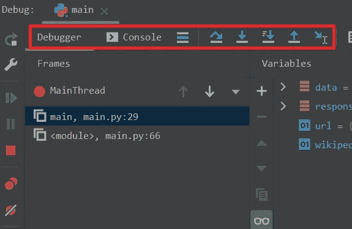
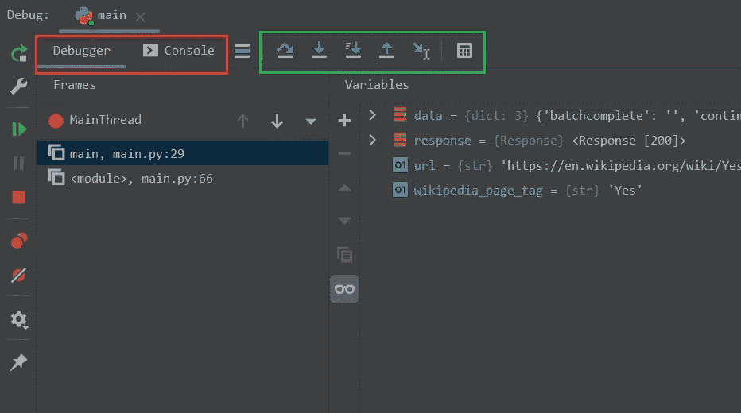
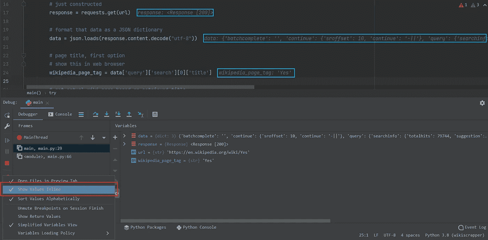
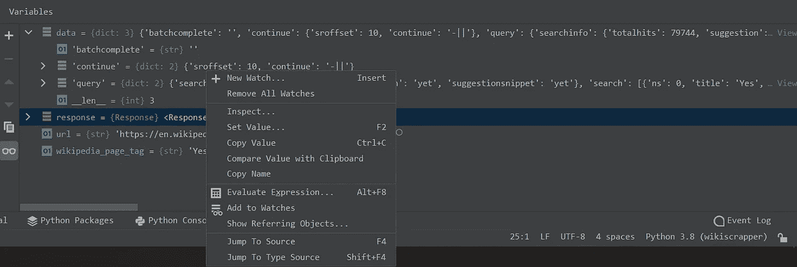

# 掌握 PyCharm 调试器

> 原文：<https://betterprogramming.pub/mastering-the-pycharm-debugger-dd21e2333d51>

## 一项值得添加到您的工具包中的技能

在 [Unsplash](https://unsplash.com?utm_source=medium&utm_medium=referral) 上由[猎人哈利](https://unsplash.com/@hnhmarketing?utm_source=medium&utm_medium=referral)拍摄的照片

PyCharm 在 Python IDE 领域处于领先地位，原因很明显。JetBrains 已经成功地将 Python 开发所需的所有工具打包在一个应用程序中。一种广泛使用的调试技术是将变量打印到 stdout，这已经被许多人接受为一种可行的调试方法，但是将变量打印到 stdout 是解决所有编程错误的灵丹妙药吗？不这么认为。

PyCharm 的调试器够好吗？在我看来，它完美无瑕。我这样说是因为我将讨论支持这一主张的理由。到本文结束时，您将理解什么是调试，它的重要性，并学会最大限度地使用 PyCharm 的调试器。

# 什么是调试？

调试仅仅意味着从程序中移除错误，但是根据应用程序的复杂性，移除这些错误可能容易也可能困难。与函数和类较少的脚本相比，高度抽象的程序很难调试。不正确的错误处理会增加调试的难度。如果开发人员确信异常会在较高的级别被捕获，那么异常会在较低的级别被引发。这避免了当异常在每一层被捕获并波及到顶层时出现的混乱。此外，引发自定义异常可以提供清晰度。

# 为什么要调试？

**因为没有什么是完美的**。开发人员会犯错误。

# 调试器的功能

理想的调试器具有以下特性:

1.  能够一行一行地执行程序
2.  根据需要添加断点
3.  能够在程序暂停的当前范围内查看和操作变量
4.  在整个执行过程中跟踪变量值
5.  接口在外壳中执行自定义代码

# Python 调试的早期阶段

## 物理数据库

[Pdb](https://docs.python.org/3/library/pdb.html) 是 Python 内置调试器。它采用基于 CLI/程序的方法来调试代码。可以从 CLI 指示调试器执行下一行或跳到下一个断点。此外，可以通过编程方式添加断点，并将字母用作调试器的命令。

如果程序很小，使用 pdb 应该不成问题。添加断点可以很容易地完成，因为程序很小，所以你不必指示调试器太长时间。不过，Pdb 可能会很快变得令人生畏。如果程序很庞大怎么办？调试会变得很有压力，使用 print 进行调试比添加断点并不断键入命令来引导 pdb 要好。

pdb 缺少的一个东西是 GUI，这也是它没有被广泛使用的原因。可视化调试比基于 CLI/程序的调试容易得多。

## PyDev

PyDev 是一个基于 GUI 的调试器。它提供了一个 API，ide 可以通过这个 API 使用 PyDev 的技术，并将调试特性添加到他们的应用程序中。PyDev 最初与 eclipse 集成，并作为“LiClipse”发布给公众。Pydev 拥有一个交互式外壳，用户可以根据需要操纵变量。

# PyCharm 调试器

PyCharm 的调试器建立在 PyDev 之上，继承了 PyDev 的所有特性。下面是调试屏幕的快照:

PyCharm 的调试窗口

现在让我们来理解这个调试窗口的每一部分。

## 左侧面板

调试窗口的左侧面板

该窗口最左侧的面板控制脚本的执行，如启动、重启和停止应用程序，以及查看和删除断点。

以下描述从上到下映射到突出显示的按钮位置:

1.  开始/重启按钮—如果脚本没有运行，它将开始执行。如果脚本正在运行，则停止并重新启动
2.  配置—在开始执行文件之前设置配置，如设置环境变量、在启动之前运行任务以及从文件重定向输入等
3.  继续程序—告诉调试器继续执行并在下一个断点处停止
4.  停止程序—停止正在运行的脚本
5.  查看断点—列出项目中设置的所有活动和非活动断点
6.  静音断点—静音所有断点(静音所有断点将等同于在没有调试器的情况下执行程序)
7.  调试器的附加设置
8.  “锁定”选项卡—锁定当前调试器选项卡

## 上面板

调试窗口的顶部面板

此面板在调试程序时最常用。在这里，用户可以检查变量的值，并在交互式 shell 中进行操作。顶部面板控件可以进一步分为两个部分。

顶部面板标签和按钮

首先，我们来看一下选项卡(以红色突出显示):

1.  调试器标签-这是用户可以查看程序内部变量设置的区域。pycharm 可以识别变量类型，并通过变量名左侧的图标进行提示。用户还可以跟踪添加了断点的线程
2.  控制台选项卡—打开具有自动完成功能的交互式 shell。这个贝壳是蟒蛇 REPL。这里进行的任何变量操作都会反映在程序执行中

接下来，让我们回顾一下代码步骤按钮(以绿色突出显示):

代码导航按钮

从左到右的按钮描述。

1.  单步执行—在当前调用方法中逐行执行代码，跳过任何函数或类实现
2.  单步执行—逐行执行，但不要跳过任何函数或方法实现。进入实现内部，继续逐行执行
3.  单步执行我的代码——与单步执行几乎相同，但避免实现从另一个库导入的函数。仅当函数是用户定义的时，才进入实现
4.  步出—步出当前方法
5.  运行到光标处—继续执行，当调试器到达光标所在的行时停止

## 查看变量值内联编辑器

启用嵌入式视图

变量的内联视图允许用户在编辑器中查看值，而不必在**变量**选项卡中搜索变量。要启用此功能，点击调试窗口左侧面板中的齿轮旋钮图标，并选择*显示内嵌值。*

## 变量运算

调试器选项卡中的变量视图

虽然可以在内联中看到变量，但是如果您希望看到远离当前行的变量值，并且必须遍历不同的文件才能看到该值，该怎么办呢？听起来很疯狂，对吧？这正是添加此视图的原因。如图所示，所有变量都显示了它们的类型，如果是 iterable，还显示了序列的长度。单击变量名旁边的向右箭头，可以清楚地显示其全部内容。对于熊猫和 numpy 对象，它们被可视化为添加了注释和颜色的表格。

右键单击变量会打开一个菜单。通过选择*设定值可以改变变量值。跳转到源代码*将用户带到声明变量的那一行。

# 结论

这基本上概括了整个 pycharm 调试器。如果使用得当，您的调试时间可以从几小时减少到几分钟。字面上。剩下唯一要做的事情就是开始使用调试器，并且永远告别 *print* 。

如果你喜欢阅读关于 Python 及其生态系统的文章，那么就订阅我的邮件列表吧！

谢谢你一直读到最后。下次见:)