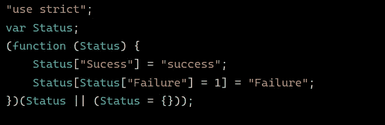
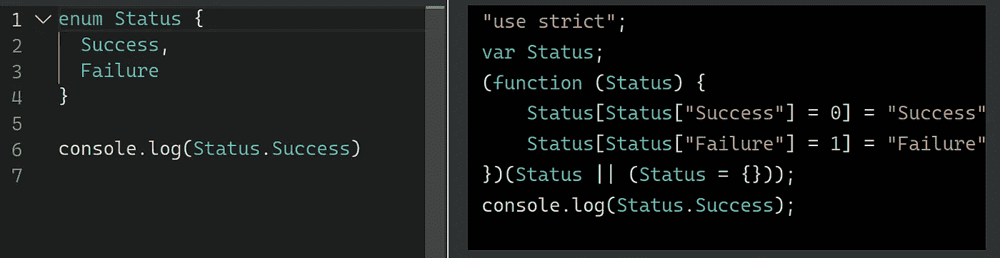
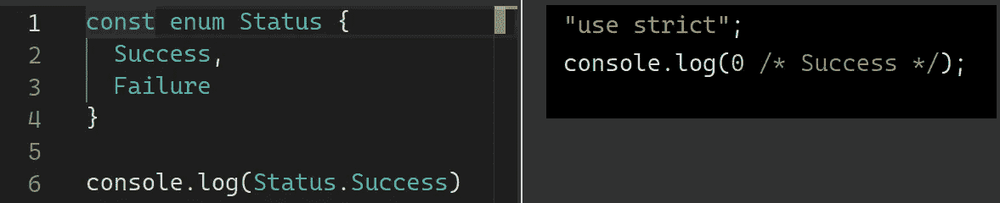

# 掌握类型脚本枚举

> 原文：<https://betterprogramming.pub/mastering-typescript-enums-e4fbd1c9dcdf>

## 看一下 TypeScript 的基本特性


TypeScript 枚举功能几乎从一开始就可用。这是大多数编程语言中常见的特性。然而，它在 JavaScript 中是缺乏的。是的，这里有一些模拟枚举的方法:

*   通过使用类
*   通过使用符号
*   通过简单地使用键值对象

然而，这些解决方案远非理想。它们降低了代码的可读性，并增加了一些开销。这是为数不多的 TypeScript 不仅仅是 JavaScript 的类型包装器的特性之一。

枚举应该用在哪里？当一个变量只能有一小组可能的值时，这是一个非常适合的特性。通过使用枚举，我们得到了一个更友好的声明性名称，而不是必须在整个代码库中传播一个神奇的数字。

在我看来，仅这个特性就足以证明将 TypeScript 作为项目技术堆栈的一部分是正确的。它将增加正确性，减少应用程序样板。

在本文中，我们将深入探讨 enums 特性以及如何最好地使用它们。

# 为什么我们需要枚举？

枚举的替代方法是使用联合。其中的陷阱是什么？如果值改变了，我们就必须改变代码中的每一处。

许多人反对枚举，因为这些常量值不可能改变。然而，如果他们真的这么做了，我们将不得不做一些手工工作，这一点也不酷。

让我们看看枚举是如何用更简洁易读的语法解决这个问题的。

# 类型脚本枚举基础

它的语法非常简单。我们只需要使用关键字`enum`并定义它可能的键和值。

```
**enum** Status {
  Success,
  Failure
}
```

如果我们不为枚举指定任何值，Typescript 将默认创建一个`Numeric Enum`。它将为每个枚举键分配一个正的增量索引值。当我们希望每个属性有不同的值，而我们不关心这些值是什么时，这是很有用的。

让我们看一些例子:

如果我们在乎价值，我们可以定制它。在数字枚举中，没有关联值的键将继承增量行为。

让我们看另一个例子，我们只定制了一个值:

然而，如果我们在一个属性上使用一个非数值，我们必须初始化所有其他的枚举键。为什么？因为它不再是一个数字枚举，TypeScript 不知道将哪个值赋给其余的属性。

这就是以下代码失败的原因:

解决这个问题的方法是为每个条目添加一个值:

我们可以在枚举中组合多个值类型吗？是的，尽管它有一个奇怪的用例。没有正当的理由是不应该使用的。

在下面的代码中，我们看到了如何混合字符串和数字:

# 环境枚举

TypeScript 枚举支持环境功能声明。这意味着我们可以描述一个已经存在的枚举的形状。不会从该枚举生成 JavaScript 代码。

我们如何做到这一点？只要使用`declare`关键词。

```
// ✅ ambient enum
**declare** enum Status {
  Success,
  Failure
}// ❌ will fail if enum is non existing
console.log(Status.Failure);
```

⚠️:上面的代码看起来和以前的一些代码一模一样。行为大相径庭。它只是为现有的枚举创建类型。初始化它的值不会有任何效果。

# 计算枚举与常量枚举

计算枚举是具有一些在运行时解析的值或从另一个值派生的值的枚举。有一个限制，它们只能建立在`Numeric Enums`之上。这意味着返回值必须总是一个数字。

让我们看一个例子:

在上面的代码中，我们看到`Success`和`Failure`的值是在运行时决定的，而不是在编译时。

如果我们要返回一个字符串，我们将得到以下错误:

⚠️:把常量值加到我们计算的枚举中是好的。只要是数字，就可以混合使用。

# 收集

基本的非环境枚举发出一些 JavaScript 代码。

让我们检查一个枚举:

```
// ✅ works even though value types are different **enum** Status {
  **Success = 'success',
  Failure = 1**
}
```

编译 TypeScript 时，上面的代码片段将生成以下 JavaScript 代码:



作者的说明

由于上面的枚举有一个对应的 JavaScript，我们不能使用`type`修饰符。该修饰符仅在导入 TypeScript 类型时保留。它向 Typescript 编译器提示，这些导入是特定于类型的，可以从 JS 输出中移除。

所以下面的代码会失败:

```
// ❌ fails, it is not purely a type
import **type** { Status } from './utils';
```

我们应该做的是:

```
// ✅ works
import { Status } from './utils';
```

如果没有 JavaScript 代码，我们就不能在 JavaScript 代码中使用枚举中的值。但是，是不是所有的枚举都会生成一些 JavaScript 代码？不，常量不会产生任何开销。这使得它们很轻便，是使用枚举时的首选。

下面就来了解一下那些。

# 常数枚举

常规枚举工作得非常好。然而，如前所述，它们会产生少量额外的 JavaScript 成本。这不是我们可能不高兴的事情，TypeScript 并不意味着向我们的包中添加代码。这个有解决办法吗？

是的，我们可以制作我们的清单`const`。常量枚举不会输出任何 JavaScript 代码。我们能一直用这些吗？是的，但前提是我们用常量初始化枚举。这意味着我们将无法组合计算值和常量。

由于这些枚举没有添加任何额外的 JavaScript 代码，它们的值在编译时会发生什么？这些将被内联到我们编译的代码的输出中。

让我们用一些例子来看看它们的区别。

使用常规枚举:



非常数枚举

使用常量枚举:



常量枚举

注意`Status.Failure`值是如何被内联的`0`并且添加了注释`/* Success */`。由于我们的代码不生成任何 JavaScript，我们可以利用`type` TypeScript 语法导入:

```
// ✅ works with const enums
import **type** { Status } from './utils';
```

⚠️:通过使用`const`,我们将运送更少的 JavaScript 代码，从而减少开销。然而，有一些陷阱要记住。使用`ambient const enums`和消费/发布某些`.d.ts`文件时会出现一些问题。为什么？正是因为枚举信息在编译时被移除。随着`preseConstEnums`的修复:枚举信息将被保存在源代码中，并在运行时被删除。

# 枚举成员类型

最后一个很酷的提示。枚举被用作类型，但是我们也可以将它们的枚举成员用作类型。请注意，并非所有枚举成员都可以充当类型。只有符合以下标准之一的人:

*   值是一个字符串
*   值是数字

注意在上面的代码中，`type`键将只取一个`Status.Success`值。

# 包裹

我们已经深入研究了 TypeScript 枚举特性。我们现在可以理解在哪里以及如何使用它们。我们已经看到了使用数值型、计算型、常量型、环境型枚举的注意事项和奇怪之处。

我们知道它们权衡是什么，以及它们将如何影响我们的 JavaScript 生成的代码。它们提供了大量的清晰度，并提高了代码的可读性。这是一个有效的记忆功能，在进行工会歧视时非常有用。

根据经验，常量应该是我们的第一个赌注。然而，挑战是不要滥用这个特性，只在正确的地方使用它。有时使用`as const`功能可能就好了。

*如果你喜欢你读到的，看看下面这个故事:*

[](/7-typescript-common-mistakes-to-avoid-581c30e514d6) [## 要避免的 7 个打字稿常见错误

### 通过避免这些错误来改进您的 TypeScript 的代码库

better 编程. pub](/7-typescript-common-mistakes-to-avoid-581c30e514d6)