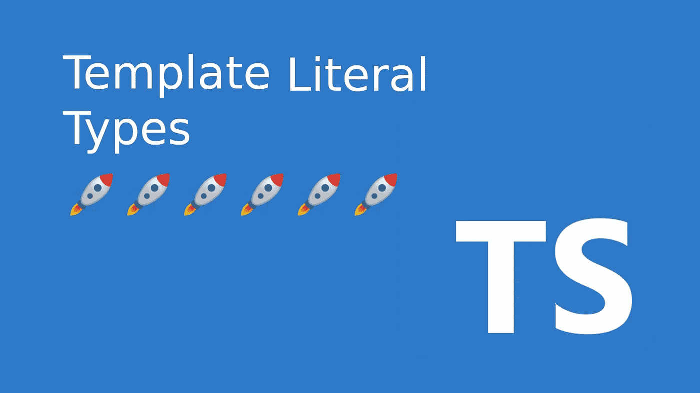

# 掌握 TypeScript 模板文本类型

> 原文：<https://betterprogramming.pub/mastering-typescript-template-literal-types-f4131a94ffb1>

## 如何使用 awesome 模板文字类型特性



作者捕获

Typescript 从早期阶段就有了模板文本。当您想要从静态字符串创建类型时，它们非常有用。直到 Typescript 4.1 版本，我们才看到模板文字类型。在以后的版本中，Typescript 团队已经完善了它的特性并修复了一些奇怪的地方。因此，它现在是一个成熟的特性。

什么是模板文字类型？他们只是一个字符串文字，但类固醇。现在，您可以向模板文本添加类型变量，Typescript 将为您创建一个具有所有可能组合的类型。因此，您可以用一种快速简单的方式组合其他类型。

为了做得更好，Typescript 现在附带了一些字符串操作实用程序，可以帮助您动态转换任何字符串文字。

在本文中，我们将看到如何使用它们以及它的用例是什么。

# 基本用法

模板文字类型用于产生字符串和字符串类型的任意组合。输出将是所有可能组合的联合字符串。

让我们来看一个语法示例:

```
type attrs = "Phone" | "Name";type target = **`get${attrs}`;**// ✅ Result
// target = "getPhone" | "getName";
```

语法很简单，但是可读性很强，功能也很强大。

为了更好地说明它的神奇之处，我们先来看一个例子。假设我们想要一个映射`CSS`填充规则类型的类型。

代码很简单:我们只需创建所有可能组合的并集:

上面的代码像预期的那样工作，但是有点冗长。`margin`规则几乎是相同的，但是使用这种方法，我们将不能重用任何东西。我们最终会得到大量重复的代码。

这次让我们通过使用模板文字类型来解决前面的`css`类型映射问题:

我们观察代码是如何变得更加简单和声明性的。如果我们想创建`margin`类型，我们可以重用`Direction`类型:

如果我们在 Javascript 中有这个变量，我们可以通过使用`typeof`操作符来提取它:

# 限制

模板文字类型中允许的参数有哪些？我们可以使用对象或自定义类型吗？不，只允许原语的子集。

唯一允许的是:`string`、`number`、`bigint`、`boolean`、 `null`、`undefined`或其中任何一个的联合组合。

我们在上面的例子中看到，通过使用一个复杂的，它会失败，因为它不知道如何将其序列化为字符串。

# 字符串操作实用程序

除了这个新特性，Typescript 还发布了一组实用工具来帮助处理字符串。它们并不排斥模板文字类型，但是当与它们结合使用时会很方便。

以下是实用程序的完整列表:

*   **大写< StringType >** :将字符串文字转换成大写。
*   **小写< StringType >** :将字符串文字转换为小写。
*   **大写< StringType >** :将第一个字母大写。
*   **不大写< StringType >** :将首字母小写。

让我们来看一个这些实用程序运行的例子。它们只接受一个字符串作为参数，否则在编译时会抛出一个错误。

让我们在更复杂的场景中使用它们。让我们将字符串文字类型与这些实用程序的用法结合起来。让我们连接两个类型，但是转换它们，使它们符合我们的 CamelCase 语法。

当我们试图构造模板文字类型时，这些实用程序会有所帮助。它们通过让我们操纵字符串类型来组合一些新的类型，帮助我们建立一个真实的来源。我们不必创建只有微小差异的新字符串类型。

# 推理

在第一个例子中，我们已经看到了如何从现有的类型组合出新的类型。

现在我们将看到如何使用模板文字类型从组合类型中提取类型。为此，我们将使用`infer`关键字。这个关键字允许我们在一个条件类型中从另一个类型推导出一个类型。

我们来做一个例子。让我们尝试提取一个字符串的根节点`margin`，而不是组成`marginRight`。

以上让我们了解了这个特性有多强大。我们不仅可以创造类型，还可以解构它们。

# 模板字符串类型作为判别式

当使用联合时，在 Typescript 中有一个使用文本类型的字段是很常见的。然后，您可以使用该字段缩小当前类型的范围。

在 Typescript 4.5 之前，您不能对该字段使用模板文字类型。现在，这个 4.5 版本将在今年 11 月发布。

这说明了这个特性在每个 Typescript 版本中是如何变得越来越成熟的。

# 与重新映射一起使用

从 Typescript 4.1 开始，我们可以重新映射属性。这个特性本身就很棒。但是，如果我们将它与模板文字类型结合起来，我们可以实现一些很酷的行为。

为了展示我们可以实现什么，让我们创建一个实用程序来取消任何对象的键的大写。我们如何做到这一点？我们可以简单的组合`Template Literal Types` + `Remapping` + `Uncapitalize utility`就搞定了。

让我们看看代码:

作为奖励，现在让我们做一个更复杂的场景。让我们创建一个重新映射实用程序，将`Aysnc`添加到我们的方法中，并返回函数返回类型的`Promise`。

语法可能有点难，但它只是使用了相同的工具:`Template Literal Types` + `Remapping` + `Uncapitalize utility`。

# 包裹

我们已经看到模板文字类型是多么简单和强大。它的语法与`ES6`相同，使用起来很直观。

他们将帮助我们保持代码干燥，并帮助我们建立一个单一的真理来源。这是所有 Typescript 代码库的最终目标。

所有这三个特性配合得非常好。如果没有模板文字类型，重映射就不会如此强大。它会感觉太手动或笨重。这是它的完美补充。

如前所述，它还不是一个完整的功能。它将在未来的版本中不断发展。将来有一件很棒的事情，那就是创建我们自己的字符串操作工具的能力。这将有助于我们进一步微调它的行为，并使它适应我们的特定用例。

干杯。

# 有关系的

[](/typescript-a-gentle-introduction-to-mapped-types-f65e45fa2598) [## TypeScript:映射类型的简明介绍

### 学习构建自己的一套 TypeScript 工具

better 编程. pub](/typescript-a-gentle-introduction-to-mapped-types-f65e45fa2598)