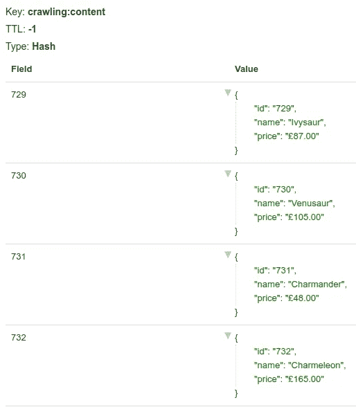
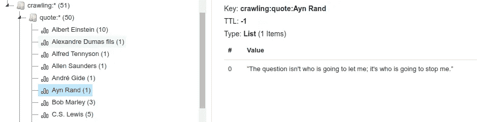
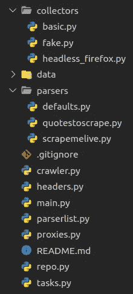

# 掌握 Python 中的 Web 抓取:扩展到分布式抓取

> 原文：<https://betterprogramming.pub/mastering-web-scraping-in-python-scaling-to-distributed-crawling-34017a1322c7>

## 在不到 300 行代码中发现页面并存储您需要的确切内容


本·艾伦在 [Unsplash](https://unsplash.com/?utm_source=medium&utm_medium=referral) 拍摄的照片

想知道如何大规模构建网站爬虫和解析器吗？实施一个项目，以分布式和容错的方式对内容进行爬网、抓取、提取和大规模存储。我们将从以前的帖子中获取所有知识，并将其结合起来。

首先，我们学习了 [pro 技术来抓取内容](https://medium.com/codex/mastering-web-scraping-in-python-from-zero-to-hero-51e27705b51b)，尽管我们今天只使用 CSS 选择器。然后是[避免阻塞的技巧](https://uxdesign.cc/stealth-web-scraping-in-python-avoid-blocking-like-a-ninja-8cb76db119ae)，我们将从中添加代理、头和无头浏览器。最后，我们[构建了一个并行爬虫](/mastering-web-scraping-in-python-crawling-from-scratch-cb510bcb9fb6)，这篇博客文章从这段代码开始。

如果你不明白某些部分或片段，它可能在较早的职位。振作起来；冗长的片段来了。

# 先决条件

为了让代码工作，你需要安装 [Redis](https://redis.io/) 和[python 3](https://www.python.org/downloads/)。有些系统已经预装了它。之后，通过运行`pip install`安装所有必要的库。

```
pip install install requests beautifulsoup4 playwright "celery[redis]"
npx playwright install
```

# 芹菜和雷迪斯介绍

[芹菜](https://docs.celeryproject.org/en/stable/getting-started/introduction.html)“是一个开源的异步任务队列。”在上一篇博文中，我们创建了一个简单的并行版本。Celery 更进一步，提供了一个实际的分布式队列实现。我们将使用它在工作人员和服务器之间分配我们的负载。

[Redis](https://redis.io/) “是一个开源的内存数据结构存储，用作数据库、缓存和消息代理。”我们将使用 Redis 作为数据库，而不是使用数组和集合来存储所有内容(在内存中)。而且，芹菜可以使用 Redis 作为经纪人，所以我们不会需要其他软件来运行它。

# 简单的芹菜任务

我们的第一步是在 Celery 中创建一个任务，打印 parameter 接收的值。将代码片段保存在名为`tasks.py`的文件中，然后运行它。如果将它作为常规 Python 文件运行，将只打印一个字符串。如果您用`celery -A tasks worker`运行控制台，它将打印两行不同的内容。

不同之处在于`demo`函数的调用。直接调用意味着“执行任务”，而`delay`意味着“将任务排队等待工人处理。”查看文档了解更多关于[调用任务](https://docs.celeryproject.org/en/stable/userguide/calling.html#basics)的信息。

这个`celery`命令不会结束；我们需要通过退出控制台来停止它(即`ctrl + C`)。我们将需要它几次，因为芹菜不会在代码更改后重新加载。

# 从任务中搜索

下一步是将芹菜任务与爬行过程连接起来。这一次，我们将使用上一篇文章中看到的[助手函数](http://www.localhost.com:8000/blog/mastering-web-scraping-in-python-crawling-from-scratch#final-code)的一个略有改动的版本。`extract_links`将获得页面上除`nofollow`之外的所有链接。我们稍后将添加过滤选项。

我们可以对检索到的链接进行循环，并对它们进行排队，但这样会导致重复地搜索相同的页面。我们已经看到了执行任务的基础，现在我们将开始分解成文件并跟踪 Redis 上的页面。

# 用于跟踪 URL 的 Redis

我们已经说过，依赖内存变量不再是一种选择。我们需要保存所有的数据:访问过的页面，当前正在抓取的页面，保存一个“要访问”的列表，并在以后存储一些内容。尽管如此，我们将使用 Redis 来避免重新抓取和重复，而不是直接对芹菜进行排队。并将 URL 仅排入队列一次。

我们不会深入 Redis 的细节，但是我们将使用[列表](https://redis.io/commands#list)、[集合](https://redis.io/commands#set)和[散列](https://redis.io/commands#hash)。

取最后一个代码片段，删除最后两行调用任务的代码。用以下内容创建一个新文件`main.py`。我们将创建一个名为`crawling:to_visit`的列表，并推送起始 URL。然后，我们将进入一个循环，在列表中查询条目，并阻塞一分钟，直到一个条目准备好。当检索到一个项目时，我们调用`crawl`函数，将其执行排队。

它几乎和以前一样，但允许我们向列表中添加项目，它们将被自动处理。我们可以通过循环`links`并全部推送来轻松实现，但如果没有重复数据删除和最大页数，这并不是一个好主意。我们将跟踪所有使用集合的`queued`和`visited`，一旦它们的总和超过允许的最大值，我们将退出。

执行后，所有内容都在 Redis 中，所以再次运行它不会像预期的那样工作。我们需要手动清理。我们可以通过使用`redis-cli`或类似 [redis-commander](https://github.com/joeferner/redis-commander#readme) 的 GUI 来实现。有删除键(即`DEL crawling:to_visit`)或[刷新数据库](https://redis.io/commands/flushdb)的命令(小心这个)。

# 分别负责

我们将在项目成长之前开始分离概念。我们已经有两个文件:`tasks.py`和`main.py`。我们将创建另外两个来托管与爬虫相关的功能(`crawler.py`)和数据库访问(`repo.py`)。请看下面的回购文件片段，它并不完整，但你得到的想法。有一个 [GitHub 存储库](https://github.com/ZenRows/scaling-to-distributed-crawling)，里面有最终的内容，如果你想查看的话。

并且`crawler`文件将具有爬行、提取链接等功能。

# 允许分析器定制

如上所述，我们需要某种方法来提取和存储内容，并只将特定的链接子集添加到队列中。我们需要一个新的概念:默认解析器(`parsers/defaults.py`)。

并且在`repo.py`文件中:

这里没有什么新的东西，但是它将允许我们抽象链接和内容提取。它将是一组作为参数传递的函数，而不是硬编码在爬虫中。现在我们可以用导入来代替对这些函数的调用(目前)。

为了将其完全抽象，我们需要一个生成器或工厂。我们将创建一个新文件来托管它— `parserlist.py`。为了简单起见，我们允许每个域有一个定制的解析器。演示包括两个测试域: [scrapeme.live](https://scrapeme.live/shop/page/1/) 和[quotes.toscrape.com](http://quotes.toscrape.com/page/1/)。

还没有为每个域做任何事情，所以我们将为它们使用默认的解析器。

我们现在可以用新的每个域的解析器来修改这个任务。

# 自定义分析器

我们先以`scrapeme`为例。检查最终版本的 [repo](https://github.com/ZenRows/scaling-to-distributed-crawling/blob/main/parsers/scrapemelive.py) 和其他自定义解析器。

这部分需要页面及其 HTML 的知识。如果你想感受一下，就看看吧。总而言之，我们将获得产品列表中每一项的产品 id、名称和价格。然后使用 id 作为键将它存储在一个集合中。至于允许的链接，只有分页的链接会经过过滤。



在`quotes`站点，我们需要以不同的方式处理它，因为每个报价没有 ID。我们将提取列表中每个条目的作者和引用。然后，在`store_content`函数中，我们将为每个作者创建一个列表并添加引用。Redis 在必要时处理列表的创建。



在最近的几个变化中，我们引入了易于扩展的定制解析器。当添加一个新站点时，我们必须为每个新域名创建一个文件，并在`parserlist.py`中创建一行引用它。我们可以更进一步，“自动发现”它们，但没有必要让它变得更加复杂。

# 获取 HTML:无头浏览器

到目前为止，访问的每个页面都是使用`requests.get`完成的，这在某些情况下是不够的。假设我们想使用不同的库或无头浏览器，但只是针对某些情况或领域。加载浏览器很耗内存，速度很慢，所以如果不是强制的，我们应该避免。解决办法？甚至更多的定制。新概念:收藏家。

我们将创建一个名为`collectors/basic.py`的文件，并粘贴已知的`get_html`函数。然后通过导入来更改默认值以使用它。接下来，创建一个新文件`collectors/headless_firefox.py`，用于获取目标 HTML 的新方法。和上一篇文章一样，我们将使用剧作家[。我们还将参数化头和代理，以防我们想要使用它们。*剧透:我们会*。](https://playwright.dev/python/docs/intro/)

如果我们想在某个领域使用无头 Firefox，只需修改该解析器的`get_html`(即`parsers/scrapemelive.py`)。

正如你在[最终回购](https://github.com/ZenRows/scaling-to-distributed-crawling/blob/main/collectors/fake.py)中看到的，我们还有一个`fake.py`收集器用于`scrapemelive.py`。因为我们用那个网站进行了紧张的测试，所以我们在第一时间下载了所有的产品页面，并将它们存储在一个`data`文件夹中。我们可以用一个无头浏览器来定制，但是我们可以用一个文件阅读器来做同样的事情，因此有了“假”的名字。

# 避免使用标头和代理进行检测

你猜对了:我们想要添加自定义头并使用代理。我们将从创建文件`headers.py`的头文件开始。我们不会在这里粘贴全部内容，Linux 机器有三组不同的头文件，而且会很长。查看[回购](https://github.com/ZenRows/scaling-to-distributed-crawling/blob/main/headers.py)了解详情。

我们可以导入一组具体的头或者调用`random_headers`来获得一个可用的选项。我们稍后将看到一个使用示例。

这同样适用于代理:创建一个新文件，`proxies.py`。它将包含一个由提供者分组的列表。在我们的例子中，我们将只包括[免费代理](https://free-proxy-list.net/)。在`proxies`字典中添加您的付费类型，并将默认类型更改为您喜欢的类型。如果我们要把事情复杂化，我们可以添加一个不同的提供者重试，以防失败。

注意:这些[免费代理](https://free-proxy-list.net/)可能不适合你；它们是短命的。

以及在解析器中的用法:

# 将这一切结合在一起

这是一次漫长而多事的旅行。是时候通过完成拼图来结束它了。我们希望你了解整个过程和大规模抓取和爬行的所有挑战。

我们不能在这里展示最终的代码，所以看一下[库](https://github.com/ZenRows/scaling-to-distributed-crawling)，如果有任何疑问，请不要犹豫发表评论或联系我们。

两个入口点是芹菜的`tasks.py`和开始对 URL 进行排队的`main.py`。从那里，我们开始在 Redis 中存储 URL 以保持跟踪，并开始抓取第一个 URL。自定义或默认解析器将获取 HTML，提取和过滤链接，并生成和存储适当的内容。我们将这些链接添加到一个列表中，然后重新开始这个过程。多亏了 Celery，一旦队列中有多个链接，并行/分布式流程就开始了。



最终文件结构

# 仍然缺少点

我们已经谈了很多，但总会有更多的进展。这里有一些我们没有包括的功能。另外，请注意，为了简洁起见，大多数代码不包含错误处理或重试。

# 分布的

我们没有包括它，但芹菜提供开箱即用。对于本地测试，我们可以启动两个不同的工人`celery -A tasks worker --concurrency=20 -n worker1`和`... -n worker2`。方法是在其他机器上做同样的事情，只要它们可以连接到代理(在我们的例子中是 Redis)。我们甚至可以动态地添加或删除工作人员和服务器，而无需重启其余部分。芹菜处理工人和分配负载。

值得注意的是，工人的姓名是必不可少的，尤其是在同一台机器上启动几个工人时。如果我们在不改变工人名字的情况下执行上面的命令两次，芹菜就不会正确地识别它们。因此，推出第二个作为`-n worker2`。

# 速率极限

Celery 不允许对每个任务和参数(在我们的例子中是域)进行速率限制。这意味着我们可以限制工作人员或队列，但不能限制到我们想要的细粒度细节。有几个[问题](https://github.com/celery/celery/issues/5732)未解决，还有[解决方法](https://stackoverflow.com/questions/29854102/celery-rate-limit-on-tasks-with-the-same-parameters)。通过阅读其中的几篇，我们得到的结论是，如果我们自己不跟踪请求，我们就无法做到这一点。

使用提供的参数`@app.task(rate_limit="30/m")`，我们可以轻松地将每个任务的请求速率限制为每分钟 30 个。但是请记住，这将影响任务，而不是被爬网的域。

# Robots.txt

除了`allow_url_filter`部分，我们还应该添加一个 robots.txt 检查器。为此， [robotparser 库](https://docs.python.org/3/library/urllib.robotparser.html)可以获取一个 URL，并告诉我们是否允许抓取它。我们可以把它添加到默认或者作为一个独立的功能，然后每个刮刀决定是否使用它。我们认为它足够复杂，所以没有实现这个功能。

如果您要这样做，请考虑最后一次使用`mtime()`访问文件的时间，并不时地重新读取它。此外，缓存它以避免为每个 URL 请求它。

# 结论

大规模构建定制的爬虫/解析器既不是一件容易的事情，也不是一件简单的任务。我们提供了一些指导和提示，希望对你们的日常工作有所帮助。

在开发如此大规模的项目之前，请考虑一些重要的要点:

1.  分开责任。
2.  必要时使用抽象，但不要过度工程化。
3.  不要害怕使用专门的软件，而不是构建一切。
4.  即使现在不需要，也要考虑缩放；记住就好。

不要忘记看看本系列的其他文章。
+ [从零开始爬行](https://www.zenrows.com/blog/mastering-web-scraping-in-python-crawling-from-scratch?utm_source=medium&utm_medium=blog&utm_campaign=distributed_crawling) (3/4)
+ [像忍者一样躲避阻挡](https://www.zenrows.com/blog/stealth-web-scraping-in-python-avoid-blocking-like-a-ninja?utm_source=medium&utm_medium=blog&utm_campaign=distributed_crawling) (2/4)
+ [掌握抽取](https://www.zenrows.com/blog/mastering-web-scraping-in-python-from-zero-to-hero?utm_source=medium&utm_medium=blog&utm_campaign=distributed_crawling) (1/4)

谢谢你一直陪我们到最后。这是一个有趣的系列，我们希望它对你也有吸引力。如果你喜欢，你可能会对 Javascript Web 抓取指南感兴趣。

*原载于*[*https://www.zenrows.com*](https://www.zenrows.com/blog/mastering-web-scraping-in-python-scaling-to-distributed-crawling?utm_source=medium&utm_medium=blog&utm_campaign=distributed_crawling)