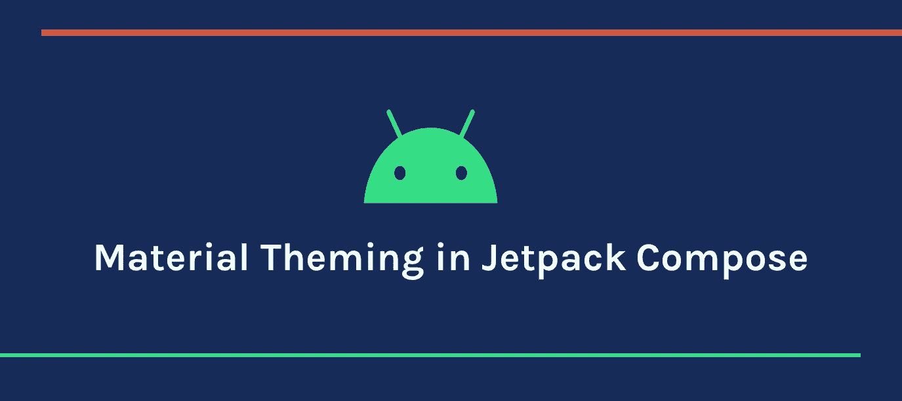
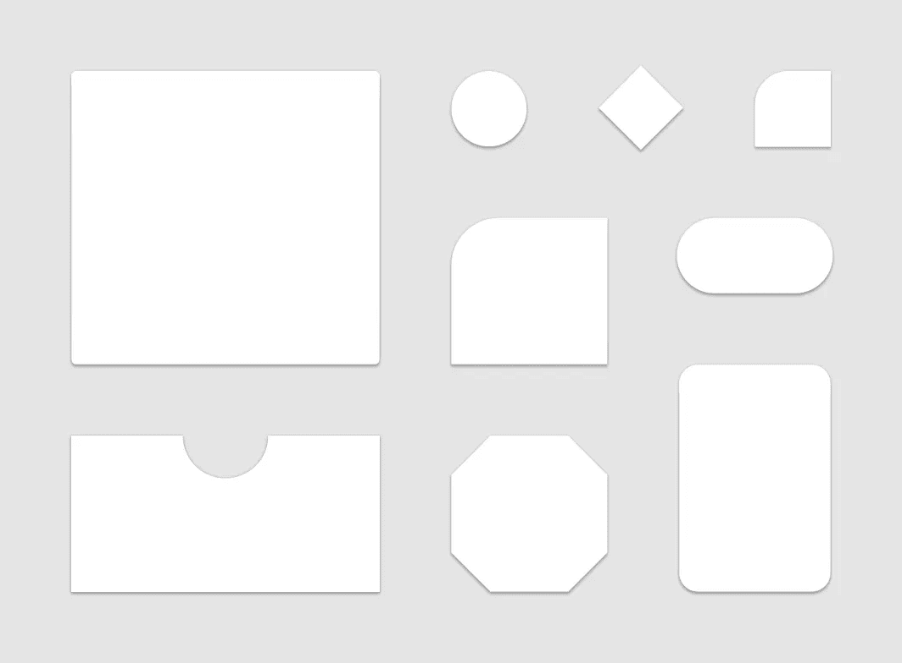

# Jetpack Compose 中的 Android 材质主题

> 原文：<https://betterprogramming.pub/material-theming-in-jetpack-compose-776af9b4498c>

## 使用 Compose 轻松定制应用程序范围的主题



作者照片。

Jetpack Compose 是 Android 未来的 UI 工具包。它目前处于测试阶段。如果你没有看过我以前的文章，请查看我的[Jetpack Compose 的介绍](/jetpack-compose-androids-modern-toolkit-for-building-ui-82e67d384c26)。给出了 Jetpack Compose 背后的基本思想和用法。

在本文中，我们将学习如何使用 Jetpack Compose 实现主题化。Jetpack Compose theming 有不同的 API，可以灵活地设计我们的应用程序。在素材主题化的帮助下，我们可以为我们的应用程序提供一致的外观。

在通过 XML 构建 UI 的传统方法中，我们使用`themes.xml`来设计主题，并在需要的地方将主题应用于元素。但是使用 Jetpack，我们使用不同的 API 在类级别上做所有的事情。

让我们看看如何定制颜色、字体和形状，以便在整个应用程序中使用它们。Jetpack Compose 中的主题基于材料设计。只需几行代码就可以轻松设置自定义主题。

# 材料主题

材质主题定义了材质设计规范中的样式原则。在 Jetpack Compose 中，`MaterialTheme`是一个可组合的函数，我们可以用它来定制默认属性。文档中的默认函数如下所示:

我们可以设置自定义属性:

*   `colors`:该层次结构的材质颜色主题的完整定义。
*   `typography`:作为该层次的排版系统使用的一组文本样式。
*   `shapes`:该层次结构中组件使用的一组形状。

在研究了上面的`MaterialTheme`函数的单个组件之后，让我们来看看如何设置自定义属性。

# 颜色

Jetpack Compose 使用 Compose 图形包中的`Color`类。我们有许多方法来定义一种颜色，但有两种常用的方法我们用得更频繁。一种方法是定义颜色的十六进制代码:

```
val red = Color(0xffff0000) 
```

`0xff`代表颜色的 alpha 状态，`ff0000`代表颜色的十六进制代码。

另一种方法是将 RGB 值指定给`Color`类:

```
val blue = Color(red = 0f, green = 0f, blue = 1f)
```

我们也可以在上面的`Color`实例中设置 alpha 组件。

在一个文件中定义所有颜色并在需要的地方使用它们总是一个好方法，如下所示:

并在需要时访问它们:

```
*Text*("How are you",
color = *Purple200*)
```

为了支持多个主题，最好在一个主题中有一组颜色，并从那里检索颜色。让我们看看如何做到这一点。

## 颜色；色彩；色调

`Colors`是 Compose 提供的一个类，用来定义一组在主题中使用的颜色实例。简单来说，`Colors`类可以用来建模材质颜色系统。让我们看看如何创建一个`Colors`类的实例:

`Colors`的构造函数中大约有 13 个属性。让我们看看每个属性的含义:

*   `primary` —原色是应用程序屏幕和组件中最常显示的颜色。
*   `primaryVariant` —主要变体颜色用于区分使用主要颜色的应用程序的两个元素，例如顶部应用程序栏和系统栏。
*   `secondary` —次要颜色提供了更多强调和区分产品的方式。二级色最适合浮动操作按钮、选择控件(如复选框和单选按钮)、突出显示选定的文本、链接和标题等。
*   `secondaryVariant` —辅助变量颜色用于区分使用辅助颜色的应用程序的两个元素。
*   `background` —背景色出现在可滚动内容的后面。
*   `surface` —表面颜色用于组件的表面，如卡片、表格和菜单。
*   `error` —错误颜色用于指示组件内的错误，如文本字段。
*   `onPrimary` —用于显示在原色之上的文本和图标的颜色。
*   `onSecondary` —用于显示在二级色之上的文本和图标的颜色。
*   `onBackground` —显示在背景颜色之上的文本和图标所使用的颜色。
*   `onSurface` —用于显示在表面颜色之上的文本和图标的颜色。
*   `onError` —用于显示在错误颜色顶部的文本和图标的颜色。
*   `isLight` —这些颜色被认为是“亮”色还是“暗”色。

`Colors`类提供了不同的构建函数来创建浅色或深色的集合，其中每个属性都有一个默认值。让我们看看`Color`类中的`darkColors`构建函数是什么样子的:

它使用默认的深色主题值为材质颜色规范创建完整的颜色定义。灯光颜色使用默认灯光主题值。

在我们的项目中，我们可以将这个调色板定义为:

# 排印

`Typograph`是一个帮助我们设计文本样式的类。在`Typograph`类的帮助下，我们可以自定义`FontFamily`、`FontStyle`、`FontWeight`、`LetterSpacing`、`TextDecoration`、`Color`以及更多与文本相关的属性。

有许多参数是构造函数的一部分，其中每个属性都有一个默认值。让我们看看默认的构造函数是什么样子的:

知道适当使用的默认值总是更好。下面是默认值的图表:


来源:[材料设计](https://material.io/design/typography/the-type-system.html#type-scale)

为了定制属性，我们可以创建`Typography`类的对象，然后覆盖所需的样式值。让我们来看看如何做到这一点:

现在我们有了`Typography` 的实例，我们需要将它设置为主题属性:

# 形状

在创建 UI 时，我们经常使用形状作为`ViewGroup`或`Views`的背景来定制外观。常见的场景有圆角布局、视图形状等。通常，我们在 drawable 文件夹中创建一个 XML 文件，以`shape`作为根标签，并定义我们需要的定制，以便我们可以在任何需要的地方重用这个 XML。我们在应用中使用的常见形状如下所示:



来源:[安卓开发者](https://developer.android.com/j)

使用 Jetpack Compose 创建形状非常简单。类似于我们如何创建`Typography`实例，我们也创建`Shapes`的实例并将其提供给`MaterialTheme`:

定义形状后，只需将它提供给我们创建的主题实例，这样许多其他组件，如`[Button](https://developer.android.com/reference/kotlin/androidx/compose/material/package-summary#button)`、`[TextField](https://developer.android.com/reference/kotlin/androidx/compose/material/package-summary#textfield)`等。默认情况下使用这些形状:

# 让我们创建一个自定义主题

通过使用上面的`colors`、`typography`和`shapes`的实例，我们可以创建一个可以在整个应用程序中使用的定制主题:

`CustomComposeTheme`是一个具有两个属性的可组合函数:

1.  `isDarkTheme` —根据勾选`isSystemInDarkTheme`来设定深色或浅色的配色方案。
2.  `content` —使用`MaterialTheme`的可组合函数。

我们还可以选择将主题中的属性应用到组件中:

我们刚刚从`MaterialTheme` 中访问了第二种颜色，并将其应用于第三个文本。要应用自定义主题，内容需要包装在`theme` lambda 中。

如果你想查看应用程序中的完整用法，请查看 GitHub 上的 repo [。](https://github.com/pavan5208/android_jetpack_compose)

# 摘要

Jetpack Compose 将开启 UI 开发的新时代。使用 Jetpack 会简单有趣得多，所以试试吧。我希望你从这篇文章中学到了一些新的东西。

欲了解更多信息，请查看以下参考资料:

*   [构图中的主题化](https://developer.android.com/jetpack/compose/themes)
*   [Jetpack 在 codelabs 中编写主题](https://developer.android.com/codelabs/jetpack-compose-theming#0)