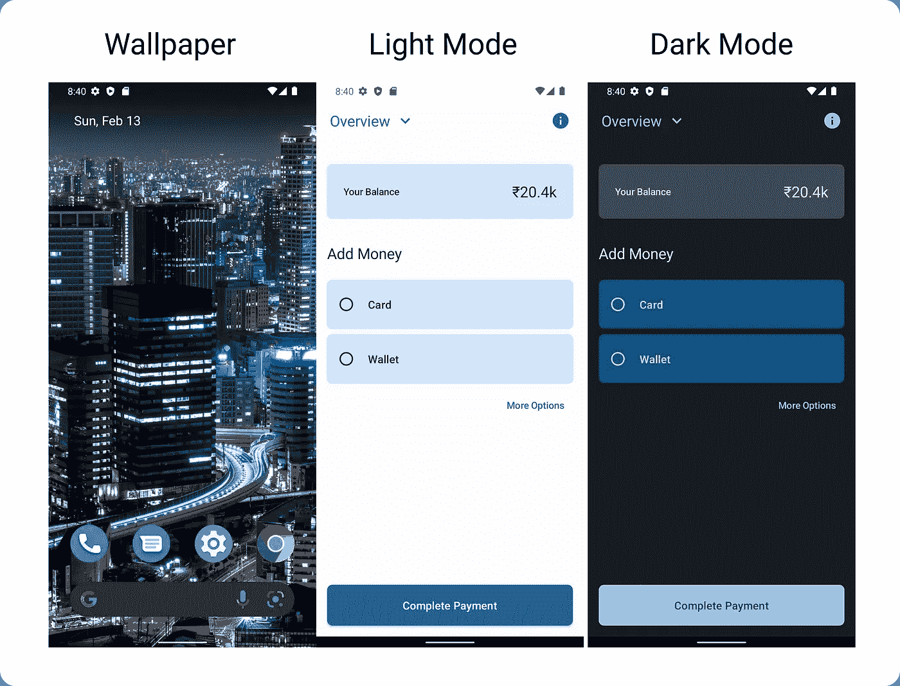
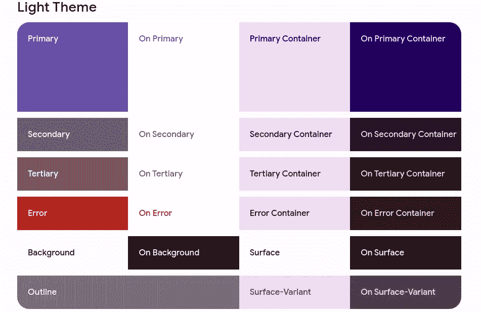
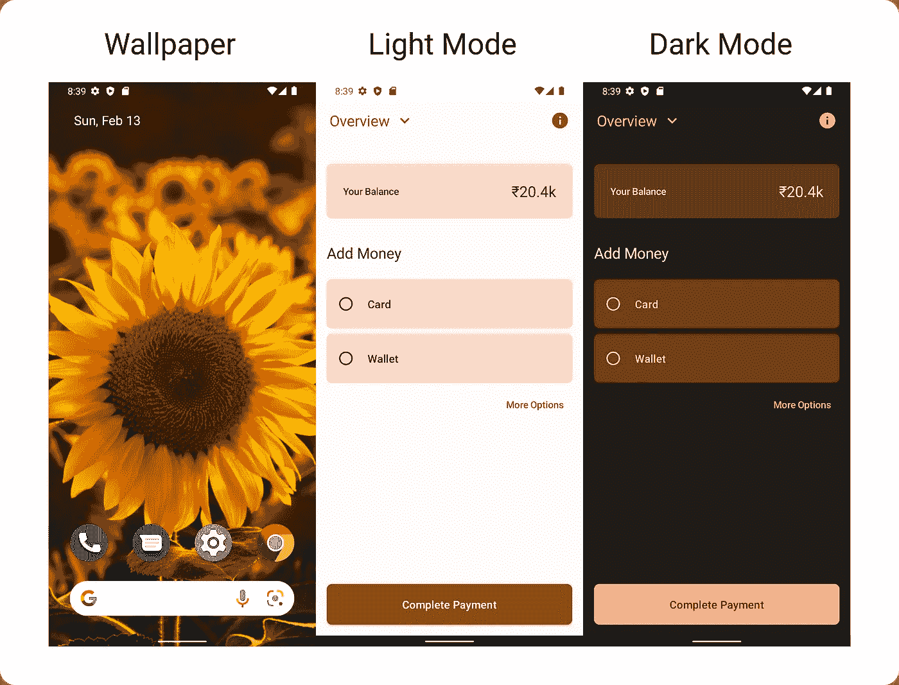

# MaterialYou —使用 JetPack 合成动态颜色

> 原文：<https://betterprogramming.pub/materialyou-dynamic-colors-with-jetpack-compose-5a9bd00130e7>

## 如何在 Android 应用中使用动态颜色



截图自示例应用程序，查看[此处](https://github.com/praveen-gm/MaterialYou-Compose)

嘿，Android 开发者们，随着 Android 12 和以上版本的发布，应用程序的配色方案变得非常令人兴奋。一个非常个性化的方法来显示应用程序的外观。

基于设备的壁纸，一种算法从壁纸中提取颜色，应用于系统 UI 和应用程序。是啊！壁纸中的自定义颜色可以动态应用到应用程序中。

在这篇文章中，我们将看到动态颜色是如何工作的，以及如何在你的应用中实现它们

# **动态色彩是如何工作的？**

Material You 的算法从用户的壁纸中提取颜色，并指定一种类型，确定它与配色方案的关系。然后，这些颜色值被转换为基于亮度的色调调色板，生成从亮到暗的五个色调范围。

从这五个色调范围中，基于亮度级别的特定色调被划分到预定义的角色中，形成一个方案。

# **材质中的调色板你的主题**



截图摘自[素材主题构建器](https://material-foundation.github.io/material-theme-builder/#/dynamic)

尝试动态色彩的现场演示或从图像生成调色板[在此](https://material-foundation.github.io/material-theme-builder/#/dynamic)

也就是说，我们如何在我们的应用中实现它？

# **实现动态颜色**

像往常一样，让我们从所需的依赖项开始

```
// Required minimum version: 1.5.0
implementation 'com.google.android.material:material:1.5.0'// For use of Material3 in Compose
implementation 'androidx.compose.material3:material3:1.0.0-alpha05'
```

注意:在编写 compose.material3 时，material3 仍处于 alpha 阶段，可能会有突破性的变化。使用时风险自担。

让我们定义一个后备主题来处理运行 Android 11 和更低版本的设备，或者硬件尚不支持您的材料

定义亮/暗主题调色板

```
private val *LightThemeColors* = *lightColorScheme*(
    primary = *md_theme_light_primary, // and 20+ more color schemes* )private val *DarkThemeColors* = *lightColorScheme*(
    primary = *md_theme_light_primary, // and 20+ more color schemes* )
```

现在让我们定义一个可组合的应用程序主题

确保您指的是导入:

```
import androidx.compose.material3.*
```

而不是:

```
import androidx.compose.material.*
```

都准备好了，现在怎么办？

使用我们刚刚创建的`AppTheme`:

```
*setContent* **{** *AppTheme* **{** *Surface*(
            modifier = Modifier.*fillMaxSize*()
        ) **{** *MyAppScreen*()
        **}
    }
}**
```

现在利用`MaterialTheme.colorScheme`为你的用户界面设置颜色

```
*Scaffold*(
    topBar = **{** *CustomTopBar*()
    **}**, 
    backgroundColor = MaterialTheme.colorScheme.surface
)
```

下面是结果:



示例应用程序的截图 1，点击此处查看


示例应用程序的截图 2，点击此处查看

仅此而已！我希望这篇文章能帮助你在应用程序中实现动态主题。

Github 库:[https://github.com/praveen-gm/MaterialYou-Compose](https://github.com/praveen-gm/MaterialYou-Compose)