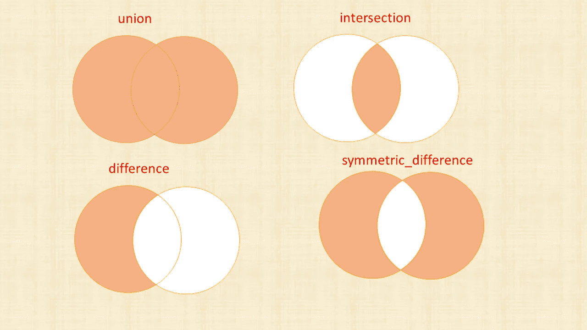
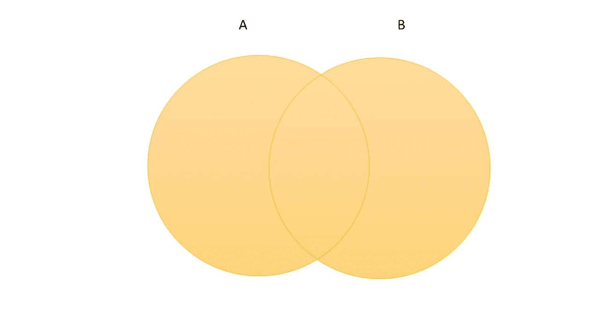
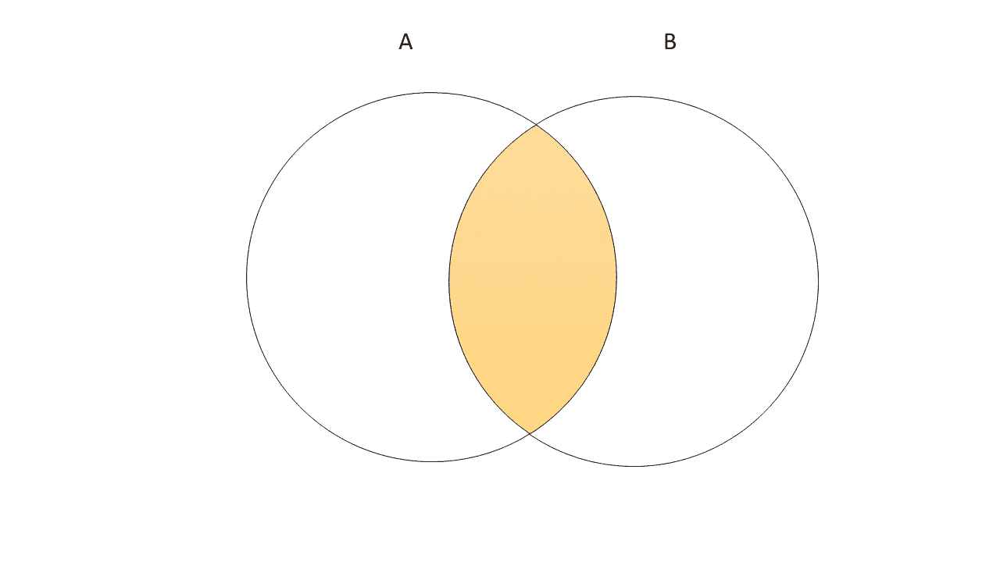
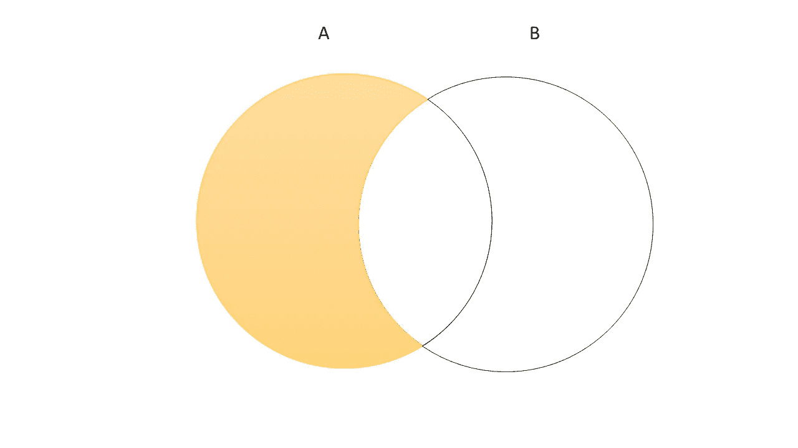
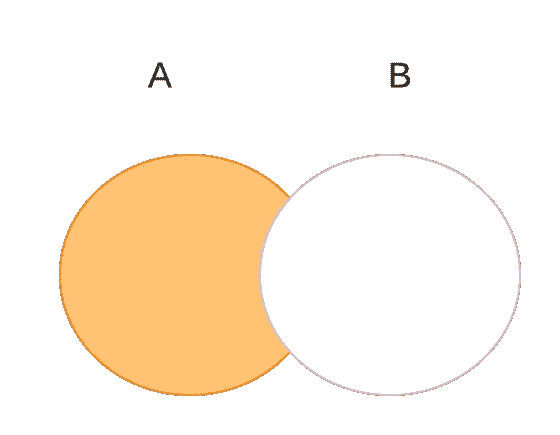
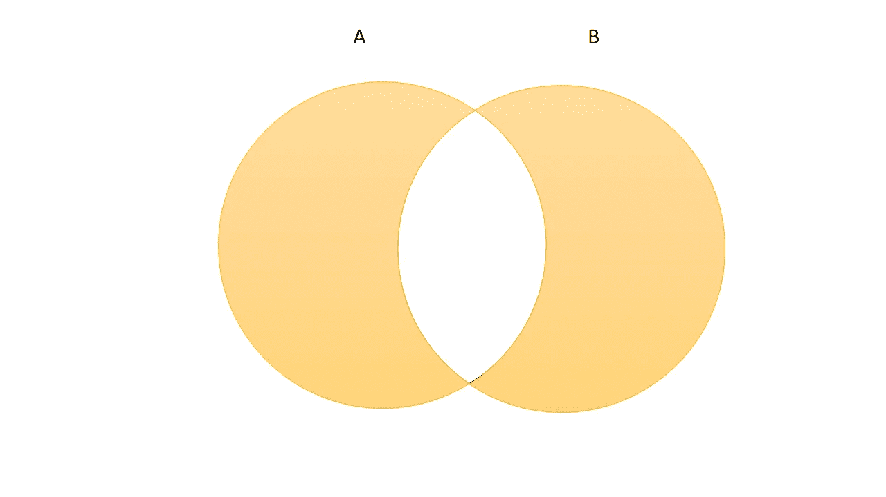
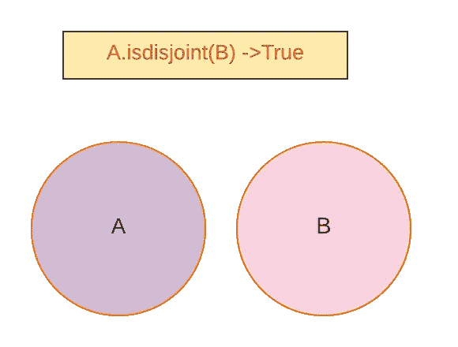
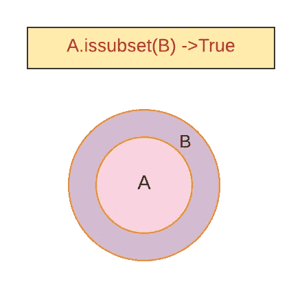
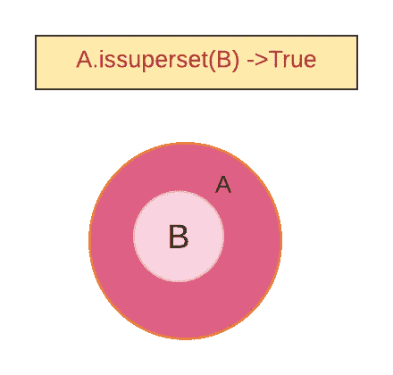
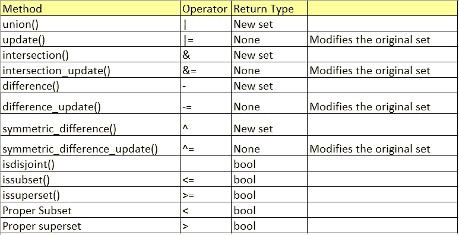

# Python 中的数学集合运算

> 原文：<https://betterprogramming.pub/mathematical-set-operations-in-python-e065aac07413>

## Python 数学集合运算完全指南



所有图片均由作者提供

# Python 中的数学集合运算

> Python 的`set`是 Python 中的无序集合。它可用于计算标准数学运算，如交集、并集、差集和对称差集。`Other`集合——如列表、元组和字典——不支持集合操作。`Dict`视图对象类似集合，允许集合操作。- [python 文档](https://docs.python.org/3/tutorial/datastructures.html#sets)

参考我关于 Python 集合的[故事。](https://medium.com/analytics-vidhya/python-sets-8e38a8bfb98c)

本文将详细探讨 set 对象支持的数学运算。

# **我们来看看 Set 对象**支持的数学运算

*   `union()`
*   `update()`
*   `intersection()`
*   `intersection_update()`
*   `difference()`
*   `difference_update()`
*   `symmetric_difference()`
*   `symmetric_difference_update()`
*   `isdisjoint()`
*   `issubset()`
*   `issuperset()`

集合操作有两种方式。通过使用方法或使用运算符。

## **'union()'**

用集合和`other`中的元素返回一个新的集合。由`union()`或使用`|`操作器来执行

**语法**

`**union**(**others*)`

`**set | other | ...**`



union()'

**例 1:求两个集合的并集—** `**A**` **和** `**B**`

它将返回一个包含集合`A`和集合`B`中元素的新集合。但不会重复元素。集合中的所有元素都是唯一的。

```
A={1,2,3,4,5}
B={2,4,6,8}
print (A.union(B))#Output:{1, 2, 3, 4, 5, 6, 8}
print (A|B)#Output:{1, 2, 3, 4, 5, 6, 8}
```

**例 2:求两个以上集合的并集**

```
A={1,2,3,4,5}
B={2,4,6,8,10}
C={1,3,5,7,9}
print (A|B|C)#Output:{1, 2, 3, 4, 5, 6, 7, 8, 9, 10}
print (A.union(B,C))#Output:{1, 2, 3, 4, 5, 6, 7, 8, 9, 10}
```

`union()`方法和`|`操作器的区别:

*   它将接受任何 iterable 作为参数
*   运算符:它只接受一个集合作为参数。否则，它会引发一个`TypeError`。

**例 3:给出** `**iterable**` **作为** `**union()**` **方法**中的一个自变量

```
A={1,2,3,4,5}
#iterable is given as list
print (A.union([2,4,6]))#Output:{1, 2, 3, 4, 5, 6}

#iterable is given as tuple
print (A.union((2,4,6)))#Output:{1, 2, 3, 4, 5, 6}

#iterable is given as range object
print (A.union(range(5,10)))#Output:{1, 2, 3, 4, 5, 6, 7, 8, 9}

#iterable is given as a dictionary
print (A.union({**'a'**:6,**'b'**:7}))#Output:{1, 2, 3, 4, 5, 'b', 'a'}
```

**例 4:给出** `**iterable**` **作为** `**|**` **运算符**的自变量

```
A={1,2,3,4,5}
B=[1,2,3]
print (A|B)
*#Output:TypeError: unsupported operand type(s) for |: 'set' and 'list'*
```

## 更新()'

它更新集合，添加来自`other`的元素。但不会重复元素。集合中的所有元素都是唯一的。通过使用`update()` 或使用`|=`操作符来执行。返回类型为`None`。它会修改原始设置本身。

**语法**

`**update**(**others*)`

`**set |= other | ...**`

**例 1:在两个集合—** `**A**` **和** `**B**`之间调用 `**update()**`

**它将通过添加两个集合中的元素来更新集合`A`。**

```
*#update()* A={1,2,3,4,5}
B={4,5,6,7,8}
print (A.update(B)) *#Output: None* print (A) *#Output: {1, 2, 3, 4, 5, 6, 7, 8}*A={1,2,3,4,5}
B={4,5,6,7,8}
A|=B
print (A) *#Output: {1, 2, 3, 4, 5, 6, 7, 8}*
```

****例 2:在两台以上**之间调用 `**update()**`**

```
***#update()* A={1,2,3}
B={3,4,5}
C={5,6,7}
print (A.update(B,C)) *#Output: None* print (A) *#Output: {1, 2, 3, 4, 5, 6, 7}* A={1,2,3}
B={3,4,5}
C={5,6,7}
A|=B|C
print (A) *#Output: {1, 2, 3, 4, 5, 6, 7}***
```

****`update()`方法和`|=`操作符的区别:****

*   ****`update()`:它将接受任何 iterable 作为参数****
*   ****运算符:它只接受集合作为参数。否则，它会养一只`TypeError`。****

******例 3:在** `**update()**` **方法**中给出 `**iterable**` **作为自变量******

```
**A={1,2,3}
*#iterable is given as list* print (A.update([2,3,4]))*#Output:None* print (A)*#Output:{1,2,3,4}

#iterable is given as tuple* A={1,2,3}
A.update((2,3,4))
print (A)*#Output:{1,2,3,4}

#iterable is given as range object* A={1,2,3}
A.update(range(2,5))
print (A)*#Output:{1,2,3,4}

#iterable is given as a dictionary* A={1,2,3}
A.update({2:**'a'**,3:**'b'**})
print (A) *#Output:{1, 2, 3}***
```

******例 4:给出** `**iterable**` **作为** `**|=**` **运算符**的自变量****

```
***#iterable is given as tuple* A={1,2,3}
B=(3,4)
A|=B
*#Output:TypeError: unsupported operand type(s) for |=: 'set' and 'tuple'***
```

## ****交集()'****

****返回一个包含集合和`other`共有元素的新集合。它由`intersection()`或使用`&`操作器执行。****

******语法******

****`**intersection**(**others*)`****

****`**set & other & ...**`****

********

****交集()'****

******例 1:求两个集合的交集—** `**A**` **和** `**B**`****

****它将从集合`A`和集合`B`中返回一个包含公共元素的新集合。****

```
**A={1,2,3,4,5}
B={2,4,6,8}
*#intersection is performed by intersection() method or & operator* print (A.intersection(B))*#Output:{2,4}* print (A&B)*#Output:{2,4}***
```

******例 2:求两个以上集合的交集******

```
**A={1,2,3,4,5}
B={2,4,6,8,10}
C={2,4}
print (A&B&C)*#Output:{2,4}* print (A.intersection(B,C))*#Output:{2,4}***
```

****`intersection()`方法和`&`操作符的区别:****

*   ****`intersection()`:它将接受任何 iterable 作为参数****
*   ****运算符:它只接受一个集合作为参数。否则，它会引发一个`TypeError`。****

******例 3:在** `**intersection()**` **方法**中给出 `**iterable**` **作为参数******

```
**A={1,2,3,4,5}
*#iterable is given as list* print (A.intersection([1,4,6]))*#Output:{1,4}

#iterable is given as tuple* print (A.intersection((2,4,6)))*#Output:{2,4}

#iterable is given as range object* print (A.intersection(range(5,10)))*#Output:{5}

#iterable is given as a dictionary* print (A.intersection({1:**'a'**,**'b'**:7}))*#Output:{1}***
```

******例 4:给出** `**iterable**` **作为** `**&**` **运算符**的自变量****

```
**A={1,2,3,4,5}
B=[1,2,3]
print (A&B)
*#Output:TypeError: unsupported operand type(s) for &: 'set' and 'list'***
```

## ****'交叉点 _ 更新()'****

****它更新集合，只保留在集合和`other`中找到的元素。通过使用 `intersection_update()`或使用`&=`操作器来执行。返回类型为`None`。它会修改原始设置本身。****

******语法******

****`**intersection_update**(**others*)`****

****`**set &= other & …**`****

******例 1:找出两个集合——**`**A**`**`**B**`之间的 `**intersection_update()**`******

******它将通过只保留在两个集合中找到的元素来更新集合`A`。******

```
*****#intersection_update()* A={1,2,3,4,5}
B={4,5,6,7,8}
print (A.intersection_update(B)) *#Output: None* print (A) *#Output: {4,5}*A={1,2,3,4,5}
B={4,5,6,7,8}
A&=B
print (A) ***#Output: {4,5}*******
```

## ******差异()'******

******返回一个新的集合，该集合中的元素不在`other`中。由`difference()`或使用`-`操作器执行。******

********语法********

****`**difference**(**others*)`****

****`**set - other - ...**`****

********

****差异()'****

******例 1:求两组的区别—** `**A**` **和** `**B**`****

****它将返回一个包含集合`A`中不在集合 b 中的元素的新集合。****

```
**A={1,2,3,4,5}
B={2,4,6,8}
print (A.difference(B))*#Output:{1,3,5}* print (A-B)*#Output:{1,3,5}***
```

******例 2:求两组以上的差******

```
**A={1,2,3,4,5}
B={2,4,6,8,10}
C={2,3}
print (A-B-C)*#Output:{1,5}* print (A.difference(B,C))*#Output:{1,5}***
```

****`difference()`方法和`-`操作符的区别:****

*   ****`difference()`:它将接受任何 iterable 作为参数****
*   ****运算符:它只接受一个集合作为参数。否则，它会抛出一个`TypeError`。****

******例 3:给出** `**iterable**` **作为** `**difference()**` **方法**中的参数****

```
**A={1,2,3,4,5}
*#iterable is given as list* print (A.difference([1,2,3]))*#Output:{4,5}

#iterable is given as tuple* print (A.difference((1,2,3)))*#Output:{4,5}

#iterable is given as range object* print (A.difference(range(1,4)))*#Output:{4,5}

#iterable is given as a dictionary* print (A.difference({1:**'a'**,2:**'b'**,3:**'c'**}))*#Output:{4,5}***
```

******例 4:给出** `**iterable**` **作为** `**-**` **运算符**的参数****

```
**A={1,2,3,4,5}
B=[1,2,3]
print (A-B)
*#Output:TypeError: unsupported operand type(s) for -: 'set' and 'list'***
```

## ****'差异 _ 更新()'****

****从集合中删除同时存在于`other`集合中的元素。使用`-=` 操作器或`difference_update()` 方法进行。返回类型为`None`。它会修改原始设置本身。****

******语法******

****`**difference_update**(**others*)`****

****`**set -= other | ...**`****

********

****'差异 _ 更新()'****

******例 1:找出两个集合——**`**A**`**`**B**`之间的 `**difference_update()**`******

******它将通过删除集合`B`中的元素来更新集合`A`。******

```
****A={1,2,3,4,5}
B={2,4,6}
*#Return type is None.* print (A.difference_update(B))*#Output:None
#It will update the original set* print (A) *#Output: {1,3,5}

# difference_update by using -= operator* A-=(B)
print (A) *#Output: {1,3,5}*****
```

********例 2:找出两个以上集合**之间的 `**difference_update**`******

```
*****#difference_update() will modify the original set.* A={1,2,3}
B={1}
C={2}
*#Return type is None.* print (A.difference_update(B,C))*#Output:None
#It will update the original set* print (A) *#Output: {3}

# difference_update by using -= operator* A={1,2,3}
B={1}
C={2}
A-=B|C
print (A) *#Output: {3}*****
```

******`difference_update()`方法和
`-=`操作符的区别:******

*   ******它将接受任何 iterable 作为参数******
*   ******`-= operator`:它只接受一个集合作为参数。否则，它会引发一个`TypeError`。******

********例 3:在** `**difference_update()**` **方法**中给出 `**iterable**` **作为自变量********

```
***#iterable is given as list* A={1,2,3}
B=[1]
print (A.difference_update(B))*#Output:None* print (A)*#Output:{2,3}***
```

******例 4:给** `**iterable**` **作为** `**-=**` **运算符**的自变量****

```
**A={1,2,3}
B=[1]
A-=B
print (A) 
*#Output: TypeError: unsupported operand type(s) for -=: 'set' and 'list'***
```

## ****symmetric_difference()'****

****返回包含集合或`other`中元素的新集合，但不包含两者。由`symmetric_difference()`或使用`^`操作器来执行。****

******语法******

****`**symmetric_difference**(*other*)`****

****`**set ^ other**`****

********

****对称 _ 差异()****

******例 1:找出两个集合之间的**`**symmetric_difference**`**——**`**A**`**和** `**B**`****

****它将返回一个新的集合，包含来自集合`A`和集合`B`的元素，但不包含在两个集合中都找到的元素。****

```
**A={1,2}
B={2,3}
print (A.symmetric_difference(B))*#Output:{1,3}* print (A^B)*#Output:{1,3}***
```

******例 2:** `**symmetric_difference**` **只在两组**之间进行****

****多台电视机不支持`symmetric_difference() method`。如果给定了两个以上的集合，就会产生一个`TypeError`。****

```
**A={1,2}
B={2,3,5}
C={3,4}
print (A.symmetric_difference(B,C))*#Output:TypeError: symmetric_difference() takes exactly one argument (2 given)***
```

****但是我们可以用`^`找到多组的`symmetric_difference`。****

```
**A={1,2}
B={2,3,5}
C={3,4}

print (A^B^C)*#Output:{1,4,5}***
```

****`symmetric_difference`方法和`&`操作符的区别:****

*   ****它将接受任何 iterable 作为参数。此方法不允许多个集合。****
*   ****运算符:它只接受集合作为参数。否则，它会抛出一个`TypeError`。通过使用`^`运算符，可以找到多个集合之间的`symmetric_difference`。****

******例 3:在** `**symmetric_difference**` **方法**中给出 `**iterable**` **作为参数******

```
***#iterable is given as list* A={1,2,3}
B=[1]
print (A.symmetric_difference(B))*#Output:{2,3}

#iterable is given as tuple* A={1,2,3}
B=(1,)
print (A.symmetric_difference(B))*#Output:{2,3}

#iterable is given as range object* A={1,2,3}
B=range(2)
print (A.symmetric_difference(B))*#Output:{2,3}***
```

******例 4:给** `**iterable**` **作为** `**^**` **运算符**的参数****

```
**A={1,2,3}
B=[1]
A^B
print (A) *#Output: TypeError: unsupported operand type(s) for ^: 'set' and 'list'***
```

## ****symmetric_difference_update()'****

****更新集合，只保留在任一集合中找到的元素，而不同时保留两个集合中的元素。通过使用`symmetric_difference_update()`或使用`^=`操作器来执行。返回类型为`None`。它会修改原始设置本身。****

******语法******

****`**symmetric_difference_update**(*other*)`****

****`**set ^= other**`****

******例 1:找出 A 和 B 两个集合**之间的 `**symmetric_difference_update()**`****

******它将更新集合`A`,只保留在任一集合中找到的元素，而不是在两个集合中都找到的元素。******

```
*****#symmetric_difference_update()* A={1,2,3,4,5}
B={4,5,6,7,8}
print (A.symmetric_difference_update(B)) *#Output: None* print (A) *#Output: {1, 2, 3, 6, 7, 8}* A={1,2,3,4,5}
B={4,5,6,7,8}
A^=B
print (A) *#Output: {1, 2, 3, 6, 7, 8}*****
```

## ******isdisjoint()'******

******如果集合中没有与`other`相同的元素，则返回`True`。集合是不相交的当且仅当它们的交集是空集。******

********语法********

****`**isdisjoint**(*other*)`****

********

****isdisjoint()****

******例子******

```
***#Set A and Set B containing common elements* A={1,2,3,4,5}
B={4,5,6,7,8}
print (A.isdisjoint(B))*#Output:False

#Set A and Set B not containing common elements* A={1,2}
B={3,4}
print (A.isdisjoint(B))*#Output:True***
```

## ******'issubset()'******

****测试集合中的每个元素是否都在`other`中。****

******语法:******

****`**issubset**(*other*)`****

****`**set <= other**`****

********

****issubset()****

******例:检查集合** `**A**` **是否是** `**B**`的子集****

****可通过`issubset()`方法或使用`≤`操作符完成。****

```
**A={1,2,3,4,5}
B={4,5,6,7,8}
print (A.issubset(B)) *#Output: False* print (A<=B)*#Output: False* A={1,2,3}
B={1,2,3,4,5}
print (A.issubset(B)) *#Output: True* print (A<=B)*#Output: False***
```

******真子集******

****测试集合是否是`other`——即`set <= other and set != other`的真子集。****

******语法******

****`**set < other**`****

******例:检查集合** `**A**` **是否是** `**B**`的真子集****

****如果两组相等，这意味着 `A.issubsetset(B)` 返回`True`。但是真子集`A<B`将返回`False`。****

```
**A={1,2,3,4,5}
B={4,5,6,7,8}
print (A<B)*#Output: False* A={1,2,3,4,5}
B={1,2,3,4,5}
print (A<B)*#Output: False* A={1,2,3}
B={1,2,3,4,5}
print (A<B)*#Output: True***
```

## ******'issuperset()'******

****测试`other`中的每个元素是否都在集合中。****

******语法******

****`**issuperset**(*other*)`****

****`**set >= other**`****

********

****issuperset()****

******例:检查集合** `**A**` **是否是** `**B**`的超集****

****可通过`issuperset()`方法或使用`≥`操作器完成。****

```
**A={1,2,3,4,5}
B={4,5,6,7,8}
print (A.issuperset(B)) *#Output: False* print (A>=B)*#Output:True* A={1,2,3,4,5}
B={1,2,3}
print (A.issuperset(B)) *#Output: True* print (A>=B)*#Output:True***
```

******适当超集******

****测试该集合是否是`other`——即`set >= other and set != other`——的适当超集。****

******语法******

****`**set > other**`****

******例:检查集合** `**A**` **是否为** `**B**` **的真超集。******

****如果两组相等，则意味着`A.issuperset(B)`返回`True`。但是适当的超集`A>B`将返回`False`。****

```
**A={1,2,3,4,5}
B={4,5}
print (A>B)*#Output: True* A={1,2,3,4,5}
B={1,2,3,4,5}
print (A>B)*#Output: False* A={1,2,3}
B={1,2,3,4,5}
print (A>B)*#Output: True***
```

# ****注意****

********

****`frozenset`不支持所有的更新方式。`frozenset`类型是不可变的，而[是可散列的](https://docs.python.org/3.8/glossary.html#term-hashable)——它的内容在创建后不能更改。因为所有的更新方法都修改原始集合，所以`frozenset`不支持。****

# ****结论****

****数学集合运算可以通过两种方式执行:使用运算符或使用方法。****

****不同的是如果我们使用方法，他们会接受`iterable`作为参数。但是对于运算符，应该只设置参数。如果没有，它会引发一个`TypeError`。所有的更新方法都会更新原来的集合，在`frozenset`中不支持。除了 update 方法之外，所有其他方法都返回一个新的集合。****

# ****资源****

*   ****[Python docs:“设置类型—](https://docs.python.org/3.8/library/stdtypes.html#set-types-set-frozenset) `[set](https://docs.python.org/3.8/library/stdtypes.html#set-types-set-frozenset)` [、](https://docs.python.org/3.8/library/stdtypes.html#set-types-set-frozenset) `[frozenset](https://docs.python.org/3.8/library/stdtypes.html#set-types-set-frozenset)`”****

****请关注此空间，了解更多关于 Python 和数据科学的文章。如果你喜欢看我的更多教程，就关注我的 [***中***](https://medium.com/@IndhumathyChelliah)[***LinkedIn***](https://www.linkedin.com/in/indhumathy-chelliah/)*[***Twitter***](https://twitter.com/IndhuChelliah)***。********

*****感谢阅读！*****