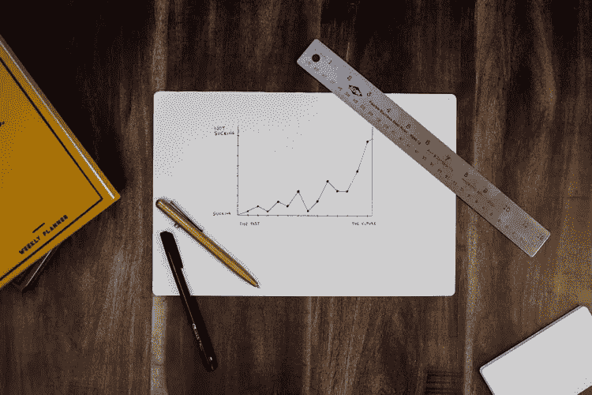
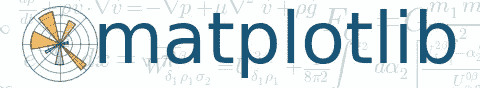
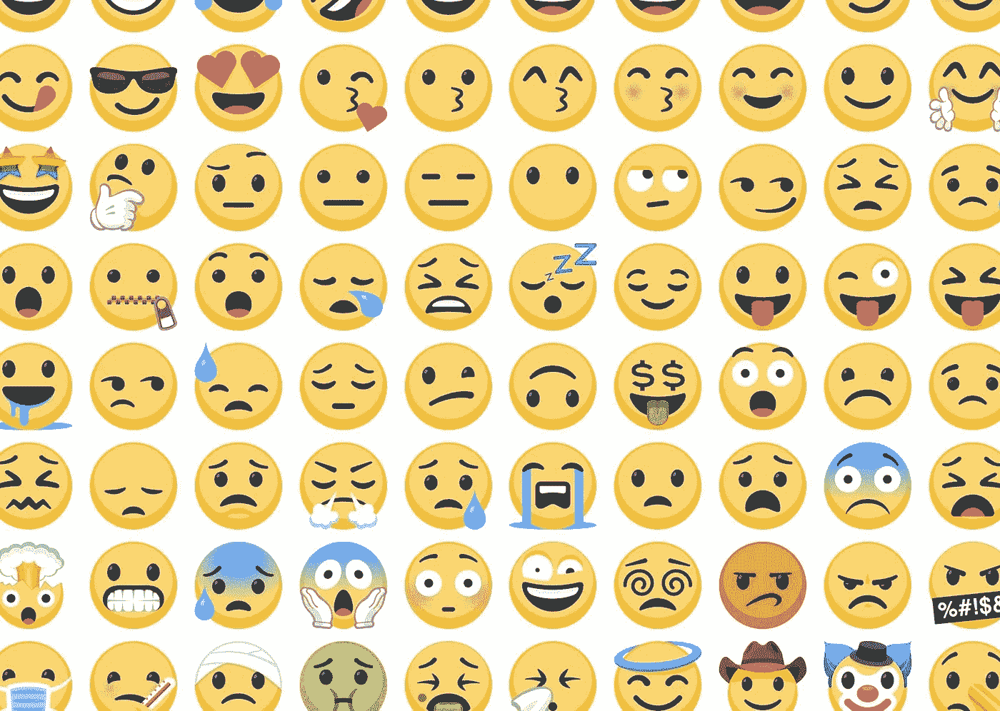
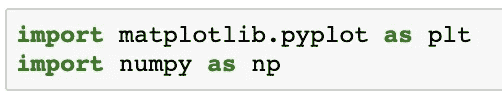
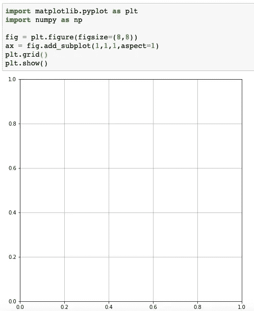
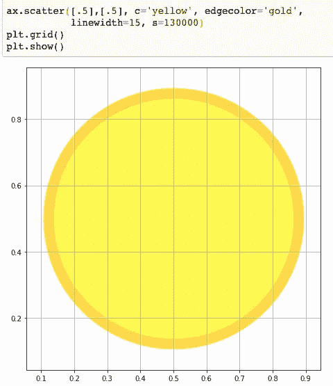
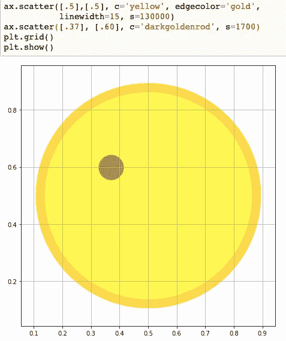
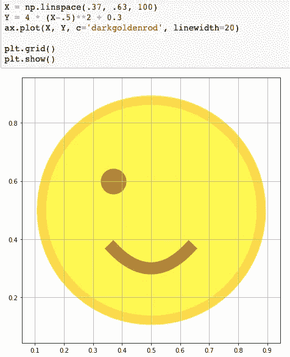
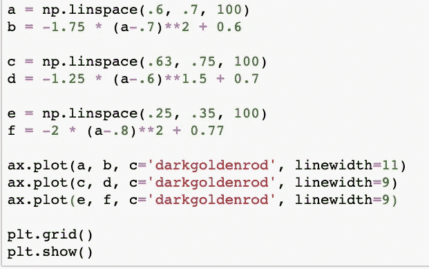

# 我用 Python 创建了一个表情符号

> 原文：<https://betterprogramming.pub/matplotlib-more-than-just-graphs-35dd46524358>

## Matplotlib 而不是 Photoshop

艾萨克·史密斯在 [Unsplash](https://unsplash.com/@isaacmsmith) 上拍摄的照片

网飞、Instagram、YouTube、电影和电视节目。所有这些东西有什么共同点？它们都是吸引各种人的视觉媒介。

如今，大多数人更喜欢看一个故事的展开，而不是阅读或听说它。有些人可能不同意，并说书籍仍然活着，蓬勃发展，但让我们现实一点——大多数人喜欢看电影，而不是看书。

这就是为什么视觉是当今最流行的交流方式之一的一个重要原因。这也是为什么数据可视化是众多学科(如数据科学)中一个极其重要的方面。那么，作为 Python 程序员，我们可以用什么来呈现我们收集的所有宝贵数据呢？幸运的是，我们有一个非常有用的数据可视化工具，叫做…

# 什么是 Matplotlib？

Matplotlib 是 Python 编程语言中最流行和最通用的绘图库之一。它被各种各样的 Python 程序员使用，从杰出的数据科学家到试图用他们的数据制作简单条形图的初学者。它能够显示各种不同的图表，例如:

*   散点图
*   曲线图
*   三维绘图
*   直方图
*   [还有更多！](https://matplotlib.org/3.1.1/tutorials/introductory/sample_plots.html#sphx-glr-tutorials-introductory-sample-plots-py)

Matplotlib 甚至允许您定制您创建的各种图表的布局和颜色。可能性几乎是无限的！

所以，你可能会问，“这样的事情是怎么发生的？”既然你问了，它来自一个叫约翰·d·亨特的人，他在 2003 年创建了它。作为 MATLAB 的独家用户，这是另一个用于数据分析和可视化的流行软件，Hunter 受到启发，为 Python 创建了一个类似的绘图包。

令人悲伤的是，约翰·亨特于 2012 年去世。今天，Matplotlib 由 Michael Droettboom 和许多其他贡献者维护，因为 Matplotlib 是一个开源库。我们不会深入探究 Matplotlib 的历史，但是如果你有兴趣了解更多，请点击这里。

直到今天，Matplotlib 仍然是数据可视化和分析的最容易访问和最重要的工具之一。它被广泛使用和接受的原因之一是因为它是免费和开源的。

任何人都可以下载 Python 和 Matplotlib，并开始编写自己的图表。事实上，现在就这么做是个好主意，因为这会让本文的其余部分更有趣一些([安装说明](https://matplotlib.org/3.1.1/users/installing.html))。如果您愿意跟随，我们将从展示 Matplotlib 的可视化潜力开始。

# 使用 Matplotlib 创建表情符号

在接下来的部分，不管你是使用它们，讨厌它们，还是喜欢它们，我们都将使用 Matplotlib 来重新创建当今最新的交流形式之一:表情符号！

在你对这个想法嗤之以鼻之前，考虑一下表情符号的总体受欢迎程度，以及有多少人使用过和/或看过它们。甚至有一部关于他们的电影，但是我们不会评论这部电影的质量。

考虑到这一点，使用 Matplotlib 重新创建一个表情符号对 Python 编码人员和非编码人员来说都是非常有趣的。因此，让我们一起开始探索 Matplotlib，并尝试重新创建以下表情符号:

这是欢迎您跟随的部分，或者如果您目前没有合适的工具，就跟随阅读。在我们开始之前，必须感谢代码大纲中的一个笑脸[在这里](https://gist.github.com/bbengfort/dd9d8027a37f3a96c44323a8303520f0)。但是，我们将调整代码，以适应我们特定的娱乐。

# 创建表情符号的说明

让我们从导入`numpy`开始，它添加了一些必要的数学函数，当然还有带有`.pyplot` 模块的 matplotlib，它让我们可以访问绘图和绘图所需的众多函数:

从两个变量开始(`fig` *、* `ax`)。`fig` 被赋予`plt.figure()`方法，参数`figsize=(8,8)`确定图表的整体大小。`ax` 被赋予`fig.add_suplot()`参数，这些参数也有助于构建图表的大小。最后，我们添加了显示图表的`plt.show()`和显示网格线的`plt.grid()`。

现在我们有了一张空白的画布或图表，可以开始绘制我们的表情符号。先从脸型开始——眼睛和嘴巴随后。

为了创建面部，我们将调用`ax.scatter()`来创建一个散点图，但是只有一个点。在`scatter()`方法内部，我们有一些参数:

*   `[.5],[.5]`；该点的坐标。
*   `c`****`edgecolor`**=`yellow`和`gold`分别给脸和边缘上色。******
*   ******`linewidth`；影响外边缘的厚度。******
*   ******`s`；影响脸的整体大小。******

************

******我们现在创造了太阳，但这不是我们在这里的原因。让我们继续添加第一只眼睛。******

******在我们为眼睛创建的第一个方法下面添加另一个`ax.scatter()`方法。但是这一次，我们将把坐标改为`[.37],[.60]`，如果你愿意，可以调整。颜色(`c`)将是`darkgoldenrod` ，不需要边缘颜色。尺寸(`s`)将改为`1700`。******

************

******现在它看起来有点像柠檬，而不是太阳。然而，我们对画柠檬不感兴趣，所以让我们继续添加微笑。******

******现在，这一次我们不会使用`ax.scatter()`方法。相反，我们将实现一个稍微复杂一点的东西，但不是那么复杂。首先，我们将创建两个新变量:`X`和`Y`。然后，我们将使用`ax.plot()`方法绘制`X`和`Y`。******

******对于`X = np.linspace(.37, .63, 100)`，我们最终使用了一个带有三个参数的 numpy 方法:`np.linspace()`。前两个参数代表 x 轴上的起点和终点(`.37, .63`)。第三个代表图形的点数(在本例中为`100`点)。******

******对于`Y = 4 * (X-.5)**2 + 0.3`，我们有一个可以修改的四个数字的方程。第一个数字(`4`)影响微笑的曲线/角度。如果是负面的，那就是皱眉了。第二个数字(`.5`)稍微改变了微笑的旋转。第三个数字(`2`，指数)影响微笑有多直。第四个数字(`0.3`)改变微笑在 y 轴上的位置。******

******最后，使用`ax.plot(X, Y, c=’darkgoldenrod’, linewidth=20)`，我们用颜色(`c`)绘制我们创建的(`X, Y`)变量，与眼睛(`darkgoldenrod`)相同，并且`linewidth` 等于`20`，这修改了微笑的厚度。******

********

****我们现在有一个独眼笑脸，这可能更适合海盗或尼克·弗瑞，但不适合我们！所以让我们继续插入一些行。****

****移动到眉毛和眨眼，我们必须重复我们微笑的过程。我们实际上是用我们刚刚用过的方法画了另外三条线。为了简洁起见，请随意复制下面的代码。****

****如您所见，它的格式与 smile 的代码完全相同，但是具有不同的值，并被赋予了新的变量名。当前使用的值似乎最合适，但是可以随意调整为您喜欢的任何值。****

****************

****我们做到了——我们终于有了自己的表情符号！但是，网格线和绘图轴呢？嗯，我们只需要几行代码就可以让它们消失。别担心，这些是我们要写的最后一点代码。****

****我们通过使用`ax.spines.set_visible()` 方法，在`ax.spines`括号中选择正确的边，并在`set_visible()`方法中传递`False`，从图形中移除线条。最后，我们使用`ax.set_xticks()`和`ax.set_yticks()`来清空列表，删除 x 和 y 轴上的数字。****

********

****完成后，让我们再次运行整个代码。这将给我们…****

********

****太棒了——我们成功地重新创建了眨眼表情符号！这可能不是一个精确的再创作，但对于仅仅使用 Matplotlib 来说，这还不算太坏。请随意向你的朋友展示你可以用代码创建表情符号，给他们留下深刻印象。或者不是，看你个人对表情符号的看法。****

# ****最后的想法****

****希望您现在对如何使用 Matplotlib 有了更好的理解。我们仅仅触及了 Matplotlib 全部潜力的表面，甚至还没有触及它的其他特性，比如 3D 绘图。****

****如果你想更深入地研究 Matplotlib 或者希望制作更多的表情符号，那么点击[这里](https://matplotlib.org/)获取官方文档。或者，你可以自己在网上随意搜索。如果你做了足够的研究，那么你可以简单地使用 Matplotlib 创建一个全新的 3d 表情符号(或者其他不适合你的风格的东西)!****