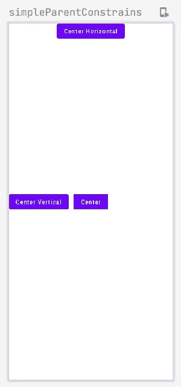
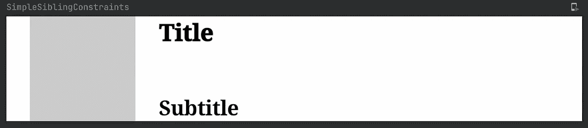
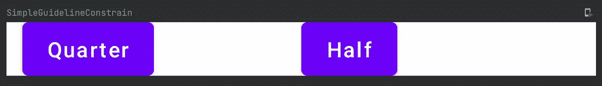
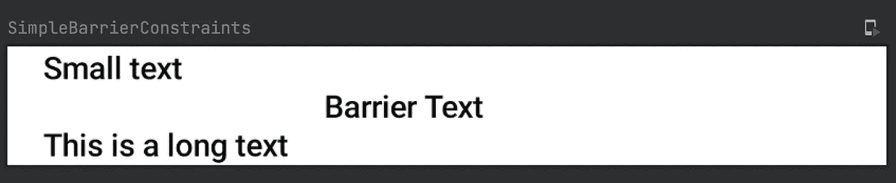
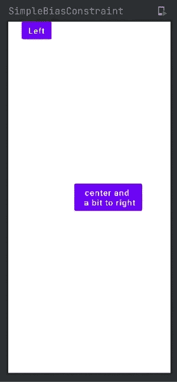

# Jetpack 合成中的成熟约束布局

> 原文：<https://betterprogramming.pub/matured-constraint-layout-in-jetpack-compose-86665a974683>

## 与我一起在 Jetpack 中开发


## 在撰写中使用约束布局的我的历史

回到 2020 年，当 Jetpack Compose 还处于早期阶段时，我写了一篇关于 Jetpack Compose 中的约束布局的文章。如果你感兴趣，你可以从[这里](https://medium.com/android-dev-hacks/exploring-constraint-layout-in-jetpack-compose-67b82123c28b)开始阅读(不是先决条件)，但是从那时起约束布局成熟的方式使它与那时完全不同，改进实际上是有意义的。

# 介绍

本文不是关于比较，而是关于如何在今天的 Jetpack Compose 中使用成熟的约束布局来设计复杂的可组合组件。我将重点介绍约束布局的四个重要概念:

```
**1\. Basics — Simple Contraints
2\. Guidlines
3\. Barriers
4\. Bias**
```

在继续之前，让我给你简单解释一下这四个概念。约束布局在 androidDev 中并不是新概念，它实际上是从传统的 Android 开发继承到 Jetpack Compose 的。

## b**ASIC——简单约束**

简单的约束只不过是将一个视图定位到其父视图或兄弟视图的特定约束(关系)中。

## **指导方针**

指引线只是一些不可见的线，您可以将它们放置在布局中，并将视图约束到布局中。

## **壁垒**

屏障类似于指引线，但是使用屏障，您可以通过单个源用多个视图约束一个视图。如果理解起来有点困难，不要担心，我们将在本文接下来的部分中深入探讨。

## 偏见

偏差用于管理视图之间的空间和它所约束的对象，它们通常用于与中心对齐的视图。

# 先决条件

在进一步学习之前，您必须具备如何使用 Jetpack Compose 的基本知识。如果你是作曲新手，我强烈推荐阅读以下文章:

*   [Jetpack 组合组件(第 1 部分)](/jetpack-compose-components-part-1-a80717dbfb59)
*   "[在 JetPack Compose 中构建 Android 布局](/build-android-layouts-in-jetpack-compose-bda2e0837f5e)"

话虽如此，我们还是开始吧。

# 您应该熟悉的函数，以掌握 Compose 中的约束布局

## 约束布局

ConstraintLayout 只不过是一个可组合的函数，可以根据指定的约束定位其子元素。它还将一个[修饰符](/jetpack-compose-components-part-3-ce5ae661f3d6)作为可选参数。

```
ConstraintLayout { // Childs goes here}
```

## 创建参考

`createRefs`是一个函数，它为我们提供了一种创建`ConstrainedLayoutReferences`(除了约束布局中的布局之外什么也没有)的常规方法。这个函数利用 Kotlin 中的[析构声明](https://kotlinlang.org/docs/destructuring-declarations.html)来创建所需数量的引用。

```
ConstraintLayout { val (title, subtitle, image) = createRefs()} 
```

在这里，标题、副标题和图像只是我们在约束布局中引用的视图。

## constrainAs

`constrainAs`不过是[修改器](/jetpack-compose-components-part-3-ce5ae661f3d6)的扩展功能。它有两个参数:

1.  第一个参数:`ConstrainedLayoutReference`，基本上用来给视图分配 id，值应该是我们通过`createRefs`函数创建的引用之一。
2.  第二个参数:`ConstrainScope`，除了一个函数之外什么都没有，在这个函数中，我们指定了我们想要应用于当前视图/可组合对象的所有约束。

```
Modifier.***constrainAs***(subtitle) **{**top.linkTo(title.bottom)
**}**
```

# **基础——简单约束**

让我们从基础开始，从如何将视图约束到其父视图开始。比如将视图限制为垂直居中、水平居中或整个屏幕居中。

相对于其父视图放置视图

你在这里遇到的一个新函数是`linkTo`。这只不过是使用`VerticalAnchorable` ( `start`和`end`)和`HorizontalAnchorable` ( `top`和`bottom`)定义约束的一种方式。



简单约束输出

下一步是相对于它的兄弟约束一个视图。为了探索这个用例，让我们以标题、副标题和图像为例。

相对于父视图和同级视图放置视图

`Box`只不过是一个简单的可组合函数，这里我们用一个盒子来代替一个图像，以保持事情的简单和简洁。`centerVerticallyTo`不过是为通过参数发送的视图添加`top`和`bottom`约束的实用函数，同样我们也可以通过`centerHorizontallyTo`添加`start`和`end`约束。


兄弟约束输出

如果你看到输出有点笨拙，那是因为视图和它的`parent`之间没有间隔。我们可以在使用`linkTo`函数中的`margin`可选参数创建约束的同时添加边距。看一看:

```
start.**linkTo**(image.end, **margin = 16.*dp***)
```



带边距的输出

# **指导方针**

因为所说的指导方针只不过是无形的线，通过它我们可以约束布局中的实际视图。传统上，`GuideLine`可以是水平的，也可以是垂直的；

*   宽度和高度为零的垂直参考线等于其父参考线。
*   高度和宽度为零的水平参考线等于其父参考线。

Compose 提供了一种非常简单的方法，通过`createGuidelineFromStart`、`createGuidelineFromEnd`、`createGuidelineFromTop`、`createGuidelineFromBottom`等函数来创建指南。每个函数都将一个`float`值作为可选参数，用于从指定的方向对齐相应的指引线。

就准则提出看法



准则代码输出

# 障碍

正如我所说的，barrier 类似于一个指南，但是真正的优势来自于运行时的多视图伸缩。简而言之，使用屏障，一个视图可以被约束到多个同级视图。

与指南类似，compose 提供了一组函数来创建屏障，例如:`createStartBarrier`、`createEndBarrier`、`createTopBarrier`、`createBottomBarrier`等等。这些函数中的每一个都有两个参数:

1.  `elements`:只有我们通过`createRefs`创建的 ConstrainedLayoutReference。屏障将被约束到这些参考。依赖于此屏障的视图将根据提供的参考测量值改变位置。
2.  `margin`:用于定义视图/组件之间的边距。

相对于屏障放置视图



屏障代码输出

# 拜斯

由于所述偏差用于管理视图和它所约束的对象之间的空间，所以要保持的空间部分被定义为`float`。这里我们使用下面的`linkTo`来定位视图并添加偏差:

```
fun linkTo(
    start: ConstraintLayoutBaseScope.VerticalAnchor,
    end: ConstraintLayoutBaseScope.VerticalAnchor,
    startMargin: Dp = 0.*dp*,
    endMargin: Dp = 0.*dp*,
    @FloatRange(from = 0.0, to = 1.0) bias: Float = 0.5f
)
```

*   `start`:定义视图的起始约束
*   `end`:定义视图的末端约束。
*   而`startMargin`和`endMargin`用于定义对齐的边距。
*   偏差是我们希望添加到视图中的差距的一部分。

增加观点的偏见



偏置码输出

目前就这些。希望你学到了有用的东西。感谢阅读。