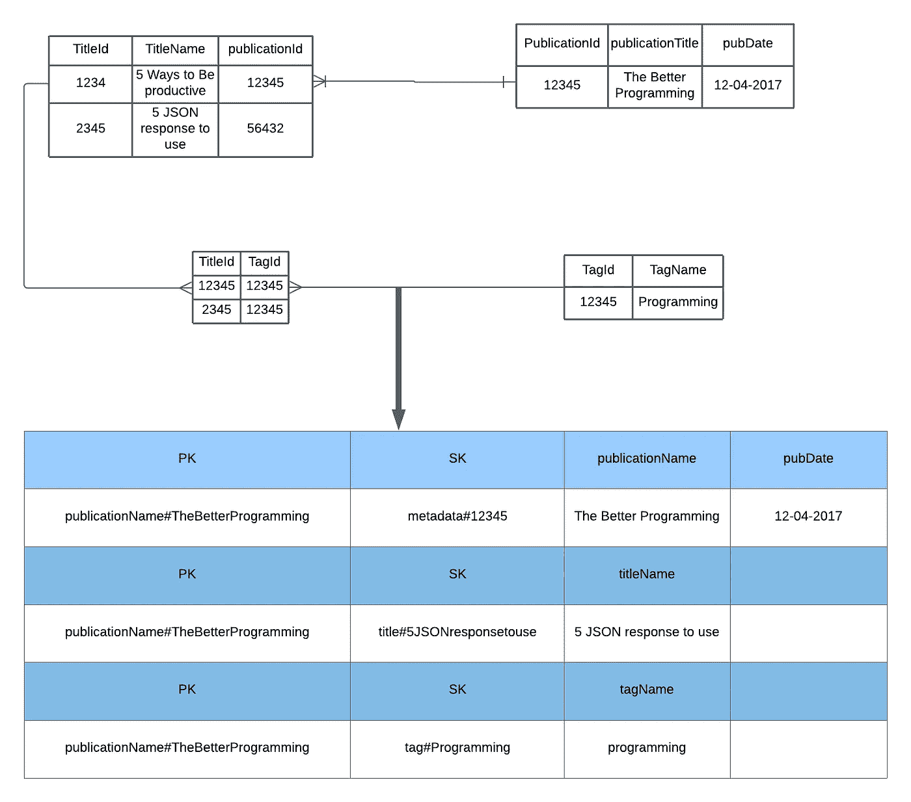
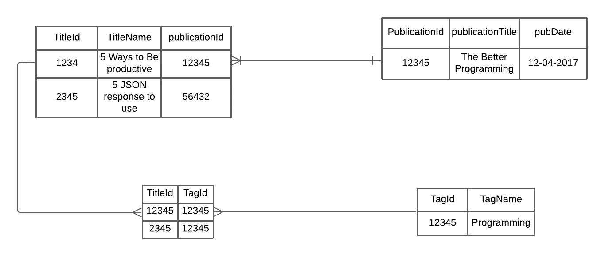
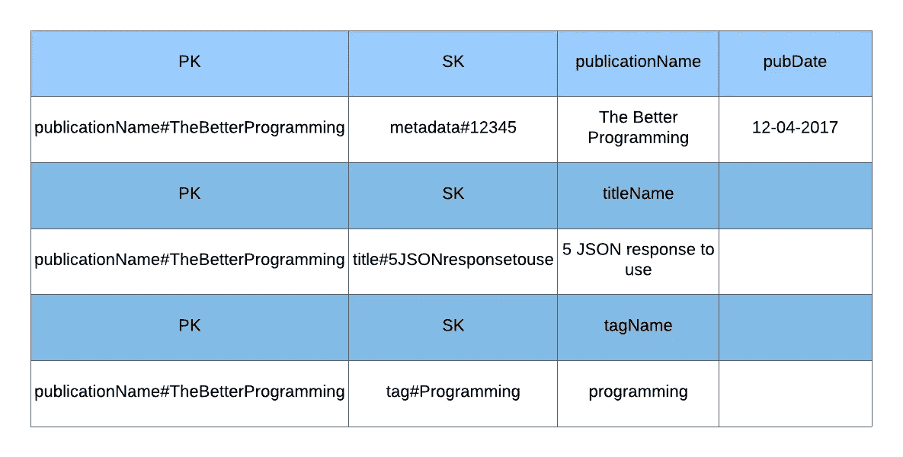
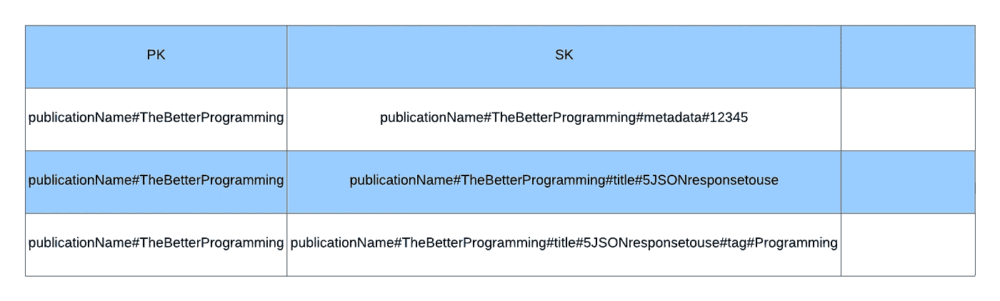
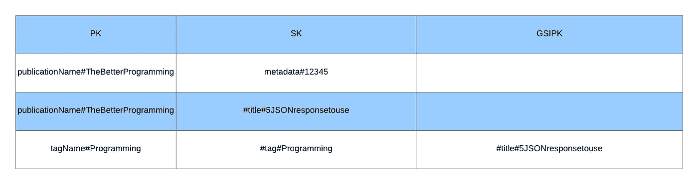

# 通过在 DynamoDB 中建模任何关系数据来最大限度地提高性能

> 原文：<https://betterprogramming.pub/maximize-performance-by-modelling-any-relational-data-in-dynamodb-17044b792cbf>

## 设计高性能数据库

图片由作者提供

当我们想开始开发一个应用程序时，设计一个数据库应用程序是我们通常做的第一件事。无论是使用 React 和 NodeJs 的简单待办 app，还是针对微服务的复杂监控应用，数据都是这些应用的核心。

设计一个好的数据模型可以帮助你编写更高性能的软件，而且在扩展一个新特性时，你需要做的繁琐步骤也更少。

现代应用程序的流行数据库之一是 [DynamoDB](https://aws.amazon.com/dynamodb/) 。DynamoDB 之所以受欢迎，是因为它是为巨大的高速用例设计的，比如亚马逊购物车。因此，随着数据集的扩展，它不能容忍连接的不一致性和缓慢的性能。

尽管 DynamoDB 是高性能的，但在 DynamoDB 中设计数据模型是很棘手的。例如，我们不能考虑如何规范化数据以避免异常，因为 DynamoDB 是一个 NoSQL 数据库。

这些是我在 DynamoDB 中设计数据模型时意识到的主要区别。

# 基于访问模式的设计

在 SQL 中，设计模型是基于数据库规范化的。我们根据这些定律设计数据，第一范式、第二范式和第三范式。

然而，在 DynamoDB 中设计数据模型时，理解访问模式是关键。例如，我们根据用户通常寻求的操作方式来设计分区键和排序键。

# 没有连接

连接的好处之一是从单个请求中获得多个异构项。

在 NoSQL 数据库中，数据不再被规范化。您可能需要在多个项目(行)上复制属性。在执行查询时，没有“连接”这样的东西。我们经常说这是使用 NoSQL 存储的缺点之一。因此，join 经常进入服务级别。

基于实体关系图在 NoSQL 上创建数据模型是行不通的，对于 DynamoDB 中的数据建模有不同的思考方式。

# 一表设计

*单表设计*就是把你所有的实体和数据模型放在一个表中。对于熟悉关系设计的人来说，这是一种很难掌握的设计模式。

DynamoDB 中没有联接，因为联接不能容忍它们的高性能用例；然而，在 DynamoDB 中建模数据的一种常见方式是应用关系设计模式。他们将项目放在不同的表中，并在应用程序级别进行连接。这种连接操作成为瓶颈，因为网络 I/O 是最慢的，并且不能在并发环境中执行。

在 DynamoDB 中设计模型的一个技巧是让应用程序处理尽可能少的对 DynamoDB 的请求——理想情况下是一个。

我们需要找出最佳实践和步骤来设计带有这些约束的数据模型。我想展示一个转换关系模型设计以适应 DynamoDB 集合的三步过程，并附带一个我目前正在做的项目示例，即[媒体发布索引](https://edward-huang.com/now/)。

# 您的应用程序的访问模式是什么？

在我们开始考虑这个应用程序中的所有实体之前，这个应用程序的访问模式是什么？

访问模式几乎是你所想到的关于用户如何访问你的数据的任何东西。

这些是我认为用户在检索媒体出版物索引时想要使用的示例访问模式(仅举几个例子):

*   用户应该能够搜索该出版物名称的元数据
*   用户应该能够搜索该出版物名称内所有文章
*   用户应该能够搜索出版物名称中所有标签

一旦我们写下所有的访问模式，我们就可以进入下一步。

# 使用关系数据设计来设计您的数据

用关系数据设计来设计模型的实体。基于灵活性设计数据，并将其规范化。标识实体的每个关系，例如一对多或多对多关系。

在媒体出版物索引的示例中，出版物和标题是一对多关系，标题和标签是多对多关系。每个出版物将有许多文章。每篇文章可以在很多标签里，每个标签也可以在很多文章里。因此，如果我们想在关系数据库中设计它，我们将有四个表:publication、articles、tags 和一个用于 articles 和 tags 的连接表。文章包含与发布相关联的外键。连接表包含与`titleId`相关联的`tagId`。

由作者提供

# 定义分区键、排序键和 GSI 索引

基于前两节，我们可以开始定义分区键和排序键。由于我们的模型是分层的，它模仿了与地图非常相似的概念。

在 DynamoDB 中，每一项都需要一个分区键。如果分区键不是唯一的，您需要定义排序键。

有几种设计模式可以设计数据库中的一对多关系模型。我通常使用的常见模式是使用分区键作为层次结构的根，使用排序键作为每个实体的主键。

在上面的例子中，我们的分区键和排序键没有任何有意义的名字。因此，我们定义分区键为`PK`，排序键为`SK`。由于 publication 是层次模型的根，分区键将是发布的名称。排序关键字可以是三个实体的唯一 ID。

记住，我们是基于访问模式来设计我们的表的。关系数据设计有助于指导我们使用分区键、排序键和任何额外的全局二级索引(如果需要的话)。这并不意味着我们需要模拟像关系数据设计那样的多对多关系。如果我们的数据没有标准化，那也没关系。

我们将用`[EntityName]#[EntityValue]`创建`PK`和`SK`值。例如，分区键将是`PublicationName#TheBetterProgramming`，排序键可以是`Metadata#[PublicationId]`、`Title#[TitleName]`、`Tag#[Tag]`:

图片由作者提供

这里需要注意的是，由于第一部分中这个应用程序的访问模式，我没有尝试让标题和标签具有多对多的关系。

`Publication`是分区键，因为我们可以观察到第一步中的三种访问模式，并且知道所有的值都是基于发布名称进行搜索的。因此，设计可以在我们的表中创建这些访问模式:

*   检索出版物:使用`GetItem` API 调用和出版物的名称来请求带有`PublicationName#<PublicationName>`的`PK`和`#Metadata#[PublicationId]`的`SK`的项目。
*   通过使用带有关键字条件表达式`PK=PublicationName#<PublicationName>`和`begins_with(SK, "Title#"("Tag#"))`的查询 API 动作，获取该出版物中的所有标题(标签)。这将检索出版物和标题，而无需获取所有的`Publication`对象和所有的标签。

我们还注意到，该模型是基于层次结构的，因为每个查询首先基于出版物。

另一种模式是使用复合排序键模式。但是，当您有两个以上的层次结构级别(如地址)时，这种模式更合适。您希望层次结构中的不同级别有一个访问模式，例如查询这个国家的所有城市。

为了便于说明，我们将把上面的发布模型转换成复合排序键模式。我们为分区键设置了一个 UUID，而不是像`PublicationName#<PublicationName>`那样的分区键，排序键将是:

*   出版物名称:`PublicationName#<PublicationName>#Metadata#<PublicationId>`
*   标题名称:`PublicationName#<PublicationName>#Title#<TitleName>`

由作者提供

我们可以有几种访问模式，例如:

*   检索出版物:使用带有关键字条件表达式`begins_with(SK,PublicationName#<PublicationName>#Metadata)`的查询 API。
*   检索出版物中的所有标题:使用关键字条件表达式`begins_with(SK, PublicationName#<PublicationName>#Title#)`查询 API

然而，我们需要使用`FilterExpression`来返回出版物中的所有标签。此外，我们需要使用`FilterExpression`来获取所有没有标题和标签的出版物。

如果你注意到，在上面的场景中把标签字段作为排序关键字`Title#[TitleName]#Tag#[TagName]`可能会在搜索时把所有的标题名和标签名挤在一起。

另一种模式是创建一个全局二级索引。使用与基表中不同的分区和排序键创建全局二级索引。

如果您的模型中有两个以上的层次，并且您不想将第二个和第三个实体放在一起作为排序关键字，那么这个场景是很好的。

让我们用上面的例子来说明。使用常规排序键的第一个例子是我们不能检索所有的 title 标签。

我们可以在一个名为`GSIPK`的标签中创建一个附加属性来命名标题。因此，我们可以查询标题中的所有标签。

由作者提供

# 关闭

在 RDBMS 中，您可以灵活地设计，而不必担心实现细节或性能，因为查询优化器会处理所有的实现细节。然而，DynamoDB 模式设计是基于应用程序访问模式的。

DynamoDB 没有像 SQL 那样的 joins 操作。因此，它使用项集合预先连接数据，以获取所有需要的数据。对于这种设计，鼓励采用单表设计。

在 DynamoDB 中设计模式的第一步是理解应用程序的访问模式。然后基于关系数据模型设计数据。最后，我使用前两个解决方案来识别分区键、排序键和其他全局二级索引。

如果您有兴趣了解更多关于 DynamoDB 所有设计模式的信息，请查看这些有用的资源:

*   使用 DynamoDB 进行设计和架构的最佳实践 — Amazon DynamoDB
*   [使用 DynamoDB 的单表设计的什么、为什么和何时](https://www.alexdebrie.com/posts/dynamodb-single-table/#the-solution-pre-join-your-data-into-item-collections)
*   [AWS re:Invent 2018:Amazon dynamo db Deep Dive:dynamo db 的高级设计模式(DAT401)](https://www.youtube.com/watch?v=HaEPXoXVf2k) — YouTube

*最初发表于*[T5【https://edward-huang.com】](https://edward-huang.com/best-practice/database/2021/04/13/how-to-model-any-relational-data-in-dynamodb-to-maximize-performance/)*。*