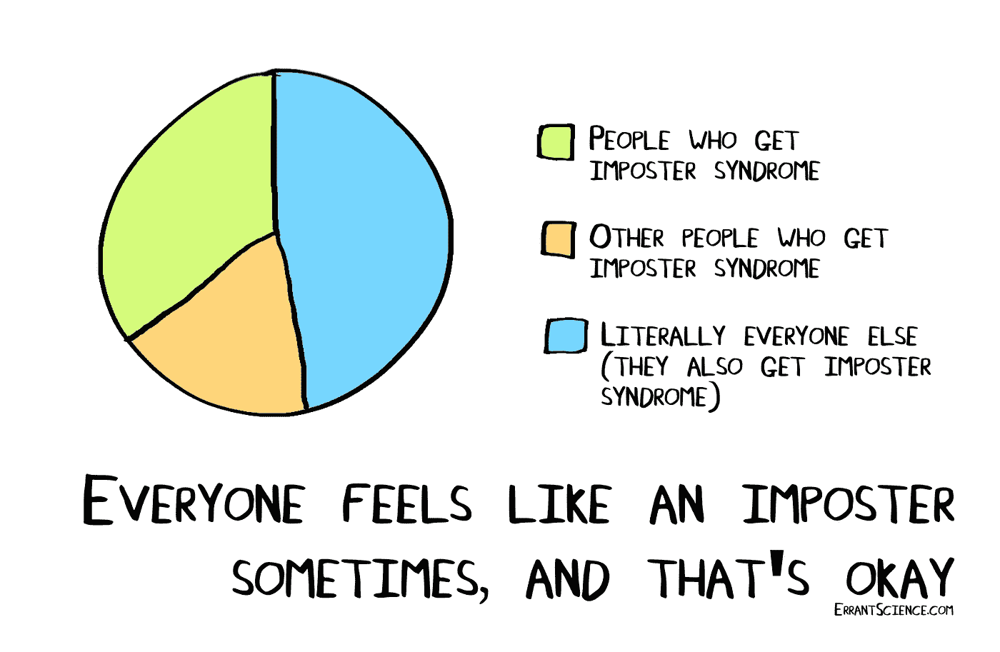

# 最大化你的潜力——如何应对冒名顶替综合症

> 原文：<https://betterprogramming.pub/maximizing-your-potential-how-to-deal-with-imposter-syndrome-cf82c06f140f>

## 每个人都有冒名顶替综合症，这没什么

图片来自[ErrantScience.com](https://errantscience.com/)——每个人都觉得自己像个骗子！

你有没有觉得自己不够好，无法胜任自己被聘用的工作？或者你能有今天完全是因为运气？感觉自己不够是每个人都熟悉的普遍经历。如果你发现有人在某个时候没有这种感觉，他们要么很快就会经历，要么在撒谎。

尤其是在科技行业，冒名顶替综合症是一个你会经常听到的术语。对我来说，作为一名计算机科学领域的女性，我过去常常怀疑自己的成就，把自己的成功淡化为团队的胜利，或者仅仅归功于我得到的帮助……但这很正常。没有人指望你独自一人取得成功。

“冒名顶替综合症”的正式定义是“一种错误的、有时是致命的信念，认为一个人的成功是运气或欺诈的产物，而不是技能”([韦氏词典](https://www.merriam-webster.com/words-at-play/what-is-impostor-syndrome))。虽然有这种感觉很正常，但事实是冒名顶替综合症只会阻碍你实现你的*能力。*

那么，如果冒名顶替综合症是一个如此普遍的问题，我们如何克服它呢？这里有四个建议可以让你不再觉得自己是个骗子。

# 弄清楚你是怎么来的

将自己从冒名顶替综合征的魔爪中解放出来的最重要的一步是首先弄清楚你是如何陷入其中的。是因为面试失败的内在驱动吗？(下面更多关于失败的内容。)有没有同事或者同学跟你说你不够好？不管是什么原因，把它写下来或者在脑子里有一个大概的说法。

现在拿着这句话，描述一下冒名顶替综合症是如何影响你的生活的。例如，这是我的故事:

> “我觉得自己不够格，因为去年我没能通过大量的技术面试。现在我正在寻找新的毕业生职位，每一次失败的面试或拒绝都让我觉得自己不属于科技行业。我一直害怕申请优秀的公司，也推迟了修改简历的时间，因为我知道什么都不会改变。此外，疫情已经把招聘搞砸了。我毕业后永远找不到工作！”

我不会深究我的故事，但希望有一个你能看到的主题:我的怀疑正积极阻止我采取行动，而缺乏行动又会导致自我实现的预言(失业)。

不过，你可以改变你的故事。这一切都始于向机遇敞开心扉，提升自己。

# 数数你的成功

冒名顶替综合症会尽一切可能拖你后腿，试图让你呆在水下。不要陷入消极和停滞不前，从积极的方面开始。

在过去的几年里，你做过哪些令人惊叹的事？这些也不一定只专注于职业。如果是的话，太好了！如果没有，太好了！你在《动物穿越》里建了一个美丽的岛吗？学习如何在隔离期间演奏乐器？创建一个新的辅助项目来帮助跟踪联系人？

通过反思你的成功，你可以开始意识到你*是*完成的和成功的。当你看你的清单时，这些项目有什么共同点吗？有帮助的是找到你天生的优势，并依靠它们前进。

如果在任何时候你开始相信，“*嘿，我毕竟不是那么大的骗子*，”那么恭喜你！你已经成功了一半。

# 创造自我肯定

在我开始创造我自己的自我肯定之前，我认为这是非常俗气和怪异的。我是说，谁会给自己写纸条说自己有多伟大多了不起？(提示:你应该！)

自我肯定很重要，原因有二:

1.  它们会建立你的自信，让你相信自己的天赋，推动你朝着目标前进。
2.  你不需要依赖别人来赞美你或影响你的行为，因为你知道你是谁，你想要什么。

花几分钟记下一些肯定的话，并定期对自己重复。冒名顶替综合症是一种困扰你的日常感觉。为了对抗这种唠叨，代之以对自己和自己能力的爱。

我强烈推荐阅读《吸引力和显化法则》——它与自我肯定背后的力量密切相关，可以给你的生活带来巨大的变化。如果不是为了你，那完全没关系！

# 快速失败

失败并不像看起来那么可怕。我重复一遍——*失败并不像看起来那么可怕*。想想看，成功的人都是失败的。大多数人都是这样到达现在的位置的。他们冒险，如果成功了，就成功了。然而，如果失败了，他们已经学会了。

这是关键。失败导致学习，而不是你职业生涯的结束或其他可能让你相信即将发生的灾难。你失败得越快，你学到的就越多，这给了你超越他人的优势。

当然，前提是你积极关注自己的失败，并从中吸取教训。九次撞上砖墙，然后期待第十次奇迹般地成功…嗯…不会。然而，面试失败可能会告诉你，也许那家公司并不那么适合你。或者面试官可能已经给了你可以利用的反馈。

# 关于恐惧的笔记

恐惧和失败是紧密相连的。我们很多人害怕冒险，因为我们害怕失败后会发生什么。去吧，好好想想。如果你被那家公司拒绝，最坏的情况是什么？

可以明年再重新申请；同时提高你的技能，继续你的生活。

用 10-10-10 的眼光思考恐惧。10 天后还重要吗？10 个月？10 年？如果其中任何一个答案是否定的，那就去做吧。

# 总结想法

这是我用来对抗我的冒名顶替综合症的四种主要方法。这并不是说我脑子里没有偶尔的一两个疑问，但我对自己成功和找到好机会的能力一点也不紧张、担心或焦虑。

我知道你面前有一条美好的路。认真对待你的冒名顶替综合症，你也会意识到自己的价值。