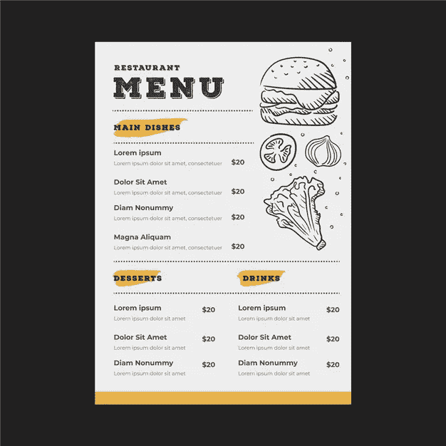
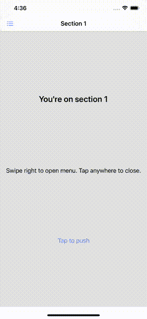

# 我可以看看 SwiftUI 菜单吗？

> 原文：<https://betterprogramming.pub/may-i-see-the-swiftui-menu-please-b9d40246c2f5>

## 在 SwiftUI 中实现菜单导航



# 介绍

移动应用程序开发中最常见的导航模式之一是菜单导航。

虽然这种模式在亚马逊或 Gmail 等许多应用程序中广泛使用，但苹果从未提供内置的方式来实现这种导航。

回到“旧时代”，当用 UIKit 设计应用程序时， [SWRevealViewController](https://github.com/John-Lluch/SWRevealViewController) 实现这种模式就派上了用场。在本教程中，我们将看到如何使用 SwiftUI 轻松实现相同的效果。

# 我们的目标

我们的目标是实现一个可重用的菜单，它将从左向右滑动，并显示一个可点击的项目列表。列表中的每一行和显示的内容都可以是任意的`View`，这意味着菜单必须支持通用类型。

你可以在我的[回购](https://github.com/fermoya/CustomNavigations)里找到最终实现。在本教程结束时，您应该会看到这样的内容:


# MenuView

在 SwiftUI 中实现定制视图时，将所有视图写在同一个文件中可能很有诱惑力。

然而，这阻止了视图的重用，并使我们的代码难以阅读。还记得 UIKit 里的**海量`ViewController`吗？大型`View`怎么样？**

**创建一个新文件，并将其命名为`MenuView`。让我们将该结构定义为:**

```
**struct MenuView<Item, Row, Content>: View where Item: Identifiable & Equatable, Row: View, Content: View { // Content here}**
```

**`MenuView`定义了三种通用类型:`Item`、`Row`和`Content`。让我们来看看这些是什么:**

*   **`Item`是填充一个`Row`的数据模型。**
*   **`Row`是为菜单中的特定项目显示的视图。**
*   **`Content`是屏幕上显示的所选菜单索引的视图。**

**对于那些已经熟悉 SwiftUI 的人来说，`Item`和`Row`听起来可能与`List`非常相似。**

**`List`接受一个`Identifiable`项目集合和一个工厂块，为每个项目生成一个`View`。在我们的例子中，`MenuView`将采用两个工厂块来构建列表的行和所选行的内容。**

**`MenuView`只是一个内置的`List`叠加在一个动态内容页面上。**

## **菜单视图依赖项**

**要创建一个`MenuView`，我们需要传递填充行的项目列表以及两个工厂块，以动态注入行和部分的视图。**

**为此，我们可以利用`@ViewBuilder`属性包装器。这将允许我们以一种更“快捷”的方式编写代码，也就是说，以一种更具描述性的方式。**

**看看这些论点:**

*   **`indexSelected`代表当前选中的行。**
*   **`menuItems`保存元素列表，这些元素将对列表的每一行进行建模。从结构定义中记住它们符合`Identifiable`和`Equatable`。**
*   **`menuItemRow`是一个`ViewBuilder`。这个工厂方法将有助于动态构建列表的每一行。**
*   **`menuItemContent`是另一个工厂方法，将用于创建所选部分的内容。**

**至此，我们已经具备了开始实现`MenuView`所需的一切。我们开始工作吧。**

## **履行**

**如前所述，`MenuView`将包含两个视图:**

*   **`revealList`，物品清单。**
*   **`contentView`，查看所选章节或页面。**

**它们都将被堆叠在彼此之上。`MenuView`会保持一个状态，知道`revealList`是否可见；**

```
**@State private var isMenuRevealed: Bool = true**
```

**扩展`MenuView`并声明`revealList`和`contentView`:**

**请注意，我们使用工厂块来构建每一行以及所选行的内容。点击时，每一行都会改变`indexSelected`并隐藏菜单。**

**我们将使用`ZStack`将`revealList`堆叠在`contentView`之上。**

**然而，`revealList`将需要一个偏移量，该偏移量将根据`isMenuRevealed`而变化。如果是真的，它会覆盖整个屏幕。如果为假，它将滑出屏幕。**

**定义一个助手方法来确定`revealList`偏移量:**

```
**private func revealListOffset(_ proxy: GeometryProxy) -> CGPoint {
    CGPoint(x: self.isMenuRevealed ? -proxy.size.width : 0, y: 0)
}**
```

**最后，将`body`定义为:**

## **显示菜单**

**目前，菜单定义了一个状态`isMenuRevealed`来管理`revealList`的偏移。当任何一行被点击时，它被切换到 false，但是我们如何显示菜单呢？**

**此外，我们应该考虑到，当某些事件发生时，任何其他视图也可能想要触发菜单。例如，当点击导航条按钮时。**

**我们来改变一下`isMenuRevealed`的定义。它将不再是一种状态，而是一种约束:**

**这意味着`isMenuRevealed`是双向的，意味着它可以被包含它的视图修改，也可以从它的视图层次结构中的其他视图修改。**

**此时，菜单可以从另一个包含`MenuView`的视图中切换。**

**如果我们添加一个“内置”的方式，通过一个手势来做同样的事情，会怎么样？让我们添加一个拖动手势，以便在用户滑动内容时显示或隐藏菜单。首先，创建一个状态来保存手势偏移值:**

```
**@State private var draggingOffset: CGFloat = 0**
```

**然后，在`ZStack`上加上`DragGesture`:**

**以及如果轻击`contentView`则关闭菜单的`TapGesture`:**

```
**self.contentView
    .onTapGesture (perform: {
        withAnimation {
            self.isMenuRevealed = true
        }
    })**
```

**不要忘记使用`withAnimation`来制作状态变化的动画。**

**注意，我们已经为依赖于`isMenuRevealed`的`draggingOffset`设置了一个阈值。如果菜单是打开的，我们不想一直向右滑动，不是吗？**

**最后，修改方法`revealListOffset`,使其考虑这个偏移量:**

```
**let hiddenOffset = -proxy.size.width + draggingOffset
return CGPoint(x: self.isMenuRevealed ? hiddenOffset : hiddenOffset + proxy.width, y: 0)**
```

## **显示比率**

**到目前为止，`revealList`占据了太多的空间(实际上是整个屏幕)。当揭露出来的时候，它背后的东西并不明显:**

****

**定义一个显示比率将是有用的，以便我们可以选择重叠比率。让我们给我们的初始化程序添加一个新变量`revealRatio`:**

**现在，修改`revealListOffset`并创建一个名为`revealListSize`的新函数:**

**最后，回到主体，使用新创建的函数。用`self.revealListSize(proxy).width`替换`proxy.size.width`。您的视图体现在应该看起来像这样:**

**`MenuView`现已准备上线。我们可以试一试吗？**

## **用例**

**让我们将它付诸实践，看看实现一个菜单有多容易。创建一个新文件，并在其主体中声明一个`MenuView`:**

**很简单，不是吗？通过模块化我们的视图，我们已经设法写出了更整洁的代码，现在我们可以重用。**

**此外，很容易扩展新的功能。选择分隔缝边缘或在不同的分隔缝模式之间进行选择怎么样？**

# **从这里去哪里**

**查看我的[回购](https://github.com/fermoya/CustomNavigations)的全部代码。**