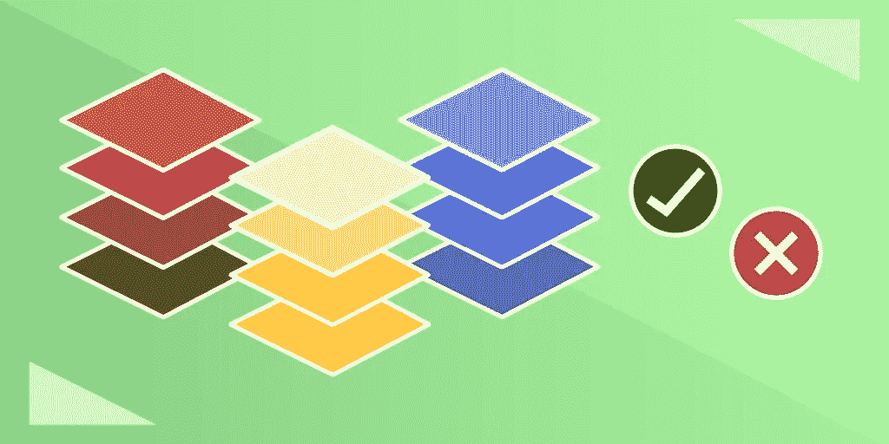

# 平均 vs 灯和超越

> 原文：<https://betterprogramming.pub/mean-vs-lamp-and-beyond-3b2dd4375da3>

## 使用哪种技术组合

图片来源:作者

技术栈，有时也称为 web 栈，是分层技术的集合，每个技术在 web 应用程序开发过程中扮演一个必要的角色。大多数技术栈都有一个用于后端 web 服务器、前端 UI 和数据库的工具。

您在项目开始时对技术堆栈的选择至关重要，因为它定义了您的开发人员将能够使用哪些工具，以及您的应用程序将受益于哪些功能/属性。当前最流行的技术堆栈是均值和灯堆栈。

今天，我们将探讨 MEAN 堆栈、LAMP 堆栈和其他流行选项的优缺点，以确保您为下一个项目选择正确的堆栈。

下面是我们今天要讲的内容:

*   什么是卑鄙？
*   什么是灯？
*   其他顶级技术堆栈
*   选择正确的技术组合
*   包扎

# 什么是卑鄙？

MEAN 是一个开源的、高级的、**基于 Javascript 的栈**，最适合用于构建动态网站和应用。术语*的意思是*是 Valeri Karpov 在 2013 年创造的首字母缩写词，用来描述使用相同的四种工具组合构建的应用程序。这些工具可以很好地协同工作，并为任何均值应用程序提供独特的优势。

MEAN stack 开发的最大优势是所有层都使用 JavaScript，这使得集成不同的组件更容易，并允许全栈软件开发。

平均的层次是

*   [**MongoDB**](https://www.mongodb.com/) :一个 NoSQL 数据库，使用带有模式的二进制 JSON 文档
*   [**express . js**](https://expressjs.com/):node . js 的模块化 web 应用框架
*   [**AngularJS**](https://angularjs.org/) :一个客户端应用框架，用于构建与业务逻辑分离的最终用户界面。这也可以用类似的流行前端框架如 React 或 Vue 来代替。
*   [**Node.js**](https://nodejs.org/en/) :一个应用程序运行时环境，代表了 MEAN 所熟知的“JavaScript 无处不在”范例。Node.js 是 MEAN stack 必不可少的组件，不可替代。

MEAN 最适合小型团队或初创公司开发的云原生现代 web 应用。由于其可伸缩性、测试和部署功能，MongoDB 允许您轻松创建云原生应用程序。此外，AngularJS 是从快速加载优化创建单页应用程序(spa)的理想选择。你甚至可以使用 Express 开发跨平台的移动应用。

MEAN 的单语言 JavaScript 设置允许较小的项目团队做更多的事情。对于其他栈，您需要多个具有不同编程语言技能的程序员来构建一个完整的应用程序。这会分裂您的团队，并限制应用程序的开发速度。

团队可以更快地创建普通的应用程序，因为每个 JavaScript 开发人员都可以作为全栈开发人员，并在每个应用层做出贡献。

一些顶级公司，如网飞、Paypal、天气频道和 Forbes 都在他们的应用程序中采用了 MEAN 组件。随着越来越多的公司过渡到全栈开发团队和云原生 web 应用程序，MEAN 的受欢迎程度预计只会增加。

## 中庸的利弊

**优点**

*   MEAN 中的所有工具都使用 JavaScript，允许全栈开发。
*   所有工具都是开源的。
*   MongoDB 允许您轻松开发、测试和部署云应用程序。
*   包括用于演示和实时更新的 web 应用程序表示层。
*   水疗中心的卓越性能。
*   可在任何操作系统上使用(不要求特定的操作系统)。

**缺点**

*   难以在现有架构中采用，因为一些旧的应用程序不使用 JavaScript。
*   在繁重的工作流程中有丢失数据的风险，不适合大型应用程序。
*   维护可能是一件麻烦的事情，因为每项技术都需要频繁的更新和更改。

# 什么是灯？

LAMP 是全球**最受欢迎的技术平台**，旨在构建不依赖外部软件或数据的应用。LAMP 是最成熟的技术堆栈，自 1998 年由迈克尔·昆策创建以来一直在使用。它作为第一个开源技术栈获得了广泛的欢迎，甚至在今天的企业或长期应用程序中仍然很受欢迎。

LAMP 的主要优势是它的成熟和广泛普及。作为 web 技术栈的长期领导者，LAMP 技术是任何新工具的必备兼容性。LAMP 使用 PHP 和 MySQL 数据库，这是众所周知的，并得到大多数主机提供商的支持。

由于大量的时间和用户将堆栈的各个部分适应于专门的任务，堆栈也变得特别可定制。简而言之，当前的 web 应用程序工具包是为 LAMP 量身定制的。

灯的层是

*   [**Linux**](https://www.linux.org/) :一个开源的、类似 Unix 的操作系统，由一个围绕 Linux 内核的包管理系统组成。
*   [**Apache web 服务器**](https://httpd.apache.org/) :一个非常受欢迎的全功能 web 服务器，被 54%的网站使用。
*   [**MySQL**](https://www.mysql.com/) :为大规模使用而构建的多线程 SQL 关系数据库管理系统。最近，一些公司选择使用 PostgreSQL 甚至 NoSQL 非关系数据库，如 MongoDB。
*   [**PHP**](https://www.php.net/) :专为 web 开发设计的服务器端脚本语言。根据其他工具的兼容性或开发人员的需要，这可以用 Perl 或 Python 来代替。

LAMP 主要用于需要最大化正常运行时间的大规模企业应用。LAMP 的非阻塞结构使它们即使在较高的工作负载下也能保持响应。

它是一个支持良好的堆栈，具有许多已经开发的设置、模块、库和附件，使您的公司可以定制每项技术以满足其需求。例如，您可以通过在多个 web 或数据库服务器之间进行负载平衡来进一步提高其可用性。这些高可用性设置包括冗余层，以确保始终有足够的资源为用户服务。

最后，所有操作都是服务器端的，不依赖客户端资源。这意味着您可以将 LAMP 应用程序分发给广泛的用户，并相信每个用户都有相似的体验。

LAMP 被世界上许多大公司使用，包括脸书、WordPress、维基百科、Slack 和 Tumblr。虽然 LAMP 目前占据市场多数，但许多专家认为，随着 MEAN 和其他堆栈的继续发展，LAMP 将被逐步淘汰。

LAMP 本质上已经成为技术堆栈中的顶级产品，但新的应用程序通常选择 MEAN 来更好地支持现代功能，如云托管。

## 灯的利与弊

**优点**

*   对堆栈中每项技术的广泛支持。
*   成熟的堆栈，有大量以前的解决方案和定制可供借鉴。
*   非阻塞结构使其易于扩展，开发速度更快。
*   LAMP 是完全开源的。
*   PHP 和 MySQL 很容易学习和使用。

**缺点**

*   仅限于 Linux 操作系统。
*   难以在后端和前端工具之间切换。
*   不能很好地与云集成。
*   预计随着时间的推移，由于 JavaScript 和云的流行，使用将会减少。

# 其他顶级技术堆栈

虽然 MEAN 和 LAMP 是目前市场上的顶级技术堆栈，但还有许多其他堆栈可用于利基情况和解决方案。其中一些只是两个更大堆栈的变体，而另一些则是市场上的创新新玩家。

让我们快速浏览一下这些荣誉奖。

## MERN

MERN 堆栈是均值的一种变体，它用 React 代替了 Angular。

React 使用虚拟 DOM 来简化 UI 更改，并针对高反应性的单页面应用程序进行了优化。React 还使用 JSX 来支持灵活的组件操作。React 最大的缺点是，作为一个库，它缺少基本状态的特性，而不是一个全功能的框架。

用 React 替换 Angular 本质上是牺牲了易用性和灵活性的特性。

**优势**

*   在不牺牲全栈开发能力的情况下，提高易用性。
*   针对水疗而优化。
*   React 开发者比 Angular 开发者多。

**劣势**

*   牺牲一些功能而没有完整的框架。
*   填补某些缺失功能所需的模块。

**用例**

您希望在尽可能短的时间内构建一个简单到中级的单页面应用程序，或者您的团队已经熟悉 React。

## 梅文

与 MERN 类似，MEVN 用 [Vue.js](https://vuejs.org/) 替换 Angular。

Vue 是一个不被看好的框架，它提供了一个极简的、性能驱动的方法。它比 Angular 或 React 更轻便，并且具有开箱即用的所有主要功能。Vue 还可以通过第三方服务进行扩展，以满足您的特定需求。Vue 最大的缺点是使用不广泛，可能没有 React 或 Angular 所享有的社区或集成支持。

Vue 本质上是一个准系统框架，牺牲了一些花哨的功能和一些控制，以尽可能快速和容易地设置。

**优点**

*   性能比 React 和 Angular 更快
*   准备好开箱即用。
*   由于使用简单，性价比高。

**缺点**

*   缺乏资源，是三个框架中最不受欢迎的。
*   相当新，意味着你必须经常更新。

**用例**

您希望获得最佳性能，并且不打算添加任何花哨的应用程序功能。

## Ruby on Rails (RoR)

Ruby on Rails 是一个开发人员友好的技术堆栈，用自以为是的 Ruby 编程语言构建。Ruby on Rails 的独特之处在于，它在一个包中包含了标准技术栈的所有工具。它还完全集成了 HTML、CSS 和 JavaScript。

由于强制性的最佳实践和内置的默认结构，RoR 旨在使您的 web 开发人员尽可能容易地构建新的应用程序。它还提供了改进的性能，因为所有工具都无缝集成，使用户界面易于操作。

**优点**

*   使用默认结构快速启动新应用程序。
*   强大的缺陷检测系统。
*   轻量级。

**缺点**

*   不是很能定制。
*   相当罕见。

**用例**

你想尽可能快地生成一个可靠的 web 应用程序，并且不需要它太复杂。

## 无服务器

云计算的兴起导致许多公司从管理自己的应用基础设施转向构建云原生无服务器应用。这些无服务器应用程序允许云提供商，如 AWS 或 Azure，以符合贵公司规模的价格处理所有服务和工具。

无服务器应用程序非常适合扩展以满足需求，并且它们可以处理任何维护。不利的一面是，您对正在使用的技术没有太多的控制权，因为您将被开箱即用的功能所束缚。

**优势**

*   对于小型企业和初创公司来说，性价比很高。
*   无需管理或维护您自己的技术。

**劣势**

*   对堆栈中的技术控制较少。
*   规模成本将使其在超过一定规模后失效。

**用例**

你是一家小型创业公司，无力雇佣一个完整的团队来管理你的应用程序的技术堆栈，而宁愿花钱请别人来做这件事。

# 选择正确的技术组合

MEAN 或者 LAMP 最适合大部分项目，但是怎么选呢？

两者都有权衡，所以考虑什么因素对您的特定项目最重要是很重要的。

**你会想考虑**

*   会是什么类型的 app？基于云、混合等。？
*   该应用程序的预期生命周期是多长？
*   我的客户的基础架构中有哪些技术可用？会标准化还是多样化？
*   您的应用程序需要处理多少流量？交通流量是峰值还是稳定流量？
*   您的应用程序的动态性如何？会实时更新吗？
*   你的团队需要做多少再培训？
*   您想给应用程序分配多少维护费用？

一般来说，MEAN 更适合小规模的现代应用程序，比如渐进式 web 应用程序、基于云的应用程序或单页面应用程序。LAMP 更适合优先考虑正常运行时间和可用性的大型应用程序。

最重要的一点要考虑的是一辈子。LAMP 非常成熟和稳定，但预计将被 MEAN 提供的现代功能淘汰。

现在选择在 LAMP 上创建一个新的应用程序意味着你现在会有一个好的应用程序，但是将来可能需要完全迁移。

现在选择 MEAN 将意味着它将更难维护，您将拥有更少的经过时间考验的解决方案，但您将拥有顶级的现代功能来为未来做准备。

## **的意思是**

**应用类型**:现代应用类型，如云、混合、PWAs 或 SPAs。

**生命周期:**长生命周期，为未来构建应用程序意味着支持。

**流量:**一致的中低流量，无需冗余。

**客户端或服务器端:**客户端渲染。

**动态或静态:** JavaScript 允许事件驱动的应用程序进行实时更新。

**培训:**只需要学习 JavaScript。

**维护:**高维护，支持各工具的频繁更新。

## **灯**

**App 类型:**多页面应用。

**寿命:**寿命短；您设计的这个应用程序只能在现在和不久的将来工作。

**流量:**高峰时段大尖峰高流量。

**客户端或服务器端:**服务器端；您不想依赖客户端基础架构来获得良好的体验。

**动态还是静态:**app 是静态应用，不需要实时更新。

培训:团队需要学习多种工具，但是 PHP 和 MySQL 很容易掌握。

**维护:**低维护，生态系统稳定。

# 包扎

为您的项目选择合适的技术组合是一个重大选择。根据今天学到的信息，你将能够做出适合你的团队和公司的最佳选择。您的下一步是学习更多关于 web 架构的知识，以熟悉下一个项目的所有可用选项。

快乐学习！