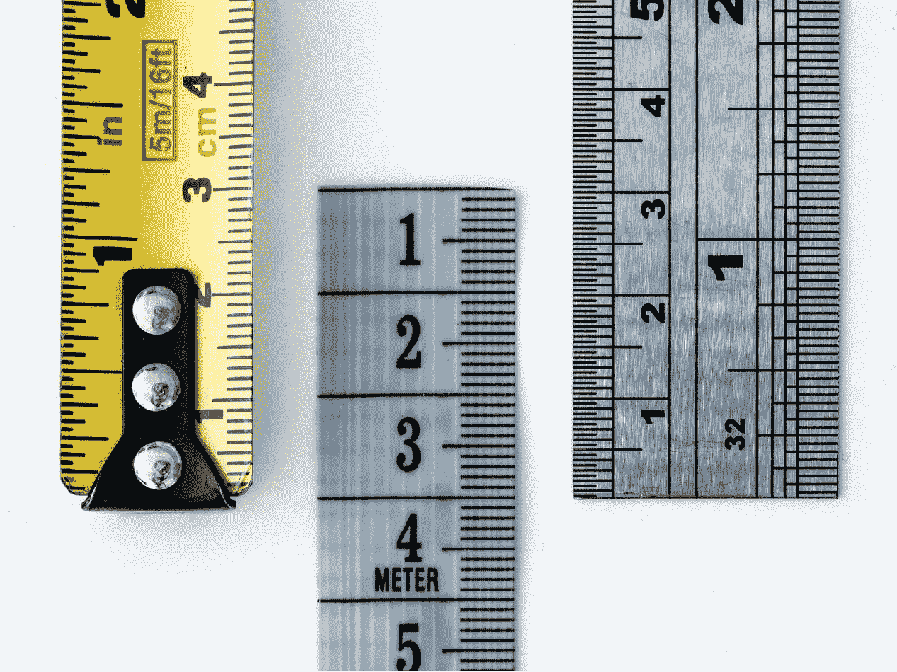

# 简化 Swift 中的测量

> 原文：<https://betterprogramming.pub/measurement-in-swift-simplified-30207fd8282c>

## 快速简单的实施



图片来自 [unsplash](https://unsplash.com/photos/WahfNoqbYnM) 的 [William Warby](https://unsplash.com/@wwarby) 。

我一直喜欢使用显式`Measurement`值(量值和单位)的想法，但我通常发现它们在实际代码中很麻烦。

有几个解决方案，但我发现它们不尽人意。

因此，经过一些研究和思考，我发现下面的语法是一个理想的语法，它很好地支持 Xcode 中任何类型的`Dimension`的可用单元的自动完成。

```
let m: Mass = 123(.kilograms) // => 123.0 kg
let m2: Mass = 123(.kilograms) + 17(.stones) // => 230.95493 kg
m2.converted(to: .pounds) // 509.1688786398349 lb
```

经过一点思考和实验，我能够非常简洁地实现它:

```
public typealias Mass = Measurement<UnitMass>
​
public extension Double { 
  func callAsFunction <U: Dimension>(_ units: U) -> Measurement<U> {
       Measurement(value: self, unit: units)
  }
}
​
public extension Int {
  func callAsFunction <U: Dimension>(_ units: U) -> Measurement<U> {
       Measurement(value: Double(self), unit: units)
  }
}
```

为隐式单位化零值添加一个小扩展:

```
// Example
let z: Mass = .zero
​
// Using
public extension Measurement where UnitType: Dimension {
   static var zero: Measurement<UnitType> {
       Measurement(value: 0, unit: UnitType.baseUnit())
   }
}
```

通过在`Double`和`Int`扩展中使用泛型，我们可以轻松地包含任何其他的`Measurement`和`Units`，而不需要编写额外的繁琐的样板代码。

```
public typealias Duration = Measurement<UnitDuration>
public typealias Angle = Measurement<UnitAngle>
public typealias Length = Measurement<UnitLength>
public typealias Speed = Measurement<UnitSpeed>
```

如果您发现自己想要或需要某个特定`Dimension`的额外单元，可以轻松添加为扩展单元:

```
// As an example
extension UnitDuration {

   static let SecondsPerDay: Double = 86_400

   static let days = UnitDuration(symbol: "days", 
     converter: UnitConverterLinear(coefficient: SecondsPerDay))
​
   static let weeks = UnitDuration(symbol: "weeks",
     converter: UnitConverterLinear(coefficient: SecondsPerDay * 7))
​
   static let months = UnitDuration(symbol: "months",
    converter: UnitConverterLinear(coefficient: SecondsPerDay * 30))
​
   static let years = UnitDuration(symbol: "years",
   converter: UnitConverterLinear(coefficient: SecondsPerDay * 365))
}
```

如果这是有用的，看一看[这里](https://gist.github.com/wildthink/4b63ab16250f17d04b85309b5338b479)的完整代码以及一些其他有用的补充。

如果你有兴趣了解更多关于单位和度量以及如何创建你自己的自定义单位和度量，我推荐以下内容。

*   [苹果:单位和测量](https://developer.apple.com/documentation/foundation/units_and_measurement)
*   [Swift 中的单位和测量](/unit-and-measurement-in-swift-7c6be4a25586)