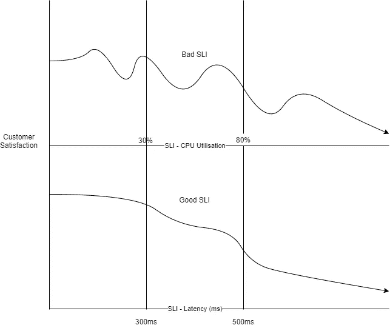
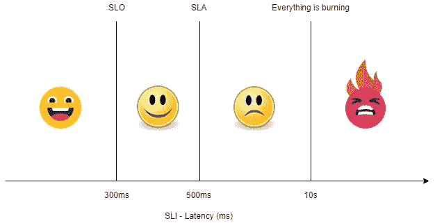

# 测量站点可靠性

> 原文：<https://betterprogramming.pub/measuring-site-reliability-9745617d206c>

## 揭秘 SLO、SLI、SLA 和错误预算

克里斯·利维拉尼在 [Unsplash](https://unsplash.com?utm_source=medium&utm_medium=referral) 上的照片。

我们都经历过开发团队和运营团队有不同的目标、规则和优先级的开发和运营世界。大多数时候，他们互相反对，因为一方的利益就是另一方的问题。

现在我们有了 DevOps。用 Andrew Shafer 和 Patrick Debois 的话说，它是“一种软件工程文化和实践，旨在统一软件开发和软件操作。”

现场可靠性工程通过培养共享所有权、应用相同的工具和技术来实现 DevOps，在接受失败的同时决不会以相同的方式失败两次。主要的焦点是在不影响交付速度的情况下构建和运行一个可靠的应用程序——这是两个截然相反的事情(即“更快地开发更好的软件”)。

现场可靠性工程师(sre)测量一切，定义并同意可测量的指标，以确保他们朝着可测量的目标努力。例如，说网站运行缓慢是一个模糊的说法，因为它在工程上没有任何意义。但是说第 95 百分位的响应时间超过 SLO 10%是完全有道理的。他们还随着时间的推移测量重复性任务(称为辛劳)，并寻求自动化它们以避免精疲力竭。

SREs 涉及三个主要的可靠性参数，我们将逐一对它们进行分类。它们是可用性定义(SLO)、可用性指标(SLI)和不可用性后果(SLA)

# 服务水平指标(SLI)

服务水平指标，或 SLIs，是可靠性的可量化度量。根据谷歌的说法，它们是“对所提供的服务水平的某个方面的一种精心定义的量化衡量。”一些常见的例子可以是请求延迟、失败率、数据吞吐量等。sli 是特定于用户旅程的，它们因应用程序而异。用户旅程是用户为实现特定目标而执行的一系列活动。例如，用户进行银行转帐的过程可以是添加收款人并进行资金转帐。

作为 SRE 的最初支持者，谷歌指出了四个黄金信号，你可以在大多数用户的旅程中监测到它们:

*   潜伏
*   错误
*   交通
*   浸透

延迟是您的服务响应用户请求所需的时间，错误是失败请求的百分比，流量是针对您的服务的需求，饱和度衡量您的基础架构组件的利用率。

获取服务水平指标的方法有很多种，但 Google 推荐的一种方法是获取好事件与有效事件的比值:SLI =好事件* 100 /有效事件。

所以 100 的 SLI 意味着一切正常，0 意味着一切都坏了。

一个好的 SLI 与用户体验直接相关。例如，如果 SLI 指示较低的值，它也应该降低客户满意度。如果不是这样，那么 SLI 就不好，甚至不值得衡量。

作者照片。

如果您没有太多的 sli 需要测量，那将是最好的。太多的 sli 会让团队混乱，引发太多的误报。最好坚持与客户满意度直接相关的四个或五个指标，因此，虽然您可能希望度量应用程序的 CPU 和内存使用情况，但度量 SLI 的更好指标是请求延迟和错误率。

对用户旅程进行优先排序至关重要，对影响客户较多的旅程给予更多价值，对影响客户较少的旅程给予较少价值。例如，您的银行应用程序中的资金转移过程将比配置文件更新更重要。

# 服务水平目标(SLO)

谷歌写道服务水平目标，或 SLO，“为你的服务可靠性指定一个目标水平。”他们定义了你应该达到多少百分比的 SLI 才能认为你的网站是可靠的。SLO 是通过组合一个或多个 sli 创建的。

例如，如果您有一个 SLI，要求在最后 15 分钟内请求延迟少于 500 毫秒，且百分比为 95%，则 SLO 需要 SLI 在 99%的时间内满足 99%的 SLO。

虽然所有组织都努力实现 100%的可靠性，但拥有 100%的 SLO 并不是一个好目标。100% SLO 的系统成本高昂，技术上更加复杂，而且大多数应用程序不需要 100%的 SLO 就能被用户接受。

此外，100%可靠的应用程序不会为新功能留出空间，因为每个新功能都有可能破坏现有的服务。您总是需要在 SLO 中为定义的错误留出一些空间。

SLO 是团队与其内部利益相关者(如开发人员、产品经理、sre 和 CTO)达成一致的内部目标。他们需要整个组织的认同。不符合 SLO 没有明确或隐含的后果。

例如，如果您没有遇到 SLO，客户不能要求赔偿损失，但是您的组织领导可能会不高兴。这并不意味着达不到 SLO 目标就不会有后果。不满足 SLO 意味着更少的变化和更少的功能开发。这也可能表明质量的下降，因此更加关注开发和测试功能。

SLO 需要切合实际，团队应该努力满足它们。SLO 应该与客户体验相结合，您应该以这样一种方式定义它们，即如果服务在 SLO 内，客户不会感觉到服务质量有任何问题。如果事情比定义的 SLO 更糟，他们可能会影响客户体验，但不会影响到他们开始增加支持票的程度。

一些组织有两个 SLO:可实现的和有抱负的。虽然可实现的 SLO 是整个团队都应该达到的目标，但是有抱负的目标是团队应该努力实现的，并且是持续改进过程的一部分。

# 服务水平协议

正如 Google 所指出的,[服务水平协议(SLA)是“与你的用户的明确或隐含的合同，包括满足(或错过)它们所包含的服务水平协议的后果。”](https://landing.google.com/sre/sre-book/chapters/service-level-objectives/#)

它们更加正式，是与客户达成的业务级协议，说明如果组织不满足 SLA 将会发生什么。它们可以是显式的，也可以是隐式的。明确的 SLA 是对不满足设定的可靠性有定义的后果(主要是在服务信用方面)的 SLA。隐式 SLA 是根据企业和客户跳槽的声誉损失来衡量的。

SLA 被设置为刚好足以避免客户跳槽的级别，因此，SLA 往往实现比 SLO 更低的 SLI 值。例如，如果我们考虑请求延迟 SLI，我们可以将 SLO 定义为 SLI 的 300 毫秒值，将 SLA 定义为 500 毫秒值。这是因为 SLO 是内部的可靠性目标，而 SLA 是外部的。如果团队努力实现 SLO，您就自动满足 SLA，但是您也想保护您的组织以防他们失败。

作者照片。

# 误差预算

根据 Liz Fong-Jones 和 Seth Vargo 的说法，错误预算是“产品和 SRE 团队之间共享的一种量化度量，以平衡创新和稳定性。”

简而言之，它是对引入新功能、停止服务进行维护、例行改进、网络和基础设施中断以及不可预见的情况所能承受的风险的衡量。通常，监控服务测量您的服务正常运行时间，而 SLO 定义您需要实现的目标。误差预算是两者之间的差额，也是在误差预算允许的情况下，你推出新版本所需的时间。

这就是为什么我们一开始没有一个 100%的 SLO。错误预算有助于团队平衡创新和可靠性，我们需要错误预算的原因是 SRE 认为失败是不可避免的，也是可以预料的。因此，每当您对产品进行新的更改时，您都要冒一些中断服务的风险。因此，更高的误差预算允许你推送更多的功能(误差预算= 100% — SLO)。

例如，如果你的 SLO 是 99%，误差预算是 1%。如果我们将它乘以 30 天/月* 24 小时/天，则每月会有 7.2 小时的误差预算。这是你可以花在保养上的时间。对于 99.9%，该值为 43.2 分钟。对于 99.99%，是每月 4.32 分钟。

这些是实际的停机时间，但是如果您有冗余服务，并且您计划了高可用性和灾难恢复，则有可能进一步提高这个数字，因为当您修补一台服务器时，服务仍然是活动的。

# 结论

现在，您已经了解了这些术语的含义以及它们对您的 SRE 之旅有何帮助，请放心将这些原则应用到您的组织中。寻找如何利用它们为客户和组织的利益相关者提供更好的体验。

感谢阅读。我希望你喜欢这篇文章。