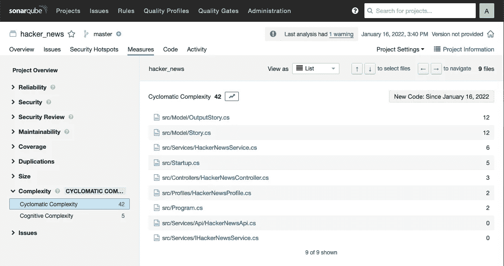
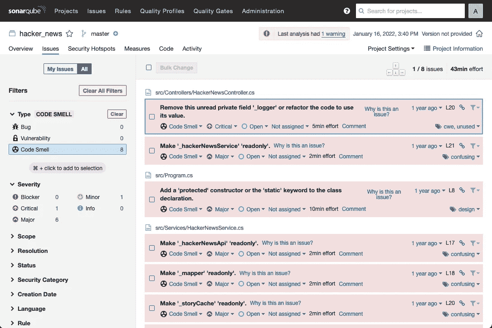

# 你的软件质量水平好吗？

> 原文：<https://betterprogramming.pub/measuring-software-quality-36485025eaf9>

## 如何度量软件质量

图片来自 Pexels

不管你的答案是什么，如果我请你证明你的观点，并解释你是如何做到这一点的，你会怎么说。

如果我继续问其他问题呢:

其他人也像你一样思考吗？你在考虑什么样的标准？
其他项目怎么样，它们使用相同的标准吗？

这些问题可以根据不同的人来回答，开发人员、项目经理、测试人员、质量保证分析师、利益相关者和其他人，可以有不同的思维方式。

人们认为应用程序质量差的原因有很多，可能是因为它没有遵循最佳实践，没有遵循 SOLID，或者没有正确使用面向对象，或者没有以端到端的方式进行测试，等等。

另一方面，人们可以因为一千个不同的原因认为一个应用程序质量好。

因此，首先，我们需要了解什么是质量，您对我们的应用程序有什么期望，然后验证应用程序是否具有良好的质量水平

有许多定义质量的标准，因此为您的项目选择合适的标准是准确了解期望的质量水平以及需要做什么来实现它的关键。

像 Sonarqube 或 Kubernetes 这样的工具可以很容易地自动提供指标，但是对于其他指标，我们通常可以找到收集它们的技术

在下一节中，我将重点介绍一些度量标准，并简要介绍如何使用它们。

## 代码覆盖率

代码覆盖率有助于开发人员思考如何编写更好的代码，也有助于确定重构是否会破坏系统的任何部分，并确保开发人员在编码时考虑测试用例场景。

## 圈复杂度

它表示代码可以遵循的逻辑路径的数量，因此在这种情况下，数字越小越好，通常，您必须避免它大于 10。要进行测量，您可以将高于 10 的分数相加，并计算应用程序的过度复杂性。

圈复杂度

## 重复代码

重复的代码可以是单行代码、完整的方法、类或文件，我们可以根据代码行总数的百分比来衡量它。

## 代码气味

它是通用编程语言工具提供的语法分析的结果，通常指出代码可以改进的地方，检测性能问题和不安全的语句。

代码气味来自语法分析

技术借方

## 错误和失败

它是应用程序在一段时间内产生故障或错误的次数，可能是错误响应、崩溃、pod 重启，日志可用于生成报告，或者我们可以使用监控工具。

## 内存消耗

了解您的应用程序消耗多少内存是很容易的，因为我们可以使用工具进行监控。困难的是了解消耗的内存是好是坏，没有一个值对所有系统都有意义，因此我们可以做的是比较类似的应用程序，以查看它们之间是否有很大的差异。

## 表演

它衡量您的系统对用户请求或特定操作的响应速度，我们可以计算应用程序每个部分、不同端点或服务的平均值。

也有跟踪内部方法和调用的工具，但是它们通常不容易实现或保存。

其他指标不太容易自动收集，但它们仍然是可能的，并且可以带来对应用程序的更好理解。

## 努力

这个度量标准可能是非常主观的，因为有许多方法来度量工作，每个团队可能有自己的方法，但是不管使用什么方法，它都是一个很好的度量标准。你可以使用完成新功能和修复错误的平均时间，团队评估，或者开发人员提供的难度级别。

## 报告的错误

即使我们可以测量失败的数量，我们也可以测量测试人员或涉众发现的未完成的标签和问题的数量，一般来说，这些 bug 更严重，必须尽快修复。

像吉拉这样的工具提供了搜索错误和问题的界面，并允许生成报告和图表。

## 客户满意度

这也是一个主观的衡量标准，因为每个客户对满意度都有不同的定义，但是我们可以精心设计调查来更好地了解客户的满意度。

Microsoft forms 可用于创建调查并将其分发给您的客户，您可以要求他们对应用程序或其特定方面进行评级。

正如我之前提到的，有许多不同的指标，这些是我认为更重要和更容易衡量的指标。

您可以寻找最适合您的应用程序、团队或组织的其他指标，也可以寻找工具或技术来度量这些指标。

就这些了，下次见。