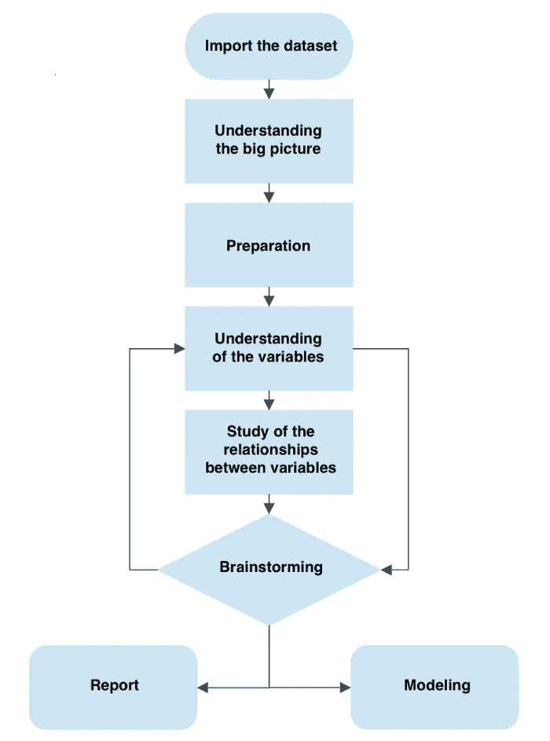
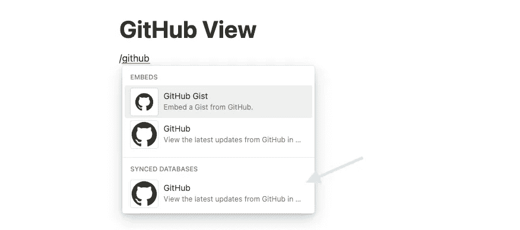

# 使用数据驱动工程测量软件项目的技术健康

> 原文：<https://betterprogramming.pub/measuring-technical-health-of-software-projects-with-data-driven-engineering-f4535271aaa3>

## 使用 GitHub 的 API 从您的存储库中提取一些见解

在 [Unsplash](https://unsplash.com?utm_source=medium&utm_medium=referral) 上由 [Carlos Muza](https://unsplash.com/@kmuza?utm_source=medium&utm_medium=referral) 拍摄的照片

在任何软件项目中，scrum 大师和项目经理都倾向于使用工具来衡量他们团队的表现。有很多，像吉拉，Azure DevOps，甚至一个简单的 Excel 文件。尽管这些工具中的一些比其他的更先进，但是它们都试图完成同样的事情，测量团队和项目的脉搏。拥有同样的东西，但不是为了“技术健康”,不是很酷吗？

> 软件交付的改进对于每个团队和每个公司都是可能的，只要领导层提供一致的支持——包括时间、行动和资源。——Gene Kim 等人在《加速精益软件和 devops 科学的发展，构建和扩展高绩效技术组织》中

我发现自己缺少一些观察项目技术团队如何工作的工具。在你提出一大堆建议之前，让我重新表述一下最后一句话:*我希望有一个带有一些度量标准的工具，帮助我发现团队做得如何，并且不会增加项目的成本。*

在 GitHub 中，我们有 [*Insights*](https://docs.github.com/en/issues/planning-and-tracking-with-projects/viewing-insights-from-your-project/about-insights-for-projects) ，它基本上是从您的存储库的活动中提取的一些关键度量。如果您和我一样，不能完全访问企业订阅提供的所有功能，但您仍然希望摆弄数据，我建议您使用探索性分析方法或 EDA。我个人还在了解中。但是首先，我们需要一些数据来处理。

由安德鲁 D 进行探索性数据分析的过程。

正如您在图像中看到的，一切都从数据集开始。作为回购的所有者或贡献者，我们知道生成的信息，但您可以随时查看文档，以了解您可以使用的数据的更大情况。在本文中，我不会介绍完整的 EDA 过程，但我会给出一些关于创建数据集的提示。

在动手之前，请注意以下几点:

*   API 中的每日查询限制。尽可能提高效率，不要过分限制。你将被卡住，直到极限重置。
*   不要提取你不需要的数据。
*   找到能帮助你了解你的团队表现的关键 KPI。

例如，我认为对一周内合并的减贫战略进行一个小的总结会很好。我发现 scrum 大师在 JIRA 看到的和开发人员实际推动的之间经常有差距。原因可能各不相同，从未跟踪的最后一分钟修复到必须分成几个 PRs 的复杂特性。通过检索这些信息，我希望获得一周进展的简明摘要，并更清楚地了解存储库的实际活动。此外，这些信息可以从其他相关的数据点中获得，比如团队的反应性或者某些特性的迭代次数！

## 构建有意义的数据集

看一下下面的脚本；它展示了如何对我们的 repo 进行身份验证，获取有关 pull 请求的数据，并将响应映射到 CSV 文件。由于我们使用的是 REST API，[过滤仅限于头文件](https://docs.github.com/en/rest/pulls/pulls#list-pull-requests)，所以您可能需要使用 GraphQL 或 jQuery 之类的库进一步过滤结果。

注意，我使用了一个名为`credentials.json`的文件来存储我的用户名和密码，因为我是在本地运行这个脚本的。

这些行上面的表格显示了脚本检索的数据类型的示例，如标题、创建日期、合并日期等。从这里，您可以全身心投入数据操作，或者创建一些易于阅读的仪表板与团队共享。你能想到你的团队可以从中受益的 KPI 吗？

如果你想知道更多关于你应该测量什么的想法，我推荐这本书“*加速精益软件和 DevOps 的科学建立和扩展高绩效的技术组织。”*它帮助我思考关于技术性能的更有意义的方式。

# 其他点击式解决方案

GitHub 在 idea 的连接器。

如果你不想浏览 GitHub API 或者你没有时间，我建议使用类似于[的与 GitHub 的集成。](https://www.notion.so/integrations/github-cdc46cd9-f0e9-48fd-b3aa-18481098e29e)您可以同步存储库的请求，并以表格的形式跟踪问题。它很容易设置，并将提供基本信息，但不要期望能够检索关于操作、工作流或其他更详细活动的信息。

我希望这篇文章有助于激发人们对数据驱动工程以及帮助您改进软件开发生命周期的方法的兴趣。