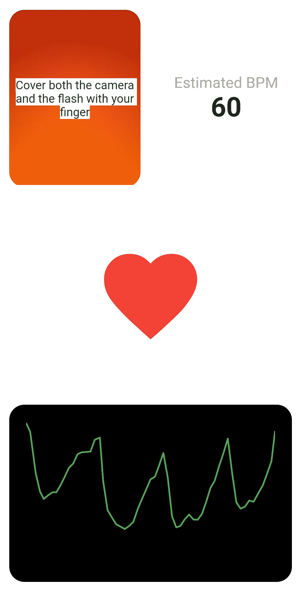
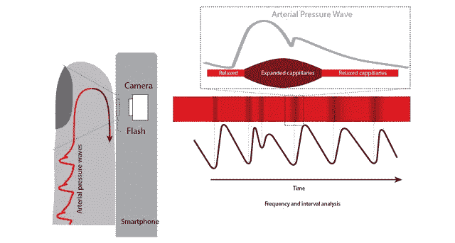
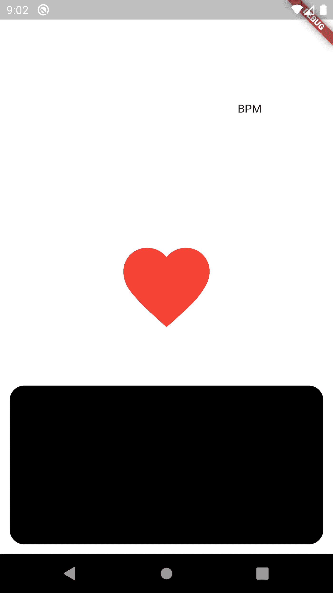
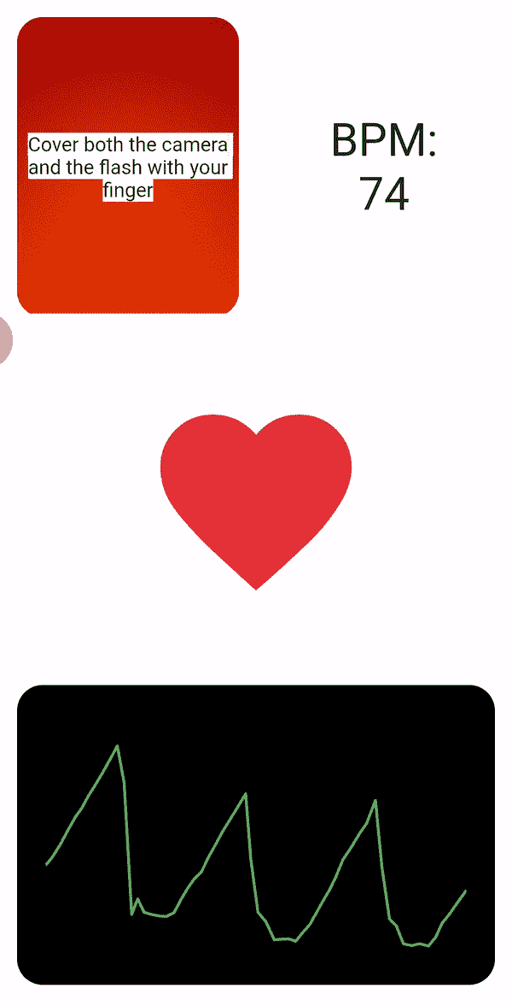

# 用你手机的摄像头测量你的心率

> 原文：<https://betterprogramming.pub/measuring-your-heart-rate-using-your-phones-camera-and-flutter-f444d3c4272a>

## 打造一款无需佩戴任何设备即可工作的移动心率监测器

西蒙·米加吉在 [Unsplash](https://unsplash.com/s/photos/heart?utm_source=unsplash&utm_medium=referral&utm_content=creditCopyText) 上的照片

在本文中，我将解释如何使用 Flutter 开发一个简单的应用程序，仅使用手机的摄像头和闪光灯来测量心率变异性并将其显示在图表中。

应用程序的屏幕截图。

# 概念

你可能见过或知道医院里人们夹在手指上测量心率的设备，或者能够测量你的心率的智能手表。他们都有一个共同点:他们用一种叫做*光电容积描记术的技术来测量心率。*

> **光电容积描记图** ( **PPG** )是光学获得的[容积描记图](https://en.wikipedia.org/wiki/Plethysmograph)，可用于检测组织微血管床中的血容量变化。—维基百科

将光照射到血液灌注组织中，我们可以测量反射光的可变性并提取血流量的变化。众所周知，血流量依赖于心率，所以我们可以利用血流量的变化来计算心率。

范登堡等人。艾尔。(2017).心率应用程序的临床验证:混合方法评估研究。JMIR 移动健康。5.e129。10.2196/m 健康

因此，在我们的应用程序中，我们将使用手机的摄像头照射相机的闪光灯，并测量反射的强度。更具体地说，我们将测量相机图像的所有像素强度的平均值。然后，如果我们盖上相机，用手指一闪，测得的强度会随着血流量的变化而变化。

# 密码

## 属国

首先，我们需要安装依赖项:

*   [**charts _ flutter**](https://pub.dev/packages/charts_flutter)—Dart 原生编写的材料设计数据可视化库。
*   [**wake loc**](https://pub.dev/packages/wakelock)**k**—这个 Flutter 插件允许你在 Android 和 iOS 上启用和切换屏幕唤醒锁，防止屏幕自动关闭。
*   [**camer**](https://pub.dev/packages/camera)**A**——一款适用于 iOS 和 Android 的 Flutter 插件，允许访问设备摄像头。

关于相机包装的说明。由于这个包不允许控制相机的闪光灯，我们需要使用一个目前正在开发中的允许控制闪光灯的版本。我们必须在`pubspec.yaml`文件中指定这一点。

## 应用

我们的应用程序的界面分为三个文件:`main.dart`、`homePage.dart`和`chart.dart`。

`main.dart` **—** 这里我们只需要将`HomePage`小部件设置为我们的主小部件，这样当应用程序运行时它会显示:

`HomePage` —应用程序的核心写在`homePage.dart`文件上，这是我们的`HomePage`小部件。

首先，我们需要创建一个`Scaffold`，并在它的主体中插入一个居中的`IconButton`，它将为读取过程激活或禁用相机。

可以看到，有一个`boolean _toggled` 存储了`iconButton` *的状态。*现在我们只需要定义函数`_toggle` 和`_untoggle` *。*

目前，这些函数只会改变`_toggle` 变量的值:

未切换和切换的*图标按钮*的屏幕截图。

下一步，将屏幕分成三个相等的部分，在一个`Column`中使用三个`Expanded` 小部件:

屏幕分成三个相等的部分。

在底部`Container` 我们显示实时图表，在那里将显示摄像机的数据。这个`Container`还加了一个边距和圆角。

图表容器的屏幕截图。

对于图表小部件，我们将使用包`charts_flutter` *。*文件`chart.dart` 包含一个*无状态小部件*，它显示在一个列表中提供的图表点中。每个点由表示`x`值的`DateTime`值和表示`y` 值的`double`值组成。

关于上面的`Container`，我们希望把它分成两半。在左边一个，将显示`CameraPreview` ，在右半个`Text` 包含每分钟的节拍(BPM)。

`CameraPreview` 小工具需要一个有效的 `*CameraController*` *。所以我们需要在按下心形按钮并切换后初始化控制器。一旦按钮被取消，我们还必须处理控制器:*

现在，我们只需要将这些功能集成到切换按钮的功能中。

我们还应该覆盖 dispose 方法，并在应用程序被释放后释放`CameraController`。

我们不能忘记激活相机的闪光灯，然后启动`ImageStream`，它将提供我们将要处理的图像。函数`_scanImage`会处理它。

功能`_scanImage` 计算摄像机图像红色通道的平均值，并将该值添加到数据列表中，该列表显示在上述图表中。请注意，我们将数据列表的点数限制为 50 个值。

我们不需要处理每一帧，因此，我们可以选择一个采样率。在这个例子中，使用 30 个样本/秒的采样速率。为此，我们有一个布尔值`_processing`，一旦调用`_scanImage` 函数，它就变成`true` ，并保持这种状态 1/30 秒，然后返回 false。只有布尔值`_processing` 为假时，才会执行`_scanImage`功能。

为了更好的实践，我们还应该在每次改变心形按钮的切换状态时将`_processing` 的值设置为 false。

我们现在有了一个应用程序，可以测量血流量的可变性，并将其显示在图表中。现在我们只需要计算心率，即标绘信号的频率。我使用了一个简单的算法来测量窗口数据的平均值和最大值，将阈值设置为这些值的平均值，并检测高于该阈值的峰值。然后，它用衰减系数更新 BPM 值，这样我们就不会有突变。

我们需要做的最后一件事是避免屏幕关闭，同时:

最后，我们有一个测量血容量变异性和估计 BPM 的应用程序。

完整代码:

在我的 GitHub 存储库中，你会注意到我添加了更多的定制和一个动画——模拟跳动的心脏的心形按钮。我没有把它包括在本教程中，因为它不是必需的。

下面是工作应用程序:

测量食指血流量变化的应用。

这个项目的 GitHub 库可以在这里找到:

 [## afonscorposo/ppg

### 使用手机摄像头测量 PPG 的应用程序。使用 Flutter 构建的应用程序，但仅在 Android 上测试。…

github.com](https://github.com/Afonsocraposo/ppg)