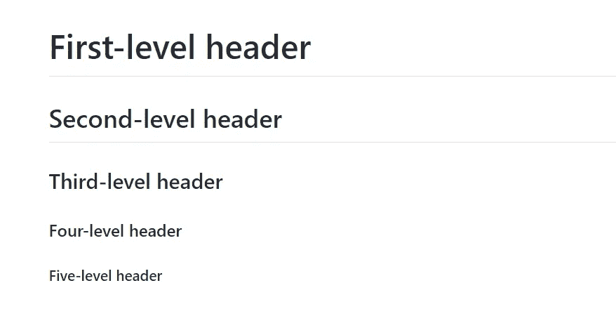
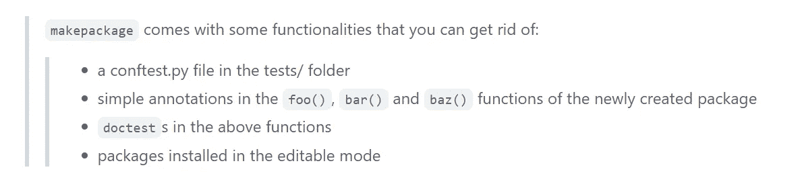
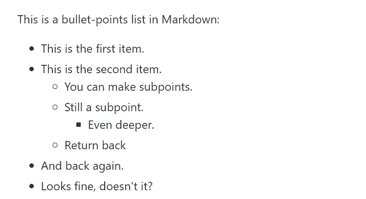
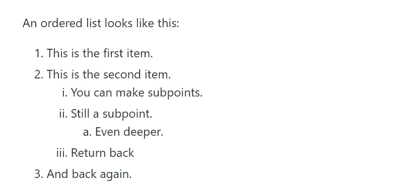

# 面向技术作家的中型故事编辑器，我还会怀念 Markdown 吗？

> 原文：<https://betterprogramming.pub/medium-story-editor-for-technical-writers-and-do-i-still-miss-markdown-3a13ebf38722>

## 技术写作

## 有点剧透:我没有。


照片由[思想目录](https://unsplash.com/@thoughtcatalog?utm_source=medium&utm_medium=referral)在 [Unsplash](https://unsplash.com?utm_source=medium&utm_medium=referral) 上拍摄

大多数程序员不仅写代码，还写关于代码的东西。最重要的是，我们写文档。这类写作有专门的工具，比如 Markdown 和 reStructuredText。这样的工具构成了我们工作的一部分，任何程序员都必须知道如何使用它们；或者，我认为，至少是降价。

Markdown 是一种标记语言，它使技术作者能够用丰富的代码格式编写格式清晰的文本。总的来说，Markdown 语法相当丰富，但它有十几个主要命令和符号，被它的所有变体使用。

但是，Medium 不使用降价。相反，它提供了所谓的[故事编辑器](https://help.medium.com/hc/en-us/articles/215194537-Using-the-story-editor)。它不是一种标记语言，尽管它与一种标记语言相似。从现在开始，我将称它为中型故事编辑器，或 MSE。

MSE 允许代码格式化。直到最近，这些代码读起来一点也不舒服。我想正是因为这个原因，许多作者使用 GitHub gists，因为以这种方式格式化的代码看起来要好得多。Myb 的普遍想法是，我肯定更喜欢直接在 Medium 的语法中使用所有这些，就像我们在 Markdown 中使用的那样。

而且从 2022 年 11 月 10 日开始，我们确实在 MSE 有！Medium 在为许多编程语言中的代码添加本机语法高亮方面做得非常好。这是许多技术作家期待已久的事情，这是一个巨大的游戏改变者。在我看来，这显著改变了技术作者对 MSE 的看法。我将在本文后面写更多关于这方面的内容；我会告诉你这是变得更好，还是变得更坏——或者是不太可能有任何意义的无意义的变化。

在这篇文章中，我讨论了我喜欢什么和我在媒体故事编辑器中错过什么。请不要把我的评论仅仅视为批评。相反，我打算根据减价提供的服务提出一些改进建议。此外，初学技术写作的人可以通过这篇文章来学习一些关于媒体技术写作的知识。

我们必须记住，截至 2022 年，Markdown 已经有 18 年的历史，全球数百万作家和开发者都在使用它，他们代表着不同的学科。在技术写作方面，Markdown 非常受欢迎，可能是因为它便于使用高质量的代码格式。例如，它是在 Git 存储库中创建自述文件的标准(尽管不是唯一的)标记语言；例如，在 [GitHub](https://github.com) 中，它是 READMEs 的默认语言。

我知道，你也应该知道，这将是一个完全主观的评价。因此，你可能不同意我的部分甚至全部评分。我是一名数据科学家和开发人员，所以我的写作需要这样的工具。我用 Markdown 写了很多文档，但是我没有用它写文章；我用媒介写文章。然而，我在 Medium 上写文章所需要的工具和我写文档所需要的工具差不多。因此，我希望这两种工具能提供相似的功能。我不需要丰富的功能。我只需要一些基本元素，这些应该真的很好。

如果你愿意，你可以用这篇文章来创建你自己的 Markdown 附件索引，当你在 Medium Story Editor 中写一篇关于 Markdown 的文章时，你可以根据它来决定你是否错过了 Markdown。

下面，我描述了在技术写作中很重要的媒体标记语言的元素，根据它们的目的进行分组。我将为每个元素分配从`-1`到`1`的点数。这里，

*   `-1` means 指的是一个显著缺失的元素，或者是一个与 Markdown 相比 MSE 很糟糕的元素；
*   `0`表示缺失的元素，或者在 MSE 中工作不太好的元素；和
*   `1`指在 MSE 中完全正常工作的元素。

我还会分配消极和积极的中间点，以便进行中间评估。综合起来，我可以用以下评价:`-1, -.75, -.5, -.25, 0, .25, .5, .75, 1`。不过，也会有一些例外。不太重要的元素将具有较小的权重(因此，例如，它们可以从`.5`中得到`.5`)。

对于一个技术作家来说，代码可能是最重要的方面，值得给予最大的重视。因此，我会给它最高的`2.0`分。

请注意我做的以下决定。在 Medium 上，有一些方法，要使用它们，您需要使用一个外部工具，然后将结果对象嵌入到 Medium 的文章中。我决定不把这样的方法当作媒体的一部分，这样它们甚至会得到负面评价。但是，如果 Medium 提供了一种嵌入这种对象的内置且有效的方法，我可能会添加一些额外的要点。

开始评测吧。

# 标题

虽然 Medium 只提供了两级标题，但我认为这已经足够了。然而，由于使用了粗体和斜体字体，您可以人工添加更多的字体。你可以以`<H1>`和`<H2>`结尾，然后，例如，粗体-斜体，粗体，最后是斜体。

这是标题在渲染减价中的外观:



降价标题。图片作者。

正如你在这篇文章中看到的，中等标题工作得很好。我从来没有遇到过像上面显示的那样需要创建嵌套层次的标题的情况。因此，我给这方面打满分。

```
1.0 Point out of 1.0
Altogether: 1.0/1.0
```

# 字体

你不能在文章中直接改变字体系列或字样，我很怀念这一点。你唯一能做的就是使用粗体和斜体，以及它们的组合。我们可以使用 **B** 和 *I* 这很好，因为它们是字体类型的两个最重要的变化。

文本不能使用颜色。很糟糕吗？我一般不确定，但我自己并不想念它。我绝对不希望看到这种选择被滥用，我担心有些人会滥用它。幸运的是，他们不能。

总的来说，Medium 提供的对我来说很好，但是我怀念在一篇文章中使用不同字体的能力。因此，我给你半分。

```
0.5 Points out of 1.0
Altogether: 1.5/2.0
```

# 超链接

链接正常工作；因此，一个完整的点。

根据记录，在本文中，我使用[文本](https://www.markdownguide.org/cheat-sheet/)作为 Markdown 备忘单，使用[中等文本](https://medium.com/blogging-guide/medium-article-formatting-guide-with-visuals-62a55abc133c)作为中等故事编辑格式。

```
1.0 Point out of 1.0
Altogether: 2.5/3.0
```

# 大宗报价

在 Markdown 中，你可以通过用`>`开始一个段落来创建 blockquotes。您也可以嵌套块引用，通过用`>>`开始下一个段落(即跟随块引用的段落)。下图显示了嵌套的 blockquotes 在渲染的 Markdown 中的外观。



呈现的 Markdown 中的嵌套块引号。来源:[make package Python 包](https://github.com/nyggus/makepackage)自述文件的代码。

在 MSE 中，您还可以使用块引号，这要归功于“在格式框中符号点击一次:


介质的格式化框。来源:在撰写这篇中型文章的过程中制作的截图。

这样，您就有了一个标准的块引用，如下所示:

> 这是一个标准的批量报价。

如果你点击符号两次，你会得到所谓的引用:

> 这是一个引用。

在 Markdown 中，除了引用之外，您还可以将 blockquotes 用于其他目的，例如提供警告或免责声明。这是由于渲染后块引用的外观(见上图)。不过，我不愿意用 MSE 的 blockquotes 来实现这些目标，因为它们看起来像什么。

我更喜欢 Markdown 的 blockquotes 的外观，但在媒体上也很好。引用是另一个优势，这是一件好事。

```
0.75 Points out of 1.0
3.25/4.0
```

# 项目符号和有序列表

在 Medium 上，您可以使用项目符号列表和有序列表。创建它们很容易，但是您没有那么多的定制机会。

我更喜欢减价清单的样子；请看下面的两张图片。



Markdown 的要点列表。图片作者。



来自 Markdown 的有序列表。图片作者。

不幸的是，如果没有一些技巧，你无法在 Medium 上创建嵌套列表。基斯·哈特在他的文章中向[展示了如何做到这一点。我不喜欢我们必须使用诡计来做像要点清单这样简单的事情。](https://chris-hart.medium.com/how-to-make-nested-lists-or-indented-bullet-points-on-medium-f7065e83d4d3)

```
0.25 Points out of 1.0
Altogether: 3.5/5.0
```

# 形象

对我来说，媒介提供了我所需要的一切；因此，一个完整的点。

```
1.0 Points out of 1.0
Altogether: 4.5/6.0
```

# 桌子

遗憾的是，MSE 没有为表提供任何内置方法。你可以使用技巧，正如迈克尔·亨格在他的文章(《饥饿 2017》)中解释的那样。我会给这个`-1`，但是因为 Markdown 的表格也可以更好，我会给它分配`-0.5`。

```
-0.5 Points out of 1.0
Altogether: 4.0/7
```

# 公式

MSE 没有提供编写公式的方法。你需要在外部工具中这样做，然后将公式作为图像嵌入到你的媒体文章中。 [Kiran Achyutuni (2020)](https://medium.com/@kiranachyutuni/how-to-embed-beautiful-math-equations-in-medium-a041a64dd4e3) 提出了这样的方法。我同意以这种方式创建的公式看起来不错，但这不是重点。关键是你不能直接在 Medium 中创建一个公式。创建配方的首选方法可能是使用 LaTeX 的方法。

因此，简单地说，Medium Story Editor 的设计目的不是让用户能够使用公式。然而，本文将 MSE 与 Markdown 进行了比较，Markdown 对于公式来说并没有那么好。于是，`0`分。

```
0.0 Points out of 1.0
Altogether: 4.0/8.0
```

# 密码

我们技术作家写了很多代码。因此，在标记语言中，编写格式良好的代码的能力是必不可少的。不能让你做到这一点的语言是完全不适合技术写作的。

MSE 使您能够格式化和突出显示代码。2022 年 11 月 10 日引入了一个非常大的变化。从此，我们可以在 MSE 中直接使用特定语言的代码高亮显示了！让我们看看它是如何工作的。

您可以编写内联代码、`like here`和代码块，

```
like here
 and here
```

如您所见，代码是以等宽字体打印的，这是其本质。

在 2022 年 11 月 10 日之前，这是你对 MSE 所能做的一切——这让我作为一名技术作家在 Medium 上的生活很痛苦。我用 GitHub gists 代替，但是这需要额外的时间和工作。然而，从那时起，Medium 使您能够使用特定于语言的代码突出显示。这造成了非常非常大的不同。现在，我只是*喜欢*在介质上写代码。

这使得这个日期——2022 年 11 月 10 日——对于媒体上的技术作家来说是一个重要的日子。我们终于可以对相当多的编程语言使用本机语法高亮显示了。因此，记住这个日子！

所以，我终于可以格式化代码了。下面，我将使用一些随机函数或我所使用语言的脚本片段。让我们从 Python 开始:

```
import numbers
from typing import List

def mean(x: List[numbers.Number]) -> numbers.Number:
    return sum(x) / len(x)
```

去吧:

```
package check

import (
 "math"
)

func AllValuesInIntSlice(Slice1, Slice2 []int) bool {
 if len(Slice1) == 0 {
  return true
 }
 if len(Slice2) == 0 {
  return false
 }
 for _, x := range Slice1 {
  if !IsValueInIntSlice(x, Slice2) {
   return false
  }
 }
 return true
}
```

r:

```
library(purrr)
library(dplyr)

map(
  colnames(iris)[1:4],
  function(name) {
    this_data <- 
      iris %>%
      mutate(to_analyze = !!as.name(name))
    lm(to_analyze ~ Species, this_data)
  }
)
```

丙:

```
#include <stdio.h>
#include <unistd.h>
#include <sys/time.h>

int main() {
    gettimeofday(&start, NULL);
    // Here do whatever the main() function is to do
    pipeline(1);
    gettimeofday(&end, NULL);

    double elapsed_time = calculate_elapsed_time(start, end);
    printf("time program took %f seconds to execute\n", elapsed_time);
    print_elapsed_time(start, end);
    return 0;
}
```

甚至巴什:

```
echo Creating pkgWithCLI package with CLI
makepackage pkgWithCLI cli

echo Deactivating the makepackage venv
deactivate

echo Creating and activating a new venv, venv-pkgWithCLI
python -m venv venv-pkgWithCLI
source venv-pkgWithCLI/bin/activate

echo
echo Installing the package in editable and development mode
cd pkgWithCLI
python -m pip install -e .[dev]
```

虽然不是一切都完美地工作(看上面 R 代码的格式)，但我很高兴能够使用本地语言突出显示，这样的小细节目前并不太重要。也许他们在未来会有所作为，但他们现在并没有多大作为。

如果不喜欢这种格式，可以使用 GitHub gists。我最有可能使用 MSE 语法高亮。所以，我给出了最高的评价(`2.0`分中的`2.0`)——即使在某些情况下或某些语言中，突出显示并不完美。

```
2.0 Points out of 2.0
Altogether: 6.0/10.0
```

# 次要工具

在我看来，对于技术作者来说，这些是标记语言最重要的方面。下面，我评价几个不太重要的方面。因此，我不会用满分来评价他们，因为那会使结果有偏差。

## 下标和上标

Medium 不提供下标的内置方法。然而，Casey Botticello (2019) 展示了一个包含下标数字的简单技巧:你可以从[他的文章](https://medium.com/blogging-guide/medium-subscript-text-and-medium-superscript-format-c169a8717ecf)中复制一个下标字符，然后粘贴到你的文本中。这个技巧只能部分起作用，因为你只能使用一种字体，而且还有一个缺陷:对于某些字母，字体是不同的。因此，我给出了最后的评价:`-0.25` 分`0.25`。

另一方面，上标可以很容易地格式化，使用“^”字符:简单地写，例如， *x* ^，然后在上标上添加你想要的任何东西，例如，2；MSE 会帮你格式化，所以你会看到 *x* 。于是，满分:`0.25`满分`0.25`。总而言之，上标和下标都得到了`0`满分`0.5`分。

```
-0.25/0.25 + 0.25/0.25 = 0.0 out of 0.5 points
Altogether: 6.0/10.5
```

## 脚注

您不能自动添加和管理脚注，但您可以手动完成，这要归功于上面描述的添加上标。当然，它们不会是自动的。

脚注在各种情况下都很有用。将它们内置到 MSE 中肯定会有所帮助，但遗憾的是它们没有。如果你对这个话题感兴趣，可以阅读[布莱恩·狄克逊的文章](https://medium.com/@bjdixon/citations-and-footnotes-on-medium-3713cc665722) (2018)。

我认为脚注是任何标记语言的一个重要特征，所以这里我将给出`0.75`中的`0.25`。

```
0.25 out of 0.75 points
Altogether: 6.25/11.25
```

## 水平标尺

Markdown 通过键入三个连字符来提供水平标尺。MSE 没有提供这种功能，但是提供了三点换行。我喜欢它——也许没有水平法则那么喜欢，但我喜欢它。

此外，您可以轻松地添加自定义水平标尺。我最近开始使用以下横向规则:


里面还有文字:


你所需要的只是一个带有规则的 pgn 文件；然后，足以将其作为图像插入。我不认为这有什么困难。所以，虽然 MSE 没有得到它所提供的一些点，有时它足够使用一个简单的技巧来得到你需要的东西。

```
0.25 out of 0.25 points
Altogether: 6.5/11.5
```

# 结论

MSE——中型故事编辑器——在我以 Markdown 的功能作为基线对其格式功能进行评估时，只获得了 56.5%的总分。

只有 56.5%？不，不完全是——不仅仅是*而是*。我认为这 56.5%是个好结果，原因有二。Markdown 是一个非常强大的基线，MSE 提供了我所需要的大部分内容。此外，我可以使用技巧来获得我想要的东西，而不必太大惊小怪。

技术写作似乎不在重要的媒介领域之内。从 [Koraza (2021)](https://www.madx.digital/learn/the-most-popular-topics-on-medium) 发布的最受关注的媒体话题列表来看，技术标签并没有我们技术作家和读者想象的那么受欢迎。最受欢迎的技术标签“技术”排在第 13 位。

它看起来没有希望，是吗？或者，至少，这个结果并不意味着技术写作应该是 Medium 开发团队的主要关注点。但是这并不意味着我们技术作家没有我们需要的大部分东西。

总而言之，虽然 Medium Story Editor 提供的不多，但它提供的通常已经足够了——尤其是现在我们可以使用特定于语言的语法高亮显示。这是我错过了很多，这是一个很大的游戏改变者。现在可以用了，我对 Medium 作为一个分享技术知识的空间还是比较满意的。也许它没有提供非常丰富的工具，但是它确实提供了足够多的工具——但是请注意，它非常简单。简单是我喜欢的媒介的优点。

你可能不同意。比如你可能需要写很多数学方程。如果是这样，你应该改变相关的评价。或者你写的是层次复杂的长文；如果是这样，MSE 的航向可能对你来说还不够。正如我在开头提到的，这个评价代表了我的需求和喜好。你的可以不同——在这种情况下，你可以用这篇文章来做你自己的评估。

但是定量评价并不能说明全貌。它没有包括最重要的思考:当我写一篇关于媒体的技术文章时的感受。以前，这一点都不好玩，我常常想，“我想念 Markdown！”当 MSE 引入本机语法突出显示时，这种情况确实发生了变化。相信我，从那一刻起，我就不想念 Markdown 了。我只是喜欢在媒体上写作。我喜欢写作。一个作家喜欢他或她用来写作的工具是一个快乐的作家；一个不需要担心*不应该*关注的事情的作家——一个写作工具应该足够好，以至于使用它的作家不必考虑他们错过了什么。

因此，不考虑量化的评价，我可以说我现在对 Medium 和它的故事编辑器很满意。现在我可以使用原生语法突出显示了，我已经拥有了撰写我所撰写的技术文章类型所需的大部分内容。我希望我的读者欣赏他们的样子。

# 脚注

是的，这是一个上标。

这是另一个上标。我添加它是为了说明你可以手动处理脚注。所以，请不要嘲笑我和这两个脚注。

老实说，当我开始写这篇文章时，我对 Medium Story Editor 在语法突出方面的提议真的很不满意。2022 年 11 月 10 日，当文章几乎准备好的时候，一个巨大的变化出现了——还好我没有太快发表这篇文章！感谢[饥饿 M. (2017)。在中型文章中嵌入表格的 5 个技巧](https://medium.com/u/9833cc01f515#:~:text=The%20more%20surprising%20and%20frustrating,Google%20Spreadsheets%20doesn't%20work.)。

*   [Achyutuni K. (2020)。如何在媒体中嵌入漂亮的数学方程式？](https://medium.com/@kiranachyutuni/how-to-embed-beautiful-math-equations-in-medium-a041a64dd4e3)*   [GitHub gists](https://gist.github.com/) 。*   [贾利娅(2021)。如何格式化介质上的代码](https://medium.com/geekculture/code-formatting-in-medium-aaa9efaff0d3)。*   [迪信通 B. (2018)。媒体上的引用和脚注](https://medium.com/@bjdixon/citations-and-footnotes-on-medium-3713cc665722)。*   [博蒂塞罗公司(2019)。中等下标文本和中等上标格式。博客指南](https://medium.com/blogging-guide/medium-subscript-text-and-medium-superscript-format-c169a8717ecf)。*   [科拉扎 T. (2021)。媒体上最受欢迎的话题是什么？](https://www.madx.digital/learn/the-most-popular-topics-on-medium)[](https://medium.com/@nyggus/membership) [## 加入我的介绍链接媒体-马尔钦科萨克

### 阅读马尔钦·科萨克(以及媒体上成千上万的其他作家)的每一个故事。您的会员费直接支持…

medium.com](https://medium.com/@nyggus/membership)