# 遇见彩色——基于云的故事书工具链

> 原文：<https://betterprogramming.pub/meet-chromatic-a-cloud-based-toolchain-for-storybook-f76d9b2b6f24>

## 一步一步的指南来设置色度并使用它来发布故事书和运行可视化回归测试


由[莱斯利·洛佩兹·霍尔德](https://unsplash.com/@leslielopezholder?utm_source=medium&utm_medium=referral)在 [Unsplash](https://unsplash.com?utm_source=medium&utm_medium=referral) 上拍摄的照片。

Storybook 是一个 UI 工具，用于简化开发、测试和文档的组件构建。 [Chromatic](https://www.chromatic.com/docs/) 是一个基于云的故事书工具链。它简化了运送高质量 UI 组件的过程。

在之前的一篇文章中，我们解释了如何建立故事书。今天，我们将介绍设置半音阶的步骤，并探索以下主要功能:

*   执行一个简单的命令来发布故事书。
*   启用可视化回归测试。
*   授权 UX 设计师审查视觉差异。
*   维护一个文档化的、版本化的、可搜索的库。
*   与 GitHub 和持续集成(CI)服务集成。

# 建立一个彩色帐户

为了使用 Chromatic，需要设置一个帐户。去 [Chromatic 的网站](https://www.chromatic.com/)。我们可以使用现有的 [GitHub](/how-to-recover-from-a-git-merge-mess-9070395df249) 、 [Bitbucket](https://bitbucket.org/product) 、 [GitLab](https://about.gitlab.com/) 账户，或者通过电子邮件注册。


我们用 GitHub 证书注册，并选择使用免费帐户进行评估。免费帐户有一些令人印象深刻的功能，如下图所示:

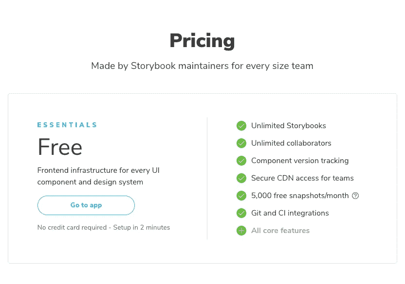

后来，随着项目的发展，我们可以考虑升级到高级计划。

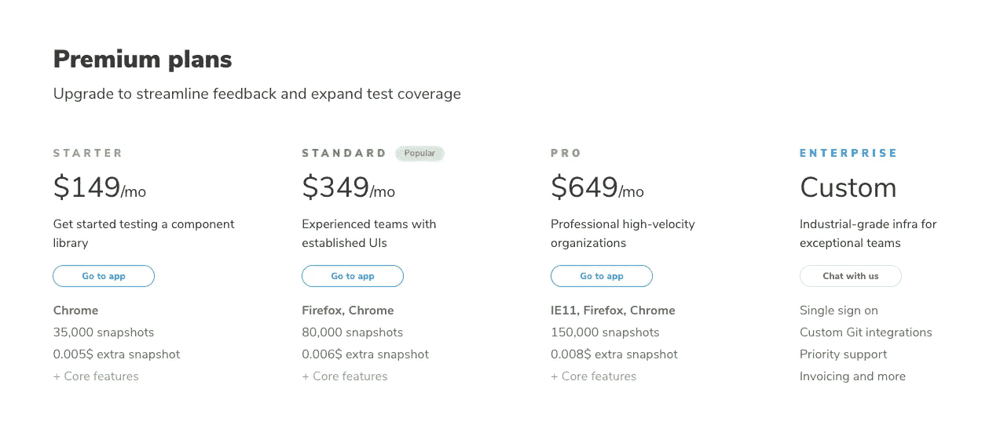

# 创建一个彩色项目

创建帐户后，我们需要将我们的项目添加到 Chromatic 帐户中。有两个选择:“从 GitHub 中选择”和“创建项目”。

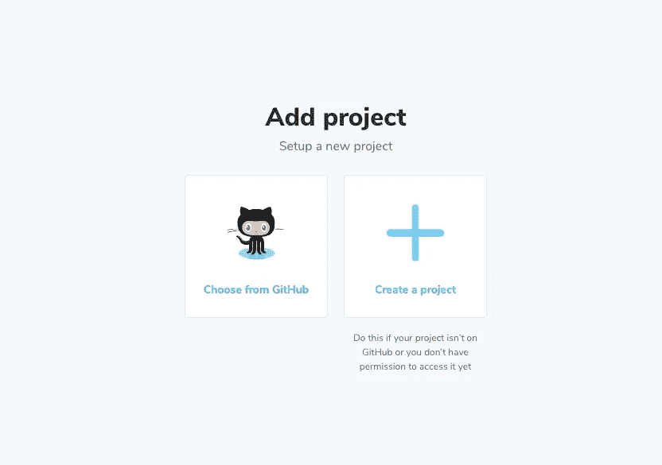

选择现有的 GitHub 项目更容易。

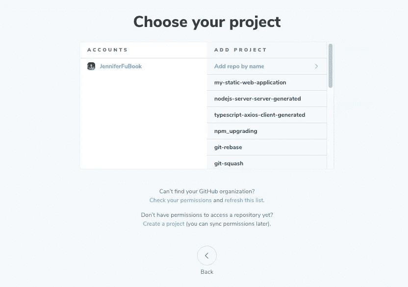

我们选择添加一个现有的 Git 存储库`[storybook-chromatic](https://github.com/JenniferFuBook/storybook-chromatic)`，它已经设置了 Storybook。通过从项目列表中选择它，名为`storybook-chromatic`的项目被创建。此时，项目状态是未完成的。

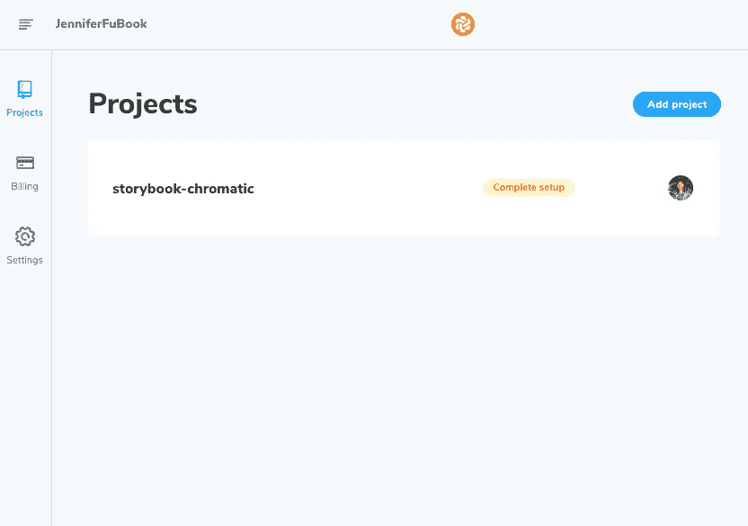

# 将故事书出版为彩色

对于未完成的项目`storybook-chromatic`，我们单击黄色按钮“完成设置”Chromatic 站点提供了两个命令:一个用于安装 Chromatic，一个用于发布故事书。

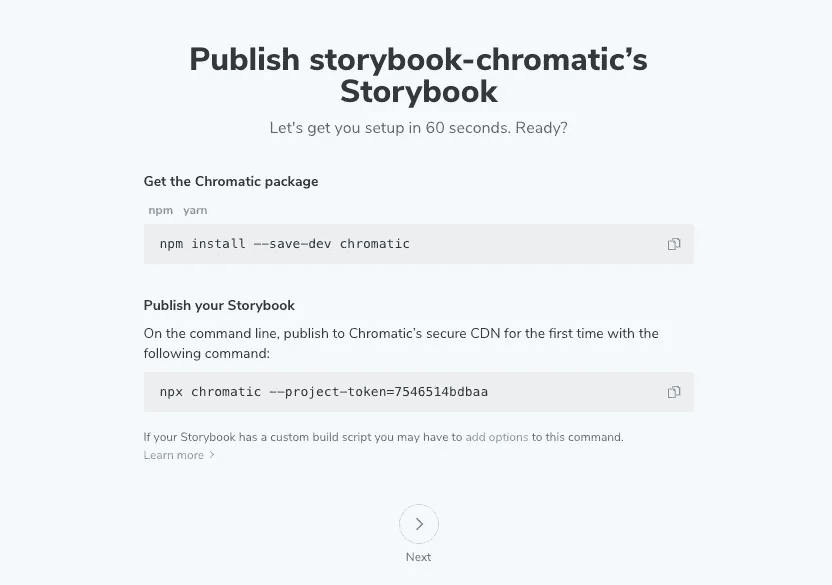

在`storybook-chromatic`的本地 Git 存储库中，我们执行命令`npm install —-save-dev chromatic`。`chromatic`成为`package.json`中`[devDependencies](/package-jsons-dependencies-in-depth-a1f0637a3129)`的一部分:

然后我们运行命令来发布故事书:

```
npx chromatic —-project-token=7546514bdbaa
```

在第 25 行，它询问我们是否希望安装半音阶脚本。我们回答是，下面的脚本被添加到`package.json`:

下一次，我们还可以键入`npm run chromatic`将故事书发布到 Chromatic 的安全内容交付网络(CDN)。

彩色网站确认故事书已经出版。它有三个组成部分和八个故事。它还显示了聚合故事的概述。

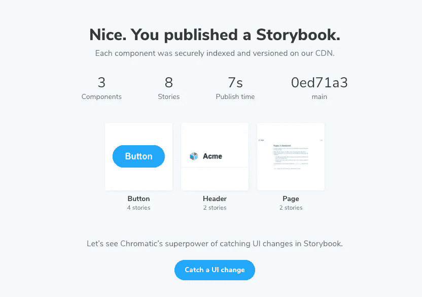

我们已经演示了如何执行一个命令来将故事书发布到 Chromatic。与下面的[将 Storybook 部署到不带 Chromatic 的 GitHub](/build-advanced-react-input-fields-using-styled-components-and-storybook-js-a231b9b2438#e765-bf98276875df)相比，这个过程要简单得多:

*   运行一个命令(`npm run build-storybook`)来构建一本故事书。
*   向 GitHub 提交并推送更改(在我们的示例中是 20 个文件[)。](https://github.com/JenniferFuBook/react-components/tree/master/docs)
*   设置 GitHub 页面站点的链接。

# 启用可视化回归测试

[回归测试](https://en.wikipedia.org/wiki/Regression_testing)是重新运行功能性和非功能性测试，以确保之前开发和测试的软件在变更后仍能运行。如果没有，这将被称为倒退。

视觉测试在一致的浏览器环境中捕获每个 UI 组件的图像。新截图会自动与之前接受的基线截图进行比较。当存在视觉差异时，我们会收到通知，以决定这些更改是要修复的回归，还是我们接受这些更改并将其作为新的基线截图。

Chromatic 支持故事书的视觉回归测试。每个故事同时在 Chrome、Firefox 和 Internet Explorer 11 中呈现，然后与最后一个已知良好状态的截图进行比较，以检测漏洞。

在`storybook-chromatic`中，有组件`Header.jsx`:

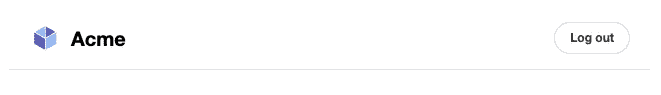

我们将背景颜色改为`red`(第 15 行)，并制作文本`New Acme`(第 27 行)。实际的变更集是 GitHub 上的[。](https://github.com/JenniferFuBook/storybook-chromatic/commit/905b912e62a0c7f0866bcefb6708e1011bbd4056#diff-8dfa0d1728a9cddd1274849696c232e7d19f6534c01987bc478c967cae890569)

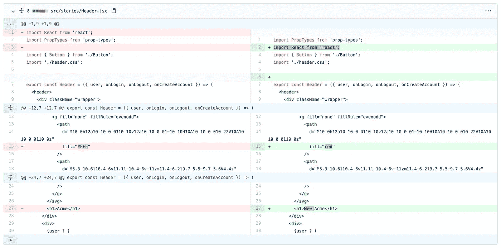

通过执行`npm run chromatic`发布变更。

半音阶站点显示两个构件行，并添加了新构件`Build 2`。

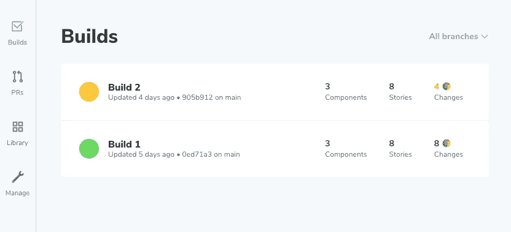

`Build 2`有一个黄色图标，表示有视觉退化。

# 授权 UX 设计师审查视觉差异

对等代码审查是一种系统化的方法，用于检查彼此的代码是否有错误。有许多成熟的工具来检查代码差异/变更。然而，比较 UI 组件的视觉差异/变化仍然是一个挑战。

彩色捕捉故事书的视觉变化，并授权 UX 设计师审查和批准视觉变化。

点击`storybook-chromatic`构建中的构建 2 行。然后显示构件 2 的详细信息。

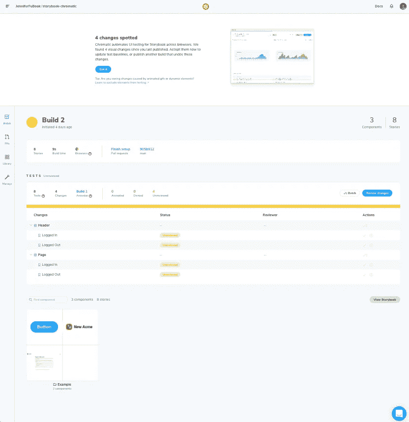

顶部屏幕显示自上次发布以来发现了四个视觉变化。系统会提示我们要么接受它们作为新的基线截图，要么发布另一个版本来撤销这些更改。

屏幕的下一部分显示了影响四个故事的变化:`Header/Logged In`、`Header/Logged Out`、`Page/Logged In`和`Page/Logged Out`。

底部屏幕显示新的汇总故事。

这个 Build 2 详细页面有很多信息和操作。我们可以点击蓝色按钮“查看修改”或点击灰色按钮“查看故事书”

让我们单击蓝色按钮“查看更改”

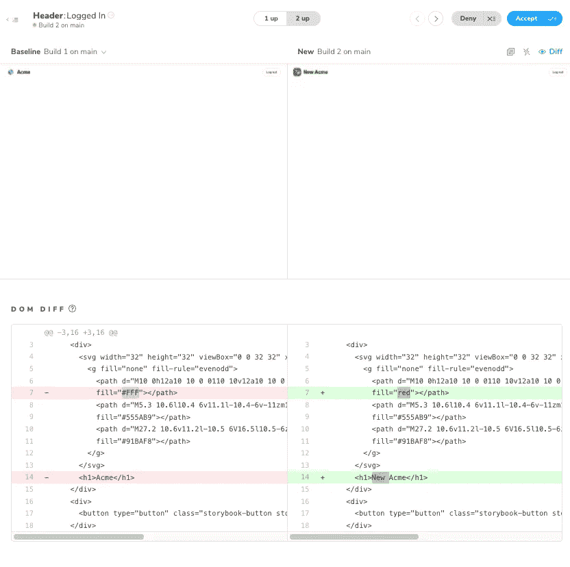

前半个屏幕突出显示了视觉差异:图标和文本。

第二个半屏幕突出显示代码差异:`#FFF => red`和`Acme => New Acme`。

这为 UX 设计师提供了足够的信息，让他们点击蓝色按钮“接受”或灰色按钮“拒绝”

想查看更多信息？

回到 Build 2 详细页面，点击灰色按钮“查看故事书”

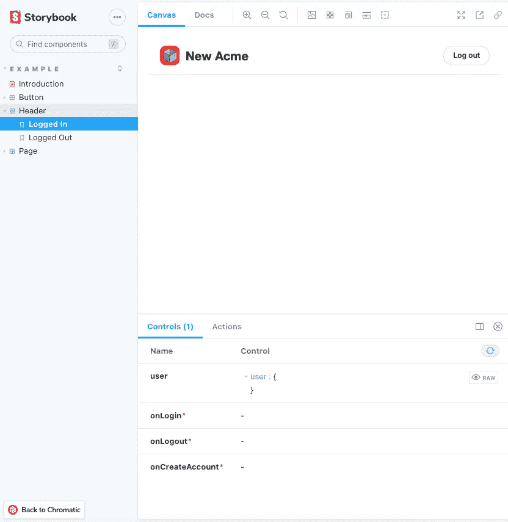

由于这本故事书是从半音阶网站上启动的，我们可以点击左下角的按钮“回到半音阶”

Chromatic 扩展了代码审查，也包括 UI 可视化审查。利益相关者可以是 UX 设计师，也可以是技术领导、产品经理、质量保证工程师等。

想进一步将审核流程与 GitHub 的 pull 请求集成在一起吗？

点按按钮“在 GitHub 上安装半音阶”

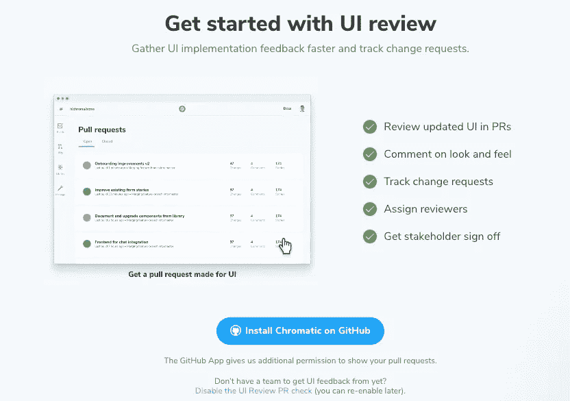

# 维护一个文档化的、版本化的、可搜索的库

它是如此的伟大，以至于所有的建筑都保存在半音阶网站上。对于 UI 组件，我们有一个文档化的、版本化的、可搜索的库。我们可以通过单击相关的行来访问任何构建的详细信息。

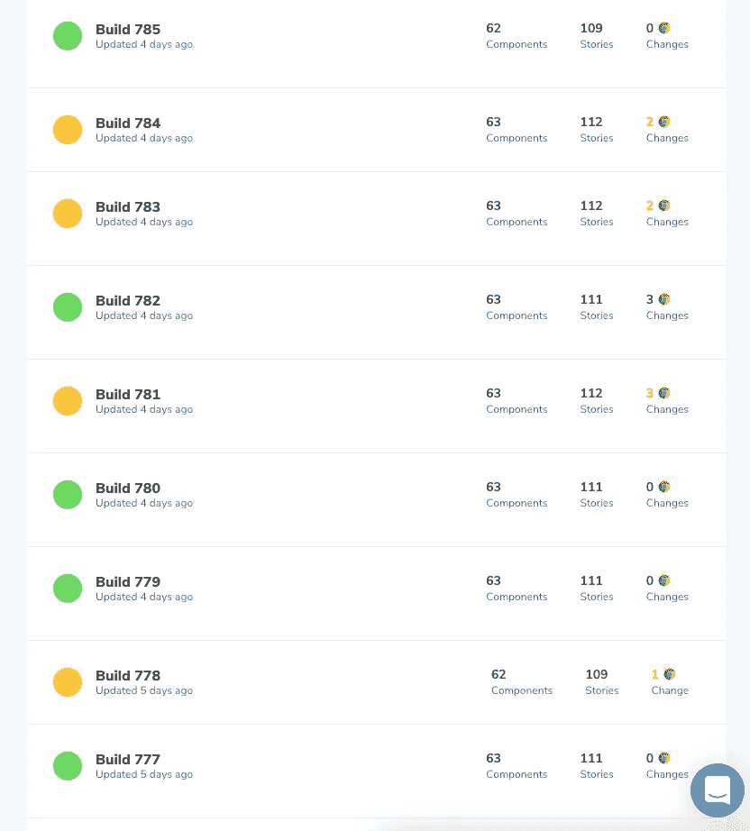

对于上面的例子，有超过 700 个构建。我们可以在去年建造的 Build 200 上发布故事书，这不是很好吗？或者甚至是三年前的东西？

# 与 GitHub 集成和持续集成

持续集成是维护现代 web 应用程序的实际方法。在合并任何拉请求之前，它必须通过测试、分析和部署的特定标准。Chromatic 可以与 GitHub 和 CI 服务集成。

这里有一个从 [Storybook 的官方网站](https://storybook.js.org/tutorials/design-systems-for-developers/react/en/review/)复制的例子:

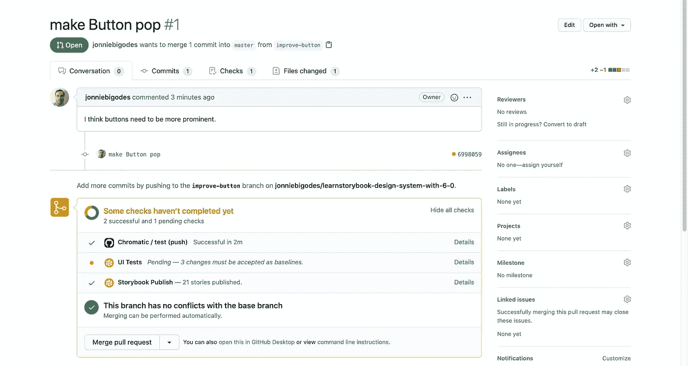

每当有拉入请求时，CI 作业都会启动三项任务:

*   半音阶/测试(按压):按压变为半音阶。
*   UI 测试:在色度上运行视觉回归测试。单击该链接将转到彩色构建详细信息。
*   故事书发布:用变化更新故事书。点击链接将查看新出版的故事书。

# 结论

在本文中，我们介绍了设置 Chromatic 的步骤，并使用它来发布故事书和运行可视化回归测试。我们展示了一个如何检查视觉差异的例子。

Storybook + Chromatic 是构建 UI 组件的强大组合。

感谢阅读。我希望这有所帮助。如果你有兴趣，可以看看[我的其他媒体文章](https://jenniferfubook.medium.com/jennifer-fus-web-development-publications-1a887e4454af)。

*注:感谢菲利克斯·德斯罗彻斯和乔希·布隆伯格向我介绍了半音阶并给我展示了一个令人印象深刻的演示！*