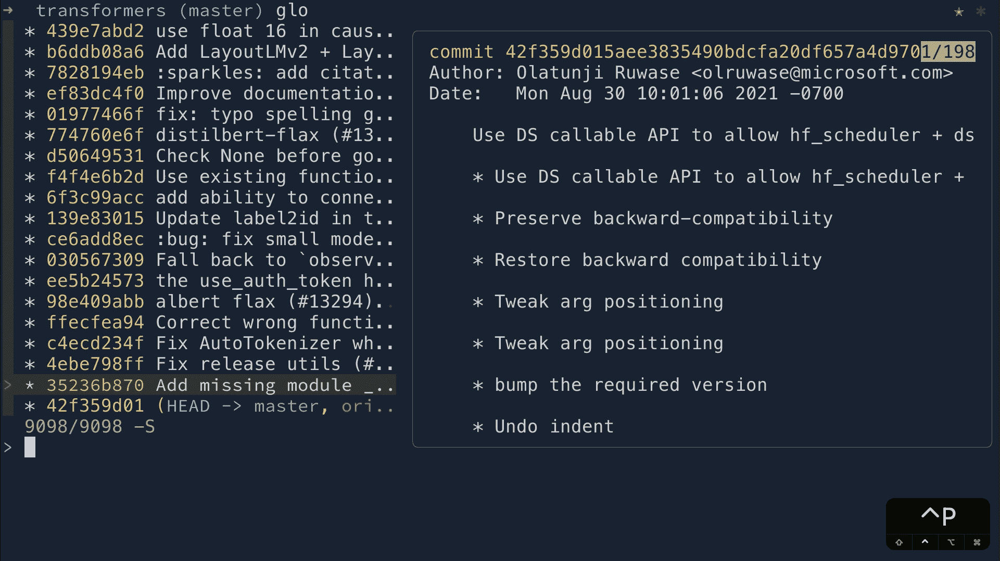
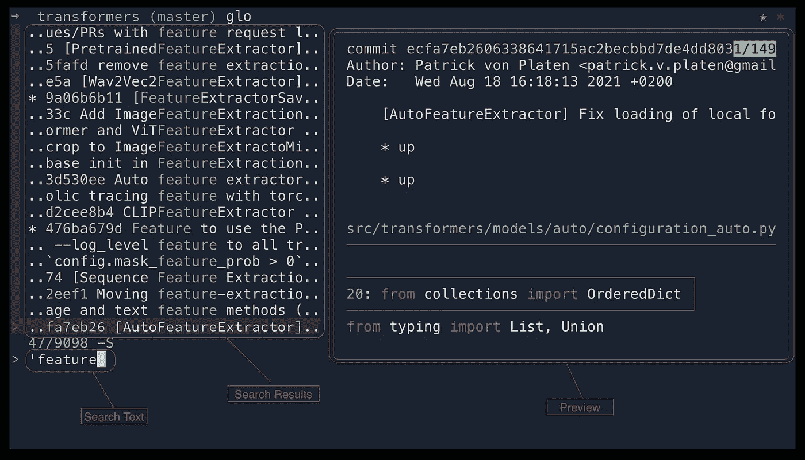
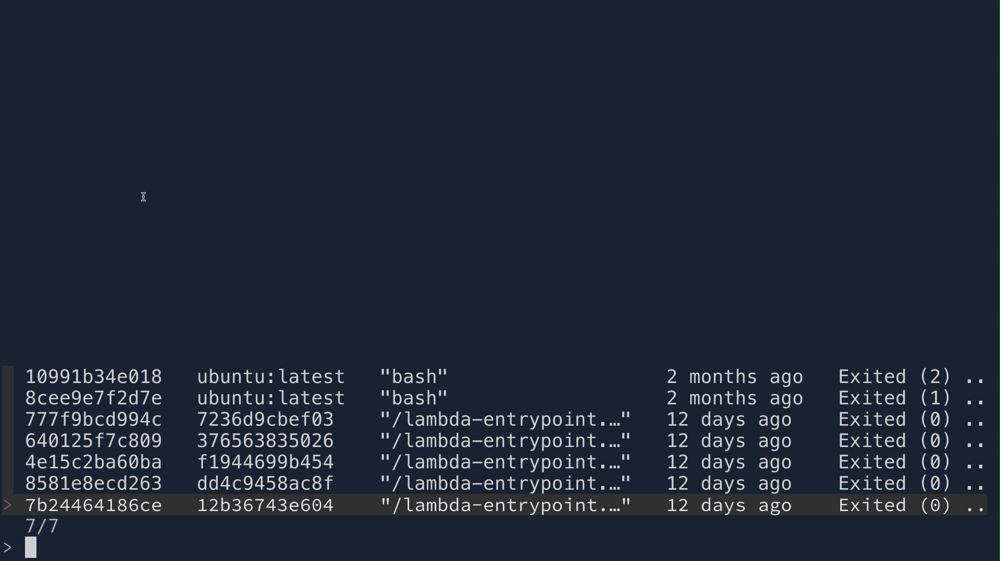
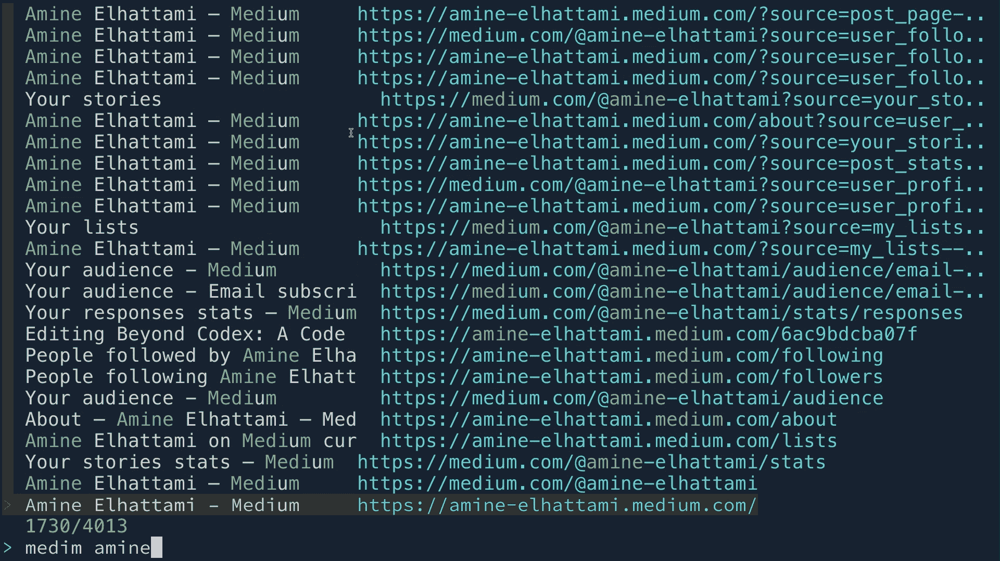

# 满足 FZF:一个模糊的发现者，以提高您的命令行工作流程

> 原文：<https://betterprogramming.pub/meet-fzf-a-fuzzy-finder-to-enhance-your-command-line-workflow-a2890f6a70f8>

## 如何使用 fzf 获得更好的命令行体验



图片由作者提供。

如果您是一个普通的终端用户，那么您可能很熟悉这样一个事实，即命令行搜索工作流有时是不切实际的，并且通常会转变为一个多步骤的过程。例如，您想使用 PID 终止几个进程，而`ps`命令输出比您的缓冲区长。你最终不得不向上滚动，也许用你的鼠标选择 PID 或者用`grep`然后执行`kill`命令。

这种多步骤的过程阻碍了使用终端的优势之一，即主要依靠键盘来节省宝贵的时间以提高生产力。而且，它给 GUI 工具用户一个远离终端的理由。幸运的是，一些工具试图解决这个问题，而`fzf`就是其中之一。

`fzf`是一个命令行模糊查找器，你可以在任何系统上运行，因为它没有依赖性，非常快。此外，它是开源的。

在这篇文章中，我将向您展示`fzf`如何改进您的命令行工作流程，并可能说服您更频繁地使用终端。

# 设置

使用以下方法之一安装`fzf`。对于其他操作系统，查看[官方 GitHub 页面](https://github.com/junegunn/fzf)。

```
# Using package managers## Debian 9+ and Ubuntu 19.10+
sudo apt-get install fzf## macOS
brew install fzf
$(brew --prefix)/opt/fzf/install# Using Git
git clone --depth 1 https://github.com/junegunn/fzf.git ~/.fzf
~/.fzf/install
```

# 概观

在我们继续之前，让我们回顾一些基础知识和`fzf`接口。

从高层次来看，`fzf`的使用主要有两种方式:

*   为命令提供一个参数。比如你想看一个文件的内容:`cat $(fzf)`。
*   **过滤命令的输出。**比如你要过滤某个具体流程的信息:`ps | fzf`。

下面的截图是一个使用`fzf`的`git log`命令的例子。



图片由作者提供。

键入时，使用输入的字符串过滤结果(请参见下面的搜索语法部分)。选择项目后，预览窗格会更新。上面的例子显示了 diff 输出。

## 快捷指令

`fzf`提供以下快捷方式与其界面进行交互:

*   `<CTRL j/n>`和`<CTRL k/p>`:上下移动结果列表。
*   `<ALT j/n>`和`<ATL k/p>` :上下移动预览面板。
*   `<ENTER>` :选择当前项目，退出。
*   `<TAB >`:选择一项不退出(多选)。
*   `<CTRL c>`:退出。

## 搜索语法

默认情况下，搜索使用模糊匹配。但是，您可以使用以下方法之一来更改此行为:

*   为了精确匹配，使用`'`。例如，`'myfile`。
*   要匹配后缀，请使用`$`。比如`.py$`。
*   要匹配前缀，请使用`^`。比如`^test_`。
*   要匹配多个标准，请使用`|`。比如`.py$ | .json$`。

此外，如果您不想对某些特定命令使用模糊匹配，可以在调用`fzf`时使用`--exact` fag。

# 现成的功能

## 更改目录

您可能认为使用模糊查找来改变工作目录是没有用的，我同意简单的情况(进行几级)。但是，假设您想要到达的文件夹在几层之外。然后，这就变得非常有用了，如下图中夸张的例子所示。要使用此功能，在您的终端中点击`<ATL c>`，然后模糊找到您想要的文件夹。


图片由作者提供。

## 搜索文件

类似于上面的更改目录示例。您可能会遇到这样的情况:您想要访问深度嵌套的文件夹结构末尾的文件，或者甚至不知道该文件的确切位置(例如，问问自己`resolv.conf`文件在哪里)。要使用此功能，首先输入您的命令(下面示例中的`cat`，然后点击`CRTL-t`。


## 命令历史

我们都同意 Unix 默认的命令历史提示是无用的。我不知道你，但我总是输入命令，因为界面不直观。所以，现在你已经安装了`fzf`，在你的终端上点击`<CTRL-r>`开始享受吧！


图片由作者提供。

# 自定义实用程序

本节将向您展示一些我经常使用的从 [fzf 示例页面](https://github.com/junegunn/fzf/wiki/examples#google-chrome)中挑选的实用程序。

当您浏览这些示例时，您将会看到这个工具是多么强大，创建一个符合您需求的实用程序是多么容易。本节只包括几个例子，但是您可以做的事情没有限制。因此，我鼓励您尝试从零开始或者从现有的示例开始构建自己的代码。

要尝试下面小节中的任何功能，请将其粘贴到您的终端中。然后，使用函数名触发命令。要永久保存这些函数，请将它们添加到您的 rc 文件中(即`bashrc`或`zshrc`)。

## 码头工人

如果你是 docker 的老用户，你会很快看到`fzf`是如何让它变得简单的，主要是因为任何与图像或容器的交互都会涉及到一个 id(或者你记得设置它的名字)。是的，您可以设置您的自动完成来列出 id，但是在我看来，它缺少更多的上下文。

下图显示了启动 docker 容器和连接终端的`da`函数的例子。



图片由作者提供。

## 打开网页

当然，我只是浏览网页的时候不会用这个。但是，当我在终端上工作时，我会大量使用它，并且我希望快速浏览一下我已经收藏或以前浏览过的 web 上的一些文档。将这与类似 [Vimium](https://chrome.google.com/webstore/detail/vimium/dbepggeogbaibhgnhhndojpepiihcmeb?hl=en) 的工具结合起来，你就可以不离开键盘完成所有这些。再者，如果记不住网址，模糊匹配也可以很方便。



图片由作者提供。

下面的 shell 函数既可以打开你的历史记录中的网页，也可以打开你在 Google Chrome 中的书签。但是，让它适用于其他浏览器非常简单。

## 包管理器

作为一名开发人员，我在多种操作系统上工作。我在本地环境中使用 macOS，在远程服务器中使用 ubuntu 或 centOS。安装包有时会很棘手，因为根据操作系统的不同，同一个包的名称可能会略有不同。以前，我通过访问包管理网页来解决这个问题。然而，有了这个实用程序，它变得更加易于管理。


图片由作者提供。

下面的函数是针对 macOS 的，不过 Ubuntu/Debian 可以查一下 [fzf-apt](https://github.com/krickelkrakel/fzf-apt) 。

## 饭桶

在 [fzf 示例页面上，](https://github.com/junegunn/fzf/wiki/examples#google-chrome)几个函数展示了如何与 git 交互。然而，我发现 [forgit](https://github.com/wfxr/forgit) ，一个使用`fzf`的工具，有你需要的一切。所以请在 forgit 上查看我的文章。

# 最后

我已经写了几篇关于`fzf`或者[使用 fzf 的工具](/how-to-make-your-git-command-line-interactions-seamless-769d5c148097)的文章，我一直告诉自己也许这就足够了。但是，我得到了周围人的积极响应。所以我们来了！

你应该知道这篇文章只是触及了可能性的表面。我的目标是让您知道这个工具的存在，并向您展示几个它有多么强大的例子。所以现在决定权在你。

# 参考

*   [GitHub — junegunn/fzf: fzf 源代码](https://github.com/junegunn/fzf)
*   [GitHub — fzf 示例 wiki](https://github.com/junegunn/fzf/wiki/examples#google-chrome)
*   [GitHug — fzf-apt](https://github.com/krickelkrakel/fzf-apt)
*   [Vimium Chrome 扩展](https://chrome.google.com/webstore/detail/vimium/dbepggeogbaibhgnhhndojpepiihcmeb?hl=en)
*   [GitHub — wfxr/forgit: forgit 源代码](https://github.com/wfxr/forgit)
*   [如何让你的 Git 命令行交互无缝](/how-to-make-your-git-command-line-interactions-seamless-769d5c148097)

```
**Want to Connect With the Author?**Follow me on [Twitter](https://twitter.com/amine_elhattami), where I regularly tweet about software development and machine learning.
```