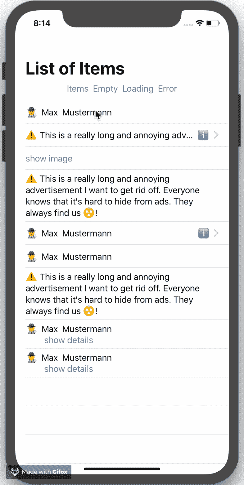
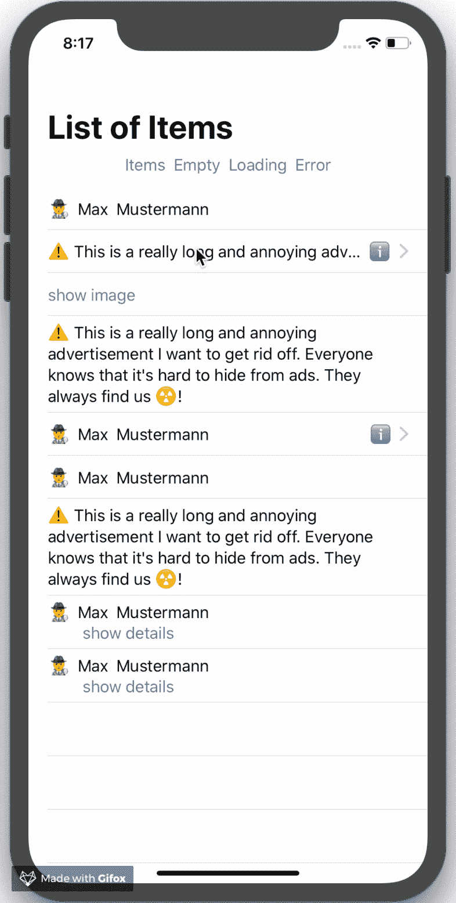
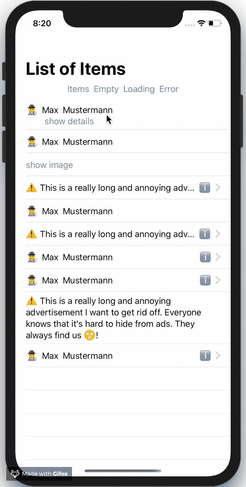

# 会面和问候 SwiftUI 中的高级列表

> 原文：<https://betterprogramming.pub/meet-greet-advanced-lists-in-swiftui-80ab6f08ca03>

## 实现一个包含空、错误和加载状态的动态列表


列表图片(版权所有 2019 **克里斯蒂安·埃利斯**

**更新 2019/08/14:** 现作为 [Swift 包](https://github.com/crelies/AdvancedList)提供🚀

# 动机

我说的*进阶榜*是什么意思？

我目前在做的 app 有很多动态列表，可以代表不同的状态，比如`empty`、`error`、`items`或者`loading`。

我在数据驱动框架 [IGListKit](https://github.com/Instagram/IGListKit) 之上实现了一个解决方案，能够在我们的 [UIKit](https://getuikit.com/) 应用中创建这些类型的列表。

现在，我想使用 [SwiftUI](https://developer.apple.com/xcode/swiftui/) 实现类似的东西。只有几行代码，对吗？

# 履行

在这一节中，我们将看看我的实现和我创建的不同组件。

## 列表状态

`AdvancedList`应该能够代表不同的州。我们可以很容易地用一个`Enum`来定义状态。

您将在下面看到为什么我跳过添加一个空案例。

## 列表服务

`AdvancedList`需要一个组件来存储和管理`ListState` 和`items`。

利用`Combine`和 SwiftUI 的数据绑定特性，我们将`AdvancedList` 和`ListService`连接起来。

您可以通过`ListService`改变列表状态并修改项目，此时`AdvancedList` 会自动更新。

在`ListService`的实现中有两个特殊项:`Item`和`AnyListItem`。

## 项目

我们希望能够在同一个列表中显示不同的项目。每个项目都应该是可识别的，并且应该可以表示为一个 SwiftUI 视图。

为了实现这一点，我将`Item` 约束为`Identifiable` 和`View`协议。

```
func appendItems<**Item: Identifiable**>(**_ items: [Item]**) **where Item: View** {}
```

但是有一个问题。

我们不能在`ListService`内部的数组中存储符合`Identifiable`和`View`协议的对象，因为这些协议有相关的类型和通用约束。这就是为什么我必须使用“类型擦除”。

我实现了一个名为`AnyListItem`的盒子类型，它使用`AnyView`删除了`body`属性(由`View`要求)的类型信息，并使用`AnyHashable`删除了`id` 属性(由`Identifiable`要求)的类型信息。

`ListService`在内部使用`AnyListItem`擦除添加到列表中的每个`item`的类型信息。

## 高级列表

最后，我们来看看 SwiftUI 视图`AdvancedList`的实现。

该视图使自己依赖于当前列表状态和当前项目。为此，`AdvancedList`视图需要一个管理列表状态和条目的`ListService` 实例。

利用`ObjectBinding` 属性包装器上的`listService` 变量，我们告诉`AdvancedList` 视图要绑定到修改上。

另外，`AdvancedList`视图的用户应该能够为列表的`empty`、`loading`和`error`状态指定一个视图。

我在初始化器的参数上使用了`ViewBuilder`属性包装器来实现这一点。

正如我上面提到的，我们不需要在`ListState`枚举上使用空 case，因为我们可以在`items`上使用`isEmpty`来代替。

在我的实现中还有一件特别的事情:

`ListState` 的`error` 案例有一个`Error` *类型的关联值。这样，我可以将错误传递给错误查看器，如果需要的话，它可以显示错误。*

就是这样！让我们看看如何在现场使用`AdvancedList` 。

# 用法示例

在本节中，您将看到一个简单的`AdvancedList` SwiftUI 视图的使用示例。

提示 **:** 您将在下面链接的 GitHub 资源库中找到完整的实现。

首先，我们必须创建想要在列表上显示的项目。

## 示例项目

我创建了一个代表联系人(姓名、地址等)的`ContactListItem`。).

要将该项目的实例添加到列表中，它必须符合协议`Identifiable`和`View`。

我在这里做了一些特别的事情；我希望能够根据其类型属性以不同的方式呈现该项。

看看`body` 属性中`viewRepresentationType`的用法。



显示 iPhone XR 上带有 ***联系人项目*** *的高级列表的动画图像*

此外，我实现了第二个项目，它代表一个简单的广告。

我用`ContactListItem`做了同样的事情。`AdListItem`有一个控制视图定义的类型。



显示 iPhone XR 上带有附加项目的高级列表的动画图像

## 示例内容视图

最后，我们看看如何在一个简单的内容视图中使用`AdvancedList`。

你可能想知道`CustomListStateSegmentedControlView`是什么**。这是一个助手视图，可以轻松地改变列表状态，并向列表中添加随机项目。**



显示 iPhone XR 上不同项目的高级列表的动画图像

你已经到达终点了！非常感谢您阅读这篇文章。希望你和我一样喜欢我的`AdvancedList` `view` ，当然还有 SwiftUI。

# 资源

本文的代码如下:

[](https://github.com/crelies/AdvancedList-SwiftUI) [## crelies/AdvancedList-SwiftUI

### 使用 swift ui-crelies/advanced list-swift ui 实现了具有空、错误和加载状态的高级列表

github.com](https://github.com/crelies/AdvancedList-SwiftUI)