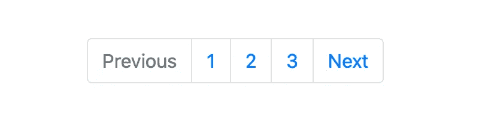
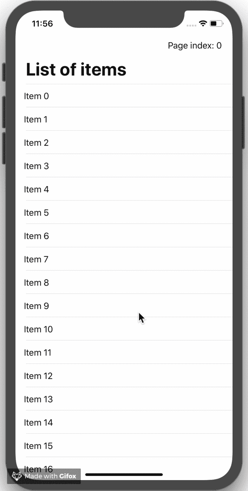
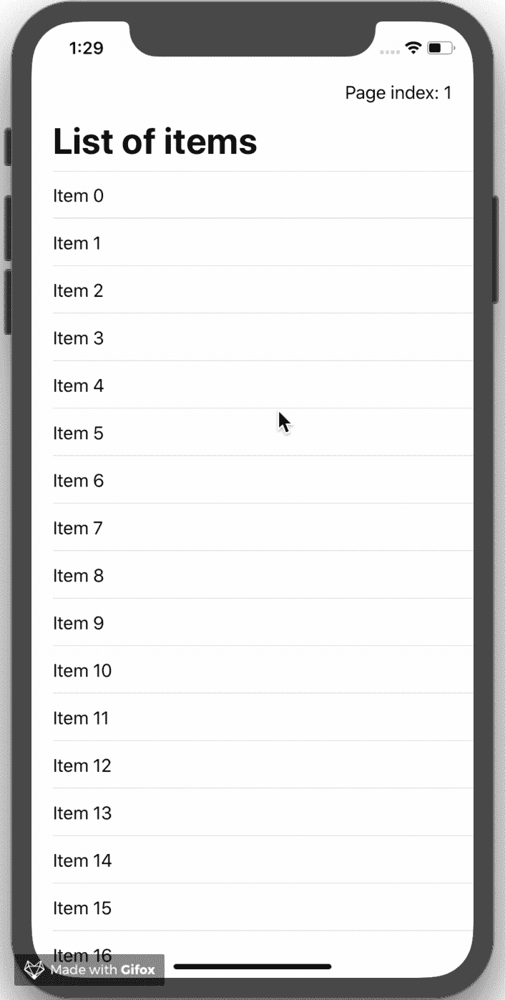

# 会议和问候—在 SwiftUI 中列出分页

> 原文：<https://betterprogramming.pub/meet-greet-list-pagination-in-swiftui-8330ee15fd61>

## 如何向 SwiftUI 列表添加对分页 API 响应的支持



引导分页的屏幕截图

我最新的 SwiftUI 演示项目从 REST API 获取数据，然后对响应进行分页。这就是为什么我在寻找一种简单的方法来为 SwiftUI 列表视图添加分页支持。

在当前的测试版(Xcode 11 beta 5)中，没有提供现成的功能。这就是为什么我们将在接下来的几分钟内实现一个简单的解决方案。

# 目标

虽然我们可以在列表视图的内容块中访问当前迭代中的一个条目，但是我们不知道它在列表中的当前位置或者我们离列表的末尾有多远。这就是分页的用武之地。

分页对不同的人有不同的含义。让我们从定义我想要的最终目标开始:

> 在滚动期间，列表应该获取并追加下一页的项目。当用户到达列表末尾并且请求仍在进行中时，应该显示加载视图。

考虑到这一点，让我们实现一个解决方案来修复这些问题，并为列表视图添加分页支持。

# 实施

在这一节中，我们将看看两种不同的方法。虽然第一种方法更明显，但高级用户可能会喜欢第二种方法的面向用户的功能。

## 第一种方法

一个简单的解决方案是检查当前迭代中的项是否是列表的最后一项。如果这是真的，我们触发一个异步请求来获取下一页的项目。

**RandomAccessCollection+isLastItem**

因为列表视图支持`RandomAccessCollection` ，所以我们可以创建一个扩展并实现一个`isLastItem`函数。关键是`Self` 需求，它限制了元素符合`Identifiable`协议的集合的扩展。

```
**extension RandomAccessCollection where Self.Element: Identifiable {
    func isLastItem<Item: Identifiable>(_ item: Item) -> Bool {**
        guard !isEmpty else {
            return false
        }

        guard let itemIndex = firstIndex(where: { $0.id.hashValue == item.id.hashValue }) else {
            return false
        }

        **let distance = self.distance(from: itemIndex, to: endIndex)
        return distance == 1**
  **  }
}**
```

您将一个符合`Identifiable`协议的项目传递给函数，如果该项目是集合中的最后一个项目，它将返回 true。

> 该函数在集合中查找给定项的索引。它使用`*id*`属性的哈希值(`*Identifiable*`协议的要求)将其与列表中的其他项目进行比较。如果找到了项目索引，这意味着项目索引和结束索引之间的距离必须正好是 1(结束索引等于集合中的当前项目数)。这就是我们如何知道给定的项目是最后一个项目。

我们可以使用类型清除包装器`AnyHashable`直接比较类型为`Hashable`的 id，而不是比较哈希值。

```
guard let itemIndex = firstIndex(where: { **AnyHashable($0.id) == AnyHashable(item.id)** }) else {
    return false
}
```

现在基础已经奠定，我们可以实现用户界面了。

**用户界面**

我们希望在到达末尾时触发列表更新。为了实现这一点，我们可以在每个项目的根视图上使用`onAppear`修改器。(在本例中，它是一个 VStack。)这就调用了下面的`listItemAppears`函数。我们一会儿就来看看。

如果当前迭代的项目是最后一个项目，将向用户显示加载视图。在这个简单的例子中，它是`Text(“Loading …”)`。

由于 SwiftUI 是声明性的，下面的代码应该是不言自明的:

```
struct **ListPaginationExampleView**: View {
    [**@State**](http://twitter.com/State) **private var items: [String] = Array(0...24).map { "Item \($0)" }** [**@State**](http://twitter.com/State) **private var isLoading: Bool = false** [**@State**](http://twitter.com/State) **private var page: Int = 0
    private let pageSize: Int = 25**

    var body: some View {
        NavigationView {
            **List(items) { item in**
                **VStack**(alignment: .leading) {
                    **Text(item)**

                    **if self.isLoading && self.items.isLastItem(item) {**
                        Divider()
                        **Text("Loading ...")**
                            .padding(.vertical)
                    **}**
                }**.onAppear {
                    self.listItemAppears(item)
                }**
            **}**
            .navigationBarTitle("List of items")
            .navigationBarItems(trailing: **Text("Page index: \(page)")**)
        }
    }
}
```

> 助手函数`***listItemAppears***` 在内部检查给定项目是否是最后一个项目。如果它是当前页面的最后一项，则增加当前页面，并将下一页的项目追加到列表中。此外，我们通过`***isLoading***`变量跟踪装载状态，该变量定义了何时显示装载视图。

```
extension **ListPaginationExampleView** {
    private **func** **listItemAppears<Item: Identifiable>(_ item: Item)** **{**
        **if items.isLastItem(item) {**
            **isLoading = true**

            /*
                Simulated async behaviour:
                Creates items for the next page and
                appends them to the list after a short delay
             */
            DispatchQueue.main.asyncAfter(deadline: DispatchTime.now() + 3) {
                **self.page += 1**
                let moreItems = self.getMoreItems(forPage: self.page, pageSize: self.pageSize)
                **self.items.append**(contentsOf: moreItems)

                **self.isLoading = false**
            }
        **}**
    **}**
}
```

在这个实现中，只有当前迭代*中的项目是最后一个项目*时，我们才获取下一页的项目。

但这并不是最好的用户体验，对吗？在一个真正的应用程序中，如果达到或超过了一个定义的阈值，我们会希望预加载下一个页面。此外，只有在真正必要的情况下(例如，如果请求花费的时间比预期的长)，我们才应该用负载指示器来打扰用户。在我看来，这将带来更好的用户体验。

考虑到这些用户体验问题，让我们跳到第二种方法。

## 第二种方法

在这里，我们将学习如果超过了给定的阈值，如何获取下一页的项目。

**RandomAccessCollection+is thresholditem**

同样，我们将从扩展`RandomAccessCollection`开始。这次我们将实现一个名为`isThresholdItem` 的函数，它确定给定的项目是否是阈值项目。

```
**extension RandomAccessCollection where Self.Element: Identifiable {**
    **func isThresholdItem<Item: Identifiable>(offset: Int,
                                             item: Item) -> Bool {**
        guard !isEmpty else {
            return false
        }

        guard let itemIndex = firstIndex(where: { AnyHashable($0.id) == AnyHashable(item.id) }) else {
            return false
        }

        let distance = self.distance(from: itemIndex, to: endIndex)
        **let offset = offset < count ? offset : count - 1**
        **return offset == (distance - 1)**
    **}**
**}**
```

> 这个函数寻找给定项目的索引。如果找到，它将计算到结束索引的距离。指定的偏移量(即结束前的项目数)应等于`***distance — 1***`。我们必须从距离中减去 1，因为结束索引等于 count 属性的值(即集合中的当前项目数)。我还为偏移量添加了一个简单的验证检查。偏移量应小于集合中的当前项数。

现在我们准备好再次进入用户界面。

**用户界面**

UI 实现与第一种方法中的 UI 几乎相同。然而，有一个关键的区别，那就是在`listItemAppears`函数中。

> 记住，我们在这里重用了第一种方法中的`*isLastItem*`函数。只有当用户到达列表的末尾并且对下一页的请求仍在进行时，加载视图才会显示。

```
struct **ListPaginationThresholdExampleView**: View {
    [**@State**](http://twitter.com/State) **private var items: [String] = Array(0...24).map { "Item \($0)" }** [**@State**](http://twitter.com/State) **private var isLoading: Bool = false** [**@State**](http://twitter.com/State) **private var page: Int = 0
    private let pageSize: Int = 25
    private let offset: Int = 10**

    var body: some View {
        NavigationView {
            **List(items) { item in**
                **VStack**(alignment: .leading) {
                    Text(item)

                    **if self.isLoading && self.items.isLastItem(item) {**
                        Divider()
                        **Text("Loading ...")**
                            .padding(.vertical)
                    **}**
                }**.onAppear {
                    self.listItemAppears(item)
                }**
            **}**
            .navigationBarTitle("List of items")
            .navigationBarItems(trailing: **Text("Page index: \(page)")**)
        }
    }
}
```

> 我们不调用`***isLastItem***` *，* 而是调用`***isThresholdItem***` 来检查给定的项是否是阈值项。

```
extension **ListPaginationThresholdExampleView** {
    private **func listItemAppears<Item: Identifiable>(_ item: Item) {**
        **if items.isThresholdItem(offset: offset,
                                 item: item) {**
            **isLoading = true**

            /*
                Simulated async behaviour:
                Creates items for the next page and
                appends them to the list after a short delay
             */
            DispatchQueue.main.asyncAfter(deadline: DispatchTime.now() + 0.5) {
                **self.page += 1**
                let moreItems = self.getMoreItems(forPage: self.page, pageSize: self.pageSize)
                **self.items.append(contentsOf: moreItems)**

                **self.isLoading = false**
            }
        **}**
    **}**
}
```

如果你是一个特别细心的读者，你可能已经注意到一些代码片段丢失了。让我们在下一节讨论这些问题。

## 缺失的代码片段

**获取更多项目**

下图显示了`getMoreItems`功能的实现:

```
extension **ListPaginationExampleView** {
    /*
        In a real app you would probably fetch data
        from an external API.
     */
    private **func getMoreItems(forPage page: Int,
                              pageSize: Int) -> [String]** {
        let maximum = ((page * pageSize) + pageSize) - 1
        let moreItems: [String] = Array(items.count...maximum).map { "Item \($0)" }
        return moreItems
    }
}
```

**字符串+可识别的**

下面是使*列表* *视图*工作所需的最后一个扩展:

```
/*
    If you want to display an array of strings
    in the List view you have to specify a key path,
    so each string can be uniquely identified.
    With this extension you don't have to do that.
 */
**extension String: Identifiable** {
    public var id: String {
        return self
    }
}
```

这个字符串扩展使得在相关的列表视图初始化器中直接使用字符串数组变得容易。

# 结果呢

最后，让我们看看我们的结果。

第一张 GIF 展示了`isLastItem`方法:



显示 iPhone XR 模拟器上最后一个项目方法的动画图像

下一张 gif 展示了`isThresholdItem`方法:



iPhone XR 模拟器上显示阈值方法的动画图像

恭喜你。您现在可以在 SwiftUI 列表中使用分页了。

再次感谢您阅读我的一篇文章！

# 资源

本文的代码如下:

[](https://github.com/crelies/List-Pagination-SwiftUI) [## cre lies/List-分页-SwiftUI

### 此时您不能执行该操作。您已使用另一个标签页或窗口登录。您已在另一个选项卡中注销，或者…

github.com](https://github.com/crelies/List-Pagination-SwiftUI) 

还提供套装:

 [## crelies/ListPagination

### 这个 Swift 包提供了 RandomAccessCollection 的扩展，帮助您将分页支持添加到 SwiftUI…

github.com](https://github.com/crelies/ListPagination)