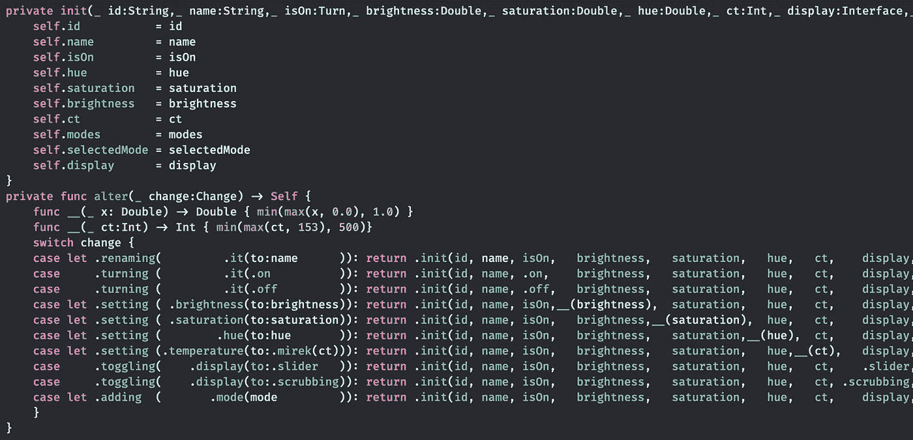
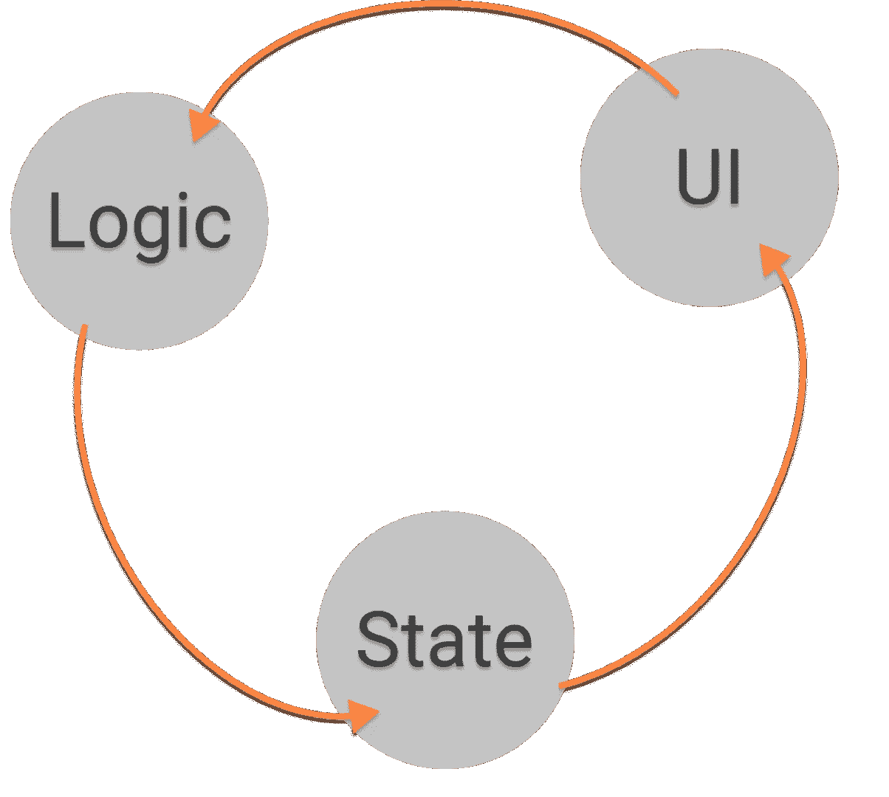

# 介绍 Khipu:我在 Swift 中干净架构的样板无代码实现

> 原文：<https://betterprogramming.pub/meet-khipu-a-boilercode-free-implementation-of-clean-architecture-in-swift-f76ccab82ff3>

## 深入探究这种完全声明性的、不可变的日常项目解决方案



Khipu 代码在运行。作者图片

MVVM-(X)、VIP、VIPER——所有这些所谓的架构都有两个共同点:它们都可以追溯到罗伯特·c·马丁的[清洁架构](https://blog.cleancoder.com/uncle-bob/2012/08/13/the-clean-architecture.html)。在 iOS 中，我还没有看到一个有效的架构。它们并不完全独立于 UI(Martin:“UI 必须是一个 I/O 设备”)，或者允许您将决策推迟到以后的某个时间点，可能是无限的。

现在，在 iOS 中，很长一段时间的问题是，“把`ViewController`放在哪里”——让架构回答它不应该被打扰的问题。对于 SwiftUI，这个问题已经转变为“在 SwiftUI 中构建(MVVM |蝰蛇| VIP)”——从一开始就将 UI 耦合到任何其他代码——并且违反了架构所代表的一切。

所有这些非架构的一个共同点是，它们都需要实现不同的对象:

*   协调者
*   路由器
*   提出者
*   视图模型
*   DI 框架

所有这些对象只是作为无效架构的一种需要而存在——它们对应用程序的域没有任何贡献——域是应用程序最初被委托的原因。没有客户在订购应用程序时会要求它包含一定数量的路由器和协调器。因此，所有这些对象都必须算作[偶然复杂性](https://medium.com/background-thread/accidental-and-essential-complexity-programming-word-of-the-day-b4db4d2600d4)或[样板代码](https://en.wikipedia.org/wiki/Boilerplate_code)。

看待样板代码和意外复杂性的另一种方式:
从根本上说，所有的应用程序都非常相似:

*   用户使用用户界面来触发动作
*   该应用程序的逻辑处理这个动作并生成一个新的状态
*   用户界面发生变化以反映变化后的状态

让我们称之为“内在设计”



每个应用的内在设计

对于一个简化的最小且无意外复杂性的架构，你会期望能够识别这种设计:它偏离得越少，架构就越符合内在设计。如果一个架构不容易被映射，那么它包含了大量的意外复杂性和样板代码。稍后我们将比较下面的架构和这个——让它成为意外复杂性的试金石。

既然我们已经看到大多数“架构”都是无效的，并且充满了样板代码，那么让我介绍一下“khi pu”——Robert c . Martin 的“ [Clean Architecture](https://blog.cleancoder.com/uncle-bob/2012/08/13/the-clean-architecture.html) ”的一个有效实现，它根本没有任何意外的复杂代码。

Khipu 通过处处拥抱简单来实现这一点。

它只允许数据单向流动，并且几乎是完全不可变的。以下两项都使代码变得简单:

*   单向数据流:易于理解和推理。如果数据只能单向流动，这将极大地简化体系结构
*   不可变数据类型:正如我们马上会看到的，我建议只使用不可变数据类型。可能会有很多人说为什么这是有益的，但我想简短地说:如果一些东西不能被故意改变，它也不能意外地改变——消除最有可能使系统崩溃的错误。

如今，在无数被视为面向对象的类中杂乱无章的强制性结构化代码表明，增加复杂性是对现有复杂性的适当反应。这就像把隔壁房间的垃圾桶倒进房间里来打扫房间一样。通过在系统的中心使用类，这种影响被极大地放大了。

类提供了大量的交互。它们允许(几乎)任何数量的方法。它们是可子类化的和可变的。虽然这些都是我们模块不需要的东西，但我们需要它们能够做的一件事，它们做得不好。几十年来，类一直被宣传为黑盒的完美工具，尽管它们最多只能提供灰盒，事实证明了这一点，即除了类的签名之外，通常还需要额外的子类化信息。

班级辜负了他们的核心承诺。此外，它们不能提供模块所期望的流通——实现这一点需要模式魔法。我加入了[写出不会对我们撒谎的文档，](https://suzdalnitski.medium.com/#L54)因为它正在被编译器检查——如果代码改变，要求文档也要改变。

*   这种部分应用程序、DSL 接口模块和可变性的工具集在私有本地函数的范围内只需要少量——以及这如何构成一种新的范式——“声明性域范式”*   这种范式是如何让像“[基于能力的设计](https://www.youtube.com/watch?v=fi1FsDW1QeY)”或“自我展示界面”这样的高级东西变得微不足道的。或者换出 UI 来执行“培养皿测试”——模拟几天用户交互的长时间运行的测试。

其中一些我在之前的文章中描述过，其他的目前只能在我的知识库中找到——但是会在我的书《声明式革命》中涉及

```
**Want to Connect?**I will discuss this and other aspects of declarative coding in my talk “Declarative Axiomatic and Provable Correct Systems in Swift” at the “[Declarative Amsterdam” conference](https://declarative.amsterdam/program) at the [CWI](http://www.cwi.nl) on Nov 8th, 2022\. Please join!
```