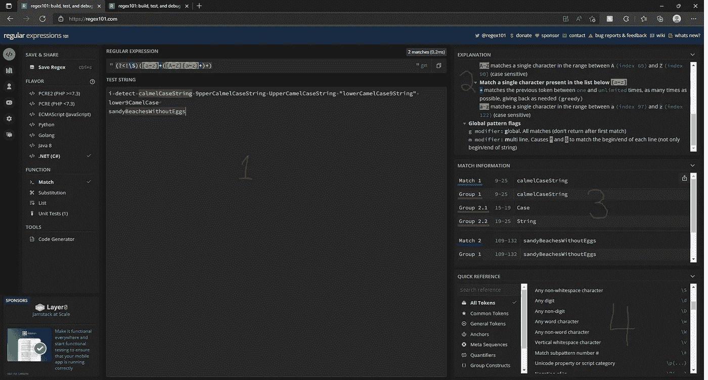
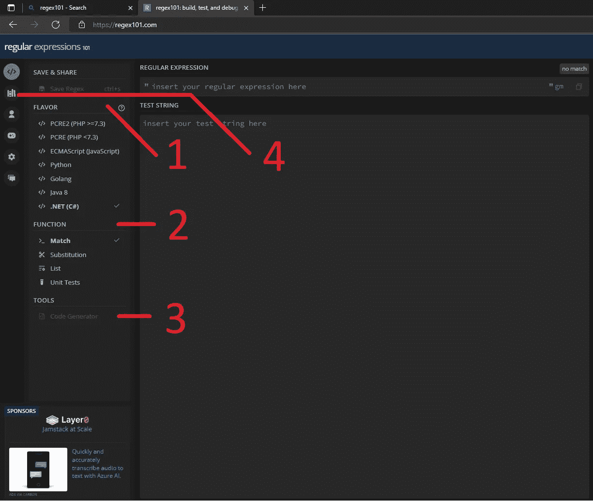

# 认识 Regex101:您没有使用的重要软件工具

> 原文：<https://betterprogramming.pub/meet-regex101-the-vital-software-tool-youre-not-using-24aa93518db4>

## 打破正则表达式循环

安特·汉默斯米特在 [Unsplash](https://unsplash.com?utm_source=medium&utm_medium=referral) 上的照片

让我们来谈谈正则表达式循环:

1.  你想解析一个字符串。
2.  您意识到您可以用正则表达式将二十行复杂的代码转换成两行可读的代码。
3.  你已经六个月没用过正则表达式了。
4.  您已经为当前的用例学习了足够多的正则表达式。
5.  你做出你的正则表达式。这比你计划的要多花三倍的时间，但是很有效。(huzzah！)
6.  六个月过去了，你忘记了你所学的。重复一遍。

我和你们中的许多人一样，曾经陷入这种循环。我在书桌抽屉里放了一张[正则表达式小抄](https://cheatography.com/davechild/cheat-sheets/regular-expressions/)，这样我就可以定期掸去灰尘，重新开始学习。这种循环让我充满了负罪感。是的，如果没有正则表达式，我的代码会更加混乱。但是，它可能会做得更快。这是在浪费我的时间吗？这是在浪费我公司的时间吗？

一天晚上，当我和一位大学朋友聊天时，一切都变了。我在下班后远程登录工作，试图敲出一个特别复杂的正则表达式。在我发泄完我的沮丧之后，他说“你为什么不用 Regex101？”

他说得好像我是个白痴。这不是不准确的。使用 Regex101，您可以快速轻松地编写和测试正则表达式。(论文陈述)

# Regex101 的基本功能

学习软件工具的最好方法是使用它。我恳请你在 https://regex101.com[查看一下。](https://regex101.com/)

1.  **主窗口:**主窗口允许你写一个正则表达式，然后看它是否匹配你提供的测试字符串。

对于本文，我编写了一个匹配小写字母字符串的正则表达式。一路上我有一些错误，但仍然用了不到 5 分钟。

2.**解释:** Regex101 在右上方的窗格中提供了一个书面解释，说明您的表达式在做什么。这是学习正则表达式的强大工具。我发现自从使用 Regex101 以来，我已经设法保留了更多关于正则表达式的知识。

3.**匹配信息:**您的匹配项和每个匹配项的子组列表显示在右侧的中间窗格中。这是从您的测试字符串生成的。个人认为，这清理了 C#的 Match 类中的一些属性。

4.**快速参考:**右下窗格中提供了一个可搜索的正则表达式语法词典。

# Regex101 的高级功能

1.  **风格选择:** Regex101 提供了多种实现供选择，因此您知道您正在生成的正则表达式将在您的代码库中工作。

2.**功能:** Regex101 有多种匹配之外的功能。这些包括替换(正则表达式的一个重要用例)和单元测试！

3.**代码生成:** Regex101 将生成一个例子，展示如何用各种语言实现你的正则表达式。语言有不同的方式声明和使用正则表达式，这可以省去你额外的谷歌搜索。

4.库:也许有人已经写出了你要找的表达式！在重新发明轮子之前，您总是可以搜索用户提交的正则表达式库。

# 最后

正则表达式是软件工程中一个强大的工具。它们可以使你的代码更短，更易读，更容易测试。Regex101 允许我们清晰而自信地快速使用这个工具。

我从来没有打算写这篇文章。我在写一篇关于软件模式的文章，我称之为上下文驱动脚本语言。但是正则表达式是讨论的主要部分，所以我想要另一篇关于 Regex101 的文章来链接。我也写过更多关于[遗留代码](https://medium.com/codex/legacy-code-2cb94a33dcd0)和[错误分类](/what-is-a-bug-anyways-dd5700e89589)的高水平文章。如果你感兴趣，请点击进入。