# 认识 Thonny，Python 初学者的完美 IDE

> 原文：<https://betterprogramming.pub/meet-thonny-the-perfect-ide-for-python-beginners-2e5905674939>

## 去除杂念，充满力量


阿列克西·塔普拉在 [Unsplash](https://unsplash.com?utm_source=medium&utm_medium=referral) 上的照片。

想一头扎进 Python 编程却不知道从何下手？别担心。 [Thonny](https://thonny.org/) 会指引你一路前行。你甚至不用安装 Python。

对于初学者来说，设置环境的过程可能是一项艰巨的任务，与经验丰富的开发人员交谈可能会使事情变得更糟。VIM 真的是初学者的好编辑器吗？

初学者需要的是写代码，看看发生了什么，得到反馈。每个人都必须对他们的代码进行故障诊断，但是简单而强大的视觉反馈可以帮助你更快地学习。

Thonny 是一个为初学者设计的简单 IDE。使用内置的调试器和一个助手来查看您的代码为什么会出错，该助手会告诉您哪里出错了，同时还会提出改进的方法。这是一个完美的学习平台。

# 设置 Thonny

设置 Thonny 很简单。在撰写本文时，Thonny 内置了 Python 3.7。

要开始，请转到 [Thonny](https://thonny.org) 并在页面顶部找到您的操作系统的安装程序:


从页面顶部下载安装程序。作者截图。

完成后，按照安装过程安装并启动它:

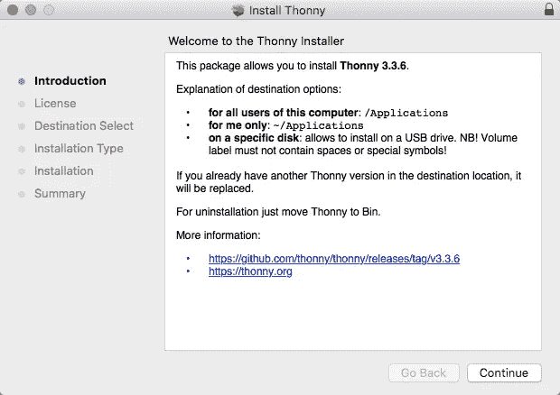

正在安装 Thonny。

Thonny 会用一些活动的 UI 元素来迎接您——很可能是编辑器和 shell。别担心，您可以随时更改希望在视图菜单中可见的 UI 元素。

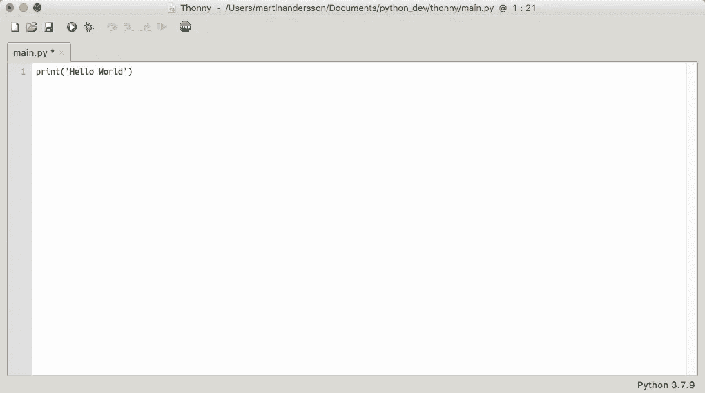

带有编辑器面板的 Thonny。

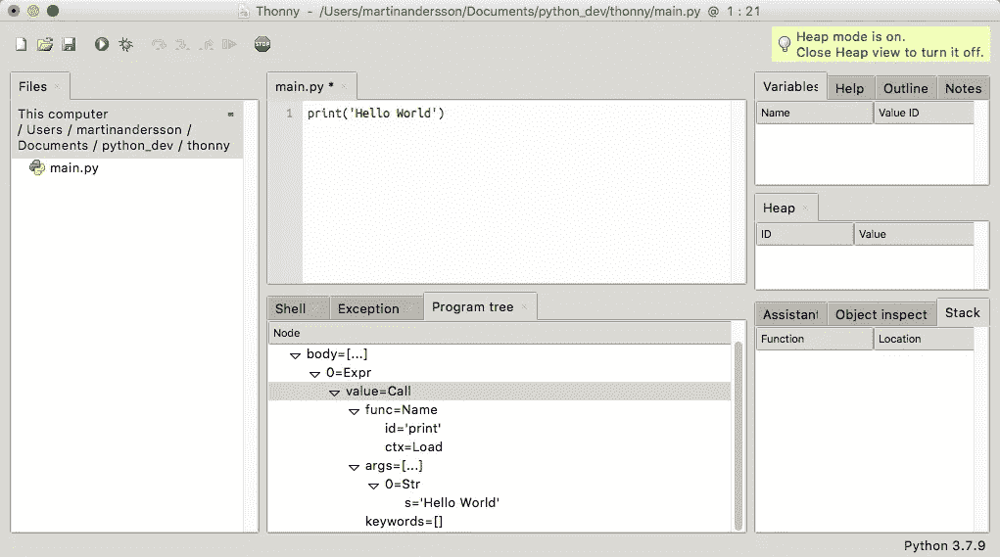

Thonny 每个面板都加载了。

保持简单。以下是我建议您开始使用的面板:

*   Shell:查看运行代码时执行了什么。
*   注意:在这里添加你的作业注释，这样你就可以把所有的东西都放在一个地方(或者把你的伪代码放在这里，而不是在你的编辑器里)。
*   变量:永远知道你的变量的值。因为它们可以改变，所以当程序增长时很容易迷失方向。
*   助手:这个面板用明文告诉你，你的代码有什么问题。它也给你提示如何解决它。

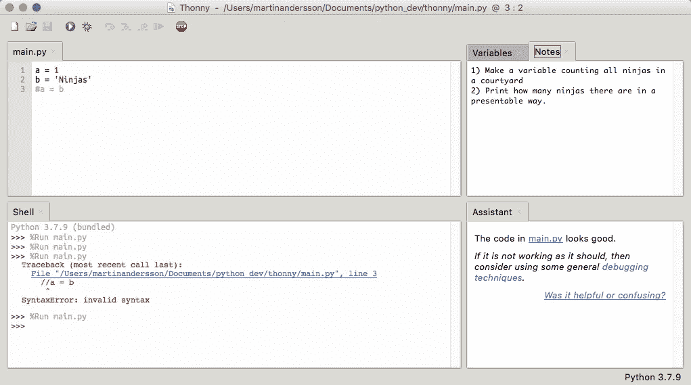

简单有效的设置。

# 偏好；喜好；优先；参数选择

在我们继续讨论特性之前，我们可能需要在首选项中查看一些内容。

我们不想在这里进入任何高级主题，但是我将强调几个不同的部分。

## 一般

如果您想要运行 Thonny 的多个实例，而不是将文件堆叠在选项卡中，您可以取消选中此选项以允许运行多个实例。

当您重新打开 Thonny 时，您可能还想重新打开上次会话中的文件。

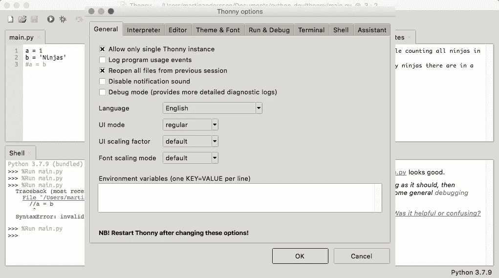

常规设置。

## 编者ˌ编辑

编辑器有一些漂亮的设置，可以帮助您在编写代码时可视化正在发生的事情。这里有一些我喜欢的活动。

*   突出匹配的名称:这可以帮助您发现变量中的拼写错误。
*   突出显示括号:便于查看您是否遗漏了开头(或结尾)。
*   突出显示语法元素:这将语法从文本和符号中分离出来，更容易发现语法错误。

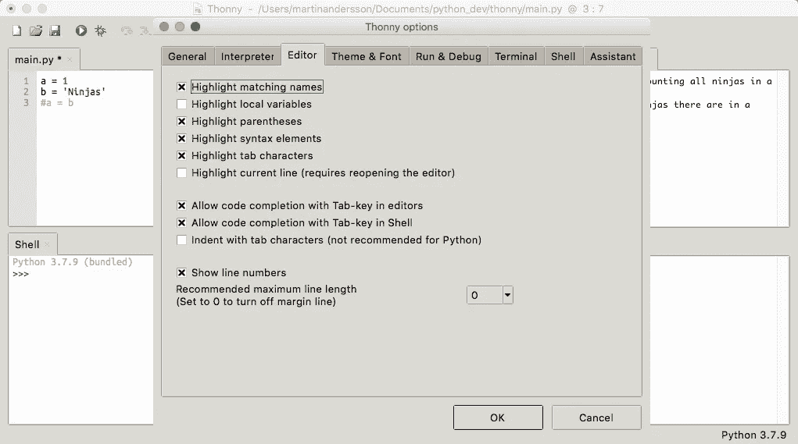

编辑。

## 主题和字体

主题和字体基于个人喜好。因此，我不会在这里发表意见。这就是我的设定，对我来说效果很好。你必须弄清楚什么适合你。

给它几个小时，这样你就可以得到一个合适的风格。

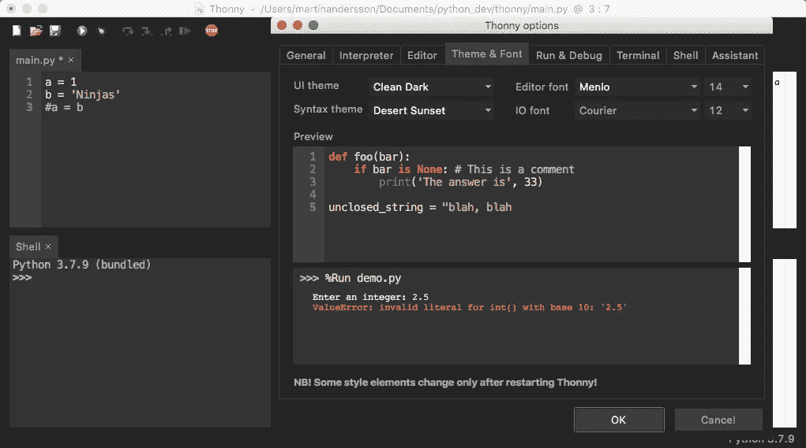

主题和字体。

# 功能

是时候去看托恩尼的美景了。

设置好 IDE 并准备好之后，您就可以开始编码了。让我们先创建一些可怕的代码来演示助手如何帮助我们。

笔记来自我们的作业，代码在左边。您可以看到我们在 shell 中遇到了一个错误，助手正在试图帮助我们解决这个问题。

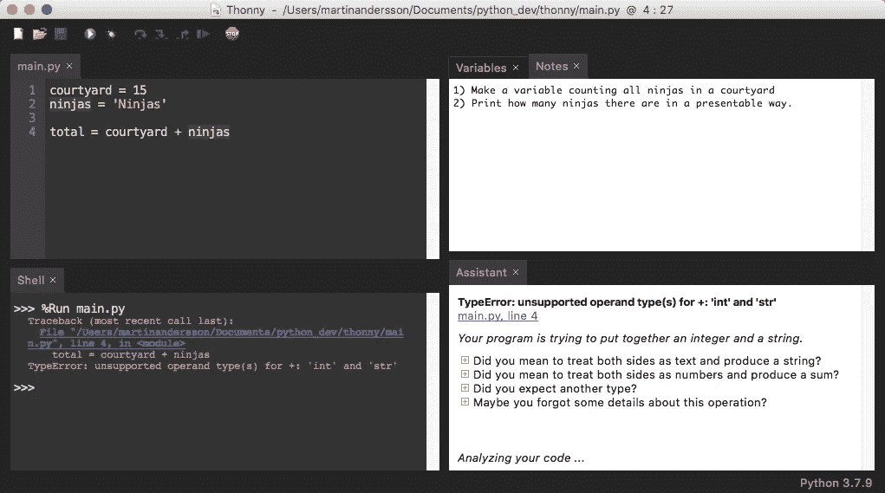

尝试连接 int 和 str 时出错。

```
TypeError: unsupported operand type(s) for +: 'int' and 'str'
main.py, line 4Your program is trying to put together an integer and a string.[+]Did you mean to treat both sides as text and produce a string?
[+]Did you mean to treat both sides as numbers and produce a sum?
[+]Did you expect another type?
[+]Maybe you forgot some details about this operation?
```

这太神奇了。

首先，助理告诉我们错误。你不能像那样连接一个`int`和一个`string`。

然后它告诉我们程序试图在第 4 行这样做。

最后，它会询问我们是否尝试过以下任何一项。在我们的例子中，我们很可能想要一个`string`以备后用。通过扩展第一个建议，我们得到了一个关于如何做到这一点的简短教程:

```
In this case you should apply function str to the integer in order to convert it to string first, eg:*str(42) + 'abc'*
```

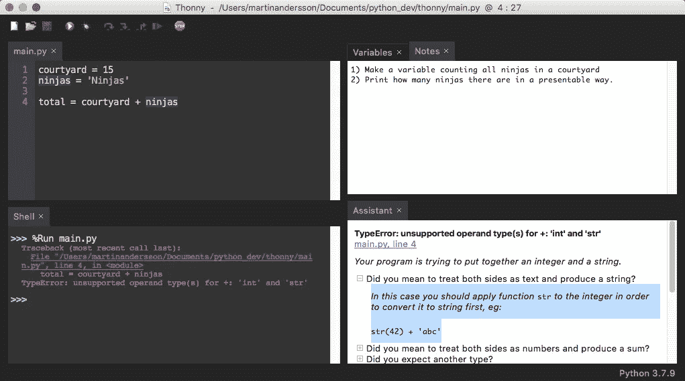

助理的建议。

对于初学者来说，这是获得代码即时反馈的绝佳方式。你不仅可以帮助检查你的代码为什么不能运行，还可以学到一些东西。

# 排除故障

Thonny 允许你调试你的代码。让我们创建一个程序，在这个程序中我们会遇到一个“索引超出范围”的错误。

```
my_list = ['one' , 'two' , 'three' , 'four']for item in range(len(my_list)-1):
    print(my_list[item])
    my_list.pop()
```

当我们运行这段代码时，我们得到:

```
**one
two**
Traceback (most recent call last):
  File "/Users/martinandersson/Documents/python_dev/thonny/main.py", line 4, in <module>
    print(my_list[item])
**IndexError: list index out of range**
```

这意味着它打印列表中的前两项，但之后不做任何事情。原因很明显。因为我们要从正在迭代的列表中删除条目，所以列表中的条目会比循环正在处理的条目少。

当循环运行两次后，列表中不再有条目，但是`range(len(my_list)-1)`告诉循环继续运行。

要调试我们的代码，请单击 bug 图标:

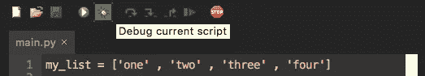

臭虫图标。

继续按“步入”(F7)来单步调试你的代码。

下面是 Thonny 的一个例子，向您展示如何计算循环的范围:

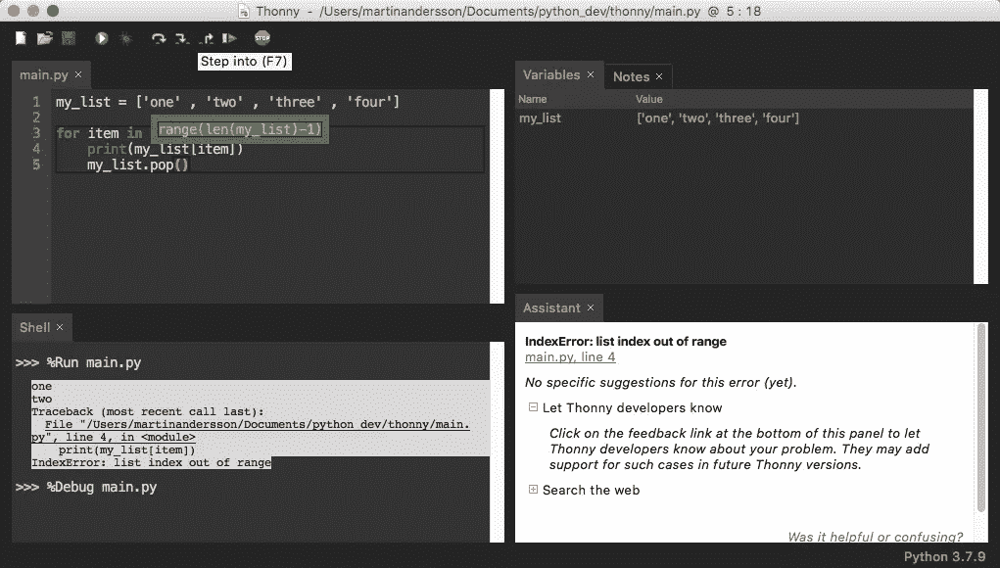

计算循环的范围。

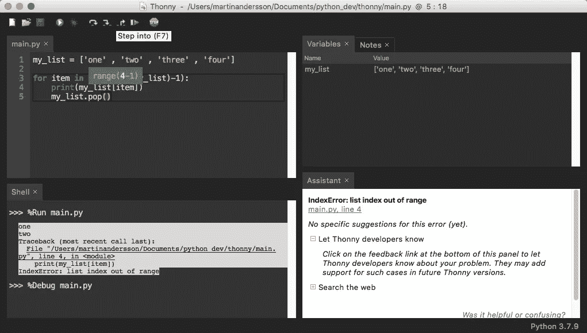

找到列表的长度，从而找到结束范围。

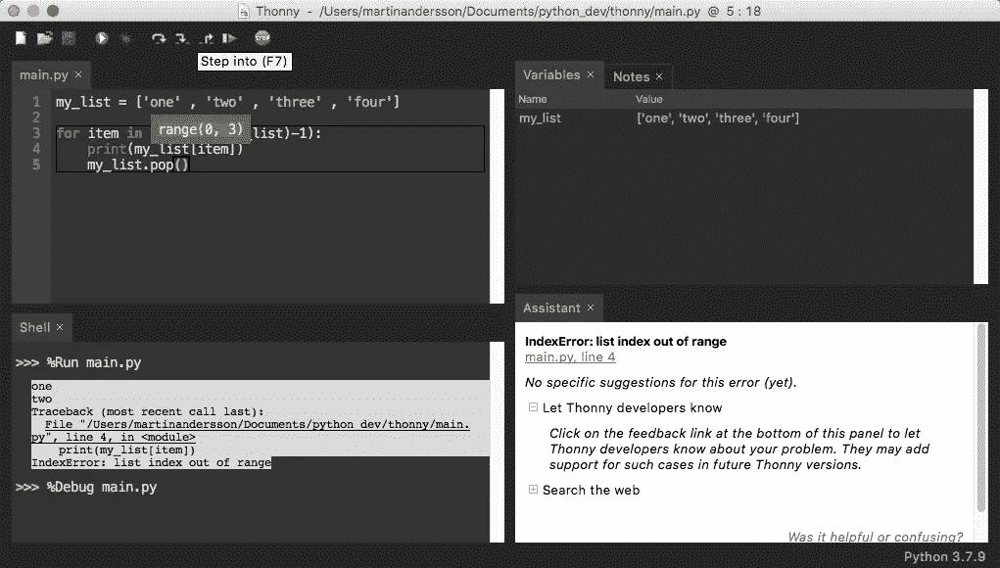

在循环开始之前设置范围开始和结束。

以下是循环内部情况的可视化表示:

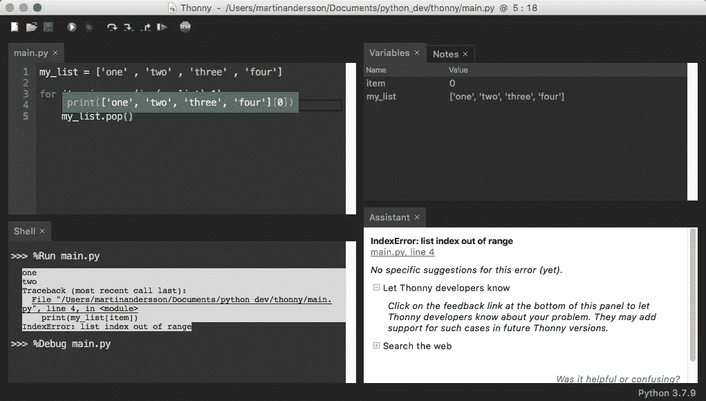

进入循环，我们可以看到 Thonny 试图打印什么。

它显示了整个列表和最后的索引。在这种情况下，它将打印`‘one’`。`0`的指数等于`‘one’`。

然而，因为我们在循环中使用了`pop()`，我们将用完索引。

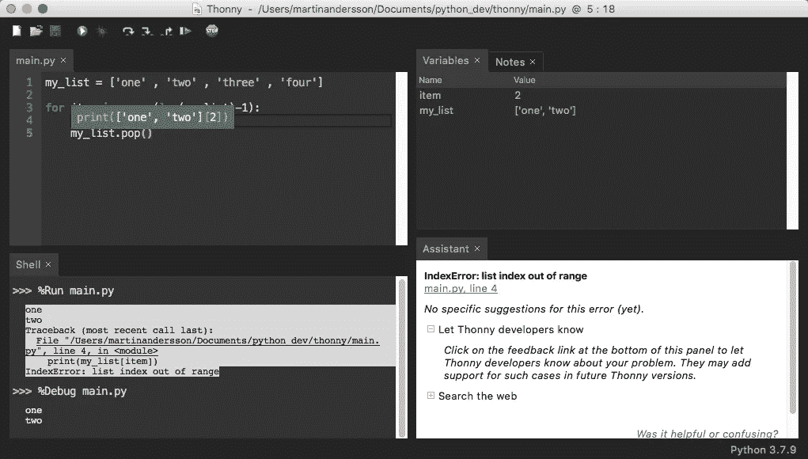

过了一会儿，我们用完了索引。我们尝试打印[2]，它在列表的新长度之外。

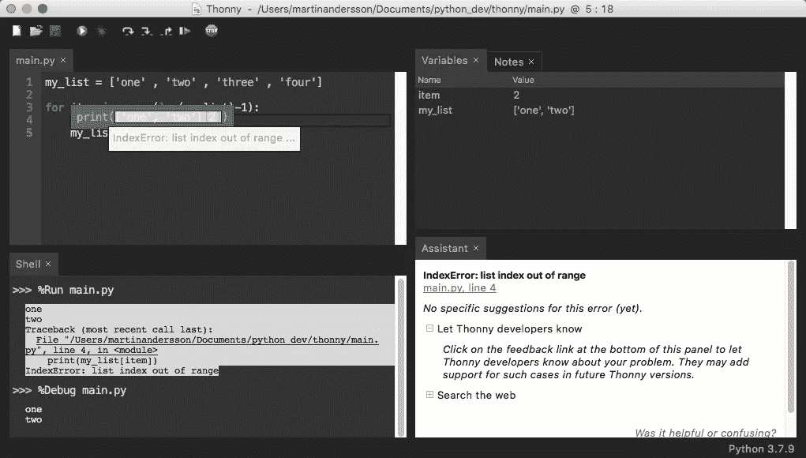

我们得到了错误。

它会产生一个错误。

如果你注意助手，Thonny 不能为你提供一个建议。如果您希望让他们知道这个错误，以便将来帮助其他人，请使用反馈链接。

# 最后的想法

如果我需要一种快速调试代码的方法，我会时不时地使用 Thonny 来把事情搞混。我喜欢这个工具的简单和它的整洁。

不过，我希望我们可以对 UI 元素做更多的调整。许多开发人员有宽屏，所以将助手堆叠在笔记旁边而不是下面是堆叠 UI 的好方法。壳也是一样。把它放在编辑器的右边会让我们看到更多的行。

我也希望滚动条、注释和助手能遵循黑暗主题。

自动完成会很好，这样你就不必键入所有的语法(例如，`[]`、`{}`、`’’`、`()`)。

如果你是初学者或者需要一些简单的东西来调试你的代码，试试 Thonny 吧。我认为这个工具对初学者来说是完美的，即使你将来很可能会跳到更高级的工具，在你的武器库中拥有它也是很好的。

谢谢你的时间。快乐编码。