# React 中的更多高图表示例:气泡、填充气泡、流图和圆柱体

> 原文：<https://betterprogramming.pub/meeting-more-chart-types-bubble-packed-bubble-stream-graph-and-cylinder-7f625c88047d>

## 探索企业级应用程序的图表类型


由[卢卡斯·布拉塞克](https://unsplash.com/@goumbik?utm_source=medium&utm_medium=referral)在 [Unsplash](https://unsplash.com?utm_source=medium&utm_medium=referral) 上拍摄的照片

# 介绍

[Highcharts](https://github.com/highcharts) 是一个基于 SVG 的企业级 JavaScript 图表库。它附带了优秀的文档和无数的例子。唯一的缺点是许可证是专有的。个人/非商业用途是免费的，但商业用途必须付费。

在[上一篇](https://medium.com/better-programming/7-examples-to-master-highcharts-in-react-33938fab5171)中，我们介绍了 Highcharts 和`line`、`spline`、`area`、`areaspline`、`column`、`bar`、`pie`、`scatter`、`scatter3d`、`heatmap`、`treemap`、`gauge`12 种图表类型。

在那篇文章中，我们使用 [Create React App](/an-in-depth-guide-for-create-react-app-5-cra-5-b94b03c233f2) 构建了一个工作环境来探索 Highcharts。我们继续使用该环境来尝试更多的图表类型`bubble`、`packedbubble`、`streamgraph`和`cylinder`。

正如我们在那篇文章中所解释的，建议为每个图表包含以下导入:

```
import Highcharts from 'highcharts';
import HighchartsReact from 'highcharts-react-official';
import _ from 'lodash';
import HighchartsExporting from 'highcharts/modules/exporting';
import HighchartsAccessibility from 'highcharts/modules/accessibility';
```

*   `highcharts`:是 JavaScript 制图库。
*   `highcharts-react-official`:这是 React 官方支持的 Highcharts 包装器。
*   `lodash`:这是一个现代的 JavaScript 实用程序库，提供模块化、高性能和额外功能。由于 [lodash 自带 Create React App](https://medium.com/better-programming/lodash-create-react-apps-built-in-library-for-debounce-and-throttle-with-hooks-3418087f44d8) ，我们方便地使用它的功能`_.startCase`，使每个首字母大写。
*   `highcharts/modules/exporting`:high charts 导出模块，向`View in full screen`、`Print chart`、`Download PNG image`、`Download JPEG image`、`Download PDF document`、`Download SVG vector image`提供与导出相关菜单项的菜单。
*   `highcharts/modules/accessibility`:为生成的图表 HTML 提供辅助功能的是 Highcharts 辅助功能模块。

# 气泡图

气泡图是一种显示三维数据的图表。每个实体以`[x, y, z]`格式编码，其中`[x, y]`指定位置，`z`是尺寸。

下面是修改后的`src/App.js`:

*   在第 6 行和第 9 行，加载了气泡图所需的`highcharts/highcharts-more`。
*   在第 12–16 行，定义了图表的`type`、`width`和`height`。
*   在第 17–19 行，图表标题由类型组成。
*   在第 20-24 行，`yAxis`配置了一个`title`。
*   在第 25–35 行，`series`定义了三组数据点(第 26–28 行、第 29–31 行以及第 32–34 行)。
*   在第 36–38 行，默认信用已被关闭。
*   在第 43 行，创建了气泡图。

执行`yarn start`，我们会看到一个气泡图。

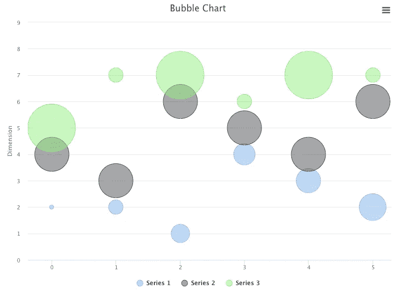

作者图片

# 包装气泡图

[打包气泡图](https://www.highcharts.com/docs/chart-and-series-types/packed-bubble)是一种气泡图，其位置`[x, y]`被自动计算以将气泡打包在一个簇中。不需要格式，`[x, y, z]`，打包气泡图只需要尺寸的`z`值。它使用大小和颜色(可选)来可视化数据。

下面是修改后的`src/App.js`:

*   在第 6 行和第 9 行，加载了`highcharts/highcharts-more`，这是打包气泡图所需要的。
*   在第 12-16 行，定义了图表的`type`、`width`和`height`。
*   在第 17–19 行，图表标题由类型组成。
*   在第 20–29 行，最小气泡尺寸配置为 30%，最大气泡尺寸配置为 100%。数据标签已启用，点的名称将格式化每个标签。
*   在第 30–111 行，`series`定义了四组数据点，`A`(第 33–50 行)，`B`(第 54–75 行)，`C`(第 79–92 行)，以及`D`(第 96–109 行)。
*   在第 112–114 行，默认信用已被关闭。
*   在第 119 行，创建了打包气泡图。

执行`yarn start`，我们会看到一个打包的气泡图。

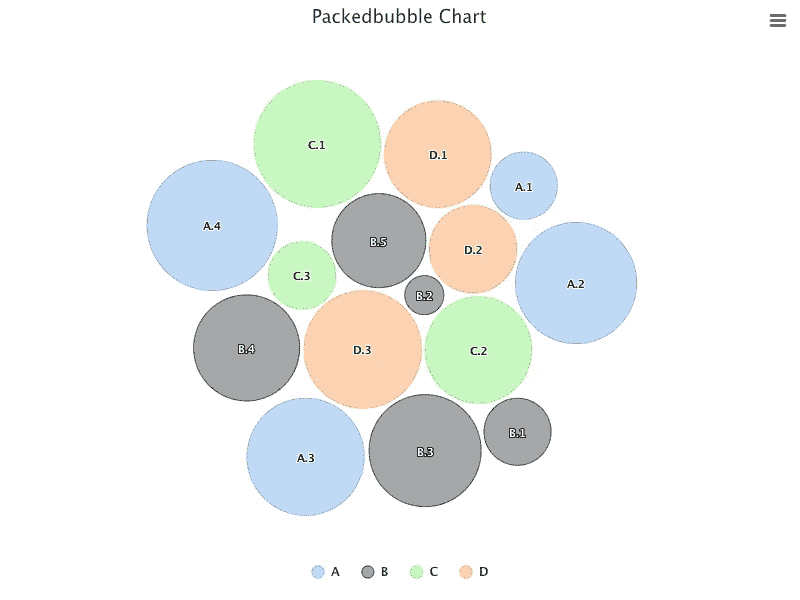

作者图片

包装气泡图具有拖放功能，允许用户在系列之间移动一个选定的气泡，以检查它们的关系如何随着移动而变化。

# 流图和面积图

[流图图](https://www.highcharts.com/docs/chart-and-series-types/stream-graph)是围绕中心轴移动的堆积面积图，形成一个流动的有机形状。它通常用于显示不同类别或一段时间内的复合体积。

下面是修改后的`src/App.js`:

*   在第 6 行和第 9 行，加载了`highcharts/modules/streamgraph`，这是流图图表所需要的。
*   在第 12–16 行，定义了图表的`type`、`width`和`height`。
*   在第 17–19 行，图表标题由类型组成。
*   在第 20–22 行，`xAxis`被定义为六个类别。
*   在第 23–40 行，`series`为这些类别定义了四组卷，`Group 1`(第 24–27 行)、`Group 2`(第 28–31 行)、`Group 3`(第 32–35 行)和`Group 4`(第 36–39 行)。
*   在第 41–43 行，默认信用已被关闭。
*   在第 48 行，创建了流图表。

执行`yarn start`，我们会看到一个流图表。

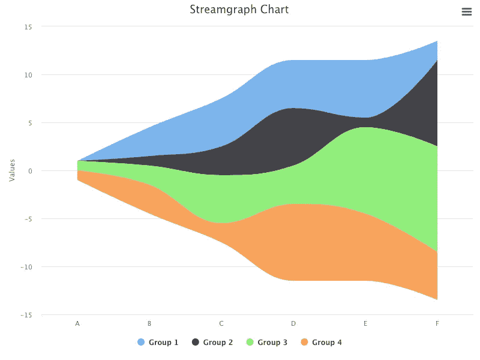

作者图片

对于相同的选项，将类型更改为`area`:

```
<HighchartsReact highcharts={Highcharts} options={getOptions('area')} />
```

执行`yarn start`，我们会看到一个面积图。

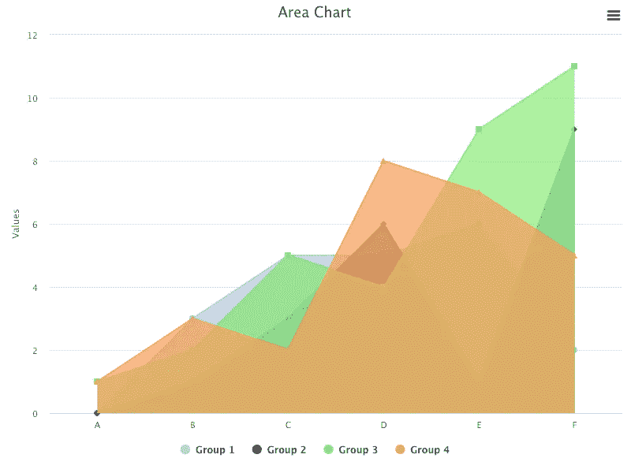

作者图片

添加`plotOptions`进行叠加:

```
plotOptions: {
  area: {
    stacking: 'normal',
  },
}
```

执行`yarn start`，我们会看到一个堆积面积图。

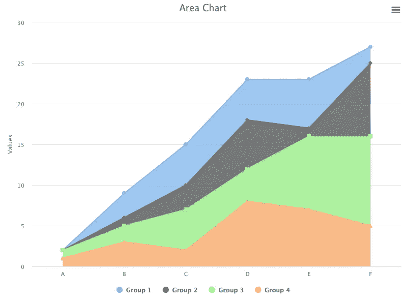

作者图片

将类型更改为`areaspline`:

```
plotOptions: {
  areaspline: {
    stacking: 'normal',
  },
}
...

function App() {
  return (
    <HighchartsReact highcharts={Highcharts} options={getOptions('areaspline')} />
  );
}
```

执行`yarn start`，我们会看到一个面积线图。

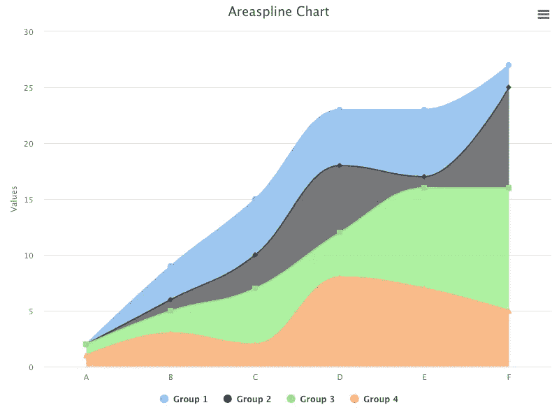

作者图片

它看起来像流图图表吗？

流图图表围绕中心轴显示，而堆积面积线图图表沿着`xAxis`显示。否则，他们是相似的。

# 圆柱图和柱形图

[三维柱形图](https://www.highcharts.com/docs/chart-and-series-types/3d-cylinder)是三维柱形图的变体，它以圆柱形点为特征。

下面是修改后的`src/App.js`:

*   在第 4 行和第 8 行，`highcharts/highcharts-3d`被加载，因为柱面图是一个 3D 图。
*   在第 7 行和第 11 行，`highcharts/modules/cylinder`被加载，这是柱面图所需要的。
*   在第 14–18 行，定义了图表的`type`、`width`和`height`。
*   在第 19–21 行，图表标题由类型组成。
*   在第 22–24 行，`xAxis`被定义为六个类别。
*   在第 25–42 行，`series`为这些类别定义了四组卷，`Group 1`(第 26–29 行)、`Group 2`(第 30–33 行)、`Group 3`(第 34–37 行)和`Group 4`(第 38–41 行)。
*   在第 43–45 行，默认信用已被关闭。
*   在第 50 行，创建了柱面图。

执行`yarn start`，我们会看到一个圆柱图。

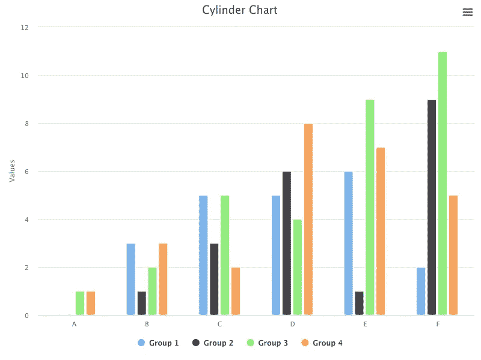

作者图片

如果你仔细观察，每根柱子的两端看起来都是圆柱形的。这是放大的视图:

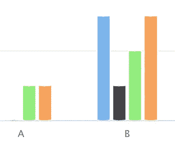

作者图片

将类型更改为`column`:

```
function App() {
  return (
    <HighchartsReact highcharts={Highcharts} options={getOptions('column')} />
  );
}
```

执行`yarn start`，我们看到一个柱形图，每根柱的两端都是边缘。

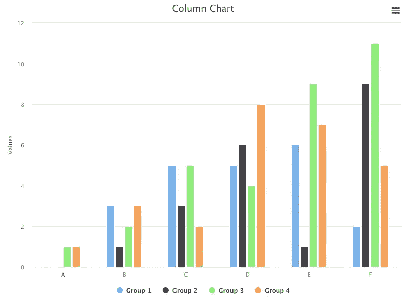

作者图片

在查看 2D 视图时，柱形图和柱形图之间的差异很小。

增加`options3d`启用 3D 图表，配置旋转角度和深度。

```
chart: {
  type,
  width: 800,
  height: 600,
  options3d: {
    enabled: true,
    alpha: 15,
    beta: 30,
    depth: 300,
  },
}
```

这是 3D 视图中的圆柱图:

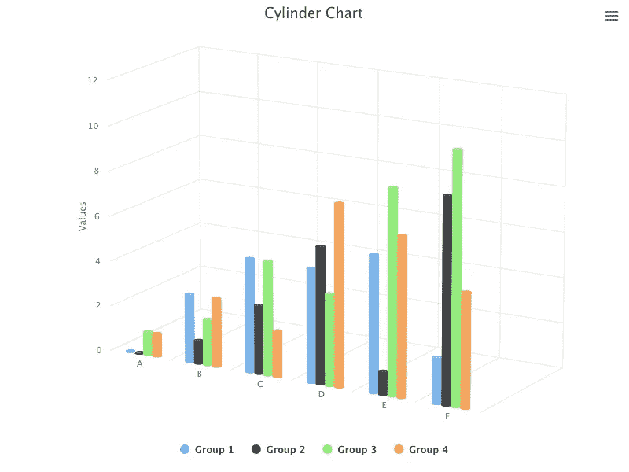

作者图片

这是 3D 视图中的柱形图:

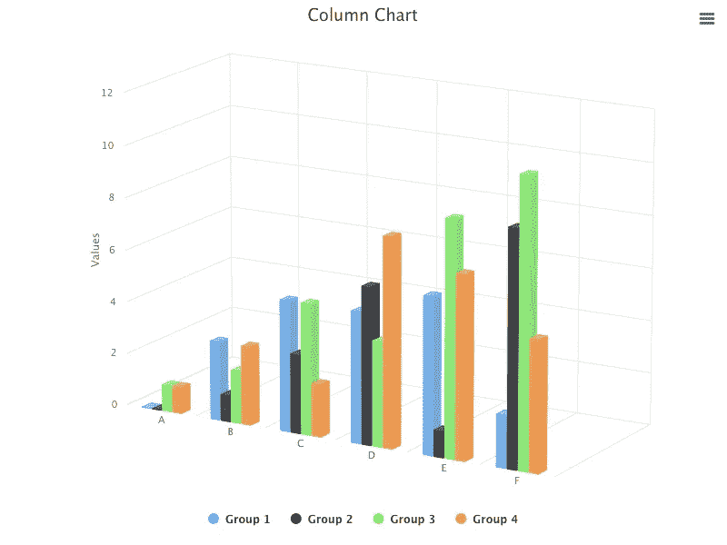

作者图片

在 3D 视图中，柱形图和柱形图之间的差异非常明显。

圆柱体看起来是圆柱形，但我们想让它更立体。我们把组放入不同的深度，设置不同直径的圆柱体(`pointWidth`)。

下面是修改后的`src/App.js`:

*   在第 31-34 行，`zAxis`配置有`min`和`max`值。
*   在第 36–41 行，`Group 1`将`depth`设置为 0，`pointWidth`设置为 30。
*   在第 42-47 行，`Group 2`将`depth`设为 100，`pointWidth`设为 20。
*   在第 48–53 行，`Group 3`将`depth`设置为 200，将`pointWidth`设置为 20。
*   在第 54-59 行，`Group 4`将`depth`设置为 300，将`pointWidth`设置为 50。

执行`yarn start`，3D 柱面图非常立体。

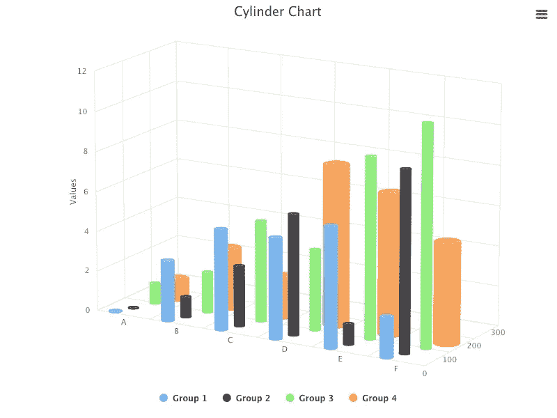

作者图片

将类型更改为`column`:

```
function App() {
  return (
    <HighchartsReact highcharts={Highcharts} options={getOptions('column')} />
  );
}
```

3D 柱形图也非常立体，它更清晰地显示了深度。

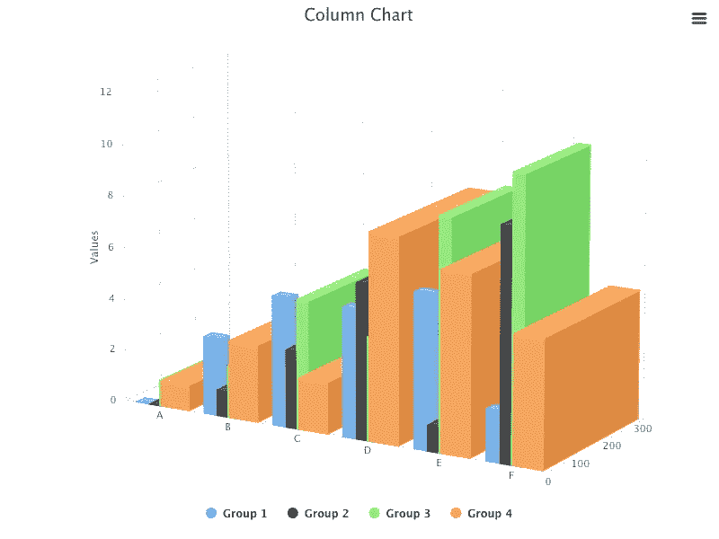

作者图片

# 结论

Highcharts 是一个基于 SVG 的企业级 JavaScript 图表库。它附带了优秀的文档和无数的例子。

在本文中，我们介绍了其他图表类型`bubble`、`packedbubble`、`streamgraph`和`cylinder`。

我们也写过关于其他高图表类型的文章:

*   [本条](https://medium.com/better-programming/7-examples-to-master-highcharts-in-react-33938fab5171)中:`line`、`spline`、`area`、`areaspline`、`column`、`bar`、`pie`、`scatter`、`scatter3d`、`heatmap`、`treemap`、`gauge`。
*   在[本条](https://medium.com/javascript-in-plain-english/more-highcharts-examples-in-react-sankey-diagram-arc-diagram-dependency-wheel-and-network-graph-cb45f57736e3)中:`sankeydiagram`、`arcdiagram`、`dependencywheel`、`networkgraph`。
*   在[这篇文章里](https://javascript.plainenglish.io/exploring-parallel-coordinates-highcharts-in-react-dba3affc45a0) : `parallelCoordinates`。

Highcharts 对于个人/非商业用途是免费的，但是对于商业用途你必须付费。如果你的预算允许，强烈推荐 Highcharts。

感谢阅读。

```
**Want to Connect?** 

If you are interested, check out [my directory of web development articles](https://jenniferfubook.medium.com/jennifer-fus-web-development-publications-1a887e4454af).
```