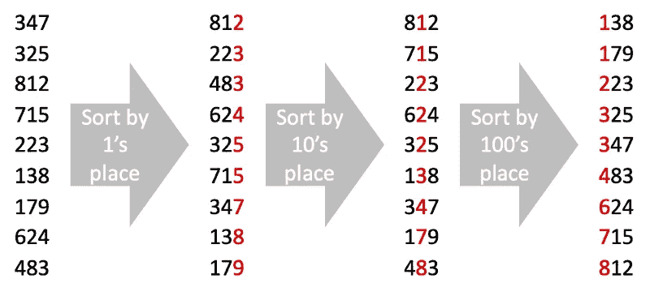
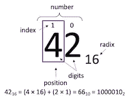
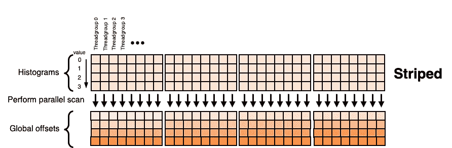
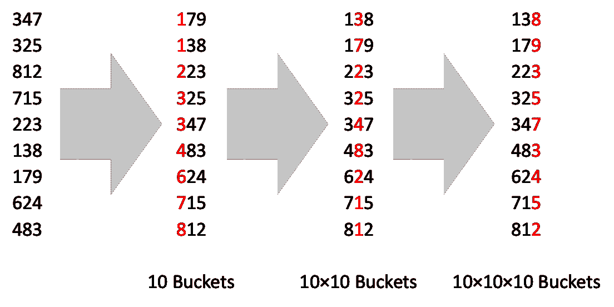
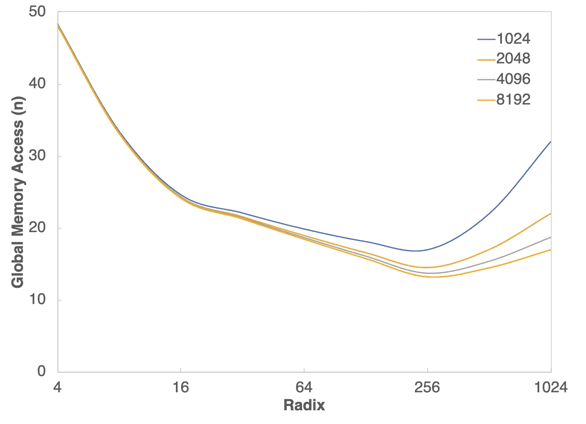
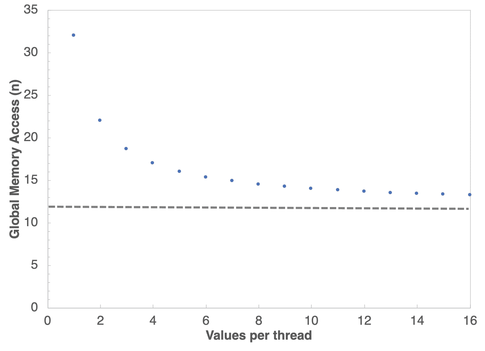
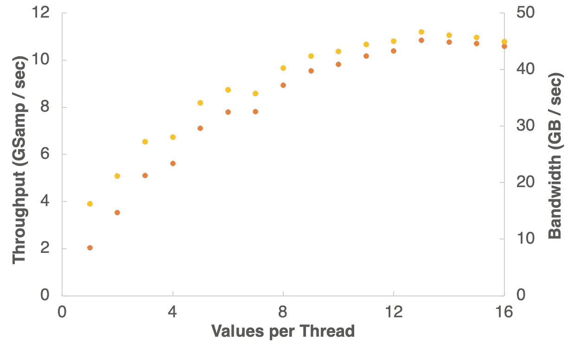
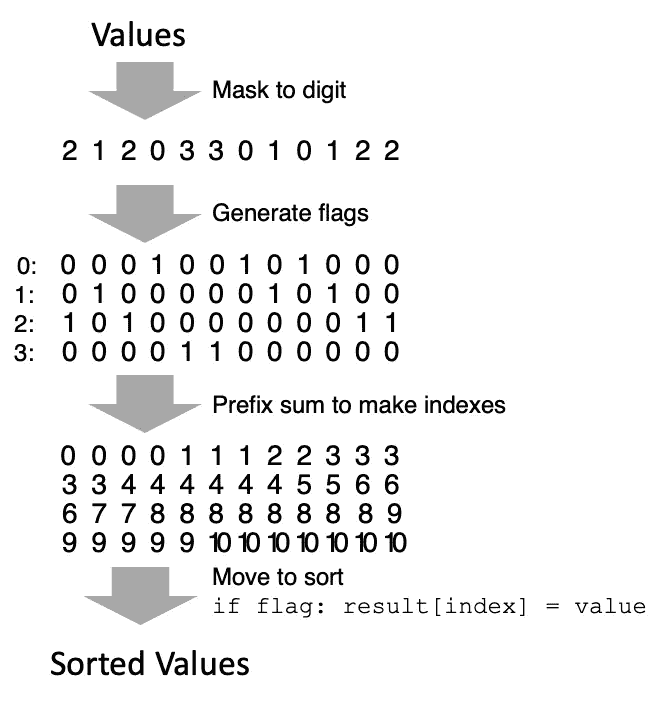
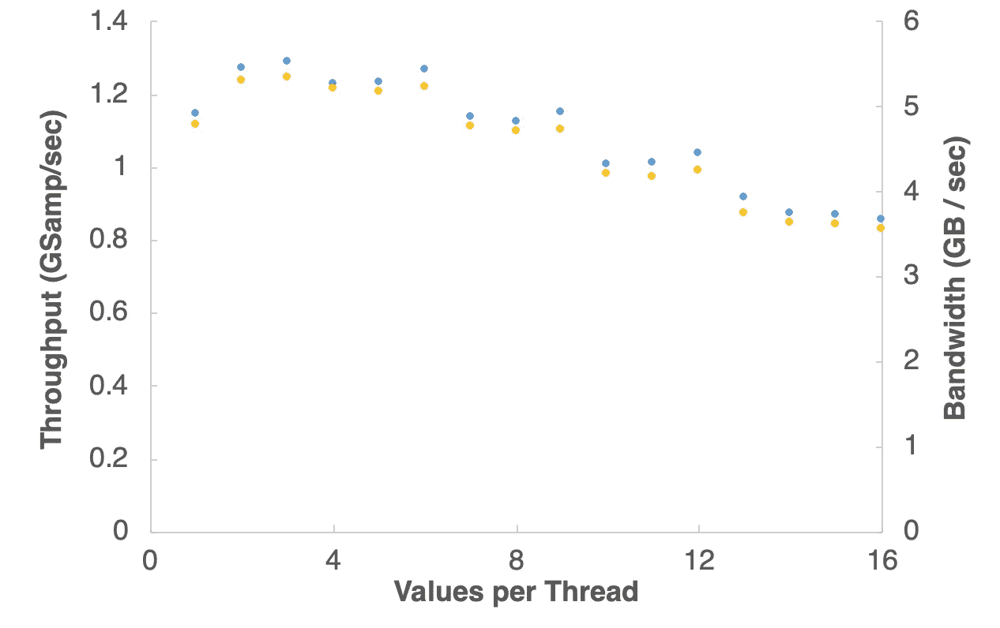
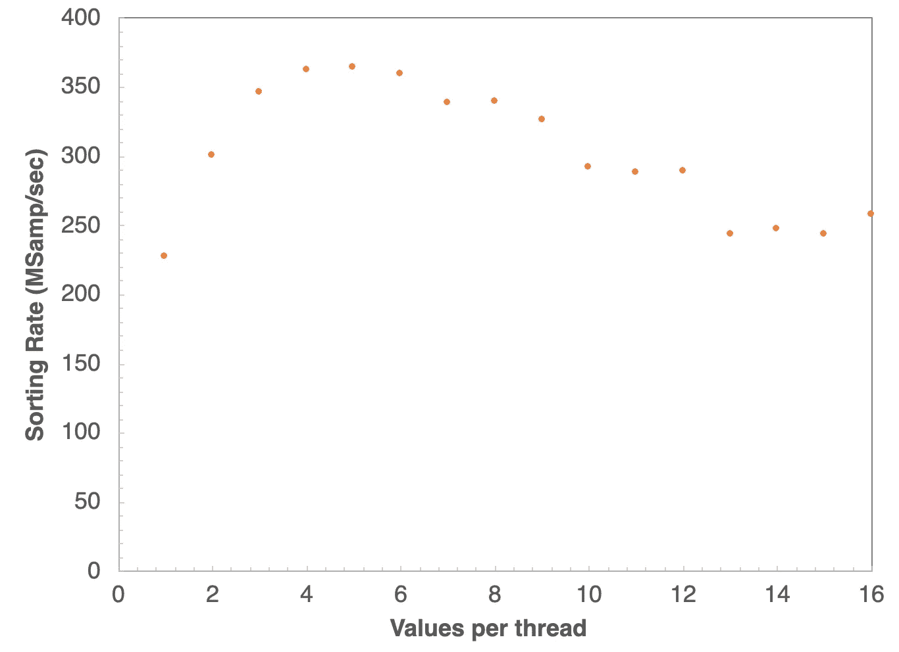

# 内存带宽优化的并行基数排序在金属苹果 M1 和超越

> 原文：<https://betterprogramming.pub/memory-bandwidth-optimized-parallel-radix-sort-in-metal-for-apple-m1-and-beyond-4f4590cfd5d3>

## Metal 中用于原始数据类型的排序着色器


M1 形象。版权所有 2022 苹果公司。保留所有权利。参见[许可证](https://www.apple.com/newsroom/2020/11/apple-unleashes-m1/)了解使用限制。

并行排序是一种在大规模并行架构上广泛使用但仍然难以实现的原语。这些挑战包括不规则的内存访问模式、数据的多次传递、中间存储要求以及导致线程分歧的分支。在这个故事中，我们将在 Metal 中开发一个用于原始数据类型的排序着色器。

对这些数据进行排序的自然算法选择是基数排序，因为它的总时间复杂度是`O(k•n)`而不是基于比较的排序中的`O(n•log(n))`，其中`n`是值的数量，`k`是表示最大值所需的位。基数排序是计数排序的一种形式，因此，这项工作建立在我们高效的[扫描](https://kieber-emmons.medium.com/efficient-parallel-prefix-sum-in-metal-for-apple-m1-9e60b974d62)和[归约](https://kieber-emmons.medium.com/optimizing-parallel-reduction-in-metal-for-apple-m1-8e8677b49b01)原语之上，以分割和分散值。

# 简要背景

文献中已经讨论了并发系统基数排序的许多变体。这些变化中的共性是计数步骤，由此确定数值序列中特定位置的数字的频率，接着是分割步骤，其中基于该数字将数值分成桶。对值中的每个位置重复这些步骤。例如，基数为 2 的基数排序产生数字 0 和 1。

对 0 的数量进行计数，以便可以将 1 移动到 0 之后的位置。对数字中的每个后续位置重复该过程。对于 32 位值，这意味着数据要经过 32 次传递，每次传递都由计数步骤和移动步骤组成。敏锐的读者当然会认识到，按位划分可能发生在一位上的`k`遍或`k`位上的一遍。在后一种情况下，计数将不再是一个值，而是每个数字的频率直方图。



为了执行基数排序，对值的位值进行 k 次遍历(其中 k 是位数)。版权 2022 马修·基伯-埃蒙斯。保留所有权利。

简单说说基本词汇——位置记数法用按位值顺序排列的数字来表示数字。该数字与其位值的乘积之和等于该数。给定数字的索引是该数字在数字中的位置。数字的基数是每个位置可能的唯一位数。例如，16 进制(十六进制)数可以跨越数字`{0, 1, 2, 3, 4, 5, 6, 7, 8, 9, A, B, C, D, E, F}`。



以 16 为基数的数字 42 的表示。版权 2022 马修·基伯-埃蒙斯。保留所有权利。

回到基数排序——在这一点上，总体算法是什么样子，以及基数排序为什么如此好地映射到并行架构，应该是相当明显的。对数字中的第一个位置执行计数排序，然后对数字中的每个位置重复执行，直到值排序完毕。I)计数以生成直方图，ii)计数的前缀扫描，以及 iii)值重新排序这三个基本步骤都是去耦操作，因此很容易并行化。


广义基数排序的实现步骤。版权 2022 马修·基伯-埃蒙斯。保留所有权利。

## 算法细节

据报道，基数排序的实现细节变化很大，很大程度上针对给定的架构或问题进行了优化。尽管有这些变化，基数排序只有两种基本类型:I)更常见的算法，从最低有效位(LSD)开始，向最高有效位前进；ii)不太常见的方法，从最高有效位(MSD)开始，向最低有效位前进。一如既往，细节决定成败，选择 MSD 或迷幻药的意义深远。

**最低有效位**。给定一个数组值`{a0, a1, …, an}`，其中`n`是值的数量，LSD 排序遍历每个位，从最低位开始，逐位划分，直到我们用完所有的位。为了在给定的通道中高效地并行划分，我们需要创建一个直方图，其中包含给定数字的频率。该直方图在输出数组中生成偏移量，用于对值进行重新排序。

在第一遍中，移动步长的相对顺序并不重要，但是在后续的遍中，重新排序必须是稳定的，这意味着必须保留先前遍中低位的相对顺序。因此，每个`threadgroup`在计数步骤中创建自己的局部直方图。为了确定给定`threadgroup`中给定数字的全局位置，我们在整个直方图集合上使用唯一前缀和来生成偏移量。

[技巧](https://doi.org/10.1145/125826.126164)是将局部直方图以条状而非分块配置(即，列主顺序)存储到全局直方图阵列，以避免前缀和计算所需的转置。与局部偏移量一起，我们可以计算一个全局索引来确定在哪里放置一个给定值。对要排序的值中的每个位置重复此过程。



如果线程组(本地)直方图以条带化(列主)顺序存储，简单的并行排他前缀扫描会产生全局偏移量。版权 2022 马修·基伯-埃蒙斯。保留所有权利。

通过整个数据的次数取决于值的大小和基数。一个 32 位整数在 256 进制中需要四次传递，在 16 进制中需要八次传递。这里值得一提的最后一点是，第一遍完全分散了数据，只有在最后一遍中才会出现顺序。这不同于基于比较的排序(如合并排序)，在基于比较的排序中，人们可以从接近排序的数据集早期短路。因此，从时间角度来看，基数排序更具确定性，但在某些情况下会输给合并排序。

**最高有效位(MSD)。**给定一个值数组{a0，a1，…，an}，其中 n 是值的个数，MSD 排序也遍历每一位并逐位划分，直到我们用完所有的位。但与迷幻药不同，MSD 从最高位开始。差异是深远的，因为 I)每次分区都会产生更多排序的数据，因为每次循环都会将值移动到更小的桶中，以及 ii)从给定桶移出的移动不需要相对于彼此稳定。

例如，在对 32 位值的基数为 256 的 MSD 排序中，值的前 8 位被屏蔽并计数，以生成 256 个桶的单个全局直方图。为了完成传递，值被移动到它们各自的桶中。下一步通过执行相同的步骤对每个单独的桶进行排序，以此类推，直到所有子桶都被递归排序。



在 MSD 排序中，概念与 LSD 排序相同，但是移动不需要在给定桶内保持顺序。版权 2022 马修·基伯-埃蒙斯。保留所有权利。

因为直方图是每个桶而不是每个`threadgroup`的，所以原子计数器通常用于计算桶中的值。这些操作是高度并行的，但这也意味着对越来越小的存储桶进行排序，并维护一个存储桶大小的树。此外，尽管 Apple Silicon 上的原子操作效率很高，但这些操作仍然会有争用。最后，每个子桶中值的数量是可变的，这给 GPU 上的编码带来了挑战。可以采用各种策略来克服这一挑战。例如，[斯蒂赫勒和雅各布森](https://doi.org/10.1145/3035918.3064043)使用了一种混合方法，其中小桶被合并并直接在单个`threadgroup`中排序，而大桶被递归排序。

## 内存注意事项

不考虑 LSD 或 MSD，Metal 中一个设计合理的基数排序最低限度要求每次从全局内存移动`3n`数据的下限。这使得基数排序内存带宽密集。虽然这种内存带宽密度意味着每次使用更大的基数来排序更多的位，但这也有其自身的问题。在 LSD 排序中，直方图存储按照`2^r`的因子增加，其中`r`是基数。

此外，线程组本身必须在创建期间维护自己的本地直方图，这意味着共享内存也会限制 r 的大小并影响占用率。在 MSD 排序中，较小的基数意味着更深的直方图树，而较大的基数意味着更宽的树。虽然有机会合并存储桶并在 MSD 本地完成小型存储桶，但这些因素也限制了占用率，因为任务要么通过提交许多运行小型数据的内核来完成，要么通过内核内的分支来完成。

为了更好地权衡利弊，我们将深入分析 LSD 排序的存储和带宽要求，作为`radix`、`threadgroup`和问题大小的函数。

**全局存储。** LSD 排序是一种本质上不合适的算法，需要一个长度为`n`的辅助数组。第二辅助阵列用于存储直方图。我们算法中的每个`threadgroup`都创建了自己的直方图。因此，直方图存储需要一个长度为

`(n + p − 1) / (p × 2^k)`

其中`n` =元素数量，`p` =处理器数量(每个`threadgroup`的线程数)，而`k` =位数。注意这里的`k`不是一个元素的总位数，而是表示给定基数所需的位数，即`log2(radix) = k`，所以 base-256 要求每个元素 8 位。这

`(n + p − 1) / p`

term 简单地表示了`threadgroup`的数量，因此存储与数据的大小成比例增加，与基数的`log2`成指数增加。请注意，增加`threadgroup`中每个线程的工作(即，用`v × p`替换`p`，其中`v`是每个处理器的值的数量)会按比例减少直方图数组的大小。

**全局内存访问。如前所述，每次分拣都包括三个步骤。首先是计数步骤，从全局存储器(`n`)中读取每个值，并将数字计数的直方图写成**

`(n + p − 1) /( p × 2^k)`

接下来，确定计数的并行前缀和。我们的[有效前缀总和](https://kieber-emmons.medium.com/efficient-parallel-prefix-sum-in-metal-for-apple-m1-9e60b974d62)总体上是`~3n`，因此这里的扫描步骤贡献了大约

`3 × (n + p − 1) / (p × 2^k)`

最后，重新排序步骤读取每个值和扫描的直方图，并将这些值分散到全局内存 so 中

`2n + (n + p − 1) / (p × 2^k)`

因此，全局访问的数量大约为

`3n + 5(n + p − 1) / (p × 2^k)`

每张通行证。遍数是每个元素的 k 位除以每遍的`k`位，因此总存储器访问数是`k(element)/k(pass)`与每遍访问数的乘积。

让我们来比较一下:



32 位值基数排序访问全局内存的理论次数，作为基数和每个线程组总值的函数(即每个线程组的线程数×每个线程的值)。Base-256 是最佳的，因为它平衡了 2^k.图像 Matthew Kieber-Emmons 的直方图存储的通过次数(4 ),版权所有。

很明显，对于 32 位值，最适合的基数是 256。超过该值后，随着直方图数组在全局存储中占据主导地位，指数`O(2^k)`项会爆炸式增长。增加每个`threadgroup`的工作会产生超过某个点的递减回报:



每个线程对 32 位值作为函数值进行基数为 256 的基数排序时访问全局内存的理论次数。随着每个线程的值的增加，全局内存访问次数趋向于 12n 的下限(4 遍×每遍 3n 次访问)。图片 Matthew Kieber-Emmons，版权所有。

这表明我们调优的起点将是基数为 256，每个线程有四个值。它还强调了内存带宽在基数排序计算中的主导地位。这强烈表明，像第一步由`threadgroup`排序和存储的 [Helluy](https://hal.archives-ouvertes.fr/hal-00596730) 这样的方法是不受欢迎的。

相比之下，如果可以在 Metal 中实现去耦后视扫描内核，那么耦合直方图和解耦后视的方法([one sweep by Adinets and Merrill](https://arxiv.org/pdf/2206.01784.pdf))会更快，不幸的是，目前还不能做到这一点。

## 优化目标

这个故事将集中在实现一个有效的最低有效位(LSD)基数排序。MSD 基数排序仍然是读者的一个练习。我们的问题域将是更大的数据集(> 100M 32 位值)，以确保我们对计算核心和内存带宽都有压力。这里值得再次注意的是，最有效的基数排序算法取决于上下文；我们的 LSD 排序不是为小数组或 8 位数据类型构建的最快的排序，因为它是为更大的数据类型或数组设计的。这个故事在很大程度上建立在先前关于 [reduce](https://kieber-emmons.medium.com/optimizing-parallel-reduction-in-metal-for-apple-m1-8e8677b49b01) 和 [scan](https://kieber-emmons.medium.com/efficient-parallel-prefix-sum-in-metal-for-apple-m1-9e60b974d62) 并行原语的故事中的概念和代码之上，鼓励读者首先理解这些概念。

**全局算法。**如上所述，我们的算法将对 32 位值进行 32/k 次遍历，每次遍历都对`k`位进行排序。每一遍将由直方图-扫描-重新排序步骤组成，在最好的情况下，每一遍从全局内存产生`~3n`数据移动。但是正如所讨论的，这确实是过于乐观的近似情况。

一个基数为 256 的基数排序，每个线程有 256 个线程，每个线程有 4 个值，从全局移动大约 4.25n 次。仅考虑数据移动，例如给定 M1 58gb/秒的内存带宽，我们理论上的最大排序速率将是大约每秒 8.5 亿个 32 位值(58gb/秒÷ 17 次全局内存访问= 3.4 GB/秒；每个值 4 字节产生 0.85 G 值/秒)。与 reduce 或 scan 原语不同，我们可以想象编写以架构的全带宽运行的原语，但我们不会达到这个速率，我认为这个速率的 1/3 或大约 250–300M 值/秒是一个完全可以接受的目标。

原因是 I)排序具有非平凡的算术强度，因此需要强大的计算来使如此大的总线饱和；ii)流水线状态切换很快但不为零，因为每一遍都需要直方图内核、前缀扫描步骤中的归约和扫描内核以及重新排序内核。此外，这些可能需要依赖于 n 的大小的边界检查变量，因此更多的流水线状态改变。虽然这些状态都将被预编译，但仍然需要一些 GPU/CPU 往返时间来编码这项工作和状态切换以执行这项工作。

## 内核实现

**直方图。**直方图内核琐碎。我们将数据从全局内存加载到寄存器中，迭代这些值，并自动更新`threadgroup`(共享)内存中的局部直方图数组，然后将该数组以条带格式存储到全局内存中。

```
template<ushort BLOCK_SIZE,
         ushort GRAIN_SIZE,
         ushort RADIX, 
         typename T> kernel void
MakeHistogramOfPlaceValuesKernel(device uint* output_data,
                                 device const T* input_data,
                                 constant uint& n,
                                 constant uint& current_digit,
                                 uint group_id  
                              [[threadgroup_position_in_grid]],
                                 uint grid_size 
                                    [[threadgroups_per_grid]],
                                 ushort local_id 
                               [[thread_position_in_threadgroup]]) {
  // catch template parameter errors at compile time
  static_assert(BLOCK_SIZE >= RADIX, 
    "ERROR - BLOCK_SIZE must be greater than or equal to RADIX");
  uint base_id = group_id * BLOCK_SIZE * GRAIN_SIZE;
  // load data into registers
  T values[GRAIN_SIZE];
  LoadBlockedLocalFromGlobal(values, 
                             &input_data[base_id], 
                             local_id);
  // zero out the shared memory
  threadgroup uint histogram[RADIX];
  if (local_id < RADIX) histogram[local_id] = 0;
  threadgroup_barrier(mem_flags::mem_threadgroup);
  // iterate over values to update the histogram using an atomics
  volatile threadgroup atomic_uint* atomic_histogram =   
    reinterpret_cast<volatile threadgroup atomic_uint*>(histogram);
  for (ushort i = 0; i < GRAIN_SIZE; i++){
    uchar key = ValueToKeyAtDigit<RADIX>(values[i], current_digit);
    atomic_fetch_add_explicit(&atomic_histogram[key], 
                              1, 
                              memory_order_relaxed);
  }
  threadgroup_barrier(mem_flags::mem_threadgroup);
  // store histogram to global in column major format (striped)
  if (local_id < RADIX){
    output_data[grid_size * local_id + group_id] = 
      histogram[local_id];
  }
}
```

如上所述，对每个`threadgroup`直方图使用条纹输出格式允许通过在整个全局数组上使用简单的排他前缀和来确定全局偏移。为了简单起见，我删除了边界检查代码，这意味着这个内核只能在数组上运行，其中`n`是每个`threadgroup`的线程数的倍数。`LoadBlockedLocalFromGlobal`请参见此处的。为了更简单，我将`BLOCK_SIZE`限制为大于或等于`RADIX`，并用`static assert`强制执行。这极大地简化了 reorder 内核，但是如果希望用如下的循环替换`local_id < RADIX`测试，这里接受任何大小的`BLOCK_SIZE`都是微不足道的:

```
for (ushort i = 0; i < (RADIX+BLOCK_SIZE-1)/BLOCK_SIZE; i++) {
  if (local_id + i * BLOCK_SIZE < RADIX) {
    histogram[local_id + i * BLOCK_SIZE] = 0;
  }
}
```

因为`BLOCK_SIZE`和`RADIX`在编译时是已知的，所以这个固定循环将展开。等效回路也将取代输出测试线。您可能感兴趣的一个函数是屏蔽函数`ValueToKeyAtDigit`，它接受一个值、一个数字和一个基数(radix)作为模板参数，并返回用于索引直方图的屏蔽(key)。简化代码如下:

```
template <ushort RADIX, typename T> static inline ushort
ValueToKeyAtBit(T value, ushort current_bit){
  return (value >> current_bit) & (RADIX - 1);
}
template <ushort RADIX> static inline ushort
ValueToKeyAtBit(int32_t value, ushort current_bit){
  return ( (as_type<uint32_t>(value) ^ (1U << 31)) >> current_bit) & (RADIX - 1);
}
template <ushort RADIX, typename T> static inline ushort
ValueToKeyAtDigit(T value, ushort current_digit){
  ushort bits_to_shift = RadixToBits(RADIX) * current_digit;
  return ValueToKeyAtBit<RADIX>(value, bits_to_shift); 
}
```

因为除了无符号整数之外，我们还想处理 32 位有符号整数，所以我们必须处理这些情况，因为在缺少符号位之后，符号位会被排序。在有符号整数的情况下，我们使用逐位`XOR`(异或 `OR`，即`^`)在移位前翻转符号位。该掩码用于索引到本地直方图数组中，并且该桶中的计数自动递增。

直方图内核很快，但达不到内存速度。在 base-256 中，内核高度依赖于每个线程的值参数，最大化接近每秒 10 G 的值，这意味着大约 40–45 GB/秒的内存带宽。在 base-16 中，这种对每个线程的值的强烈依赖消失了，每个线程 4–16 个值总是产生大于 10G 的值/秒。我查看了`BLOCK_SIZE`参数(数据未显示)，256 是最好的，这是相当典型的，因此我们不会进一步优化这个参数。



M1 上 32 位无符号整数的内核吞吐量和有效带宽的直方图，作为每个线程值的函数(`BLOCK_SIZE` = 256)。基准测试是在配有 8 GB 内存和 256 GB 固态硬盘的 M1 Mac Mini 上进行的。在操作系统优化级别编译的代码，代表 25 次试验的平均值。图片 Matthew Kieber-Emmons，版权所有。

有一种替代方法可以生成值的直方图，这种方法在对值进行排序后会更快。给定一个排序的数组，可以生成一个头标志数组(片段是相同掩码的游程)。分段扫描或包含“最大”扫描可用于将段头线程 id 传播到段尾线程。

尾线程索引和头线程索引之间的差异是特定掩码的计数。这个过程很快，但是，当然，需要排序的值，这在全局数组排序之前是很慢的。总之，对本地`threadgroup`值进行排序，然后使用这种替代算法来确定直方图，比只对未排序的数据使用原子计数器慢大约 4 倍。尽管如此，这种替代算法在下面的重新排序内核中是有用的，在这里我们首先进行局部排序，然后进行全局分散。

**前缀求和。**因为我之前的[故事](https://kieber-emmons.medium.com/efficient-parallel-prefix-sum-in-metal-for-apple-m1-9e60b974d62)讨论了 Apple Silicon 上的金属扫描原语的细节，读者可以在那里了解更多细节。我们的前缀和代码具有较低的算术强度，对全局内存进行`~3n`访问，并显示在 M1 的内存带宽限制下进行。换句话说，它很快，你不会再从中挤出更多的时间。关于 LSD 基数排序过程中的前缀求和步骤，唯一需要考虑的是[布伦特定理](https://dl.acm.org/doi/10.1145/321812.321815)与基于整体全局内存访问选择的基数的关系。

例如，如果在 base-256 中执行排序，每个线程有 256 个线程，每个线程有一个值，那么直方图数组的大小等于或大于要排序的原始数组的大小！随着每个线程的值的数量增加，直方图数组按比例减少，因为每个`threadgroup`只维护一个直方图。因此，很明显，利用每个线程更多的工作将会大大减少这一步的工作量。

**重新排序。**直方图数组的前缀和由`threadgroup`表示，是存储每个唯一值的全局偏移量。移动必须是稳定的，这意味着产生相同掩码的值的移动尊重相对于彼此的顺序。这一点很重要，否则在对高位进行排序时，低位的排序将无法保留。这是我们的算法:

```
template<ushort BLOCK_SIZE, ushort GRAIN_SIZE, ushort RADIX, 
         typename T> 
kernel void
ReorderByPlaceValuesKernel(device T* output_data,
                           device const T* input_data,
                           constant uint& n,
                           device const uint* offsets_data,
                           constant uint& current_digit,
                           uint group_id
                             [[threadgroup_position_in_grid]],
                           uint grid_size
                             [[threadgroups_per_grid]],
                           ushort local_id
                             [[thread_position_in_threadgroup]]) {
  uint base_id = group_id * BLOCK_SIZE * GRAIN_SIZE;
  // 1) load data into registers
  T values[GRAIN_SIZE];
  LoadStripedLocalFromGlobal(values, 
                             &input_data[base_id], 
                             local_id,  
                             BLOCK_SIZE);
  // 2) sort striped values by threadgroup
  threadgroup uint shared_data[BLOCK_SIZE];
  for (ushort i = 0; i < GRAIN_SIZE; i++){
    values[i] = PartialRadixSort<BLOCK_SIZE, T, RADIX>(values[i], 
                                                      shared_data, 
                                                       local_id,
                                                   current_digit);
  }
  threadgroup_barrier(mem_flags::mem_threadgroup);
  // 3) load the global histogram into shared memory by digit
  threadgroup uint global_offset[RADIX];
  if (local_id < RADIX){
    global_offset[local_id] = 
      offsets_data[grid_size * local_id + group_id];
  }
  threadgroup_barrier(mem_flags::mem_threadgroup);
  // 4) create local histogram to make global indexes
  uint indexes[GRAIN_SIZE];
  for (ushort i = 0; i < GRAIN_SIZE; i++){
    // local offset by scan of head flags of the range of digits
    uchar key = ValueToKeyAtDigit<RADIX>(values[i],  
                                         current_digit);
    uchar flag = FlagHeadDiscontinuity<BLOCK_SIZE>(key,
                reinterpret_cast<threadgroup uchar*>(shared_data), 
                                                   local_id);
    ushort local_offset = local_id - 
ThreadgroupPrefixScanRaking<BLOCK_SIZE, SCAN_TYPE_INCLUSIVE>(
                                flag ? (ushort)local_id (ushort)0,
               reinterpret_cast<threadgroup ushort*>(shared_data),
                                                         local_id,
                                                      MaxOp<T>());
    indexes[i] = local_offset + global_offset[key];
    threadgroup_barrier(mem_flags::mem_threadgroup);
    flag = FlagTailDiscontinuity<BLOCK_SIZE>(key,
                reinterpret_cast<threadgroup uchar*>(shared_data), 
                                             local_id);
    if (flag){
      global_offset[key] += local_offset + 1;
    }
    threadgroup_barrier(mem_flags::mem_threadgroup);
  }
  // 5) scatter to global
  for (ushort i = 0; i < GRAIN_SIZE; i++){
    output_data[indexes[i]] = values[i];
  }
}
```

为了保持值的相对顺序以使重新排序稳定，我们以条带格式而不是块格式将值加载到寄存器中。该代码是对阻塞负载的一个小修改:

```
// non-bounds checking version of striped load into registers
template<ushort LENGTH, typename T> static void
LoadStripedLocalFromGlobal(thread T (&value)[LENGTH],
                           const device T* input_data,
                           const ushort local_id,
                           const ushort local_size) {
  for (ushort i = 0; i < LENGTH; i++){
    value[i] = input_data[local_id + i * local_size];
  }
}
```

接下来，我们对当前数字执行部分基数排序，如下所示:

```
template <ushort BLOCK_SIZE, typename T, ushort RADIX> static T
PartialRadixSort(const T value, 
                 threadgroup uint* shared, 
                 const ushort local_id,
                 const ushort current_digit) {
  T result = value;
  ushort current_bit = current_digit * RadixToBits(RADIX);
  const ushort last_bit = min(current_bit + RadixToBits(RADIX), 
                              (ushort)sizeof(T) * 8);
  while (current_bit < last_bit) {
    if (last_bit - current_bit > 1) {
      result = SortByTwoBits<BLOCK_SIZE>(result, 
                                         shared, 
                                         local_id, 
                                         current_bit);
      current_bit += 2;
    } else {
      result = SortByBit<BLOCK_SIZE>(result,  
                                     shared, 
                                     local_id, 
                                     current_bit);
      current_bit += 1;
    }
  }
  return result;
}
```

由于 Apple 已经提供了四分量向量类型，我们可以利用这一点来执行四路排序，这减少了本地传递的数量，并在需要时进行最后一次传递来排序剩余的位。这一策略源于 Ha、Krüger 和 Silva 的工作，但在算法的细节上有所不同。我们的四路功能`SortByTwoBits`如下:

```
template <ushort BLOCK_SIZE, typename T> static T
SortByTwoBits(const T value, 
              threadgroup uint* shared, 
              const ushort local_id, 
              const uchar current_bit) {

  uchar mask = ValueToKeyAtBit<4>(value, current_bit);
  // 4-way scan
  uchar4 partial_sum;
  uchar4 scan = {0};
  scan[mask] = 1;
  scan = ThreadgroupPrefixScan<BLOCK_SIZE, SCAN_TYPE_EXCLUSIVE>
                     (scan,
                      &partial_sum,
                      reinterpret_cast<threadgroup uchar4*>(shared),
                      local_id,
                      SumOp<T>());
  // make offsets from unrolled prefix sum of the partial sums
  ushort4 offset;
  offset[0] = 0;
  offset[1] = offset[0] + partial_sum[0];
  offset[2] = offset[1] + partial_sum[1];
  offset[3] = offset[2] + partial_sum[2];  
  shared[scan[mask] + offset[mask]] = value;
  threadgroup_barrier(mem_flags::mem_threadgroup);
  // read new value from shared
  T result = shared[local_id];
  threadgroup_barrier(mem_flags::mem_threadgroup);
  return result;
}
```

该算法将当前位的值屏蔽为基数为 4 的值，构建一个标志数组来表示给定值的存在，并计算标志的排他前缀和以生成索引，其中`index = scan[mask] + offset[max]`。这些索引将值按排序顺序放在共享内存中。



我们的四路排序算法的图形描述。图片 Matthew Kieber-Emmons，版权所有。

迭代一个数中给定位置的所有位，对该位置进行排序。用`n > 4`执行这种`n`方式很难，原因有几个，其中最大的原因是 Metal 只支持最多 4 个分量的向量。但是，即使 Metal 支持更大的向量，比如像我们在 OpenCL 1.2 中那样通过 8 路或 16 路向量来一次按 3 位和 4 位排序，它也可能没有什么帮助，因为 SIMD 组中的各个线程可能本来就是标量的。此外，很可能在执行单元中存在某种专有的 SIMT 魔法，因此不清楚向量操作是否以及如何被矢量化以利用执行单元。



根据每个线程的值对 32 位无符号整数的内核吞吐量和 M1 上的有效带宽进行重新排序(`BLOCK_SIZE` = 256)。基准测试是在配有 8 GB 内存和 256 GB 固态硬盘的 M1 Mac Mini 上进行的。在操作系统优化级别编译的代码，代表 25 次试验的平均值。图片 Matthew Kieber-Emmons，版权所有。

这个核比直方图核慢得多。在 base-256 中，性能峰值为每线程 4 个值，每秒约 1.3 千兆样本，相当于约 5gb/秒的带宽。我注意到在每个线程四个值的情况下，内核占用率只有 60%,值越大越低，情况越糟。没有达到最大理论占用率本身并不一定是个问题，但是值得深入研究一下，看看是什么原因导致内核这样调度，特别是因为这是一个非常耗时的内核。

对于来自 CUDA 的人来说，Xcode(截至撰写本文时)并不像 NSight 那样显示 SIMD 组(warp)占用信息，因此很难考虑线程组内的不平衡工作负载、尾部效应和部分最后一波。但是，Metal API 也简单得多，所以这种权衡是值得的，因为在内核调度期间更容易做正确的事情。

在运行缓慢的内核中，首先要寻找的是寄存器压力和共享内存的使用，这是限制占用率的因素。M1 有一个特别大的寄存器文件(根据[该](https://rosenzweig.io/blog/asahi-gpu-part-3.html)分析为 4.875 MiB)，它转化为每个`threadgroup`256 个线程可用的> 256 个寄存器。我们的内核编译到 28 个寄存器，所以我们远远低于限制。`Threadgroup`(共享)内存使用可通过`MTLComputeCommandEncoder`对象上的`setThreadgroupMemoryLength:atIndex:`在命令编码时设置。

相反，我们选择在内核中使用共享数组的静态实例化，因为对我来说，这样更容易，所以我们通过`MTLComputePipelineState`对象的`staticThreadgroupMemoryLength`属性进行查询。在每个线程组有 256 个线程的 base-256 中，我们的内核使用 2 KB 的`threadgroup`内存。在这种情况下，我们可以只添加它，但我可以想象编译器有时可能会优化一些东西，所以最好不要猜测，只使用 API 来检查。

给定在 [Apple8/Mac2 系列设备](https://developer.apple.com/metal/Metal-Feature-Set-Tables.pdf)上的 32 KB `threadgroup`内存限制，这意味着我们可以同时运行 16 个`threadgroup`，在 M1 上最多可以运行 24 个`threadgroup`(苹果引用的 1024 个线程× 24 组= 24，576 个线程[，因此这反映了占用率问题(66%)。但是，将基数降低到基数 32，将对`threadgroup`内存的需求降低到 1152 B，并不会增加占用率，因此我们需要查看指令本身，因为`threadgroup`内存不是真正的问题。](https://web.archive.org/web/20201110184757/https://www.apple.com/mac/m1/)

使用 XCode 捕获工具来查看着色器统计数据，重新排序算术指令支配着内核。考虑数字中所有位的循环，每次循环对数字进行前缀求和以划分数据。内核执行时间一半以上是 ALU 指令，大致四分之一是同步。因此，我们的内核是计算受限的，这就是为什么它需要一些时间，因为我们几乎达到了 ALU 限制器的 70%。如果我们想要一个更快的重新排序步骤，我们需要重新思考并开发一个替代算法。

**基数排序程序。**我们终于拥有了组装高性能带宽优化 LSD 基数排序的所有部件。这是结果。我们表现如何？



均匀随机 32 位无符号整数的基数排序吞吐量。基准测试是在配有 8 GB 内存和 256 GB 固态硬盘的 M1 Mac Mini 上进行的。在操作系统优化级别编译的代码，代表 25 次试验的平均值。图片 Matthew Kieber-Emmons，版权所有。

我们做得很好！对于 32 位无符号整数，我们每秒处理大约 3.64 亿个键。这算出带宽为 1.42 GB/秒，是理论值的 43%。使用 8 位无符号整数，这些内核可以实现每秒 13.2 亿个密钥。虽然这可能是一个不公平的比较，但这比`std::sort`的 introsort 算法快得多，它达到了 43 MSamp/sec，并且本身比 Accelerate 库的`vDSP_sort`函数甚至 C stdlib `qsort`都快。我考虑过为 M1 编写一个手动调整的多线程基数排序，但决定它不会与 GPU 竞争，所以真的没有意义。

# 结论

我们对全局内存访问的理论分析和一些早期测试表明，LSD 基数排序的 32 位整数在 M1 上的最佳位置是 base-256，每个线程组有 256 个线程。因此，每个线程的值的数量实际上是唯一可调整的参数。最大占用率和最大排序率是通过每个线程四个值来实现的。很难看出哪里还能获得额外的性能；我会对你的想法感兴趣。

源代码在[我的要诀](https://gist.github.com/kieber-emmons/7c30e2ba3e02da30bbb44baee6bada39#file-parallelradixsort-metal)中。感谢阅读！