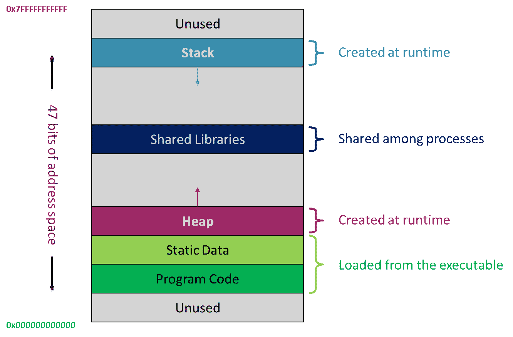
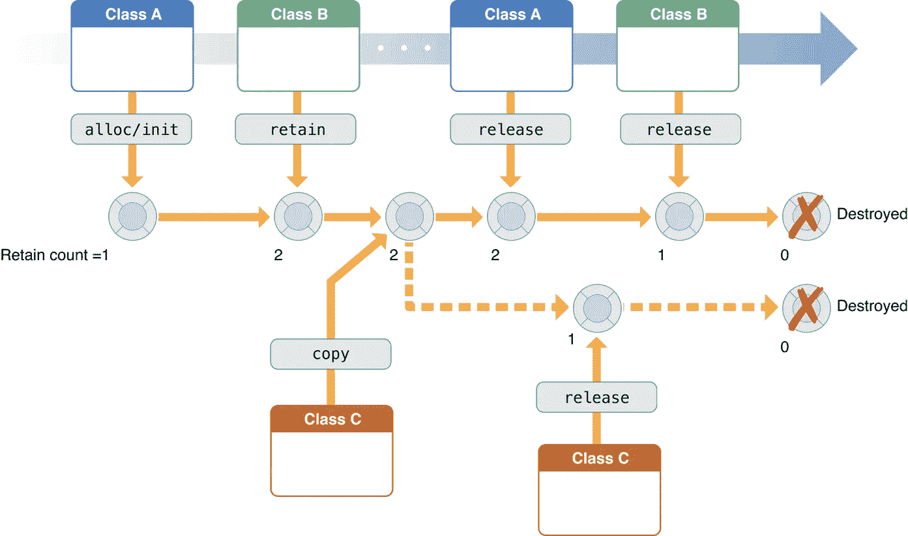
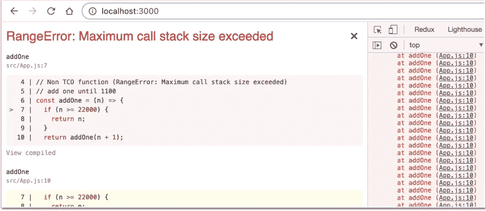
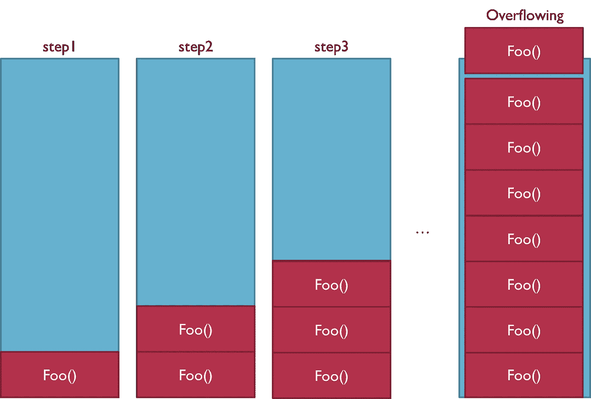
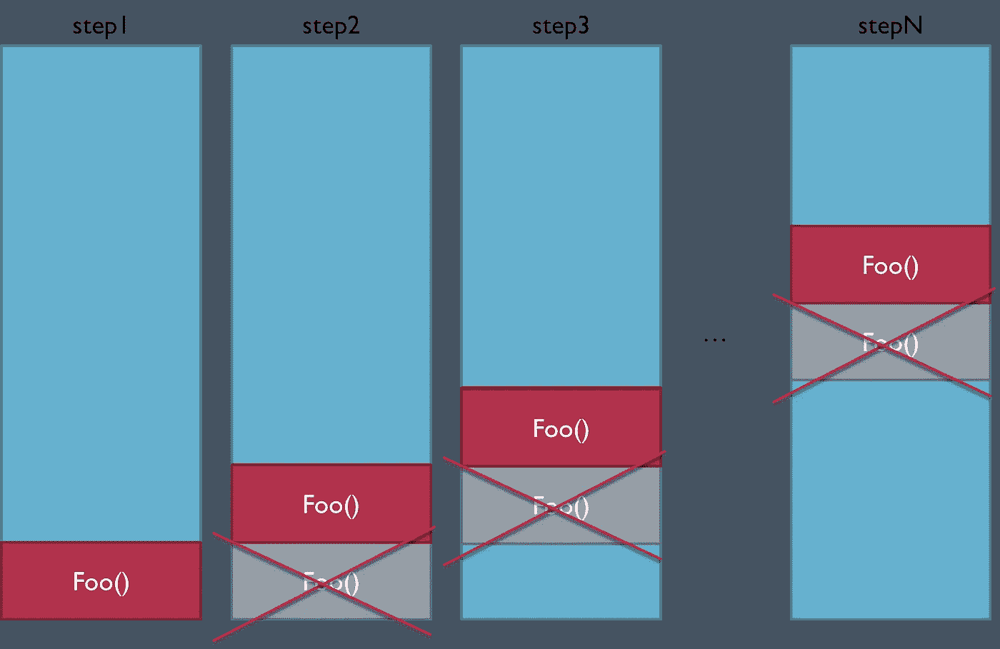
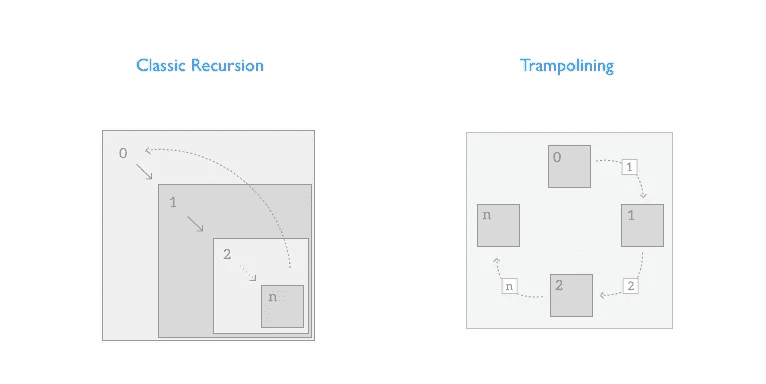

# 内存安全违规

> 原文：<https://betterprogramming.pub/memory-safety-violations-a3e75536cc9>

## 如何避免内存问题？



运行程序的内存(图片由作者提供)

# 运行程序的内存

正在运行的程序的典型内存布局如下:

*   静态内存:静态大小、静态分配(编译时)、全局变量和静态局部变量。
*   堆栈内存(调用堆栈):静态大小，动态分配(运行时)，用于局部变量。
*   堆内存:动态大小，动态分配(运行时)。它的程序员控制一些编程语言(可变大小的对象)。

对于所有数据，必须分配内存(即保留内存空间)。

太好了！我们现在知道我们的程序如何以及何时使用内存了！

现在，让我们看看编程语言是如何管理(分配和释放)堆内存的！

# 在堆中分配和释放内存

内存管理有几种类型:

*   手动:C，C++
*   手动保持-释放(MRR):目标-C
*   自动参考计数(ARC): Objective-C，Swift
*   垃圾收集(全自动管理):Java、JavaScript
*   所有权:生锈

让我们快速了解一下每个选项的神奇之处！

## 手动内存管理

在 C 中，像`malloc()`这样的函数用于从堆中动态分配内存。当不再需要内存时，指针被传递给`free`，它释放内存，以便它可以用于其他目的。

```
#include <stdlib.h>int *array = malloc(num_items * sizeof(int));
```

`malloc()` 会尝试找到未使用的足够大的内存来保存指定的字节数并保留它。否则，程序将终止，并显示一条错误消息。

`malloc()`不会自动解除分配。还必须使用`free`显式释放它。

忘记释放会导致内存泄漏和内存不足！

除非重新分配或重新分配，否则我们不能使用释放的指针！

哇，那不是很难吗？

我们来看看 C++内部吧！

在 C++中，内存管理是使用`new`和`delete`操作符来完成的。`new`用于在执行时分配内存。`delete`释放保留的内存。

和 C 语言一样，我们必须小心不要忘记释放内存和避免访问错误！

尽管手动管理内存很困难，但它的好处是我们知道程序的确切需求，并且我们可以在使用完内存后立即释放内存。

我们还确保对象只要应该存在就存在，但不再存在。

您还可以基于低级内存管理函数创建您的自动内存管理方式！

## 从手动保持释放(MRR)到自动参考计数(ARC)

iOS 和 OS X 应用通过引用计数实现内存管理:

*   当我们声明一个对象的所有权时，我们增加了它的引用数。
*   当我们处理完这个对象后，我们减少它的引用数。
*   当计数达到零时，允许操作系统销毁它。

很久以前，在 Objective-C 中，我们通过调用特殊的内存管理方法来手动控制对象的引用计数:

*   `alloc`:引用计数加 1(拥有一个对象)。
*   `retain`:引用计数加 1(取得对象的所有权)。
*   `release`、`autorelease`:引用计数减一(放弃一个对象的所有权)。

这叫做手动保持释放(MRR)！



[参考计数内存管理](https://developer.apple.com/library/archive/documentation/Cocoa/Conceptual/MemoryMgmt/Articles/MemoryMgmt.html)

我们的工作是声明和放弃程序中每个对象的所有权:

*   如果我们忘记释放一个对象，它的底层内存永远不会被释放，从而导致内存泄漏(我们将在后面看到更多细节)。
*   当我们试图释放一个对象太多次时，就会产生一个悬空指针(我们将在后面看到更多细节)。
*   在这两种情况下，程序很可能会崩溃。

很难在每一个`alloc`、`retain`、`copy`和`release`或者`autorelease`之间保持平衡！

幸运的是，随着 Objective-C 和 Swift 的新版本，我们已经转移到 ARC 了！

自动引用计数的工作方式与 MRR 完全相同，但它会自动为我们插入合适的内存管理方法。这意味着我们不会再次手动调用`retain`、`release`或`autorelease`。哇哦。

自动引用计数让我们完全忘记了内存管理。其思想是关注高级功能，而不是底层的内存管理。

你可以在这里找到更多关于 ARC [的细节。尽情享受吧！](https://docs.swift.org/swift-book/LanguageGuide/AutomaticReferenceCounting.html)

啊哈，这是自动管理内存的一大步，但不是唯一的方法！让我们继续我们的发现吧！

## 碎片帐集

垃圾收集(GC)是 Java 和 JavaScript 中用于自动内存管理的技术。

在 Java 中，使用一个`new`操作符来分配对象。

为了简化 GC 的工作机制，就像在后台编写了一个线程，它将在每个周期运行，以分析内存使用情况并尝试释放未使用的对象。

一般来说，所有 GC 都关注两个领域:

*   找出所有仍然存在或被使用的对象(标记可到达的对象)。
*   去掉其他所有东西——假定是死的和不用的对象(去掉不用的对象，或者清扫)。

这个算法叫做[标记和扫描](https://en.wikipedia.org/wiki/Tracing_garbage_collection)。抓住你了。

那么，从所有这些定义中我们能注意到什么:

*   GC 依赖于运行时，而不是编程语言。
*   实际上，执行周期是不规则的，可能以不确定的时间间隔发生:或者在经过一定时间后，或者当运行时发现可用内存变低时。
*   这意味着对象不一定在不再使用的时候被释放。
*   当垃圾收集算法运行时，正常的程序执行被挂起，以便找到使用的程序并清除未使用的程序。

哇哦。不是很神奇吗！

说实话，我不喜欢 GC 就是因为这种不确定性。我更喜欢 ARC 方法和提前的方式，而不是运行时任务，️which 可能会降低程序的执行速度。

## 垃圾收集与 ARC

有了 ARC，编译器会将代码注入到可执行文件中，跟踪对象引用计数，并在必要时自动释放对象，而不是让运行时在后台查找和处理未使用的对象。

> 自动参考计数(ARC)。在编译时，它将在运行时增加和减少引用计数的消息 retain 和 release 插入到对象代码中，当对这些对象的引用数达到零时，标记这些对象的释放。ARC 不同于跟踪垃圾收集，因为它没有后台进程在运行时异步释放对象。与跟踪垃圾收集不同，ARC 不会自动处理引用周期。[自动引用计数—维基百科](https://en.wikipedia.org/wiki/Automatic_Reference_Counting#:~:text=ARC%20differs%20from%20tracing%20garbage,not%20handle%20reference%20cycles%20automatically.)

太神奇了！编译时就完成了。确定性销毁，即提前销毁，无需后台处理！

## 内存管理与内存安全

我想你开始意识到自动并不意味着安全:

*   如果 GC 迟到释放内存怎么办？
*   如果我们在 GC(多线程)释放变量的同时使用它，会怎么样呢？
*   如果 ARC 没有很好地管理保留周期怎么办？
*   临时数据呢？
*   全局变量呢？
*   输入大小超过内存怎么办？

不幸的是，这些情况会导致许多内存问题，从而导致程序崩溃，有时还会违反安全性！

在大多数情况下，自动内存管理保证了一定程度的安全性，然而，这是不够的，我们将看到为什么。那么，让我们继续看看会出现什么样的内存问题，以及如何避免它们！

# 内存冲突以及如何避免内存冲突

## 记忆行话

在我们开始之前，这里有一些重要的记忆术语:

[**Buffer**](https://en.wikipedia.org/wiki/Data_buffer) 是一个在等待其他东西处理数据或我们正在处理数据时临时存放信息的地方。例如，当输入来自键盘时，它被存储在输入缓冲区中，直到被应用程序读取和使用。

[**指针**](https://learn.microsoft.com/en-us/cpp/cpp/pointers-cpp?view=msvc-170) 是存储对象内存地址的变量。

## 缓冲区溢出

啊哈，我想你知道这个众所周知的[安全漏洞](https://owasp.org/www-community/vulnerabilities/Buffer_Overflow)！

> 缓冲区溢出或缓冲区溢出是一种异常现象，程序在向缓冲区写入数据时，会超出缓冲区的边界并覆盖相邻的内存位置。[缓冲区溢出—维基百科](https://en.wikipedia.org/wiki/Buffer_overflow)

换句话说，当程序试图将超过缓冲区容量的数据放入缓冲区时，或者当程序试图将数据放入缓冲区以外的内存区域时，就会发生缓冲区溢出:


缓冲区溢出示例(图片由作者提供)

啊，你明白我为什么说自动并不意味着安全了吧！

缓冲区溢出漏洞可能出现在以下代码中:

*   依赖外部数据来控制其行为。
*   依赖于在代码直接范围之外应用的数据属性。
*   在 C 和 C++中有许多不执行边界检查的内存操作函数，它可以很容易地覆盖它们所操作的缓冲区的分配边界。

在已分配内存块的边界之外进行写入会损坏数据、使程序崩溃或导致恶意代码的执行。

为了避免这种类型的违规，我们需要验证所有通过 HTTP 请求接受用户输入的代码，并确保它对所有这样的输入提供适当的大小和类型检查。

还建议在将数组索引用作数组的索引之前，验证数组索引是否在正确的范围内。

这个问题关系到所有的编程语言，不管是手动还是自动管理内存，因为这是由于它的编码方式(`[BufferOverflowException](https://docs.oracle.com/javase/7/docs/api/java/nio/BufferOverflowException.html)`、`[ArrayIndexOutOfBoundsException](https://docs.oracle.com/javase/6/docs/api/java/lang/ArrayIndexOutOfBoundsException.html)`、`[IndexOutOfBoundsException](https://docs.oracle.com/javase/6/docs/api/java/lang/IndexOutOfBoundsException.html)`)。

仅供参考，还有一个缓冲区问题:[缓冲区过度读取](https://cwe.mitre.org/data/definitions/126.html)，在读取一个缓冲区时发生，使程序越过缓冲区限制，读取相邻内存。

## 零解引用

当使用空指针时，空指针解引用发生，就好像指向一个有效的内存区域。

不应将空指针与未初始化的指针相混淆:

*   未初始化的变量是在使用前声明但未设置为已定义的已知值的变量。
*   空指针是不指向任何内存位置的指针(不指向任何东西)。它存储数据段的基址。

空指针取消引用可能会发生:

*   当程序在调用一个函数后不检查错误，而该函数失败时会返回一个空指针。
*   当程序不能正确预测或处理在软件正常运行期间很少发生的异常情况时。
*   通过一些缺陷，包括竞争条件和简单的编程遗漏。

在 C #中，取消引用空指针是未定义的行为。在 Java 中，访问空引用会触发一个 [NullPointerException](https://docs.oracle.com/javase/10/docs/api/java/lang/NullPointerException.html) 。

为了避免这种类型的违规:

*   在使用指针之前，请确保它不等于 NULL。
*   释放指针时，请确保它们没有设置为 NULL。一旦它们被释放，一定要将它们设置为 NULL。
*   当使用多线程或异步环境时，确保在 if 语句之前使用正确的锁定 API 进行锁定；并在完成后解锁。
*   在 Java 中， [NullPointerException](https://docs.oracle.com/javase/10/docs/api/java/lang/NullPointerException.html) 可以被错误处理代码捕获，但是最好的做法是确保这种异常永远不会发生。
*   使用[防御编程](https://en.wikipedia.org/wiki/Defensive_programming)方法。

对于范[Google Chrome 和 Google Chrome(cyber security-help . cz)](https://www.cybersecurity-help.cz/vulnerabilities/8953/)中的空指针解引用。

## 悬空指针和百搭指针

你听说过使用 DOM 插件数组的[悬空指针漏洞— Mozilla](https://www.mozilla.org/en-US/security/advisories/mfsa2010-51/) 和 nsTreeSelection — Mozilla 中的[悬空指针漏洞吗？](https://www.mozilla.org/en-US/security/advisories/mfsa2010-54/)

> 安全研究员 Sergey Glazunov 报告了一个在`*navigator.plugins*`实现中的悬空指针漏洞，其中`*navigator*`对象可以保留一个指向插件数组的指针，即使它已经被破坏。
> 
> 攻击者可能会利用此问题使浏览器崩溃，并在受害者的计算机上运行任意代码。[584512—(CVE-2010–2767)nsPluginArray—内存损坏(mozilla.org)](https://bugzilla.mozilla.org/show_bug.cgi?id=584512&_gl=1*acfhw8*_ga*MjI4Mjc3NzYxLjE2NjQxMDY5ODk.*_ga_MQ7767QQQW*MTY2NDE4NzM0MC4xLjAuMTY2NDE4NzM0MC4wLjAuMA..)

当引用对象被删除或释放并且指针仍然指向内存位置时，悬空指针出现。这就产生了一个问题，因为指针指向了不可用的内存。哎呀！

在第一次使用之前没有正确初始化的指针(甚至不是空的)称为通配符指针。未初始化指针的行为是完全未定义的，因为它可能指向某个任意位置，这可能是程序崩溃的原因。所以叫野指针。OMG！

使用 C++编写 JavaScript 引擎时会出现这些问题(Rust for Firefox 实际版本)。

使用自动内存管理机制(GC 或 ARC)大大降低了遇到这些指针问题的可能性，但这并不能防止内存泄漏，我们将在下面看到这一点。让我们继续前进！

# 堆栈溢出

如果你在浏览器中使用 JavaScript，我想你至少遇到过一次这个错误:



JavaScript 堆栈溢出—超出了最大调用堆栈大小(图片由作者提供)

此错误通常发生在递归调用中，并指示已超过最大堆栈大小:



调用堆栈溢出(图片由作者提供)

这里 GC 也没有帮助，因为每次迭代都引用前一次！

这个问题并不是针对 [JavaScript](https://github.com/getify/Functional-Light-JS/blob/master/manuscript/ch8.md) 的，而是针对所有没有[尾调用优化](https://exploringjs.com/es6/ch_tail-calls.html)机制的编程语言。

尾调用是指一个函数的最后一条语句是对另一个函数的调用。优化在于让尾部调用函数替换它在堆栈中的父函数。这样，递归函数不会增加堆栈。



尾部调用优化(图片由作者提供)

现在的问题是，如果语言默认不实现尾调用优化(TCO)，该怎么办？

嗯，在这种情况下，有一个神奇的模式可以帮助我们，它可以应用于所有语言，以接近地模仿 TCO 的行为:[蹦床](https://en.wikipedia.org/wiki/Trampoline_(computing))模式。

一个`trampoline`函数在一个循环中包装了我们的递归函数。在引擎盖下，它一段一段地调用递归函数，直到不再产生递归调用:

```
// Trampoline 
const Trampoline = fn => (...args) => {
  let result = fn(...args)
  while (typeof result === 'function') {
    result = result()
  }
  return result
}
```



[uraimo.com Swift 中的递归尾调用和蹦床](https://www.uraimo.com/2016/05/05/recursive-tail-calls-and-trampolines-in-swift/)

有了 Trampoline，我们对普通的递归算法几乎没有任何改变(非 TCO！)，但是我们完全跳过了调用栈的构建。这只是一个新的工具！

一个奇妙的图案！

# 内存不足(OOM)

当堆中没有足够的空间来分配对象，并且堆无法进一步扩展时，会出现此错误。这种情况，GC 帮不上忙！

OOM 错误通常意味着程序做错了什么，例如:

*   抓着东西太久
*   试图一次处理太多数据
*   有许多全局变量(函数和变量中的一个问题)

例如，在 JavaScript 中，直接指向根(全局或窗口)的引用总是活动的(已使用)，GC 不能清除它们！

那么，我们能做些什么来避免 OOM 呢？让我们看看！

为了处理大量数据，

*   对于使用 Node JS 的后端应用程序，我们可以使用[流](https://nodejs.org/api/stream.html)和分页、[地理空间查询](https://www.mongodb.com/docs/manual/geospatial-queries/)。
*   对于使用 JavaScript 和 React 的前端应用程序，我们可以使用一些技术，如[窗口](https://reactjs.org/docs/optimizing-performance.html#virtualize-long-lists)或分页。
*   一般来说，强烈建议采用这些原则:按需处理，按需显示，在开始时我们只加载和处理必要的东西(懒惰评估)。

为了避免[强引用](https://en.wikipedia.org/wiki/Tracing_garbage_collection#Strong_and_weak_references)，在利用这些 API 之前先试试: [WeakMap](https://developer.mozilla.org/en-US/docs/Web/JavaScript/Reference/Global_Objects/WeakMap) 、 [WeakSet](https://developer.mozilla.org/en-US/docs/Web/JavaScript/Reference/Global_Objects/WeakSet) 、 [WeakHashMap](https://docs.oracle.com/javase/8/docs/api/java/util/WeakHashMap.html) 。

为了缓存数据，我们可以采用一种机制，例如 [LRU](https://github.com/isaacs/node-lru-cache) (最近最少使用的)，通过设置我们想要保留的最近使用的项目的最大数量。

为了获取函数和变量，我们可以采用[函数式编程](https://medium.com/p/fdc07b4b1084)方法。对于 JavaScript，我们应该尽可能避免全局变量、窗口和全局侦听器。

## 内存泄漏

> 虽然 GC 有效地处理了很大一部分内存，但它不能保证内存泄漏的解决方案万无一失。GC 相当智能，但并非完美无缺。内存泄漏仍然会悄悄出现。内存泄漏是 Java 中真正的问题。[了解 Java | Baeldung 中的内存泄漏](https://www.baeldung.com/java-memory-leaks)

我喜欢这个解释。它总结了我想在本文中解释的一切:GC 很重要，但还不够。我们不应该依赖 GC 来为我们清理一切，但是我们应该帮助它做好自己的工作！

我想您会对我们在有 GC 的情况下仍然会遇到内存泄漏感到惊讶。我们一起来看看吧！

内存泄漏是指堆中的对象不再被使用，但垃圾收集器无法将它们从内存中移除。因此，没有必要维护它们。什么时候出现这种情况？

在 Java 中，内存泄漏可能由于以下原因而发生:

*   静态变量
*   未关闭的资源(建立新连接或打开流)
*   每当一个类的方法被覆盖时，该类的对象不会立即被垃圾回收。取而代之的是，GC 将它们排队等待在稍后的时间点完成
*   当使用这个 [ThreadLocal](https://www.baeldung.com/java-memory-leaks#7-using-threadlocals) 时，每个线程将持有一个对其 ThreadLocal 变量副本的隐式引用。只要线程是活动的，它将维护自己的副本，而不是在多个线程之间共享资源

在 JavaScript 中，出现内存泄漏的原因可能是:

*   未声明的或意外的全局变量
*   忘记了`setTimeout`和`setInterval`
*   脱离 DOM 引用或分离的节点:已经从 DOM 中移除但在内存中仍然可用的节点
*   未清除的 DOM 事件侦听器
*   WebSocket 订阅和对 API 的请求
*   如果在卸载组件后更新状态，执行状态更新和运行异步操作的 React 组件可能会导致内存泄漏问题。

哇！知道 JS 和 Java 内存管理使用垃圾收集真是太可怕了！

## 多线程和竞争条件

在各种并行编程模型中，进程/线程共享一个公共地址空间，它们异步地读写该空间。在这种模式下，所有进程对共享内存都有同等的访问权。

当两个线程使用共享内存数据访问同一个变量，并且至少有一个线程执行写操作时，共享内存程序中就会出现争用情况。访问是并发的，因此它们可以同时发生。

作为信息，几个线程尝试读取一个共享资源是安全的，只要它们不尝试修改它。

构成多处理环境的所有系统都容易受到竞争条件攻击！

在竞争情况下，共享内存可能会被线程破坏。

诸如锁([同步](https://docs.oracle.com/javase/tutorial/essential/concurrency/syncmeth.html))和[信号量](https://en.wikipedia.org/wiki/Semaphore_(programming))之类的各种机制可以用来控制对共享存储器的访问。

Java 提供了几种[数据结构](https://docs.oracle.com/javase/8/docs/api/java/util/concurrent/package-summary.html)，允许并发访问:`[DelayQueue](https://docs.oracle.com/javase/8/docs/api/java/util/concurrent/DelayQueue.html)`、`[BlockingQueue](https://docs.oracle.com/javase/8/docs/api/java/util/concurrent/BlockingQueue.html)`、`[ConcurrentMap](https://docs.oracle.com/javase/8/docs/api/java/util/concurrent/ConcurrentMap.html)`、 [ConcurrentHashMap](https://docs.oracle.com/javase/8/docs/api/java/util/concurrent/ConcurrentHashMap.html) 。

# 结论

多么美好的记忆之旅啊！非常有教育意义！

我们看到了一个程序的内存是如何布局和管理的:通过 ARC 或 GC 手动或自动管理。

我们已经看到，自动管理内存很重要，但还不够。甚至在 GC 运行时也会出现一些内存问题。

缓冲区溢出、缓冲区过度读取、空解引用、悬空和通配符指针、堆栈溢出和内存不足(OOM)是所有编程语言的例外。它们更多地与“不安全”的编码缺陷有关，而不是编程语言或运行时的内部问题。

最重要的建议是在编写代码时采取防御性的方法。一个程序应该能够正常运行，即使是在不可预见的过程中，或者是在意外进入时。

这就是这次旅行的所有人。快乐阅读！

感谢您阅读我的文章。

```
**Want to Connect?**You can find me at GitHub: [https://github.com/helabenkhalfallah](https://github.com/helabenkhalfallah)
```