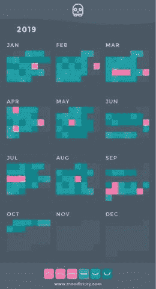

# 技术领域的心理健康

> 原文：<https://betterprogramming.pub/mental-health-in-the-technology-sector-3ea614cd055d>

## 我们应该多谈一谈

萨曼莎·加德斯在 [Unsplash](https://unsplash.com/s/photos/group?utm_source=unsplash&utm_medium=referral&utm_content=creditCopyText) 上的照片

# 促进讨论

最近，围绕心理健康的对话已经从一个耻辱的话题转变为被视为与身体健康同等重要的事情。

显然，这看起来是巨大的进步，然而，科技领域要应对这一流行病还有很长的路要走。

由英国互动媒体协会进行的 2019 年[研究](https://www.bima.co.uk/Tech-and-Inclusion-Report)发现，三分之二在科技行业工作的人报告说他们的工作压力很大。

超过一半的参与者还报告在某个时候患有抑郁症或焦虑症。该研究得出结论，在科技行业工作的人比英国普通人群抑郁程度高五倍。

这些数字令人震惊，很明显出了问题。

# 男孩不哭

众所周知，技术领域存在严重的男性偏见(这是一个独立的问题，绝对值得自己写一篇博文)。

据统计，男人很难有效地交流他们的感受。不幸的是，45 岁以下男性的主要死因是自杀。

几代人以来，男人都被鼓励要“像个男人”，不要谈论他们的感受，有证据表明，这是有问题的。这或许会对科技行业产生影响。

*如何不成为一个男孩是罗伯特·韦伯写的一部关于这个问题的奇幻自传。韦伯讨论了男性从小就根深蒂固的性别限制。这或许能让我们对这个问题有所了解。这很值得一读。*

**

# *冒名顶替综合症*

*冒名顶替综合症是一种心理模式，在这种情况下，一个人会怀疑自己的成就，以达到现在的位置。冒名顶替综合症在这个部门很普遍，尤其是在新员工中。*

*由 Hub Events 进行的 2019 [调查](https://www.thehubevents.com/resources/impostor-syndrome-survey-results-116/)发现，85%经验不足三年的人都经历过这种现象。这种综合症还会导致[焦虑和](https://www.mentalhealthtoday.co.uk/blog/therapy/imposter-syndrome-to-feel-like-a-fake-in-the-company-of-others-can-be-lonely)抑郁。*

# *那么，有什么办法呢？*

*解决心理健康问题需要行业的重大转变，然而，作为个人和公司，我们可以做几件事。*

## ***作为个人***

1.  ***工作中的情绪跟踪***

*这样做，你将能够识别出导致不同情绪或引发焦虑的模式，例如，不吃早餐或天气比平时更阴冷。*

*有几个应用程序可以让你做到这一点，然而，我使用 [Moodistory](https://moodistory.com/) ，一个付费应用程序可以让你轻松做到这一点。*

**

***2。寻求帮助***

*有些人你可以倾诉来清空你的大脑。无论是同事、朋友还是家人，总有人可以倾诉。*

*在最坏的情况下，有些组织已经被训练成倾听你的声音，比如[撒马利亚人](https://www.samaritans.org/)(你可以拨打 116 123 联系他们)。不要压抑自己的情绪，也不要采用传统的英国“硬上嘴唇”的心态。回头参考*如何不做男生*。*

***3。疗法***

*治疗过程实际上是非常强大的。能够完全自私地、不带偏见地与他人交谈，可以让个人变得更加开放，从而有望理解他们问题的根本原因。*

*我非常支持心理治疗。你可以通过这个网站找到当地的治疗师。*

## ***作为一家公司***

*实施由[独立政府审查(Mind Thrive)](https://www.mind.org.uk/media/25263166/how-to-implement-the-thriving-at-work-mental-health-standards-final-guide-online.pdf) 发布的支持员工心理健康的六项标准。*

*它们是:*

1.  *制定、实施和传达工作中的精神健康计划，鼓励和促进所有员工良好的精神健康和开放的组织文化。*
2.  *通过提供信息、工具和支持，培养员工的心理健康意识。*
3.  *在招聘过程中，以及在整个雇佣过程中的定期时间间隔，鼓励关于心理健康和支持的公开对话，并向有需要的员工提供适当的工作场所调整。*
4.  *为您的员工提供良好的工作条件，确保他们拥有健康的工作/生活平衡和发展机会。*
5.  *促进有效的人员管理，以确保所有员工定期与他们的直线经理、主管或组织领导谈论他们的健康和福祉，并通过有效的管理实践培训和支持直线经理。*
6.  *通过了解可用数据、与员工交谈和了解风险因素，定期监控员工的心理健康和幸福。*

*你可以考虑采用[教练策略](https://www.brightec.co.uk/ideas/coaching-greatness)。每月一次，你和你的教练将走出办公室，谈论你如何应对工作内外的问题。*

*这给人们创造了一个公开谈论自己感受的机会，没有了办公室的压力。它也是一个建立有意义的关系和支持网络的地方。*

*是时候解决这个问题了。*