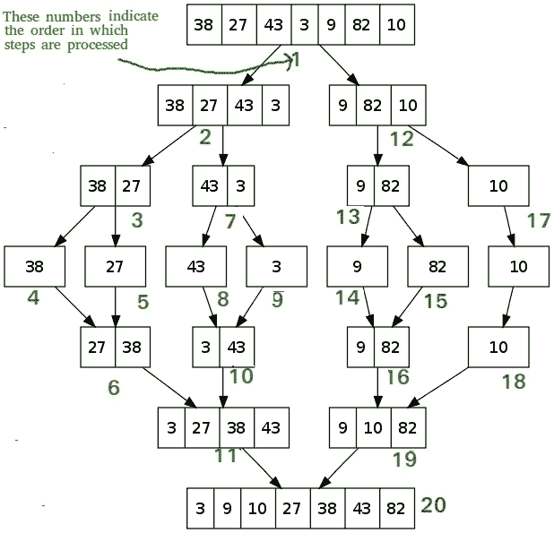
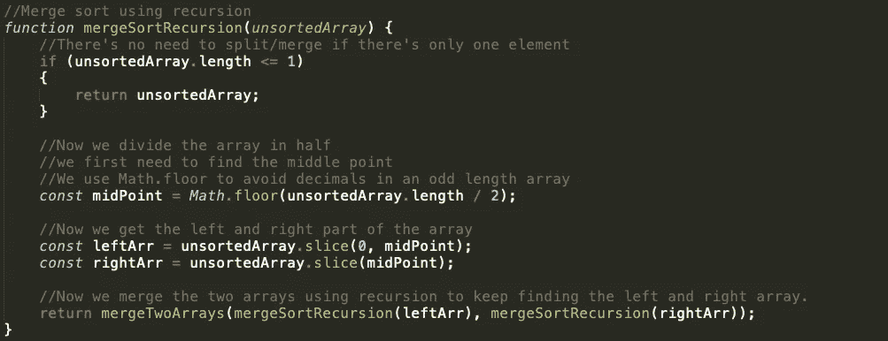
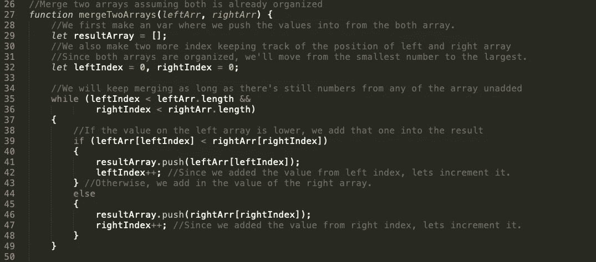
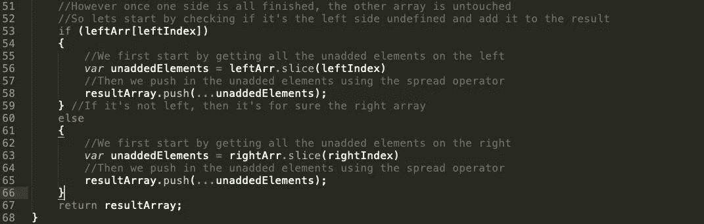

# JavaScript 中的合并排序

> 原文：<https://betterprogramming.pub/merge-sort-in-javascript-ce6e0e8b8fb2>

## 解释、要点和例子


图片由 [Pxfuel](https://www.pxfuel.com/en/free-photo-eyedi) 提供

只想要密码？向下滚动到代码的三个版本:

1.  不带注释(即插即用)。
2.  另一个用注释来理解代码。
3.  另一个包含控制台日志和一个示例，以了解一切是如何工作的。

# 什么是合并排序？

合并排序是一种排序算法，它将一个问题分解成两个或更多类似的子问题，直到最初的问题变得足够容易直接解决。

Merge sort 会将一个输入数组分成两半，并一直这样做，直到它变成一个元素。然后，它会合并两半，同时对它们进行排序，直到我们只到达一个数组。这是一个合并排序的例子。



# 使用合并排序对数组进行排序的步骤

最简单的实现是使用递归函数。下面是我们排序数组需要采取的步骤。

1.  检查传入数组的长度是否为 1——如果是，我们返回元素并开始合并。
2.  否则，我们继续将数组一分为二，直到它与步骤 1 中的条件匹配。
3.  当组合时，我们有两个数组:左数组或右数组。我们总是假设两个数组都已经排序了，所以我们可以比较每个数组的起始索引，然后加上最小的数字。


显示合并排序的 GIF

# JavaScript 中的合并排序(带递归)

让我们从 main 函数开始，在这个函数中，我们将未排序的数组拆分成只有一个元素。



取一个未排序的数组，首先检查它的长度，看它是否只有一个元素。如果有，我们就原样返回数组。

否则，我们找到中点(在哪里拆分数组)并将数组一分为二，左和右。

这部分有点棘手，我们想合并两个数组，但首先我们要组织左和右，并在合并前按顺序排序。为此，我们使用递归并再次调用 main 函数，这将一直进行下去，直到只剩下一个元素。在这个例子中，它已经被排序了，所以我们开始合并两个数组。

现在，我们需要编写合并两个数组的函数——假设它们已经按顺序排序。



这里我们有两个数组:左数组和右数组。我们假设一切都已经从最低到最高排序。在开始之前，我们需要三个变量:一个将信息推入的结果数组和两个跟踪每个数组需要哪个索引位置的索引。

```
let resultArray = [];
let leftIndex = 0, rightIndex = 0;
```

然后，我们有一个`while`循环，它将一直运行，直到其中一个索引超出了它所跟踪的数组的边界。

```
while (leftIndex < leftArr.length && rightIndex < rightArr.length)
```

接下来，我们比较两个数组，看哪一个更小。一旦我们找到它，我们将把这个值放入结果中，并增加数组的索引跟踪器。

```
if (leftArr[leftIndex] < rightArr[rightIndex]) { 
  resultArray.push(leftArr[leftIndex]);   leftIndex++;  
} else {   
  resultArray.push(rightArr[rightIndex]);   rightIndex++;  
}
```

这将一直循环下去，直到其中一个数组的值用完为止(超出界限)。之后，我们要将未完成数组中的所有值相加，并将其推入我们的结果中。我们通过在 push 中使用 spread 操作符来实现这一点。

```
if (leftArr[leftIndex]) {   
  var unaddedElements = leftArr.slice(leftIndex)
  resultArray.push(...unaddedElements);  
} else {  
  var unaddedElements = rightArr.slice(rightIndex)
  resultArray.push(...unaddedElements);  
}
```

如果您在 spread 操作符之前使用 JavaScript，您可以使用`concat`来代替。

```
if (leftArr[leftIndex]) {   
  var unaddedElements = leftArr.slice(leftIndex)
  resultArray = resultArray.concat(unaddedElements);
} else {  
  var unaddedElements = rightArr.slice(rightIndex)
  resultArray = resultArray.concat(unaddedElements);
}
```

最后，你只需要返回结果数组，就大功告成了。

```
return resultArray;
```

# 就为了密码吗？

这里有一个[链接](https://gist.github.com/Tonylil/92a73135a9478d04727d7ca12c69209e)到 GitHub gist，三个文件合二为一。

## 版本 1:只有函数，没有任何注释

## 版本 2:带注释

## 版本 3:带有控制台日志和测试示例