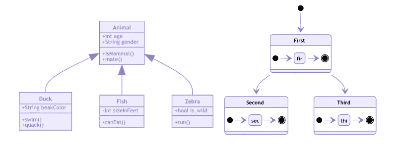
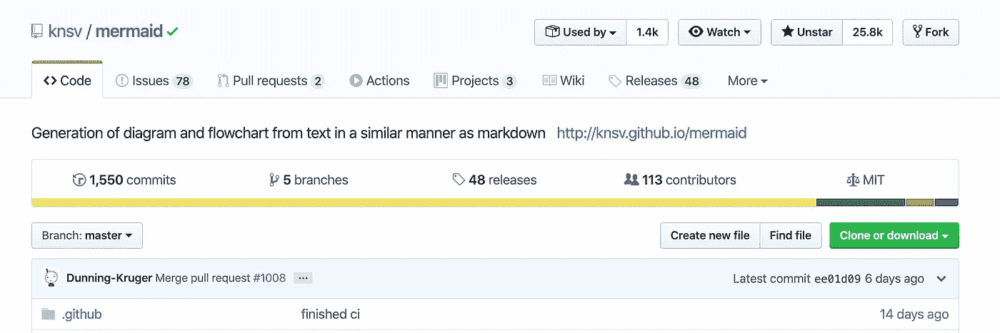
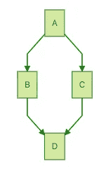
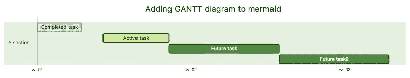
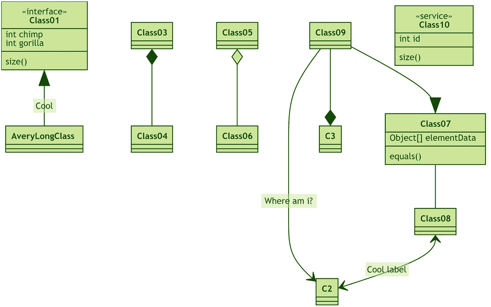
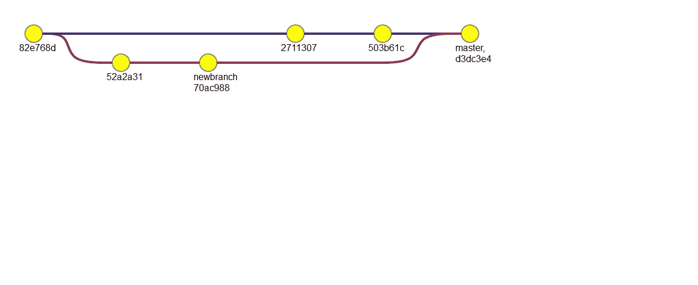

# Mermaid —使用类似 Markdown 的语法创建图表

> 原文：<https://betterprogramming.pub/mermaid-create-charts-and-diagrams-with-markdown-88a9e639ab14>

## Mermaid 是一种简单的类似 markdown 的脚本语言，用于通过 JavaScript 从文本生成图表



来源:[美人鱼](https://mermaidjs.github.io/#/)

Mermaid 允许您使用类似 Markdown 的语法生成图表和流程图。它易于使用，免费，开源。Mermaid 让您在解释代码时简化文档并避免使用笨重的工具。



来源:[美人鱼 Github 页面](https://github.com/knsv/mermaid)

# 例子

这里有几个例子可以说明如何使用美人鱼。

## 流程图

流程图是一种表示工作流程或过程的图表。流程图也可以定义为算法的图形表示，即解决任务的逐步方法。

```
graph TD;
    A-->B;
    A-->C;
    B-->D;
    C-->D;
```



美人鱼流程图

# 程序表

序列图简单地描述了按顺序排列的对象之间的交互；即这些相互作用发生的顺序。

```
sequenceDiagram
    participant Alice
    participant Bob
    Alice->>John: Hello John, how are you?
    loop Healthcheck
        John->>John: Fight against hypochondria
    end
    Note right of John: Rational thoughts <br/>prevail!
    John-->>Alice: Great!
    John->>Bob: How about you?
    Bob-->>John: Jolly good!
```


美人鱼序列图

# 甘特图

甘特图是一种说明项目进度的条形图。它是以它的发明者亨利·甘特的名字命名的，他在 1910-1915 年间设计了这样一张图表。现代甘特图还显示了活动和当前进度状态之间的依赖关系。

```
gantt
dateFormat  YYYY-MM-DD
title Adding GANTT diagram to mermaid
excludes weekdays 2014-01-10section A section
Completed task            :done,    des1, 2014-01-06,2014-01-08
Active task               :active,  des2, 2014-01-09, 3d
Future task               :         des3, after des2, 5d
Future task2              :         des4, after des3, 5d
```



美人鱼甘特图

# 类图(实验)

统一建模语言(UML)中的类图是一种静态结构图，它通过显示系统的类、它们的属性、操作(或方法)以及对象之间的关系来描述系统的结构。

```
classDiagram
Class01 <|-- AveryLongClass : Cool
<<interface>> Class01
Class03 *-- Class04
Class05 o-- Class06
Class07 .. Class08
Class09 --> C2 : Where am i?
Class09 --* C3
Class09 --|> Class07
Class07 : equals()
Class07 : Object[] elementData
Class01 : size()
Class01 : int chimp
Class01 : int gorilla
Class08 <--> C2: Cool label
class Class10 {
  <<service>>
  int id
  size()
}
```



美人鱼类图

# Git 图(实验)

Git 图是一种可视化 Git 项目提交、合并和进度的方式。

```
gitGraph:
options
{
    "nodeSpacing": 150,
    "nodeRadius": 10
}
end
commit
branch newbranch
checkout newbranch
commit
commit
checkout master
commit
commit
merge newbranch
```



美人鱼 Git 图

# 如何安装美人鱼

## NPM

```
yarn add mermaid
```

## 加拿大

```
<script  src=”https://cdnjs.cloudflare.com/ajax/libs/mermaid/8.3.1/mermaid.min.js"></script>
```

## 网页上的简单用法

在网页上整合美人鱼的最简单方法需要两个元素:

1.  使用脚本标签在 HTML 页面中包含美人鱼框架。
2.  网页上的图形定义。

如果这些东西都准备好了，Mermaid 会监听页面加载事件，当被触发时(当页面已经加载时)，它会定位页面上的图形，并将它们转换成 SVG 文件。

## 在您的网页上包含美人鱼:

```
<script  src=”https://cdnjs.cloudflare.com/ajax/libs/mermaid/8.3.1/mermaid.min.js"></script>
<script>mermaid.initialize({startOnLoad:true});</script>
```

在页面的更下方，美人鱼会寻找带有`class="mermaid"`的标签。从这些标签中，Mermaid 将尝试读取图表定义，并将其替换为 SVG 图表。

## 像这样定义一个图表:

```
<div class="mermaid">
    CHART DEFINITION GOES HERE
</div>
```

图表最终会是这样的:

```
<div class="mermaid" id="mermaidChart0">
    <svg>
        Chart ends up here
    </svg>
</div>
```

id 属性也被添加到没有 id 属性的美人鱼标签中。

## 简单完整的示例:

```
<!DOCTYPE html>
<html lang="en">
<head>
  <meta charset="utf-8">
</head>
<body>
  <div class="mermaid">
  graph LR
      A --- B
      B-->C[fa:fa-ban forbidden]
      B-->D(fa:fa-spinner);
  </div>
  <script src="mermaid.min.js"></script>
  <script>mermaid.initialize({startOnLoad:true});</script>
</body>
</html>
```

## 与 webpack 一起使用

美人鱼完全支持 webpack。这里是一个[工作演示](https://github.com/mermaidjs/mermaid-webpack-demo)。

## 对于贡献者

关于投稿的详细信息可在[投稿指南](https://github.com/knsv/mermaid/blob/master/CONTRIBUTING.md)中找到

要获得深入的指导和解释，请查看[官方美人鱼文档。](https://knsv.github.io/mermaid/#/)感谢阅读，祝编码愉快！