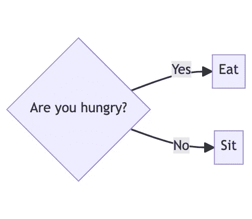

# 美人鱼:创建任何图表的一体化工具

> 原文：<https://betterprogramming.pub/mermaid-the-all-in-one-tool-to-create-any-diagram-acc0b633a439>

## 用现有的绘图工具解决几个问题。美人鱼是任何工程师的必修课


安妮特·巴蒂斯塔日在 [Unsplash](https://unsplash.com?utm_source=medium&utm_medium=referral) 拍摄的照片

几十年来，工程师们一直在为各种用例创建图表。无论是记录架构还是解释复杂的事件序列，图表都可以快速简洁地传达信息。

几十年来，图表的创建都是手工完成的。您需要下载软件或使用基于 UI 的在线工具来创建图表。完成后，您将图表导出为图像，以便与同事共享。

这带来了几个问题，阻碍了大多数工程师做图表。然而现在，有一种更好的方式，它被称为美人鱼。

# 美人鱼是什么？

在我们深入探讨我认为 Mermaid 是一项重大改进之前，让我们更仔细地了解一下 Mermaid。

Mermaid 是一个图表工具，可以用来创建图表。然而，您不用手动绘制图表，而是使用类似 Markdown 的标记来定义图表，然后 Mermaid 获取该标记并呈现图表。

例如，下面是一些创建简单流程图的美人鱼标记:

```
flowchart LR
   hungry{Are you hungry?}

   hungry-- "Yes" -->Eat
   hungry-- "No" -->Sit
```

渲染时，它看起来像这样:



图片来源:作者

很简单但是很有效。最重要的是，任何人都可以使用 Mermaid 和浏览器创建图表。他们的[文档](https://mermaid-js.github.io/mermaid/#/)也很好，可以让你快速上手。

除了流程图之外，Mermaid 还支持各种图表，比如序列图、类图和实体关系图。如果 Mermaid 本身不支持您想要的图表类型，您可以使用流程图来创建它。例如，在添加原生支持之前，我已经使用美人鱼的流程图创建了 [C4 模型](https://c4model.com/)图(C4 图在美人鱼中仍处于试验阶段！).

我们现在知道了什么是 Mermaid，但是与基于 UI 的工具或者甚至是 [PlantUML](https://plantuml.com/) 相比，它解决了什么问题？

# 美人鱼解决什么问题？

如果您以前创建过图表并使用过基于 UI 的工具，我敢打赌您也经历过失去原始资源的痛苦。我肯定有过，要么忘了保存，要么，如果是在工作中，一个同事离开了，图表也随之丢失了。

发生这种情况是因为必须从基于 UI 的工具中手动导出呈现的图，并且必须将结果图像上传到某个地方(例如，在一些文档中)。这意味着源和呈现的图在这一点上是分离的。您可以将映像和源代码都提交给版本控制，但是它们可能会在某个时候不同步。

此外，你曾经尝试过用基于 UI 的工具来区分源文件吗？我向你保证这是无法破解的，也不是人类可读的。那就没法复习了。

美人鱼解决了这两个问题。

首先，正如你在上面的例子中看到的，美人鱼的来源就像是降价，这使得它是可区分的和可审查的。

其次，也是最重要的一点，美人鱼已经被广泛采用。GitHub 拥有对美人鱼的[原生支持](https://github.blog/2022-02-14-include-diagrams-markdown-files-mermaid/)(git lab 也是如此)。有针对 VS 代码、Sublime、Vim 等的 IDE 插件。甚至还有对生产力工具的支持(一些是原生的),比如 JIRA、特雷罗、概念等等。

原生的 GitHub 和 GitLab 支持是真正的杀手锏。你可以将你的人鱼图提交到 Markdown 文件中，它们将在你被查看时呈现你的图(例如，在 README 中)。这使得源代码不可能过时，因为它是从源代码中呈现的，并且很容易在 pull 请求中查看。

PlantUML，一个从简单标记创建图表的老工具，实际上与 Mermaid 工作方式相似。关键的区别在于它是在 2009 年发布的，并且渲染是使用 Java 完成的。使用 Mermaid，您可以在浏览器中呈现源代码中的图。在我看来，这就是为什么美人鱼得到了如此广泛的采用。

并不是说 PlantUML 不好。远非如此。只是美人鱼的采用正在迅速增长，使它成为图表的首要工具。

# 摘要

美人鱼正在革新图表的创建和渲染方式。与基于 UI 的工具不同，使用 Mermaid 可以快速降低创建图表的速度，因为您不必担心它的外观。你可以在这里查看美人鱼工具[。](https://mermaid-js.github.io/mermaid/#/)

**兴奋的想给美人鱼一个尝试却不确定从何下手？**

我的书《用现代图表技术创造软件》已经出版了！[点击此处](https://www.amazon.com/dp/1680509837?maas=maas_adg_265A9C302E256D26C2E10C30DA1AA728_afap_abs&ref_=aa_maas&tag=maas)学习如何创建图表，比文字更直接、更清晰地传达信息，全部使用美人鱼。