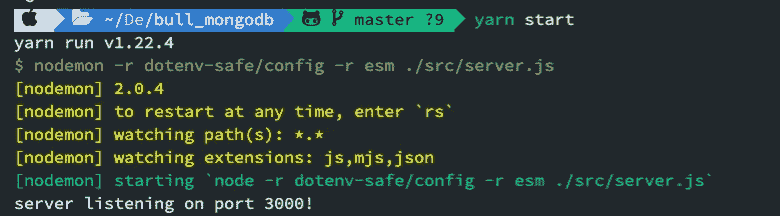
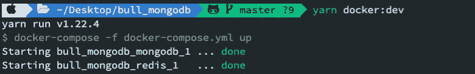

# Node.js 中使用 Bull、Redis 和 MongoDB 的消息队列

> 原文：<https://betterprogramming.pub/message-queue-using-bull-redis-and-mongodb-in-node-js-d7dedaa426ea>

## 排队是 Node.js 中的一项重要技术，用于有效处理异步操作


照片由 [Paulius Dragunas](https://unsplash.com/@paulius005?utm_source=medium&utm_medium=referral) 在 [Unsplash](https://unsplash.com?utm_source=medium&utm_medium=referral) 上拍摄

有很多排队系统:亚马逊简单队列服务(SQS)，Apache Kafka，Kue，RabbitMQ，Sidekiq，Bull 等。每一个都是不同的，都是为了解决某些问题而产生的。

在本教程中，我们将创建一个命中 API 计数器来计算用户命中特定 URL 的次数。此外，我们将研究如何创建一个队列，将一个作业放入其中，并处理该作业。

我们将使用基于 Redis 的 [Bull](https://github.com/OptimalBits/bull) 消息队列包来处理 Node 中的作业和消息。为了保存 URL 命中的总数，我们将使用 MongoDB。

# 项目设置

如果你只是想快速进入代码，[这里是项目回购](https://github.com/miladr0/bull-mongo)。

让我们初始化项目并安装我们需要的所有包。

```
yarn init -y
```

以下是我们项目需要的一些包:

*   **Bull** :基于 Redis 的节点队列
*   **dotenv-safe:** 从`.env`文件中读取环境变量
*   **esm** :支持节点模块的导入/导出
*   **ioredis** :用于连接 redis

```
yarn add bull, dotenv-safe, esm, express, ioredis, mongoose
```

对于自动格式化代码以及在开发中自动重启 Express.js web 服务器，我们将使用 Prettier、ESLint 和 nodemon。

```
yarn add -D eslint eslint-config-prettier eslint-plugin-prettier prettier
```

# 快速设置

让我们通过将下面的代码片段添加到路径:`./src/server.js`中的`server.js` 来建立一个简单的 Express web 服务器。

如果你看一下`server.js`代码的第一行，我们在添加模块时使用了`import`而不是`require` 。由于我们已经添加了 esm 模块来支持 Node 上的这种行为，为了运行这个简单的 web 服务器，我们只需要将下面的代码添加到我们的`package.json`文件的`scripts`部分:

```
"start": "nodemon -r dotenv-safe/config -r esm ./src/server.js"
```

就这样——现在，如果我们在终端上运行`yarn start` ，web 服务器就准备好为我们的请求提供服务了。



# 设置 MongoDB

接下来，我们将使用 Docker Compose，而不是手动安装 Redis 和 MongoDB 尽管这取决于您是否愿意。如果您已经在本地安装了它们，应该没问题。让我们在项目的根目录下创建一个`docker-compose.yml` 文件:

并定义一个 MongoDB schema 模型，用于保存这个路径中命中一个 API 的总计数:`./src/models/hitApi.model.js`。

现在让我们通过在这个路径中定义`mongoose.js` 来使用 Mongoose 连接到 MongoDB:`./src/mongoose.js`。此外，将`hitApi.model.js`添加到我们之前定义的文件中，这样我们就可以从任何地方访问该模型:

在我们调用`connectToMongo`函数来连接 MongoDB 之前，我们需要确保 MongoDB 正在运行，因此我们将在`package.json`的`scripts`部分添加下面一行来运行我们的 Docker 容器:

```
"docker:dev": "docker-compose -f docker-compose.yml up"
```

通过在另一个终端上运行`yarn docker:dev`命令，我们的容器将启动。



现在，我们实际上可以通过将下面一行添加到`server.js`来连接到我们的 MongoDB——这意味着当我们的 web 服务器启动时，我们就连接到了我们的 MongoDB。

```
connectToMongo();
```

太好了！到目前为止，我们已经设置了项目，运行了容器，并将 web 服务器连接到 MongoDB。最后一步是创建并运行我们的作业。

# 创造一份工作

Bull 消息队列使用 Redis 来保存和检索作业，因此首先我们需要创建一个到 Redis 的连接，并将该连接传递给 Bull 实例。

创建`redisConnection.js`，并将下面的代码片段添加到这个路径中:`./src/lib/redisConnection.js`。

现在我们可以在我们的作业中使用这个 Redis 连接—例如，让我们定义一个作业来处理当前的 URL 并将结果保存在 MongoDB 中。为此，在这个路径中创建`hitApi.redisJob.js`:`./src/jobs/hitApi.redisJob.js`。

最后，让我们将这个作业作为中间件添加到文件`server.js`中的 Express routes 之前。通过这种方式，当用户点击一个 URL 时，该作业将会运行，并会更新特定 URL 的总计数。

```
...const app = express();connectToMongo();app.get('/', (req, res) => {res.send('hello world');});**app.use(hitApi);**app.get('/api-1', (req, res) => {res.send('you hit api-1');});app.get('/api-2', (req, res) => {res.send('you hit api-2');});...
```

**注意**:不要忘记在项目的根目录下创建一个`.env`文件来定义 MongoDB 和 Redis 的连接 URL 和 user/pass，如下图所示:

# **开始工作**

在你喜欢的浏览器中打开`http://localhost:3000/api-1`或`http://localhost:3000/api-2`网址，在检查你的 DB 时，你可以看到每次你打开那些网址，那些网址的总数都会更新。

就是这样。希望这个快速概述可以帮助您开始使用 Bull in Node。感谢您的阅读！

[这是 GitHub 上完整资源库的链接](https://github.com/miladr0/bull-mongo)。