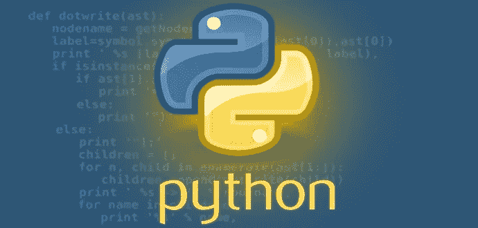

# Python 中的元编程

> 原文：<https://betterprogramming.pub/meta-programming-in-python-7fb94c8c7152>

## 关于装饰者和元类的简短教程



最近，我遇到了一个非常有趣的概念，那就是 Python 中的*元编程。我想在这篇文章中分享我在这个话题上的发现。我希望这能帮助你理解这一点，因为他们说这是一个棘手的问题。*

# 什么是元编程？

所以，用一句话来说:“元编程是一种编写操纵代码的代码的行为。”

等等，什么？是的，你没看错。操纵代码的代码。听起来是不是很迷人，很强大？嗯，事实上是的。

在 Python 的上下文中，元编程可以表述为:“元编程是一种构建函数和类的行为，这些函数和类可以通过修改、包装现有代码或生成代码来操纵代码。”

Python 中的元编程可以通过以下方式实现:

1.  装修工
2.  元类

让我们一个一个地熟悉它们。

# 装修工

装饰器是一种向现有函数添加新功能而不修改其原始结构的方法。

例如，我们有三个函数:

```
def add(x, y):
    return x + y    

def sub(x, y):
    return x - y

def mul(x, y):
    return x * y
```

现在我们需要在调用函数时打印出函数名和参数值。这应该适用于上述所有三个功能。

本地方法是向所有三个函数添加打印/日志语句。但是这听起来像是非常重复的工作，我们还需要修改每个函数体。

```
def add(x, y):
    print("add is called with parameter {0},{1}".format(x,y))
    return x + y    

def sub(x, y):
    print("sub is called with parameter {0},{1}".format(x,y))
    return x - y

def mul(x, y):
    print("mul is called with parameter {0},{1}".format(x,y))
    return x * y    

print(add(5,3))
print(sub(5,3))
print(mul(5,3))

*********************** output *********************

add is called with parameter 5, 3
8
sub is called with parameter 5, 3
2
mul is called with parameter 5, 3
15
```

我们能做得更好吗？我们当然可以，因为感谢上帝，我们是程序员，而程序员是聪明的。我们可以通过编写一个装饰函数并且不修改任何现有的函数体来实现这一点。

```
def my_decorator(func):
    def wrapper_function(*args):
        print("{0} is called with parameter {1}".format(func.__name__, args))
        return func(*args)
    return wrapper_function

@my_decorator
def add(x, y):
    return x + y

@my_decorator
def sub(x, y):
    return x - y

@my_decorator    
def mul(x, y):
    return x * y 

*********************** output *********************

add is called with parameter (5, 3)
8
sub is called with parameter (5, 3)
2
mul is called with parameter (5, 3)
15
```

答对了。在上面的代码片段中，`my_decorator`是一个装饰函数。我们用`@my_decorator`修饰了所有三个函数，并且没有修改现有的函数体来添加打印功能。

所以，基本上，decorators 是高阶函数，它将一个函数作为参数，并返回另一个函数。这里，`my_decorator`将一个函数作为参数并返回结果`wrapper_function`，其中`wrapper_function`将我们的打印功能添加到`func`。

装饰者还有更多，但这是对 Python 中装饰者的简要介绍。

# 元类

现在我们已经看到了装饰者，他们是为了装饰功能。但是元编程不仅仅是装饰器，比如*元类*。

元类是特殊类型的类，而不是 Python 中的普通类。普通类定义自己实例的行为，元类定义普通类及其实例的行为。

元类可以在普通类中增加或减少方法或字段。Python 有一个特殊的类，`type`类，默认情况下是一个元类。所有自定义类型类必须从`type`类继承。

例如，如果我们有一个类`Calc`，有三个类方法，我们想为一个类中的所有方法提供调试功能，那么我们可以使用一个元类来实现这个目的。

```
class Calc():
    def add(self, x, y):
        return x + y

    def sub(self, x, y):
        return x - y

    def mul(self, x, y):
        return x * y
```

首先，我们需要创建一个具有调试功能的元类`MetaClassDebug`，并让`Calc`类继承`MetaClassDebug`。

并且，当我们从`Calc`类中调用任何方法时，它将被我们的`debug_function`调用。

```
def debug_function(func):

    def wrapper(*args, **kwargs):
        print("{0} is called with parameter {1}".format(func.__qualname__, args[1:]))
        return func(*args, **kwargs)

    return wrapper

def debug_all_methods(cls):

    for key, val in vars(cls).items():
        if callable(val):
            setattr(cls, key, debug_function(val))
    return cls

class MetaClassDebug(type):

    def __new__(cls, clsname, bases, clsdict):
        obj = super().__new__(cls, clsname, bases, clsdict)
        obj = debug_all_methods(obj)
        return obj

class Calc(metaclass=MetaClassDebug):
    def add(self, x, y):
        return x + y

    def sub(self, x, y):
        return x - y

    def mul(self, x, y):
        return x * y

calc = Calc()
print(calc.add(2, 3))
print(calc.sub(2, 3))
print(calc.mul(2, 3))

**************** output ****************

Calc.add is called with parameter (2, 3)
5
Calc.sub is called with parameter (2, 3)
-1
Calc.mul is called with parameter (2, 3)
6
```

答对了。在上面的代码片段中，我们创建了一个元类`MetaClassDebug`并编写了一个*新的*方法，该方法负责创建类的一个实例，并将我们的装饰函数`debug_function`应用于对象(实例)，该对象将为继承`MetaClassDebug`的每个类创建。

`Calc`继承自`MetaClassDebug`，因此每个方法都被`debug_all_methods`中的`debug_function`修饰过。

这样，我们可以向类中的所有方法添加新的行为，还可以使用元类控制类的实例创建。我们可以用元类完成很多事情，比如给类添加一个方法或字段，从类中移除一个方法或字段，等等。

我想让你快速浏览一下 Python 中的元编程，所以我不能在这篇文章中涵盖所有的内容。

我希望这篇文章已经帮助您熟悉了元编程的概念。欢迎批评！