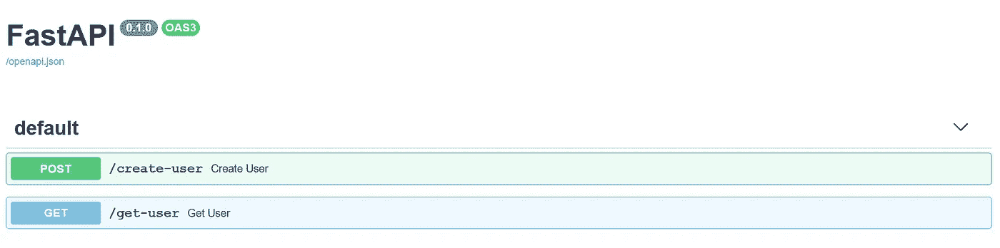
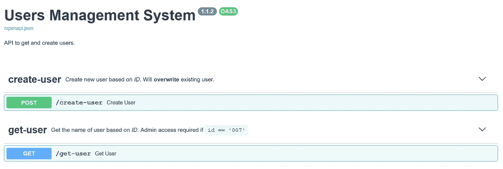
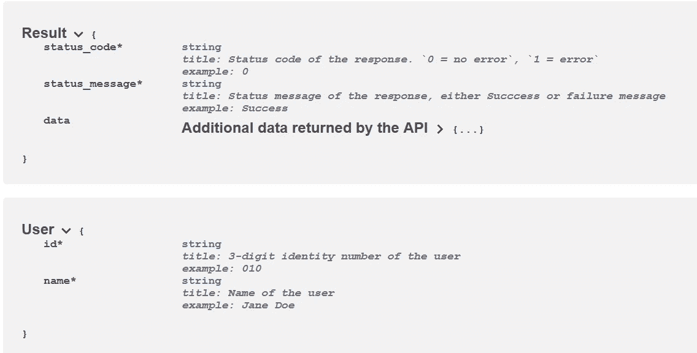
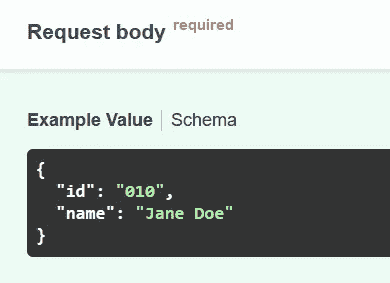

# FastAPI 中的元数据和附加响应

> 原文：<https://betterprogramming.pub/metadata-and-additional-responses-in-fastapi-ea90a321d477>

## 自定义您自己的 API 文档以获得更好的可读性


作者照片。

基于我们之前的指南([平滑地从 Flask 迁移到 FastAPI](https://medium.com/better-programming/migrate-from-flask-to-fastapi-smoothly-cc4c6c255397))，我们今天将更深入地探索 API 文档。

到目前为止，您应该意识到生成的交互式 API 文档和新创建的 FastAPI 服务器的 ReDoc 不是那么直观，并且缺少输入和输出模式的适当示例。让我们看看下面的例子。

Swagger UI:



作者图片

快速浏览一下，我们可以推断出有两个可用的 API。第一个途径是创建一个用户，而第二个途径是获得一个新用户。对于不熟悉这个 API 的人来说，这些信息肯定是不够的。此外，命名是基于函数的实际名称。当更多的 API 加入其中时，它会变得非常混乱。

如果 API 文档看起来像这样，会方便得多，而且不言自明:



作者图片

与第一个相比，新开发人员阅读这个文档会更容易。

让我们继续下一节，向文档中添加元数据。

# 1.[计]元数据

## 标签

在初始化 FastAPI 实例时，可以直接向文档中添加通用元数据。在此之前，声明下面的`tags_metadata`变量，该变量将在稍后用作我们拥有的每条路线的描述:

`tags_metadata`包含字典列表。每个字典都应该有一个唯一的名称，并由以下项目组成:

*   `name` —标签的唯一名称。强烈建议使用路线的名称作为每个字典的名称。默认情况下，这是必需的。
*   `description` —标签的描述。允许降价语法。
*   `externalDocs` —增加了两个条目的词典。第一个是`description`，第二个是`url`(如果指定了`externalDocs`则需要)。

在描述下，您可以使用 Markdown 语法来格式化您的文本。

## 大胆的

粗体字应使用双星号:

```
The following word is **bolded**.
```

## 斜体字

斜体的建议语法是将文本括在单个星号内:

```
Flying to *Italy* next week!
```

## 粗体+斜体

您可以将两者结合起来，如下所示:

```
Have a ***great day*** ahead!
```

## 密码

您可以通过将代码括在反斜线内来表示代码:

```
The code snippet is `userName = 'Wai Foong'`
```

## FastAPI 实例

FastAPI 实例的通常初始化如下:

```
app = FastAPI()
```

将其修改为以下代码片段:

*   `title` —代表将显示在文档顶部的 H1 标题。
*   `description` —标题正下方的描述文本。
*   `version` —代表 API 的当前版本。
*   `openapi_tags`-包含每条路线元数据的字典列表。我们将传入之前定义的`tags_metadata`变量。

## 标签

之后，您可以如下定义路线内的标记:

```
@app.post("/create-user", tags=["create-user"])
async def create_user(user: User):
```

当你刷新网页到`docs`网址时，你应该会看到显示的描述。


作者图片

# 2.Pydantic 基本模型

从 [Pydantic](https://pydantic-docs.helpmanual.io/) 的`BaseModel`继承的一个新类充当 FastAPI 中验证过程的核心元素。看看[的《Pydantic 初学者指南》](https://medium.com/better-programming/the-beginners-guide-to-pydantic-ba33b26cde89),了解更多关于它背后的基本概念的信息。此外，从`BaseModel`继承的任何类也可以作为`Request Body`实例，您可以在其中添加额外的元数据。通常，您将按如下方式定义您的类:

## 田

为了给它添加元数据，您必须使用直接来自 Pydantic 的`Field`类。导入该函数，并将其修改为以下代码片段:

对于可选参数，第一个参数应该定义为`None`。我在这里只使用了`title`和`example`参数。

## 查询、正文和路径

除此之外，您还可以为`Query`、`Body`和`Path`类指定相同的参数。唯一的区别是您必须从 FastAPI 而不是 Pydantic 导入它们。例如，给定以下接受查询参数的路由:

```
@app.get("/get-user", tags=["get-user"])
async def get_user(id: str):
```

您可以很容易地直接在 route 函数中设置`title`和`example`，如下例所示:

```
from fastapi import FastAPI, Query@app.get("/get-user", tags=["get-user"])
async def get_user(id: str = Query(..., title="3-digit identity number of the user", example="010")):
```

当您刷新文档时，应该会看到更新的方案。开发人员将更好地了解如何使用 API，而无需阅读源代码。



作者图片

此外，输入有效负载/方案的示例也将更新:



作者图片

# 3.其他回复

默认情况下，将返回一个`JSONResponse`作为答案，除非您在`response_class`中明确说明。以下示例以纯文本形式返回结果:

```
@app.get("/hello", response_class=PlainTextResponse)
async def hello():
    return "Hello World!"
```

话虽如此，您可以在您的路由中返回带有附加状态代码的不同响应。您必须直接返回带有状态代码的响应——即使它是`JSONResponse`。

下面的代码片段说明了一条路线:

*   如果发现与状态代码 200 匹配，则返回用户的信息。
*   如果不匹配，则返回状态代码 404。
*   如果由于权限不足，查询参数 id 为`007`，则返回状态代码 403。

为了在文档中包含这些信息，您需要修改 route decorator 中的两个参数:

*   `response_model` —表示默认模型作为响应。
*   `responses` —字典形式的附加响应，其中关键字代表状态代码。您可以添加描述和示例结果，以便它们出现在文档中。

让我们使用以下附加元数据来重用前面的代码片段:

事实上，您可以创建一个预定义响应的字典:

```
responses = {
    403: {"model": Message, "description": "Insufficient privileges for this action"},
}
```

并通过 Python 的解包方法重用它们:

```
**responses
```

请随意查看以下[要点](https://gist.github.com/wfng92/ec8a1e2bd44c5e1cc2d9ca8db1f136fa)中的完整代码:

# 4.结论

让我们回顾一下今天所学的内容。

我们首先简单解释了新创建的 FastAPI 服务器缺乏示例和描述的原因。

接下来，我们探讨了如何在初始化 FastAPI 实例时向文档中添加元数据。根据描述，它非常支持粗体、斜体和基于 Markdown 语法的代码。

我们继续前进到下一部分，在那里我们接触到了在我们的路线中添加`title`和`example`的正确方法。我们测试了通过`Field`和`Query`类在一些参数上添加两个变量。

此外，我们还学习了如何直接用状态代码返回额外的响应。可以在 route decorator 中指定附加信息，使其出现在文档中。

感谢你阅读这篇文章。希望在下一篇文章中再见到你！

# 参考

1.  [FastAPI 元数据和文档](https://fastapi.tiangolo.com/tutorial/metadata/)
2.  [open API 中的 FastAPI 附加响应](https://fastapi.tiangolo.com/advanced/additional-responses/)
3.  [FastAPI Schema Extra](https://fastapi.tiangolo.com/tutorial/schema-extra-example/)
4.  [降价指南基本语法](https://www.markdownguide.org/basic-syntax)