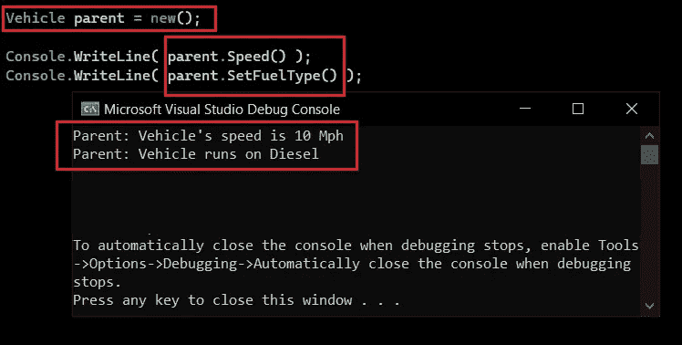
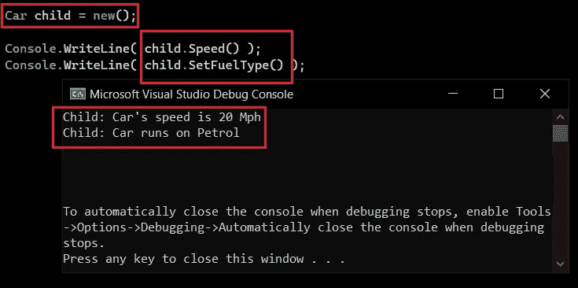
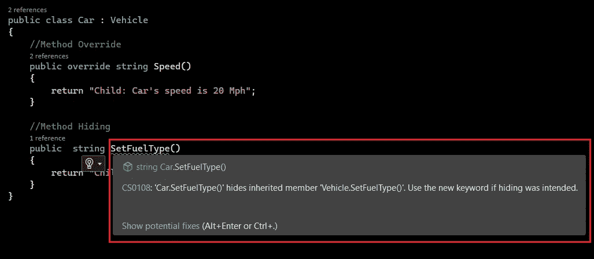
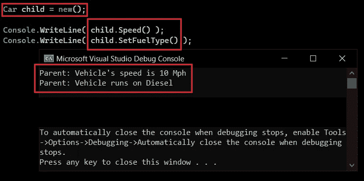
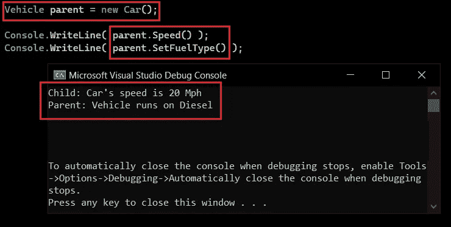
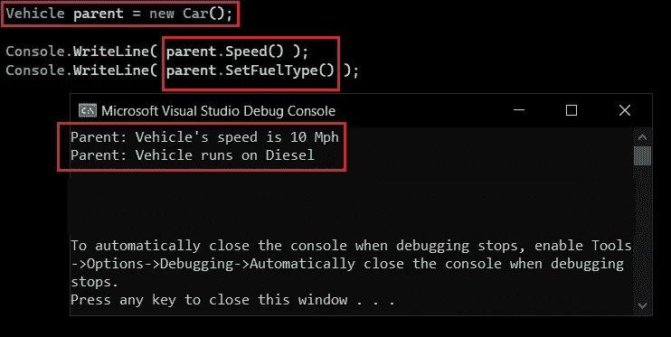

# C#中隐藏的方法

> 原文：<https://betterprogramming.pub/method-hiding-in-c-d653f822ab33>

## 如何通过在子类中实现来掩盖父类中的更改


约书亚·雷德科普在 [Unsplash](https://unsplash.com?utm_source=medium&utm_medium=referral) 上拍摄的照片

方法隐藏意味着通过重新实现父类的方法来改变它在子类中的行为。

根据定义，我们所做的就是隐藏或隐藏，或者更好地“忽略”父类方法。

等一下！这正是方法重写的含义。那么，如果方法隐藏服务于相同的目的，为什么我们还需要它呢？这就是我们在本文中要回答的问题。

这是多态性系列的第三部分，在这里我们将深入探讨多态性。以下是拼图的三个部分。

1.  [编译时多态性](/compile-time-polymorphism-in-c-f5ca6934cc55)
2.  [运行时多态性](https://medium.com/@RikamPalkar/run-time-polymorphism-in-c-6f9687857ba6)
3.  方法隐藏/隐藏

> 注意:方法覆盖和方法隐藏的方法签名应该相同。

首先，我们将看到这两者之间的实现差异，然后我们将看到操作差异。

# 实现差异

1.  在方法覆盖中，在`child`类中只允许覆盖`virtual`或`abstract`方法，但是在方法隐藏的情况下`child`类可以重新实现父类的任何方法，不管是`virtual`还是`abstract`。
2.  关键字`override`用于被覆盖的方法，其中关键字`new`用于隐藏方法。

让我们通过创建一个有一个虚拟方法`Speed()`和另一个普通方法`SetFuelType()`的`class Vehicle`来一步步破解这个难题。代码如下:

清单 1:车辆类别

如果我用`parent`的对象运行项目，我将得到以下输出:



图 1:父对象调用自己的方法

让我们创建一个`child` `class Car`来重新实现这两个方法。

清单 2:汽车类

现在看看当我用一个`child`类的对象调用这些方法时会发生什么。



图 2:子对象调用自己的重新实现的方法

对象调用自己的重新实现的方法。

还有更重要的一点要注意，关键字`new`是可选的，但是如果你没有使用它，编译器会抛出一个警告。



图 3:不使用新关键字的警告

> 警告:`*‘Car.SetFuelType()’*`隐藏了继承的成员`*‘Vehicle.SetFuelType()’*`。如果想要隐藏，请使用 new 关键字。

现在，你可能会问，覆盖和隐藏之间的具体区别是什么，因为我们看到它们在做同样的事情，但方法不同。

# 操作差异

当我们试图用`child`类对象调用`parent`类方法时，区别就来了。

有两种方法可以在`child`类中引用`parent`类。

1.  使用`child`类中的`base`关键字，查看清单 3 中的第 19 行和第 25 行。

清单 3:使用 base 关键字的 car 类

在下图中，您可以看到一个`child` `class car`的实例是如何调用其`parent` `class vehicle`的实现的。



图 3:子类 car 调用其父类 vehicle 的实现

2.第二种方式:这是一切开始真正可疑的地方。

您可以使用`parent`类的`reference variable`来存储`child`类`object`。

它看起来会像这样:

`Vehicle parent = new Car();`

这个`reference variable`将可以访问属于`Parent`类的所有方法，但是当访问`child`类的成员时，它不能调用任何属于`child`类的纯成员函数的方法，除了被覆盖的方法。

清单 4:覆盖和隐藏方法的父子关系

1.  您可以在清单 4 中看到，第 17 行的`method Speed()`是`class Car`中被覆盖的方法。在图 4 中，`parent` `class Vehicle`的`reference variable`正在调用`child` `class Car`的覆盖版本`Speed()`。按照我们上面的规则，它按预期工作，“它不能调用任何纯成员函数的方法，除了被覆盖的方法。”
2.  清单 4 中要观察的下一件事是第 23 行的`method SetFuelType()`；是`class Car`中的隐藏方法。在图 4 中，`parent` `class Vehicle`的引用变量忽略了`child` `class Car`的实现，调用了`parent` `class Vehicle`的`SetFuelType()`版本。



图 4:父引用变量调用自己的隐藏方法实现

> **注意:**带`new`关键字的方法被认为是纯成员函数，因为`new`关键字隐藏了`parent`的方法，现在属于`child`。在清单 5 中，我将第 17 行的`method Speed()`的关键字从`override`改为`new`。现在，它将被视为`class Car`的纯定义方法。

清单 5:带有两个隐藏方法的父子关系



图 5:父引用变量使用新关键字调用其子方法

# 结论

当图 4 中的`parent`类被类型转换为`child`类时，`parent`类可以有`virtual`方法或者它自己的纯成员函数。

在重写中，它跳过虚拟方法并调用`child`类重写的方法。这就是为什么在图 4 中，调用了`child`的`speed()`方法。

在方法隐藏的情况下，它首先在自身中寻找纯成员函数。如果找到它们，它会跳过带有关键字`new`的`child`类隐藏方法。这就是为什么在图 4 中，调用了`parent`的`SetFuelType()`方法。

**注意**:如果虚拟方法没有任何被覆盖的方法，那么`parent`类将调用自己的方法。找不到被覆盖的实例。

我知道这是一篇非常令人困惑和难以置信的文章，但是一旦你知道编译器是如何工作的，你就知道语言是如何工作的。

这就是编程的全部内容:理解编译器是如何工作的，任何语言都不会成为你的障碍。

```
**Want to Connect?**Hit me up on [LinkedIn](https://www.linkedin.com/in/rikampalkar).
```